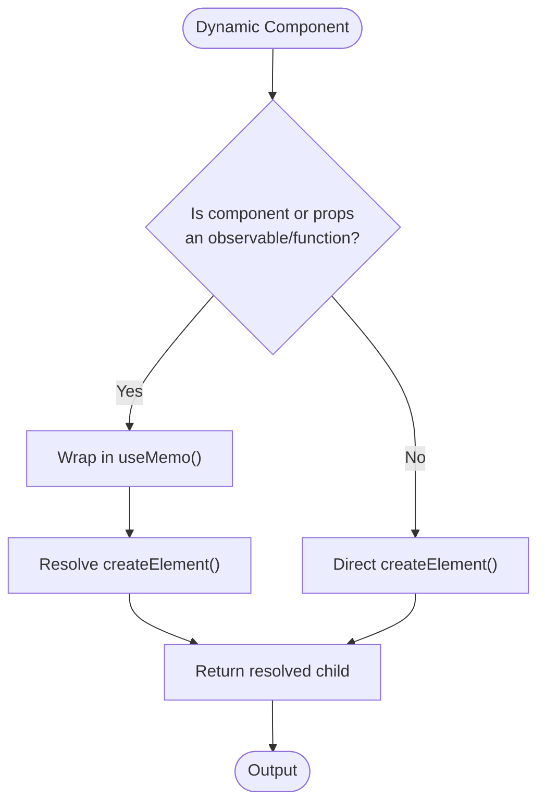
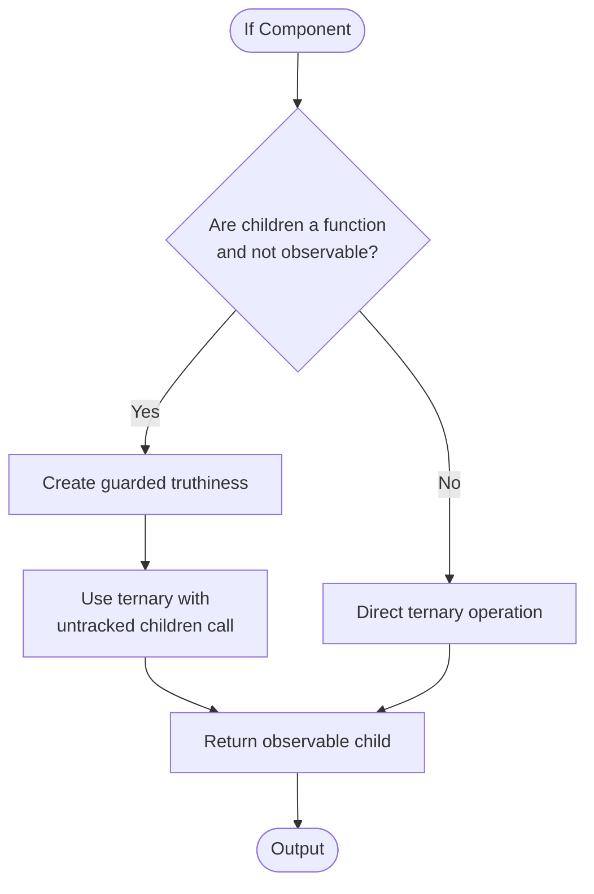
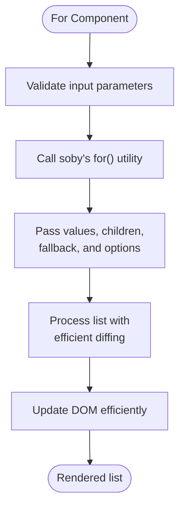
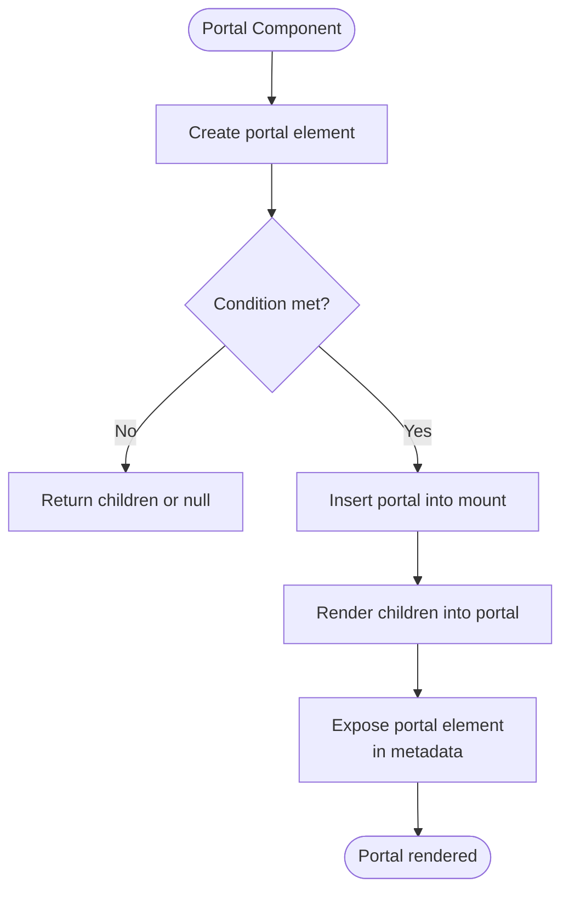
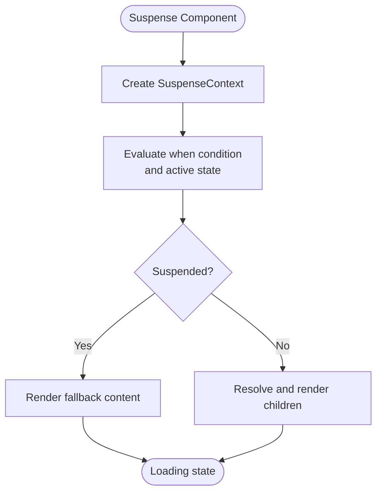
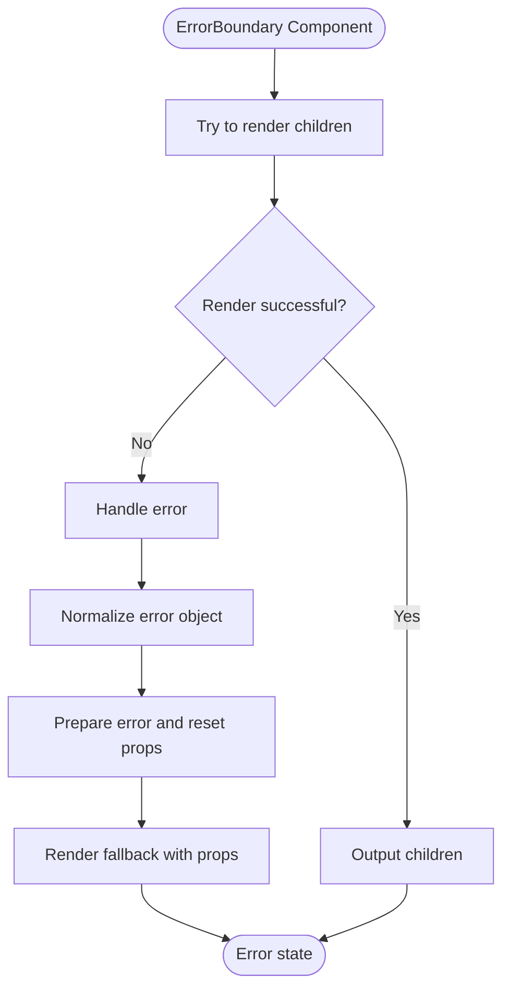
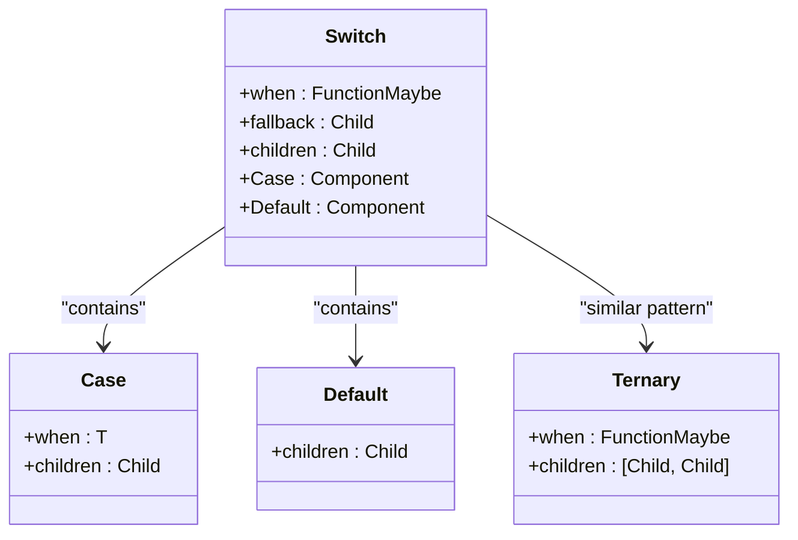

# Components API

<cite>
**Referenced Files in This Document**   
- [dynamic.ts](file://src/components/dynamic.ts)
- [if.ts](file://src/components/if.ts)
- [for.ts](file://src/components/for.ts)
- [portal.ts](file://src/components/portal.ts)
- [suspense.ts](file://src/components/suspense.ts)
- [error_boundary.ts](file://src/components/error_boundary.ts)
- [switch.ts](file://src/components/switch.ts)
- [ternary.ts](file://src/components/ternary.ts)
- [use_resource.ts](file://src/hooks/use_resource.ts)
- [suspense.context.ts](file://src/components/suspense.context.ts)
- [suspense.manager.ts](file://src/components/suspense.manager.ts)
- [suspense.collector.ts](file://src/components/suspense.collector.ts)
- [soby.ts](file://src/methods/soby.ts)
- [lang.ts](file://src/utils/lang.ts)
- [types.ts](file://src/types.ts)
</cite>

## Table of Contents
1. [Introduction](#introduction)
2. [Dynamic Component](#dynamic-component)
3. [If Component](#if-component)
4. [For Component](#for-component)
5. [Portal Component](#portal-component)
6. [Suspense Component](#suspense-component)
7. [ErrorBoundary Component](#errorboundary-component)
8. [Switch and Ternary Components](#switch-and-ternary-components)
9. [Conclusion](#conclusion)

## Introduction
This document provides comprehensive documentation for Woby's built-in components, focusing on their reactive rendering model, observable inputs, and integration with the framework's reactivity system. The components covered include Dynamic, If, For, Portal, Suspense, ErrorBoundary, Switch, and Ternary, each designed to handle specific UI patterns with efficient updates and reactivity.

**Section sources**
- [types.ts](file://src/types.ts#L0-L799)

## Dynamic Component
The Dynamic component enables runtime component resolution based on observable inputs. It supports both static and dynamic component resolution, automatically detecting when the component or props are observables and wrapping the rendering in a memoized computation for efficient updates.

When either the component or props are functions (including observables), the component uses `useMemo` to create a reactive computation that resolves the element only when dependencies change. For static cases, it directly creates the element without additional overhead.

The component leverages `resolve` and `createElement` from the core methods, and uses `$$` to unwrap observable values. This design ensures that dynamic component rendering is both reactive and performant, only re-rendering when necessary.

**Diagram sources**
- [dynamic.ts](file://src/components/dynamic.ts#L15-L27)

**Section sources**
- [dynamic.ts](file://src/components/dynamic.ts#L1-L27)
- [soby.ts](file://src/methods/soby.ts#L1-L12)
- [lang.ts](file://src/utils/lang.ts#L100-L120)

## If Component
The If component provides conditional rendering with full reactivity support. It evaluates a condition (`when`) and renders either the main content or fallback based on its truthiness. The component implements a sophisticated reactivity model that optimizes rendering based on the nature of the children prop.

When children is a function (but not an observable or component), it passes a guarded truthiness check to enable fine-grained reactivity. This allows the component to track the condition's truthiness independently. For regular children, it uses a simple ternary operation through the framework's `ternary` utility.

The implementation uses `useGuarded` to create a derived observable that tracks the truthiness of the condition, and `useUntracked` to prevent unnecessary tracking when calling the children function. This ensures optimal performance by minimizing re-renders.

**Diagram sources**
- [if.ts](file://src/components/if.ts#L15-L28)

**Section sources**
- [if.ts](file://src/components/if.ts#L1-L28)
- [soby.ts](file://src/methods/soby.ts#L1-L12)
- [lang.ts](file://src/utils/lang.ts#L180-L200)

## For Component
The For component handles list rendering with support for efficient DOM updates and keying strategies. It provides two typing signatures: one for keyed rendering (default) and one for unkeyed rendering when `unkeyed` is set to true.

The component delegates the actual rendering logic to the framework's `for` utility from `soby`, passing the values, children renderer, fallback, and options. The children function receives both the current value and an observable index, enabling reactive updates to index-dependent logic.

Key features include:
- Automatic memoization of the rendering function
- Support for fallback content when the list is empty
- Configurable keying strategy via the `unkeyed` option
- Efficient diffing and DOM updates through the underlying `for` implementation

**Diagram sources**
- [for.ts](file://src/components/for.ts#L1-L13)

**Section sources**
- [for.ts](file://src/components/for.ts#L1-L13)
- [types.ts](file://src/types.ts#L50-L70)

## Portal Component
The Portal component enables rendering children into a different part of the DOM tree, outside the parent component's hierarchy. It supports mounting to any DOM element, with fallback to `document.body` if no mount point is specified.

Key features include:
- Conditional rendering via the `when` prop
- Custom wrapper element specification
- Automatic cleanup of DOM nodes
- Error handling for invalid mount points
- Metadata exposure of the portal element

The implementation uses `useRenderEffect` to manage the portal's lifecycle, inserting the portal element into the target mount point and cleaning up on unmount. Two effects are used: one for DOM insertion/removal and another for rendering the children into the portal.

**Diagram sources**
- [portal.ts](file://src/components/portal.ts#L1-L50)

**Section sources**
- [portal.ts](file://src/components/portal.ts#L1-L50)
- [creators.ts](file://src/utils/creators.ts#L1-L10)

## Suspense Component
The Suspense component handles asynchronous operations with fallback content, integrating with the `useResource` hook for data fetching. It creates an isolated suspense boundary using `SuspenseContext` to manage loading states.

The component works by:
1. Creating a suspense context that tracks active suspensions
2. Evaluating the `when` condition and active suspense state
3. Using `useSuspense` to handle the suspended state
4. Rendering fallback content during suspense
5. Resolving and rendering children when ready

It leverages the `suspense` manager to coordinate suspension across the component tree, ensuring proper error boundaries and loading states.

**Diagram sources**
- [suspense.ts](file://src/components/suspense.ts#L1-L26)
- [suspense.context.ts](file://src/components/suspense.context.ts#L1-L55)

**Section sources**
- [suspense.ts](file://src/components/suspense.ts#L1-L26)
- [suspense.context.ts](file://src/components/suspense.context.ts#L1-L55)
- [suspense.manager.ts](file://src/components/suspense.manager.ts#L1-L68)

## ErrorBoundary Component
The ErrorBoundary component catches runtime errors in child components and renders fallback content. It uses the framework's `tryCatch` utility to intercept errors during rendering.

Key features:
- Catches errors in child components and their render functions
- Provides error information and reset function to fallback
- Uses `untrack` to prevent reactivity issues in error handling
- Supports both static and functional fallback components

The implementation wraps the children in a try-catch block, normalizes errors, and passes them to the fallback along with a reset function that allows retrying the failed operation.

**Diagram sources**
- [error_boundary.ts](file://src/components/error_boundary.ts#L1-L18)

**Section sources**
- [error_boundary.ts](file://src/components/error_boundary.ts#L1-L18)
- [soby.ts](file://src/methods/soby.ts#L1-L12)

## Switch and Ternary Components
The Switch and Ternary components provide conditional logic patterns for component rendering. Switch enables multi-way branching similar to a switch statement, while Ternary provides a simple two-way conditional.

### Switch Component
Switch uses metadata tagging to identify Case and Default branches. Each Case component attaches its value and content as metadata, which the parent Switch collects and matches against the `when` condition.

The implementation:
- Collects all children with metadata
- Extracts values and components from metadata
- Uses the framework's `switch` utility to match conditions
- Falls back to Default when no match is found

### Ternary Component
Ternary provides a simpler two-way conditional that directly uses the framework's `ternary` utility. It takes a condition and an array of two children (true/false cases).

**Diagram sources**
- [switch.ts](file://src/components/switch.ts#L1-L36)
- [ternary.ts](file://src/components/ternary.ts#L1-L8)

**Section sources**
- [switch.ts](file://src/components/switch.ts#L1-L36)
- [ternary.ts](file://src/components/ternary.ts#L1-L8)
- [types.ts](file://src/types.ts#L300-L350)

## Conclusion
Woby's built-in components provide a comprehensive set of tools for building reactive user interfaces. Each component is designed with performance and reactivity in mind, leveraging the framework's observable system to minimize unnecessary updates. The components work together to handle common UI patterns including conditional rendering, list rendering, error handling, and asynchronous operations.

Key architectural principles include:
- Reactive updates through observable integration
- Efficient DOM manipulation and diffing
- Proper cleanup and resource management
- Composable and reusable patterns
- Type safety with comprehensive TypeScript definitions

These components form the foundation of Woby applications, enabling developers to build complex, responsive interfaces with minimal boilerplate.