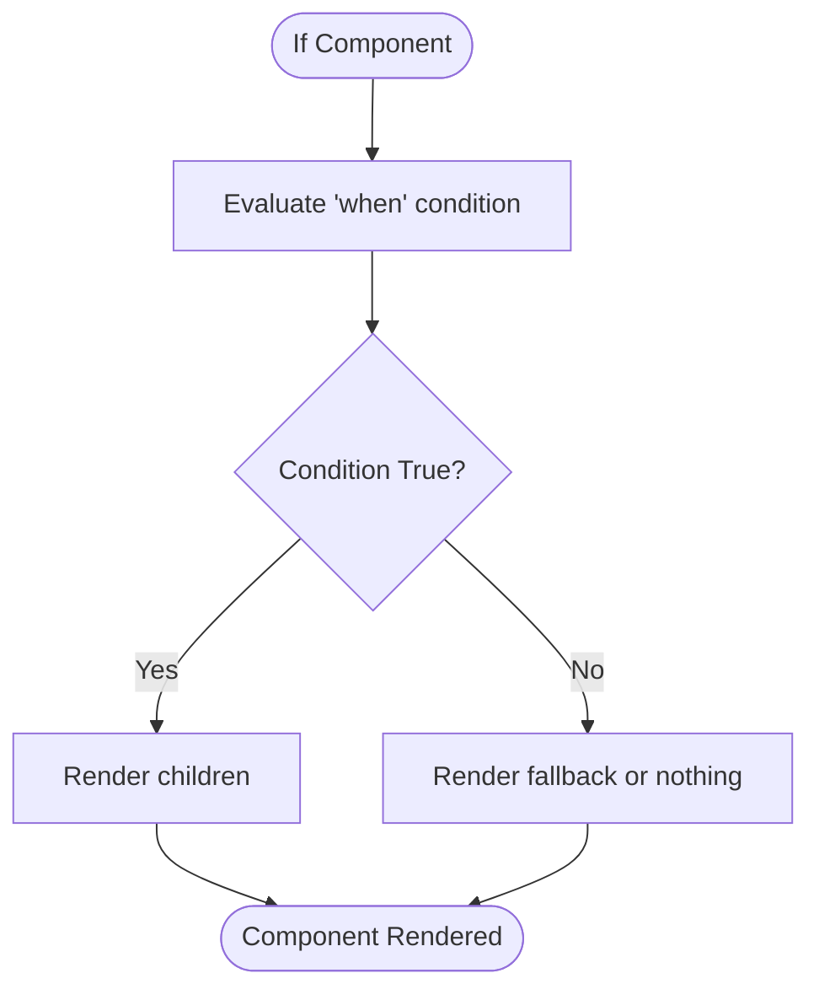
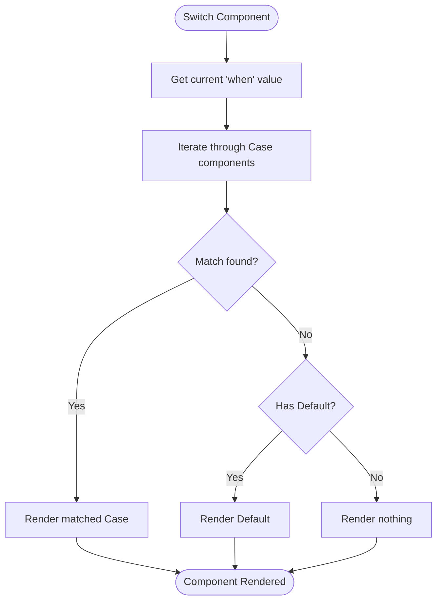
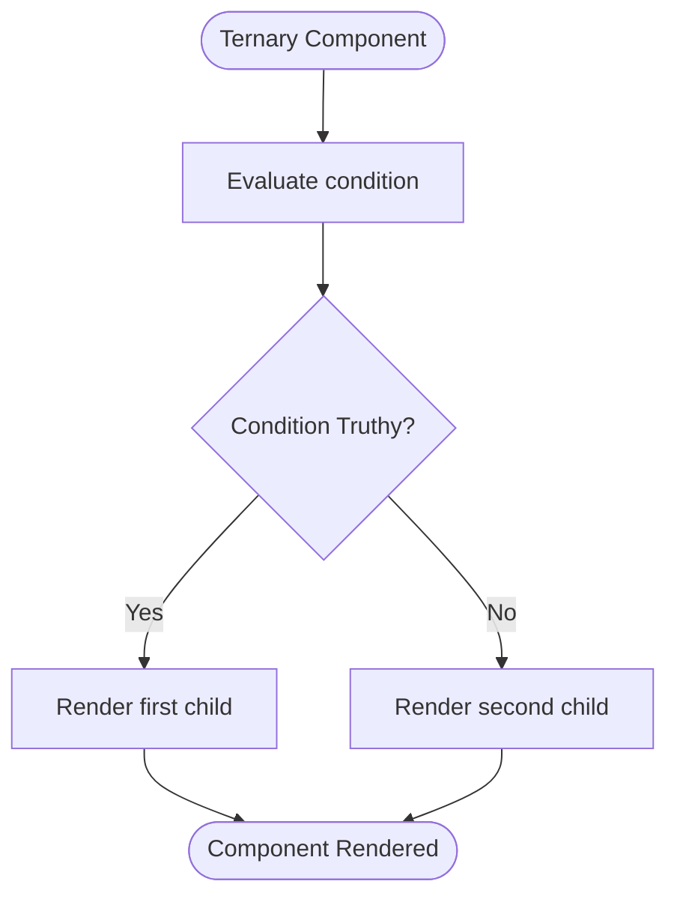
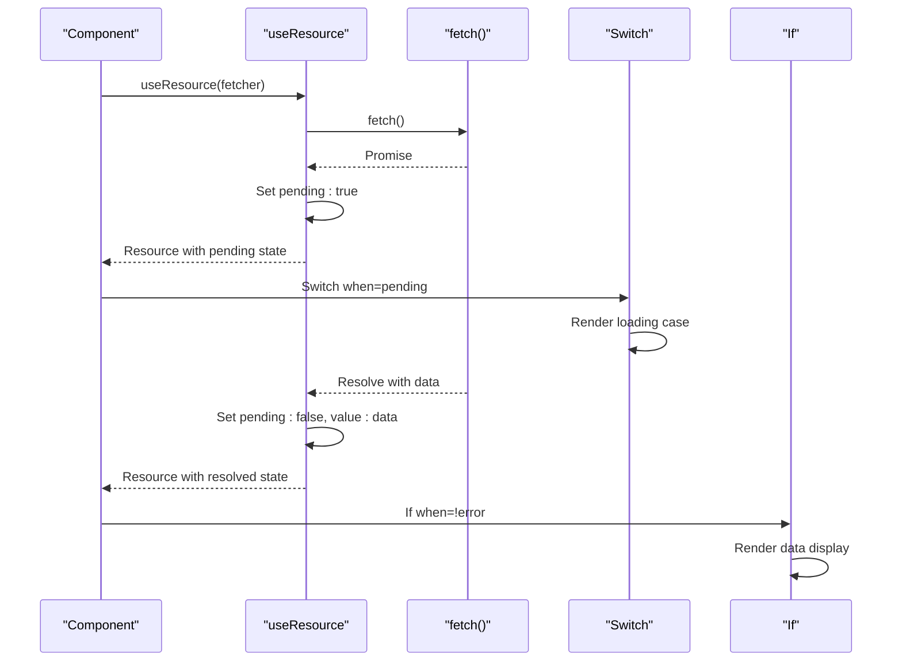

# Conditional Rendering

<cite>
**Referenced Files in This Document**   
- [if.ts](file://src/components/if.ts)
- [switch.ts](file://src/components/switch.ts)
- [ternary.ts](file://src/components/ternary.ts)
- [use_resource.ts](file://src/hooks/use_resource.ts)
- [soby.ts](file://src/soby.ts)
- [types.ts](file://src/types.ts)
</cite>

## Table of Contents
1. [Introduction](#introduction)
2. [If Component](#if-component)
3. [Switch Component](#switch-component)
4. [Ternary Component](#ternary-component)
5. [Usage Examples](#usage-examples)
6. [Performance Comparison](#performance-comparison)
7. [Common Pitfalls](#common-pitfalls)
8. [Integration with useResource](#integration-with-useresource)
9. [Conclusion](#conclusion)

## Introduction
Woby provides a reactive conditional rendering system built on observable-based reactivity. The framework offers three primary components for conditional logic: `If`, `Switch`, and `Ternary`. These components leverage Woby's fine-grained reactivity system to efficiently manage DOM updates without unnecessary re-creation of nodes. This document details the implementation, usage patterns, performance characteristics, and integration capabilities of these conditional rendering components.

## If Component

The `If` component provides reactive boolean evaluation for conditional rendering with efficient DOM node toggling. It automatically tracks dependencies through observables and minimizes re-renders by only updating the necessary parts of the DOM.

The component accepts a `when` prop that can be any function-maybe type (observable, function, or plain value). When the condition is truthy, it renders the `children`; otherwise, it renders the `fallback` content (or nothing if no fallback is provided).

A key feature is its ability to handle both direct children and function-based children. When children are passed as a function, the component calls this function with a truthy value accessor, enabling more complex conditional logic within the rendering function itself.



**Diagram sources**
- [if.ts](file://src/components/if.ts#L12-L26)

**Section sources**
- [if.ts](file://src/components/if.ts#L12-L26)
- [types.ts](file://src/types.ts#L100-L110)

## Switch Component

The `Switch` component implements multi-branch conditional logic similar to a switch statement, supporting both `Case` and `Default` subcomponents. It's particularly useful for routing scenarios or state-machine based UIs where multiple discrete states need different rendering.

The component works by comparing the `when` value against the `when` values of each `Case` component. When a match is found, it renders that case's children. If no cases match, it renders the `Default` component's children if provided.

The implementation uses metadata attached to functions to store the case values and their corresponding children, allowing the parent `Switch` component to access this information during rendering.



**Diagram sources**
- [switch.ts](file://src/components/switch.ts#L10-L17)
- [switch.ts](file://src/components/switch.ts#L25-L35)

**Section sources**
- [switch.ts](file://src/components/switch.ts#L10-L35)
- [types.ts](file://src/types.ts#L112-L120)

## Ternary Component

The `Ternary` component provides a lightweight alternative for inline conditional expressions. It's the most basic form of conditional rendering, taking a condition and two children (for true and false cases).

This component is ideal for simple conditional logic where the overhead of `If` or `Switch` is unnecessary. It directly maps to the ternary operator pattern but in a component form that integrates with Woby's reactive system.

The implementation is straightforward, delegating to the underlying `ternary` function from the soby reactivity core, which handles the observable tracking and conditional logic.



**Diagram sources**
- [ternary.ts](file://src/components/ternary.ts#L3-L7)

**Section sources**
- [ternary.ts](file://src/components/ternary.ts#L3-L7)
- [soby.ts](file://src/soby.ts)

## Usage Examples

### Feature Flags
Conditional components are ideal for implementing feature flags that can be toggled at runtime:

```tsx
<If when={isFeatureEnabled('new-ui')}>
  <NewUserInterface />
</If>
<If when={!isFeatureEnabled('new-ui')}>
  <LegacyUserInterface />
</If>
```

### Authentication Flows
Managing authenticated vs unauthenticated states:

```tsx
<Switch when={authState()}>
  <Switch.Case when="loading">
    <LoadingSpinner />
  </Switch.Case>
  <Switch.Case when="authenticated">
    <Dashboard />
  </Switch.Case>
  <Switch.Case when="unauthenticated">
    <LoginForm />
  </Switch.Case>
  <Switch.Default>
    <ErrorState />
  </Switch.Default>
</Switch>
```

### Responsive Layouts
Creating responsive designs that adapt to screen size:

```tsx
<Ternary when={isMobile()}>
  {[<MobileLayout />, <DesktopLayout />]}
</Ternary>
```

**Section sources**
- [if.ts](file://src/components/if.ts)
- [switch.ts](file://src/components/switch.ts)
- [ternary.ts](file://src/components/ternary.ts)

## Performance Comparison

| Component | Re-render Frequency | DOM Operations | Memory Overhead | Use Case |
|---------|-------------------|--------------|----------------|----------|
| **If** | Minimal (only when condition changes) | Toggles existing nodes | Low | General conditional rendering |
| **Switch** | Minimal (only when switch value changes) | Toggles existing nodes | Medium (metadata storage) | Multi-branch logic, routing |
| **Ternary** | Minimal (only when condition changes) | Toggles existing nodes | Very Low | Simple inline conditions |

The `If` component offers the best balance of features and performance for most use cases, with automatic dependency tracking through observables. The `Switch` component has slightly higher overhead due to metadata storage for cases but excels in complex state-based UIs. The `Ternary` component has the lowest overhead and is optimal for simple conditions.

All three components avoid DOM node re-creation by toggling visibility or presence of existing nodes, leveraging Woby's direct DOM manipulation approach rather than virtual DOM diffing.

**Section sources**
- [if.ts](file://src/components/if.ts)
- [switch.ts](file://src/components/switch.ts)
- [ternary.ts](file://src/components/ternary.ts)

## Common Pitfalls

### Closure Traps in Callbacks
When using function-based children, be aware of closure traps that might capture stale values:

```tsx
// ❌ Problem: May capture stale values
<If when={condition} children={() => {
  // This function might capture stale values from closure
  return <Component value={someValue} />;
}} />

// ✅ Solution: Use proper dependency tracking
<If when={condition}>
  <Component value={someValue} />
</If>
```

### Memory Leaks
Ensure proper cleanup when using conditional components with resources:

```tsx
// ❌ Problem: Potential memory leak
<If when={showComponent}>
  {() => {
    const resource = expensiveOperation();
    return <Component resource={resource} />;
  }}
</If>

// ✅ Solution: Use appropriate hooks for resource management
<If when={showComponent}>
  <Component useResource={expensiveOperation} />
</If>
```

**Section sources**
- [if.ts](file://src/components/if.ts)
- [use_resource.ts](file://src/hooks/use_resource.ts)

## Integration with useResource

The conditional components integrate seamlessly with `useResource` for data-driven conditions. This enables powerful patterns where UI state is directly tied to data loading states.

The `useResource` hook creates a resource object that tracks pending, error, and resolved states, which can be directly used with conditional components:

```tsx
const resource = useResource(() => fetch('/api/data'));

<Switch when={resource.pending()}>
  <Switch.Case when={true}>
    <LoadingSpinner />
  </Switch.Case>
  <Switch.Case when={false}>
    <If when={resource.error()}>
      <ErrorMessage error={resource.error()} />
    </If>
    <If when={!resource.error()}>
      <DataDisplay data={resource.value()} />
    </If>
  </Switch.Case>
</Switch>
```

This integration allows for fine-grained control over UI rendering based on asynchronous data states, with automatic reactivity and minimal re-renders.



**Diagram sources**
- [use_resource.ts](file://src/hooks/use_resource.ts#L18-L104)
- [switch.ts](file://src/components/switch.ts#L10-L17)
- [if.ts](file://src/components/if.ts#L12-L26)

**Section sources**
- [use_resource.ts](file://src/hooks/use_resource.ts#L18-L104)
- [if.ts](file://src/components/if.ts)
- [switch.ts](file://src/components/switch.ts)

## Conclusion
Woby's conditional rendering components provide a powerful, reactive system for managing UI state. The `If`, `Switch`, and `Ternary` components offer different levels of complexity and functionality, allowing developers to choose the right tool for each scenario. By leveraging Woby's observable-based reactivity, these components provide efficient DOM updates with minimal re-renders, making them ideal for high-performance applications. When combined with hooks like `useResource`, they enable sophisticated data-driven UI patterns that respond automatically to changing conditions.