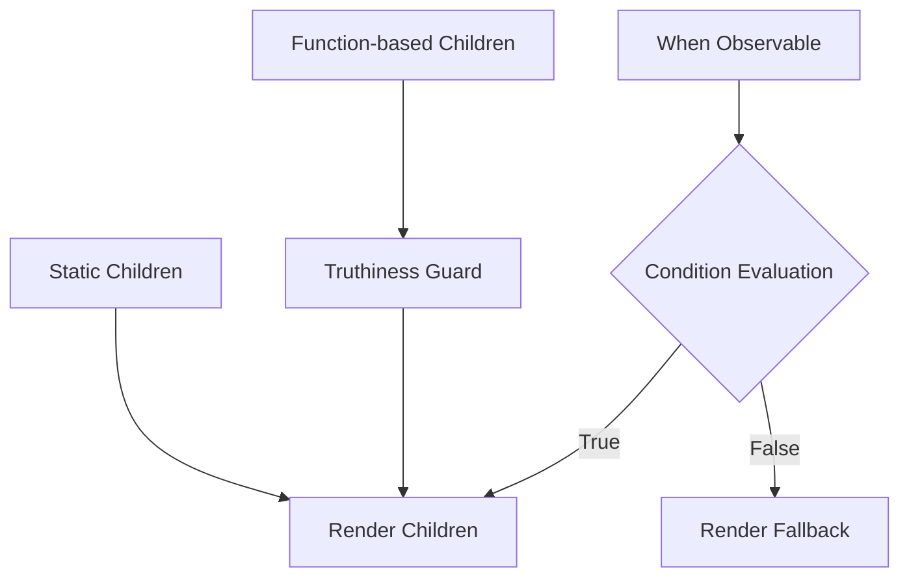
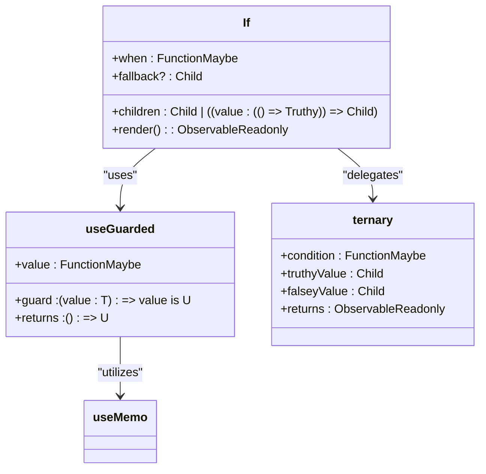
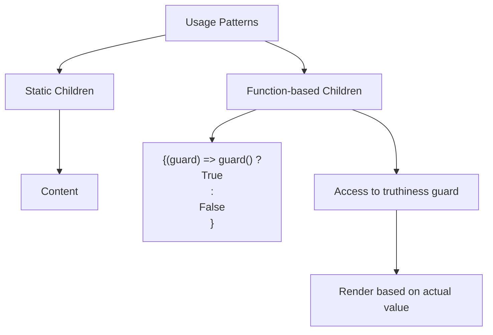
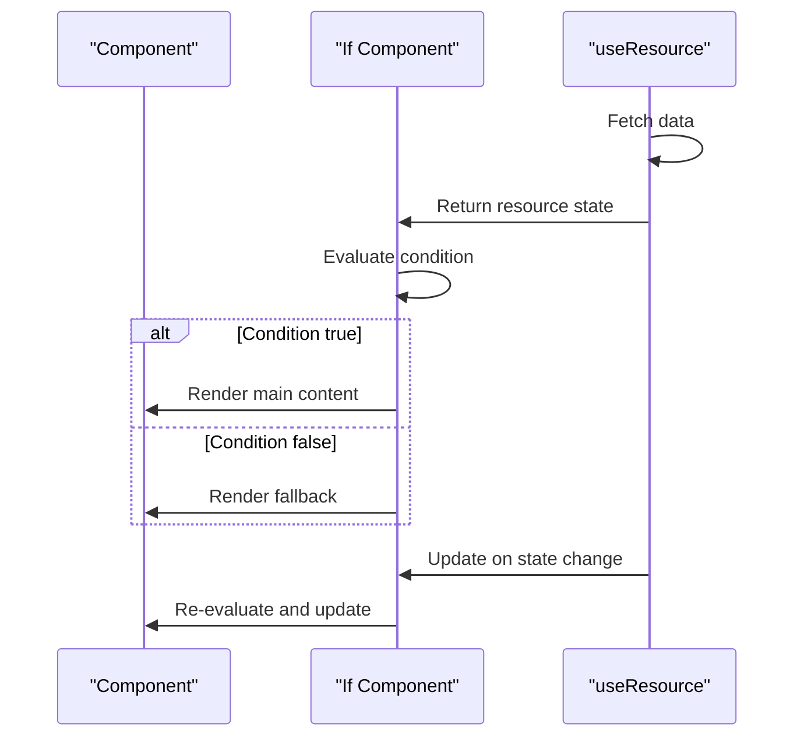

# If Component

<cite>
**Referenced Files in This Document**   
- [if.ts](file://src/components/if.ts)
- [use_guarded.ts](file://src/hooks/use_guarded.ts)
- [ternary.ts](file://src/components/ternary.ts)
- [use_resource.ts](file://src/hooks/use_resource.ts)
</cite>

## Table of Contents
1. [Introduction](#introduction)
2. [Core Functionality](#core-functionality)
3. [Implementation Details](#implementation-details)
4. [Usage Patterns](#usage-patterns)
5. [Performance Characteristics](#performance-characteristics)
6. [Integration with Hooks](#integration-with-hooks)
7. [Common Use Cases](#common-use-cases)

## Introduction
The If component in Woby serves as a reactive conditional rendering primitive that enables dynamic UI updates based on boolean conditions. Unlike traditional conditional rendering approaches, this component leverages Woby's observable-based reactivity system to provide efficient updates without unnecessary re-renders. The component evaluates a condition specified by the 'when' observable and renders content accordingly, making it ideal for scenarios requiring dynamic visibility of UI elements.

**Section sources**
- [if.ts](file://src/components/if.ts#L12-L26)

## Core Functionality
The If component accepts a 'when' observable that triggers re-evaluation whenever its value changes. This reactive approach ensures that the component automatically responds to state changes without requiring manual intervention. The component supports two rendering patterns: static children and function-based children. When using function-based children, the component provides a truthiness guard that can be invoked to access the current truthiness state of the condition. The optional 'fallback' prop specifies content to render when the condition evaluates to false, providing complete control over both branches of the conditional rendering.

**Diagram sources**
- [if.ts](file://src/components/if.ts#L12-L26)

**Section sources**
- [if.ts](file://src/components/if.ts#L12-L26)

## Implementation Details
The If component's implementation leverages two key utilities: useGuarded and ternary. The useGuarded hook creates a guarded observable that ensures type safety and prevents unnecessary updates by only propagating values that pass a truthiness check. This hook maintains a reference to the last valid value, preventing flickering during rapid state transitions. The ternary utility handles the actual conditional rendering, efficiently switching between the main content and fallback content based on the condition's value. When function-based children are used, the component wraps the children function in useUntracked to prevent unnecessary dependency tracking, optimizing performance.

**Diagram sources**
- [if.ts](file://src/components/if.ts#L12-L26)
- [use_guarded.ts](file://src/hooks/use_guarded.ts#L10-L34)
- [ternary.ts](file://src/components/ternary.ts#L0-L7)

**Section sources**
- [if.ts](file://src/components/if.ts#L12-L26)
- [use_guarded.ts](file://src/hooks/use_guarded.ts#L10-L34)
- [ternary.ts](file://src/components/ternary.ts#L0-L7)

## Usage Patterns
The If component supports multiple usage patterns to accommodate different scenarios. For simple conditional rendering, static children can be passed directly as children. For more complex scenarios requiring access to the truthiness state, function-based children can be used. In this pattern, the children function receives a truthiness guard function that can be invoked to obtain the current truthiness state. This enables advanced patterns such as rendering different content based on the specific truthy value rather than just its boolean equivalent.

**Diagram sources**
- [if.ts](file://src/components/if.ts#L12-L26)

**Section sources**
- [if.ts](file://src/components/if.ts#L12-L26)

## Performance Characteristics
The If component achieves high performance through direct DOM manipulation and automatic dependency tracking. By leveraging Woby's fine-grained reactivity system, the component avoids unnecessary re-renders and updates only the affected parts of the DOM. The use of useUntracked for function-based children prevents the children function from being tracked as a dependency, reducing the reactivity graph's complexity. The ternary utility ensures that only the currently visible branch is actively tracked, further optimizing performance. This approach results in minimal overhead compared to traditional virtual DOM-based solutions.

**Section sources**
- [if.ts](file://src/components/if.ts#L12-L26)
- [use_guarded.ts](file://src/hooks/use_guarded.ts#L10-L34)

## Integration with Hooks
The If component integrates seamlessly with Woby's hook system, particularly with useResource for data-driven conditions. When combined with useResource, the If component can conditionally render content based on the loading state of asynchronous operations. This pattern is particularly useful for implementing loading states, authentication gates, and error handling. The observable nature of the 'when' prop allows it to directly consume the return value of useResource or any other observable-producing hook, creating a cohesive reactivity chain.

**Diagram sources**
- [if.ts](file://src/components/if.ts#L12-L26)
- [use_resource.ts](file://src/hooks/use_resource.ts#L0-L105)

**Section sources**
- [if.ts](file://src/components/if.ts#L12-L26)
- [use_resource.ts](file://src/hooks/use_resource.ts#L0-L105)

## Common Use Cases
The If component is commonly used for implementing conditional UI blocks, authentication gates, and loading states. For conditional UI blocks, it enables showing or hiding interface elements based on user permissions, feature flags, or application state. Authentication gates can be implemented by passing an authentication state observable to the 'when' prop, rendering protected content only when the user is authenticated. Loading states are handled by combining the If component with useResource, showing a loading indicator while data is being fetched and the actual content once loading completes. These patterns demonstrate the component's versatility in handling various conditional rendering scenarios.

**Section sources**
- [if.ts](file://src/components/if.ts#L12-L26)
- [use_resource.ts](file://src/hooks/use_resource.ts#L0-L105)