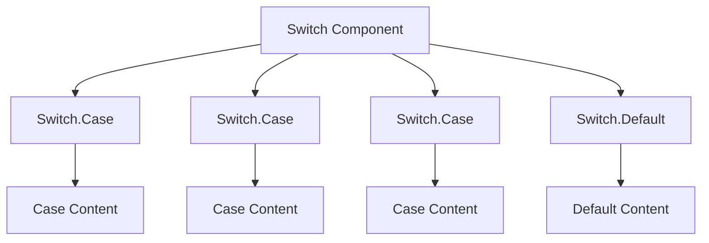
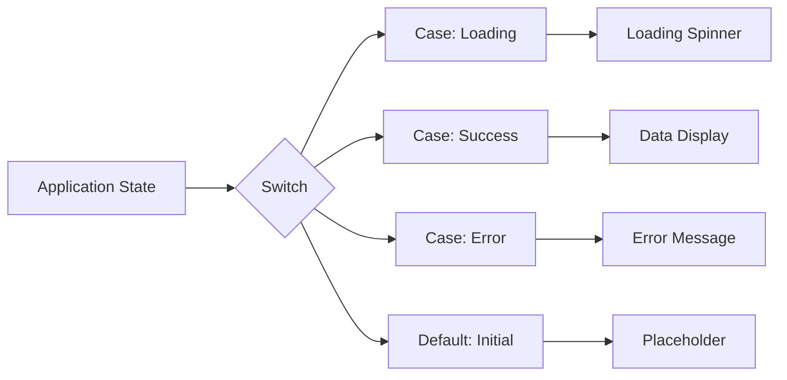

# Switch Component

<cite>
**Referenced Files in This Document**   
- [switch.ts](file://src/components/switch.ts)
- [types.ts](file://src/types.ts)
- [lang.ts](file://src/utils/lang.ts)
</cite>

## Table of Contents
1. [Introduction](#introduction)
2. [Core Functionality](#core-functionality)
3. [Component Structure](#component-structure)
4. [Value Matching Mechanism](#value-matching-mechanism)
5. [Usage Examples](#usage-examples)
6. [Reactivity System](#reactivity-system)
7. [Implementation Details](#implementation-details)

## Introduction
The Switch component in Woby provides a powerful mechanism for multi-branch conditional rendering, similar to a JavaScript switch statement. It enables developers to declaratively render different content based on the value of a reactive variable. The component evaluates its children in order and renders the first matching case, falling back to a default component when no cases match. This pattern is particularly useful for implementing routing logic, state machine UIs, and tabbed interfaces where different views need to be displayed based on application state.

## Core Functionality
The Switch component serves as a control flow mechanism that selects and renders one of several possible children based on the value of its 'when' prop. It operates by comparing the 'when' value against the values specified in Switch.Case components using strict equality (===). The first case with a matching value is rendered, while all other cases are ignored. If no cases match, the Switch.Default component is rendered as a fallback. This approach provides a clean, readable alternative to nested conditional statements and enables efficient updates when the 'when' value changes.

**Section sources**
- [switch.ts](file://src/components/switch.ts#L10-L17)

## Component Structure
The Switch component requires a specific structure with specialized child components. It must contain one or more Switch.Case components and optionally a Switch.Default component. Each Switch.Case component represents a possible branch in the conditional logic and contains a 'when' prop that specifies the value to match against. The Switch.Default component serves as the fallback option when no cases match and does not require a 'when' prop. This structure enforces a clear, predictable pattern for multi-branch conditional rendering.



**Diagram sources**
- [switch.ts](file://src/components/switch.ts#L22-L35)

## Value Matching Mechanism
The Switch component uses strict equality (===) to compare the 'when' prop value with the values specified in each Switch.Case component. This ensures type-safe comparisons and prevents unexpected matches due to type coercion. The comparison is performed in the order that cases appear in the JSX, with the first matching case being rendered. The internal implementation uses the castArray utility to handle both single and multiple children uniformly, then extracts metadata from each child to determine the matching logic. This approach provides predictable behavior and optimal performance by short-circuiting after the first match is found.

**Section sources**
- [switch.ts](file://src/components/switch.ts#L12-L15)
- [lang.ts](file://src/utils/lang.ts#L10-L14)

## Usage Examples
The Switch component is versatile and can be applied in various scenarios requiring conditional rendering. Common use cases include routing logic where different views are displayed based on the current route, state machine UIs that render different interfaces for different application states, and tabbed interfaces where content changes based on the active tab. For example, in a routing scenario, the 'when' prop could be bound to the current route path, with each Switch.Case representing a different page. In a state machine, the 'when' prop could represent the current state, with cases for each possible state transition.



**Diagram sources**
- [switch.ts](file://src/components/switch.ts#L10-L17)

## Reactivity System
The Switch component integrates seamlessly with Woby's observable-based reactivity system. When the 'when' prop is bound to an observable value, the component automatically re-evaluates and re-renders whenever the value changes. This reactivity is achieved through Woby's fine-grained dependency tracking, which ensures that only the necessary parts of the UI are updated. The component efficiently handles transitions between different cases, minimizing DOM operations by reusing existing elements when possible. This automatic reactivity eliminates the need for manual state management and ensures that the UI stays in sync with the application state.

**Section sources**
- [switch.ts](file://src/components/switch.ts#L10-L17)
- [types.ts](file://src/types.ts#L50-L52)

## Implementation Details
The Switch component's implementation leverages several key utilities from the Woby framework. It uses the castArray function to normalize its children into an array format, enabling consistent processing regardless of whether a single child or multiple children are provided. Each Switch.Case and Switch.Default component attaches metadata to its render function using the assign utility, storing the case value and associated content. This metadata is then extracted and used by the main Switch component to determine which case should be rendered. The actual switching logic is delegated to the underlying 'soby' library's switch function, which handles the reactive evaluation and rendering.

```mermaid
classDiagram
class Switch {
+when : FunctionMaybe<T>
+fallback? : Child
+children : Child
-_switch() : ObservableReadonly<Child>
}
class SwitchCase {
+when : T
+children : Child
-metadata : [T, Child]
}
class SwitchDefault {
+children : Child
-metadata : [Child]
}
Switch --> SwitchCase : contains
Switch --> SwitchDefault : contains
Switch --> "soby.switch" : delegates
```

**Diagram sources**
- [switch.ts](file://src/components/switch.ts#L10-L35)
- [lang.ts](file://src/utils/lang.ts#L10-L14)