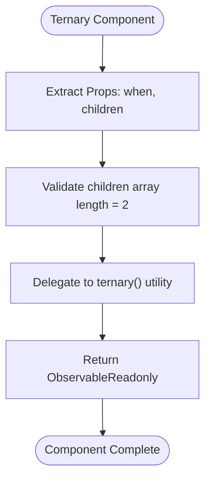
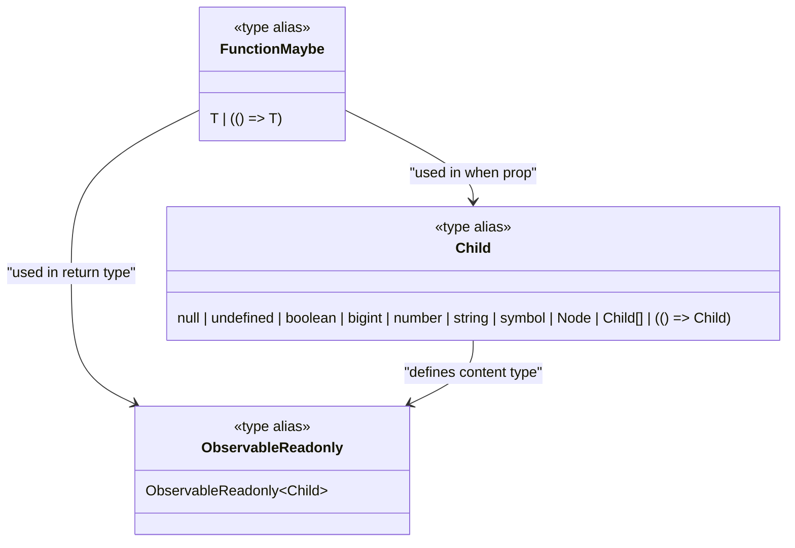
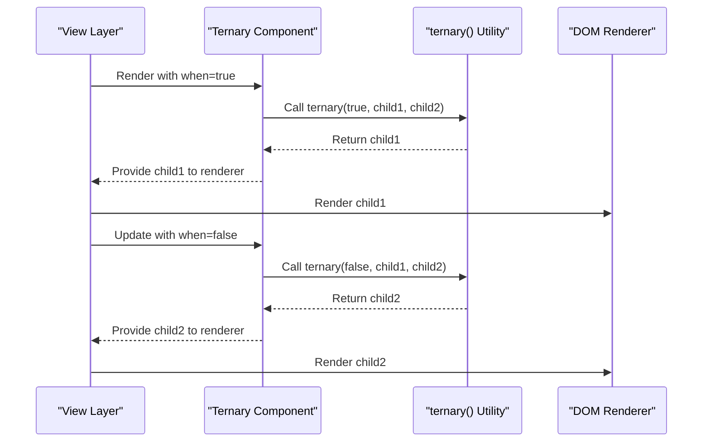
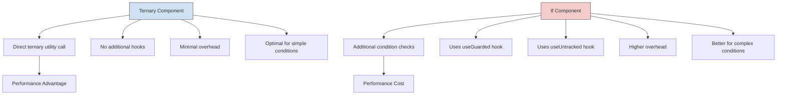
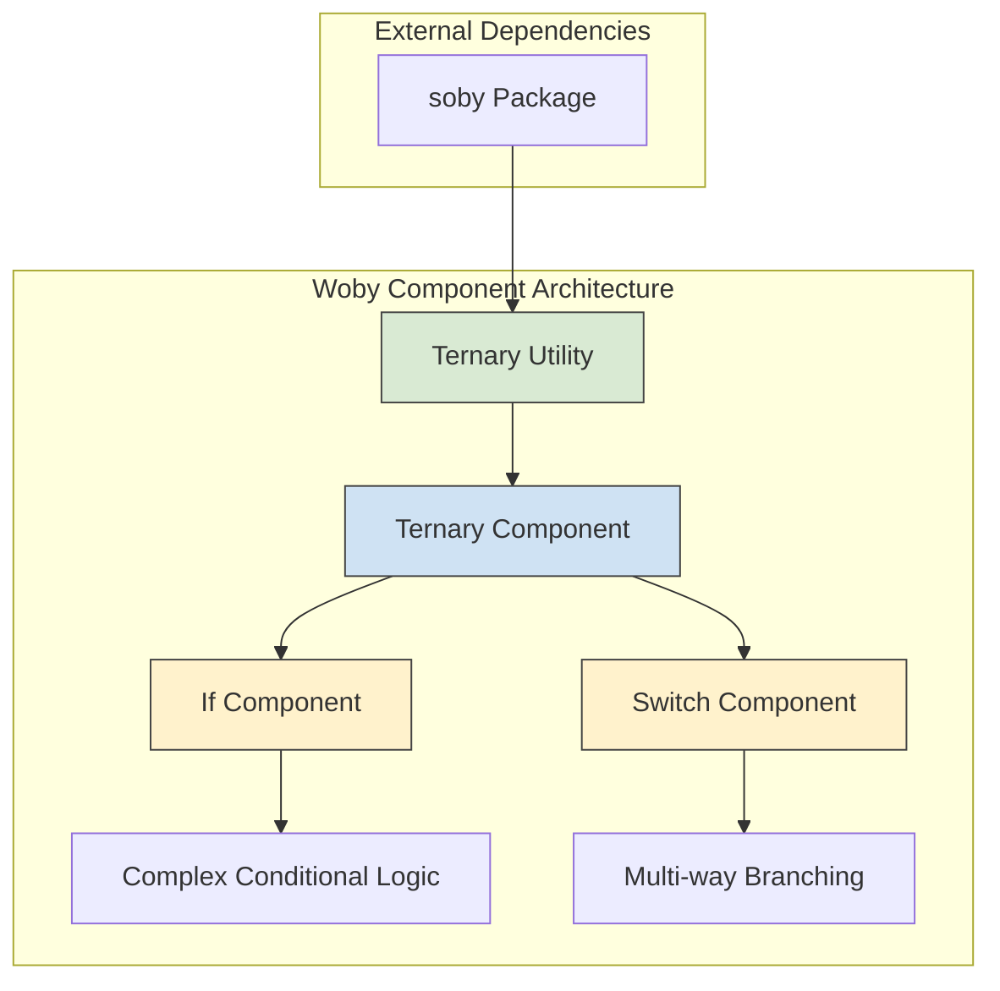
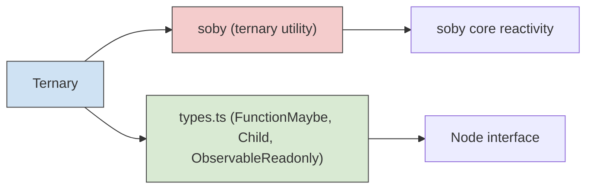

# Ternary Component

<cite>
**Referenced Files in This Document**   
- [ternary.ts](file://src/components/ternary.ts)
- [if.ts](file://src/components/if.ts)
- [soby.ts](file://src/soby.ts)
- [types.ts](file://src/types.ts)
- [lang.ts](file://src/utils/lang.ts)
- [use_guarded.ts](file://src/hooks/use_guarded.ts)
- [index.ts](file://src/components/index.ts)
</cite>

## Table of Contents
1. [Introduction](#introduction)
2. [Core Implementation](#core-implementation)
3. [Type Definitions](#type-definitions)
4. [Usage Examples](#usage-examples)
5. [Performance Comparison with If Component](#performance-comparison-with-if-component)
6. [Architecture Overview](#architecture-overview)
7. [Dependency Analysis](#dependency-analysis)

## Introduction

The Ternary component in Woby serves as a lightweight conditional rendering primitive that enables developers to select between two children based on a condition. Functionally analogous to the JavaScript ternary operator, this component provides a minimal overhead solution for simple conditional logic in the UI layer. The component is designed to be the foundational building block for more complex conditional components like If, offering direct and efficient switching between true and false branches.

As a core component in the Woby framework, Ternary leverages the internal ternary utility for efficient state switching, making it ideal for scenarios requiring simple boolean conditions. Its implementation is intentionally minimal, focusing on performance and simplicity for common conditional rendering patterns such as toggling classes, showing/hiding elements, and inline conditional rendering.

**Section sources**
- [ternary.ts](file://src/components/ternary.ts#L3-L7)
- [index.ts](file://src/components/index.ts#L10)

## Core Implementation

The Ternary component is implemented as a functional component that accepts a condition observable and an array of two children. The implementation directly delegates to the internal ternary utility function from the soby package, providing a thin wrapper that exposes the functionality through a component interface.

The component takes two props: 'when' which is a FunctionMaybe<unknown> representing the condition to evaluate, and 'children' which is a tuple of exactly two Child elements representing the true and false branches. The implementation returns an ObservableReadonly<Child> that automatically updates when the condition changes, ensuring reactive behavior without additional overhead.

The minimal implementation approach ensures that the Ternary component has virtually no additional overhead beyond the underlying ternary utility, making it the most efficient option for simple conditional rendering scenarios in the Woby framework.

**Diagram sources**
- [ternary.ts](file://src/components/ternary.ts#L3-L7)

**Section sources**
- [ternary.ts](file://src/components/ternary.ts#L3-L7)

## Type Definitions

The Ternary component relies on several key type definitions from the Woby type system. The FunctionMaybe<T> type represents a value that can either be a direct value of type T or a function that returns T, enabling both static and reactive values to be used interchangeably. The Child type defines the acceptable content for rendering, including primitive values, DOM nodes, arrays of children, and functions that return children.

The ObservableReadonly<Child> return type indicates that the component produces a read-only observable that emits child content, allowing the rendering system to efficiently track and update the DOM when the condition changes. These type definitions work together to provide a type-safe interface that supports both simple and complex rendering scenarios while maintaining the performance characteristics expected from a lightweight conditional primitive.

**Diagram sources**
- [types.ts](file://src/types.ts#L89)
- [types.ts](file://src/types.ts#L15)
- [ternary.ts](file://src/components/ternary.ts#L3-L7)

**Section sources**
- [types.ts](file://src/types.ts#L15)
- [types.ts](file://src/types.ts#L89)

## Usage Examples

The Ternary component can be used in both JSX and programmatic contexts for various conditional rendering scenarios. For class toggling, it can conditionally apply CSS classes based on state. For element visibility, it can show or hide DOM elements without unmounting them. In inline rendering, it can switch between different content fragments based on application state.

Common use cases include toggling UI states (such as active/inactive elements), conditional error displays, feature flags, and responsive design elements that change based on screen size or device characteristics. The component's simplicity makes it ideal for these straightforward conditional scenarios where the overhead of more complex conditional components would be unnecessary.

**Diagram sources**
- [ternary.ts](file://src/components/ternary.ts#L3-L7)
- [soby.ts](file://src/soby.ts#L1)

## Performance Comparison with If Component

The Ternary component offers superior performance characteristics compared to the If component for simple boolean conditions due to its minimal implementation. While both components ultimately rely on the same underlying ternary utility, the If component includes additional logic for handling fallback values and function children, resulting in more overhead.

The Ternary component's direct delegation pattern eliminates intermediate processing, making it the optimal choice for straightforward conditional rendering. In contrast, the If component performs additional checks and may invoke hooks like useGuarded and useUntracked, which, while providing enhanced functionality, introduce performance costs that are unnecessary for basic ternary operations.

For applications prioritizing rendering performance, especially in scenarios with frequent condition changes or deeply nested components, the Ternary component should be preferred over If when the use case involves simple true/false branching without complex fallback logic or value guarding requirements.

**Diagram sources**
- [ternary.ts](file://src/components/ternary.ts#L3-L7)
- [if.ts](file://src/components/if.ts#L15-L27)

**Section sources**
- [ternary.ts](file://src/components/ternary.ts#L3-L7)
- [if.ts](file://src/components/if.ts#L15-L27)

## Architecture Overview

The Ternary component fits into Woby's component architecture as a foundational primitive for conditional rendering. It sits at the lowest level of the conditional component hierarchy, providing the basic switching functionality upon which higher-level components like If are built. This architectural approach follows the principle of composition, where complex functionality is built from simpler, well-optimized primitives.

The component's architecture emphasizes minimalism and performance, delegating the core logic to the soby package's ternary utility. This separation of concerns allows the component to focus solely on the React-like interface while relying on the underlying reactivity system for efficient state management and change detection.

By exposing the ternary utility through a component interface, Woby provides developers with a familiar JSX pattern for conditional rendering while maintaining the performance benefits of the underlying functional reactive programming model.

**Diagram sources**
- [ternary.ts](file://src/components/ternary.ts#L3-L7)
- [if.ts](file://src/components/if.ts#L15-L27)
- [soby.ts](file://src/soby.ts#L1)

## Dependency Analysis

The Ternary component has minimal dependencies, reflecting its role as a lightweight primitive. It directly imports the ternary utility from the soby package and relies on type definitions from the local types module. This limited dependency graph contributes to its small bundle size and fast initialization.

The component's dependency on FunctionMaybe and Child types creates a coupling with the core type system, ensuring type safety across the framework. The reliance on ObservableReadonly ties it to Woby's reactivity model, guaranteeing consistent behavior with other reactive components.

Compared to the If component, which has additional dependencies on hooks like useGuarded and useUntracked, the Ternary component's dependency profile is significantly simpler. This reduced complexity not only improves performance but also makes the component more predictable and easier to test.

**Diagram sources**
- [ternary.ts](file://src/components/ternary.ts#L1-L7)
- [types.ts](file://src/types.ts#L15-L89)
- [soby.ts](file://src/soby.ts#L1)

**Section sources**
- [ternary.ts](file://src/components/ternary.ts#L1-L7)
- [types.ts](file://src/types.ts#L15-L89)
- [soby.ts](file://src/soby.ts#L1)