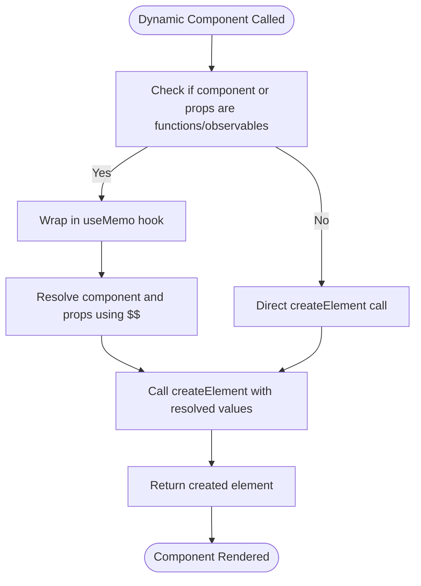
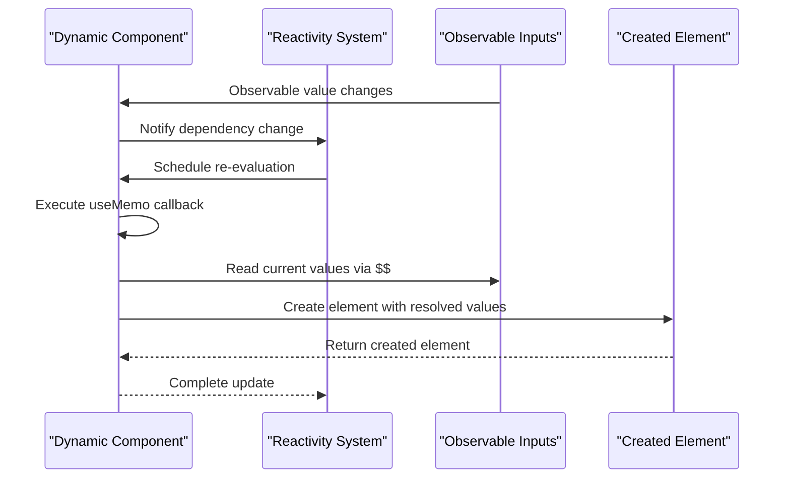
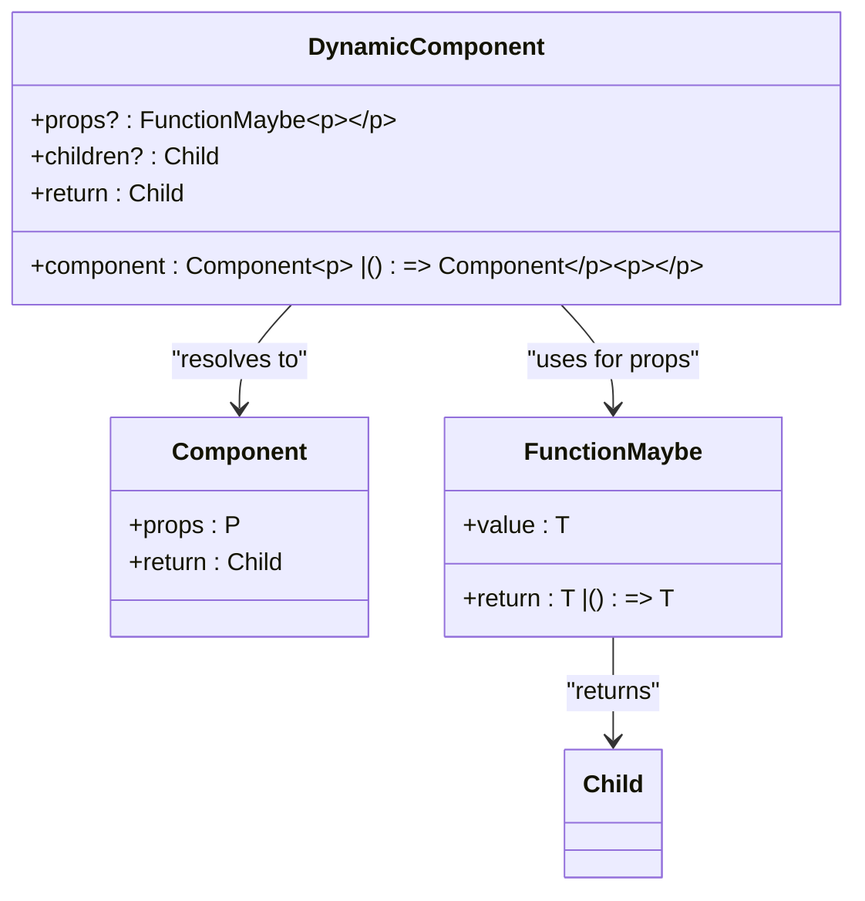
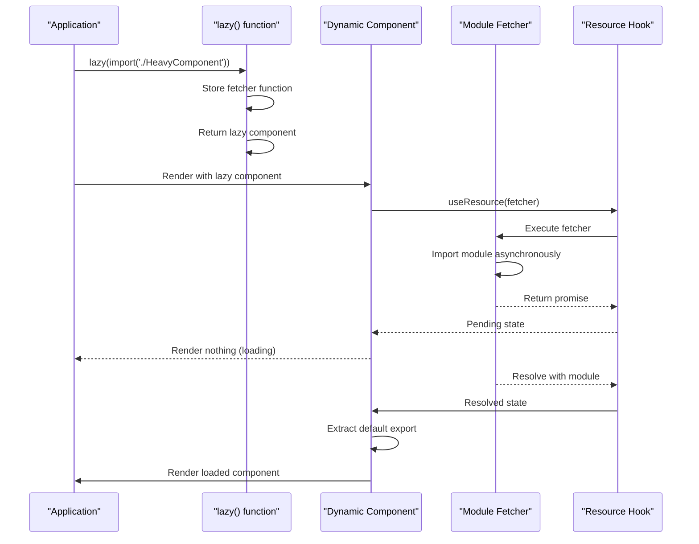
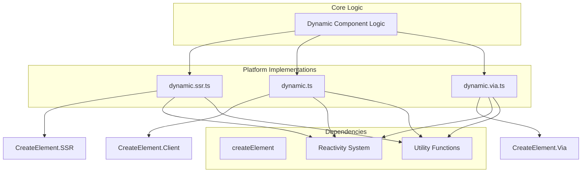
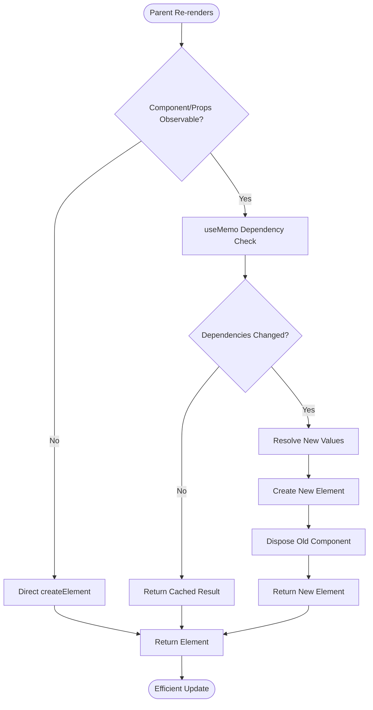
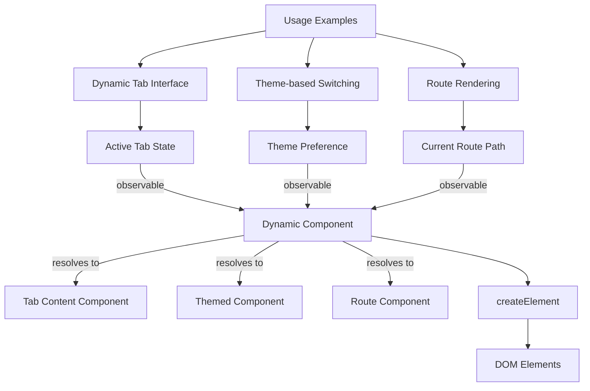
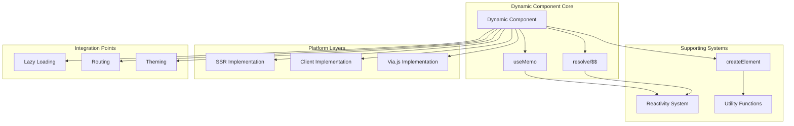

# Dynamic Component

<cite>
**Referenced Files in This Document**   
- [dynamic.ts](file://src/components/dynamic.ts)
- [lazy.ts](file://src/methods/lazy.ts)
- [dynamic.ssr.ts](file://src/components/dynamic.ssr.ts)
- [dynamic.via.ts](file://src/components/dynamic.via.ts)
- [create_element.ts](file://src/methods/create_element.ts)
- [create_element.ssr.ts](file://src/methods/create_element.ssr.ts)
- [create_element.via.ts](file://src/methods/create_element.via.ts)
- [use_resolved.ts](file://src/hooks/use_resolved.ts)
- [soby.ts](file://src/methods/soby.ts)
- [lang.ts](file://src/utils/lang.ts)
- [types.ts](file://src/types.ts)
</cite>

## Table of Contents
1. [Introduction](#introduction)
2. [Core Functionality](#core-functionality)
3. [Integration with Reactivity System](#integration-with-reactivity-system)
4. [Interface and Props](#interface-and-props)
5. [Lazy Loading Support](#lazy-loading-support)
6. [SSR and Platform Compatibility](#ssr-and-platform-compatibility)
7. [Performance Characteristics](#performance-characteristics)
8. [Usage Examples](#usage-examples)
9. [Lifecycle and Disposal](#lifecycle-and-disposal)
10. [Comparison with Conditional Rendering](#comparison-with-conditional-rendering)
11. [Architecture Overview](#architecture-overview)

## Introduction
The Dynamic component in Woby provides a powerful mechanism for runtime component resolution based on observable inputs. It enables efficient swapping of components without unnecessary re-renders by leveraging Woby's fine-grained reactivity system. This component is designed to handle dynamic UI requirements where the rendered component needs to change based on application state, user preferences, or other observable conditions.

**Section sources**
- [dynamic.ts](file://src/components/dynamic.ts#L10-L26)

## Core Functionality
The Dynamic component serves as a runtime component resolver that can render different components based on observable inputs. Its primary purpose is to enable dynamic UI composition where the component to be rendered is determined at runtime rather than compile time. The component efficiently handles both static and dynamic component references, ensuring optimal performance by minimizing unnecessary re-renders.

When the component receives a component reference or props that are functions or observables, it wraps the rendering logic in a `useMemo` hook to ensure the component is only re-evaluated when the underlying observables change. This approach prevents unnecessary re-creation of components when the observable values remain stable.

**Diagram sources**
- [dynamic.ts](file://src/components/dynamic.ts#L10-L26)

**Section sources**
- [dynamic.ts](file://src/components/dynamic.ts#L10-L26)
- [soby.ts](file://src/methods/soby.ts#L7-L8)
- [lang.ts](file://src/utils/lang.ts#L79-L83)

## Integration with Reactivity System
The Dynamic component is deeply integrated with Woby's fine-grained reactivity system, enabling efficient updates when observable inputs change. It leverages the `useMemo` hook from the reactivity system to ensure that component resolution only occurs when necessary. When either the component reference or its props are observables, the Dynamic component creates a memoized computation that automatically tracks dependencies and re-evaluates only when those dependencies change.

The integration works by using the `$$` operator to resolve observable values at the right time in the rendering lifecycle. This ensures that the component resolution happens within the reactive context, allowing the reactivity system to properly track dependencies and schedule updates efficiently.

**Diagram sources**
- [dynamic.ts](file://src/components/dynamic.ts#L10-L26)
- [soby.ts](file://src/methods/soby.ts#L7-L8)
- [use_resolved.ts](file://src/hooks/use_resolved.ts#L67-L67)

**Section sources**
- [dynamic.ts](file://src/components/dynamic.ts#L10-L26)
- [soby.ts](file://src/methods/soby.ts#L7-L8)
- [use_resolved.ts](file://src/hooks/use_resolved.ts#L67-L67)

## Interface and Props
The Dynamic component exposes a clean interface with well-defined props that enable flexible component resolution. The primary props include:

- **component**: Accepts either a direct component reference or a function/observable that returns a component. This allows for runtime determination of which component to render.
- **props**: An optional parameter that accepts either a static props object or a function/observable that returns props. This enables dynamic prop passing based on application state.
- **children**: Supports passing children to the dynamically resolved component, maintaining the standard JSX composition pattern.

The type definitions ensure type safety while allowing for the dynamic nature of the component. The generic type parameter `P` ensures that props are properly typed according to the expected component interface.

**Diagram sources**
- [dynamic.ts](file://src/components/dynamic.ts#L10-L26)
- [types.ts](file://src/types.ts#L70-L71)

**Section sources**
- [dynamic.ts](file://src/components/dynamic.ts#L10-L26)
- [types.ts](file://src/types.ts#L70-L71)

## Lazy Loading Support
The Dynamic component integrates seamlessly with Woby's lazy loading mechanism through the `lazy()` function. This enables code splitting and on-demand loading of components, improving initial load performance by deferring the loading of non-essential components.

The `lazy()` function returns a special component that can be directly used with the Dynamic component. When the lazy component is first rendered, it automatically handles the asynchronous loading of the underlying module, displaying nothing during the loading phase and throwing the error if loading fails. The preload method allows for proactive loading of components before they are needed.

**Diagram sources**
- [lazy.ts](file://src/methods/lazy.ts#L15-L60)
- [dynamic.ts](file://src/components/dynamic.ts#L10-L26)

**Section sources**
- [lazy.ts](file://src/methods/lazy.ts#L15-L60)
- [dynamic.ts](file://src/components/dynamic.ts#L10-L26)

## SSR and Platform Compatibility
The Dynamic component is designed with server-side rendering (SSR) and platform compatibility in mind. It has dedicated implementations for different environments, ensuring consistent behavior across server, client, and specialized platforms like Via.js.

The SSR implementation in `dynamic.ssr.ts` is optimized for server rendering, handling the creation of elements in a way that produces proper HTML output without requiring browser-specific APIs. Similarly, the Via.js implementation in `dynamic.via.ts` is tailored for that specific runtime environment.

All implementations share the same core logic but use platform-appropriate versions of supporting functions like `createElement`, ensuring that the Dynamic component works seamlessly across different execution environments.

**Diagram sources**
- [dynamic.ts](file://src/components/dynamic.ts#L10-L26)
- [dynamic.ssr.ts](file://src/components/dynamic.ssr.ts#L8-L23)
- [dynamic.via.ts](file://src/components/dynamic.via.ts#L8-L24)
- [create_element.ts](file://src/methods/create_element.ts#L53-L129)
- [create_element.ssr.ts](file://src/methods/create_element.ssr.ts#L15-L79)
- [create_element.via.ts](file://src/methods/create_element.via.ts#L19-L80)

**Section sources**
- [dynamic.ts](file://src/components/dynamic.ts#L10-L26)
- [dynamic.ssr.ts](file://src/components/dynamic.ssr.ts#L8-L23)
- [dynamic.via.ts](file://src/components/dynamic.via.ts#L8-L24)

## Performance Characteristics
The Dynamic component is optimized for performance through several key mechanisms. It leverages Woby's fine-grained reactivity system to ensure that component resolution only occurs when observable inputs actually change, preventing unnecessary re-renders.

The use of `useMemo` for dynamic component resolution creates a cached computation that automatically tracks dependencies and only re-evaluates when necessary. This means that even if the parent component re-renders, the Dynamic component will not re-resolve its target component unless the observable inputs have changed.

Additionally, the component benefits from direct DOM updates and automatic disposal of old components. When a new component is resolved, the old component is properly disposed of, preventing memory leaks and ensuring clean state management.

**Diagram sources**
- [dynamic.ts](file://src/components/dynamic.ts#L10-L26)
- [create_element.ts](file://src/methods/create_element.ts#L53-L129)

**Section sources**
- [dynamic.ts](file://src/components/dynamic.ts#L10-L26)
- [create_element.ts](file://src/methods/create_element.ts#L53-L129)

## Usage Examples
The Dynamic component can be used in various scenarios that require runtime component resolution. Common use cases include dynamic tab interfaces, theme-based component switching, and route rendering.

For dynamic tab interfaces, the component can resolve different tab content components based on the currently active tab. For theme-based switching, it can render different component variants based on the user's theme preference. In routing scenarios, it can resolve route components based on the current URL path.

The component's flexibility allows it to work with both observable values and functions that return components, making it suitable for a wide range of dynamic UI patterns.

**Diagram sources**
- [dynamic.ts](file://src/components/dynamic.ts#L10-L26)
- [types.ts](file://src/types.ts#L70-L71)

**Section sources**
- [dynamic.ts](file://src/components/dynamic.ts#L10-L26)

## Lifecycle and Disposal
The Dynamic component handles component lifecycle and disposal automatically. When a new component is resolved, the previous component is properly disposed of, ensuring that resources are cleaned up and memory leaks are prevented.

This automatic disposal is particularly important in dynamic UIs where components may be frequently swapped. The reactivity system ensures that cleanup functions are called when components are unmounted, and the Dynamic component integrates with this system to provide seamless lifecycle management.

The component also handles the lifecycle of lazy-loaded components, managing the loading, error, and resolved states appropriately.

**Section sources**
- [dynamic.ts](file://src/components/dynamic.ts#L10-L26)
- [lazy.ts](file://src/methods/lazy.ts#L15-L60)

## Comparison with Conditional Rendering
The Dynamic component offers advantages over traditional conditional rendering approaches using If/Switch components. While conditional rendering with If/Switch is suitable for static conditions known at render time, the Dynamic component excels when the component to render is determined by observable values that may change over time.

The key difference is that the Dynamic component integrates with the reactivity system to efficiently handle dynamic component resolution, while conditional rendering typically requires re-evaluating the entire conditional structure on each render. This makes the Dynamic component more efficient for scenarios where the component mapping is based on observable state.

Additionally, the Dynamic component provides better type safety and a cleaner API for dynamic component resolution compared to complex conditional expressions.

**Section sources**
- [dynamic.ts](file://src/components/dynamic.ts#L10-L26)
- [if.ts](file://src/components/if.ts#L15-L27)
- [switch.ts](file://src/components/switch.ts#L15-L35)

## Architecture Overview
The Dynamic component is a core part of Woby's dynamic rendering capabilities, integrating multiple subsystems to provide efficient runtime component resolution. It combines the reactivity system, element creation, and platform-specific implementations to deliver a robust solution for dynamic UIs.

The architecture is designed to be lightweight and efficient, leveraging Woby's fine-grained reactivity to minimize unnecessary work while providing the flexibility needed for complex dynamic interfaces.

**Diagram sources**
- [dynamic.ts](file://src/components/dynamic.ts#L10-L26)
- [dynamic.ssr.ts](file://src/components/dynamic.ssr.ts#L8-L23)
- [dynamic.via.ts](file://src/components/dynamic.via.ts#L8-L24)
- [create_element.ts](file://src/methods/create_element.ts#L53-L129)
- [soby.ts](file://src/methods/soby.ts#L7-L8)
- [lang.ts](file://src/utils/lang.ts#L79-L83)

**Section sources**
- [dynamic.ts](file://src/components/dynamic.ts#L10-L26)
- [dynamic.ssr.ts](file://src/components/dynamic.ssr.ts#L8-L23)
- [dynamic.via.ts](file://src/components/dynamic.via.ts#L8-L24)
- [create_element.ts](file://src/methods/create_element.ts#L53-L129)
- [soby.ts](file://src/methods/soby.ts#L7-L8)
- [lang.ts](file://src/utils/lang.ts#L79-L83)