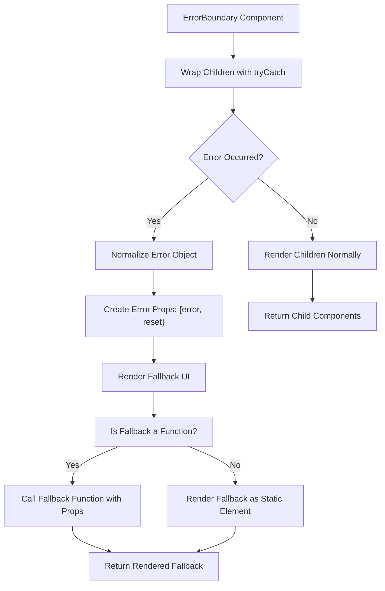
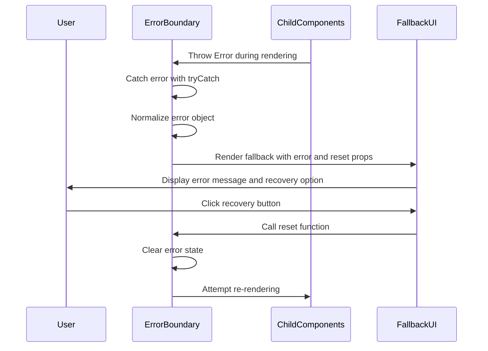

# Error Boundary

<cite>
**Referenced Files in This Document**   
- [error_boundary.ts](file://src/components/error_boundary.ts)
- [lang.ts](file://src/utils/lang.ts)
- [soby.ts](file://src/methods/soby.ts)
</cite>

## Table of Contents
1. [Introduction](#introduction)
2. [Core Functionality](#core-functionality)
3. [Implementation Details](#implementation-details)
4. [Usage Patterns](#usage-patterns)
5. [Error Recovery Mechanisms](#error-recovery-mechanisms)
6. [Integration with Woby's Reactive System](#integration-with-wobys-reactive-system)
7. [Limitations](#limitations)
8. [Best Practices](#best-practices)

## Introduction
The ErrorBoundary component in Woby provides a robust mechanism for handling JavaScript errors that occur during rendering, lifecycle methods, or in constructors of child components. Unlike traditional error handling approaches that can cause entire applications to crash, ErrorBoundary implements a containment strategy that isolates failures to specific component subtrees, allowing the rest of the application to continue functioning normally. This documentation details the component's architecture, usage patterns, and integration with Woby's reactive system.

**Section sources**
- [error_boundary.ts](file://src/components/error_boundary.ts#L8-L16)

## Core Functionality
ErrorBoundary serves as a fault isolation boundary that catches JavaScript errors anywhere in its child component tree, logs those errors, and displays a fallback UI instead of the crashed component tree. The component specifically handles errors during rendering, in lifecycle methods, and in constructors of child components. It operates by wrapping potentially problematic child components and intercepting any synchronous errors that occur during their execution.

The component accepts two primary props: `children` representing the component subtree to be protected, and `fallback` which defines the UI to be displayed when an error occurs. When an error is caught, the component prevents the error from propagating up the component tree, maintaining application stability while providing a graceful degradation experience.

**Section sources**
- [error_boundary.ts](file://src/components/error_boundary.ts#L8-L16)

## Implementation Details
The ErrorBoundary implementation leverages the `tryCatch` function from the Soby reactive library to wrap the child components and intercept errors. The component signature defines the `fallback` prop as either a static child element or a function that accepts error and reset parameters and returns a child element. This design provides flexibility in creating dynamic error UIs that can respond to the specific error context.

Internally, when an error is caught, the component normalizes the error into a proper Error object, even if the thrown value is not an instance of Error. This ensures consistent error handling regardless of how the error was originally thrown. The `untrack` function from Woby's reactivity system is used to prevent the fallback rendering from creating unnecessary reactive dependencies, optimizing performance during error recovery.

**Diagram sources**
- [error_boundary.ts](file://src/components/error_boundary.ts#L8-L16)
- [soby.ts](file://src/methods/soby.ts#L10)
- [lang.ts](file://src/utils/lang.ts#L10)

## Usage Patterns
ErrorBoundary is particularly effective in several common scenarios where component failures are likely to occur. For dynamic imports, it can wrap asynchronously loaded components to handle potential loading failures gracefully. When integrating third-party widgets that may have unpredictable behavior, ErrorBoundary provides a safety net that prevents external code from crashing the entire application. In complex form handling scenarios with multiple interdependent components, it can isolate validation or submission errors to specific form sections rather than the entire form.

The component can be used at various levels of the component hierarchy, from wrapping entire application sections to protecting individual UI elements. This hierarchical approach allows for fine-grained error containment, where a failure in a minor component doesn't affect major application functionality.

**Section sources**
- [error_boundary.ts](file://src/components/error_boundary.ts#L8-L16)

## Error Recovery Mechanisms
The recovery mechanism in ErrorBoundary centers around the `reset` function passed to the fallback component. This function allows users to attempt recovery from the error state, typically through a "Retry" button or similar UI element. When invoked, the reset function clears the error state and attempts to re-render the original children, providing a resumable rendering capability.

The fallback function receives both the error object and the reset function as parameters, enabling the creation of informative error messages that include details about the specific error encountered. This information can be used to display user-friendly messages, log errors to monitoring services, or provide context-specific recovery instructions.

**Diagram sources**
- [error_boundary.ts](file://src/components/error_boundary.ts#L8-L16)

## Integration with Woby's Reactive System
ErrorBoundary leverages Woby's reactive system to maintain isolation between the error state and the rest of the application. By using the `untrack` function when rendering the fallback UI, it prevents the error handling logic from creating reactive dependencies that could affect other parts of the application. This isolation ensures that error recovery operations don't trigger unnecessary re-renders in unrelated components.

The component's design aligns with Woby's observable-based reactivity model by treating the error state as a transient condition that can be resolved and cleared. The reset mechanism works within the reactive framework by allowing the component to return to its normal rendering path once the error is addressed, maintaining the reactive data flow without requiring external state management.

**Section sources**
- [error_boundary.ts](file://src/components/error_boundary.ts#L8-L16)
- [soby.ts](file://src/methods/soby.ts#L10)

## Limitations
While ErrorBoundary provides robust error handling capabilities, it has several important limitations. It cannot catch asynchronous errors that occur in event handlers, setTimeout callbacks, or promise rejections, as these fall outside the synchronous rendering lifecycle. Errors that occur within the ErrorBoundary component itself cannot be caught by that same instance, as there is no higher-level boundary to intercept them.

Additionally, the component only handles JavaScript errors and does not catch syntax errors, network failures, or other runtime exceptions that occur outside the component rendering process. Developers should implement complementary error handling strategies for these scenarios, such as global error handlers and promise rejection handlers.

**Section sources**
- [error_boundary.ts](file://src/components/error_boundary.ts#L8-L16)

## Best Practices
For optimal use of ErrorBoundary, place instances at strategic points in the component hierarchy rather than wrapping every individual component. Focus on protecting major application sections, complex third-party integrations, and dynamically loaded content. Avoid overuse, as excessive error boundaries can make error diagnosis more difficult and add unnecessary complexity to the component tree.

When designing fallback UIs, provide clear error messages and meaningful recovery options. Include error logging to monitoring services to track issues in production. Consider implementing a hierarchy of error boundaries, with more general boundaries at higher levels and more specific ones for critical functionality. Always test error recovery flows to ensure they work as expected and don't introduce new failure modes.

**Section sources**
- [error_boundary.ts](file://src/components/error_boundary.ts#L8-L16)