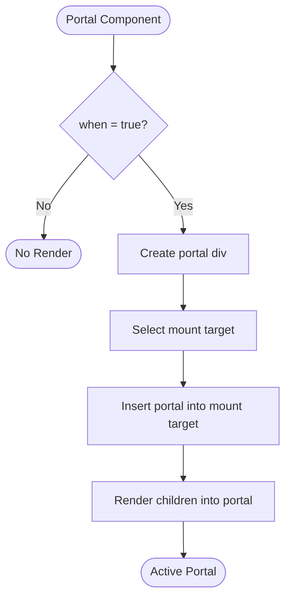
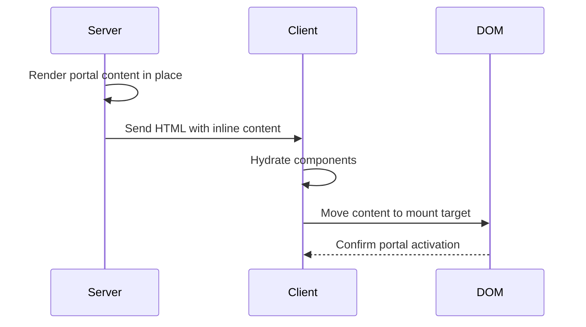
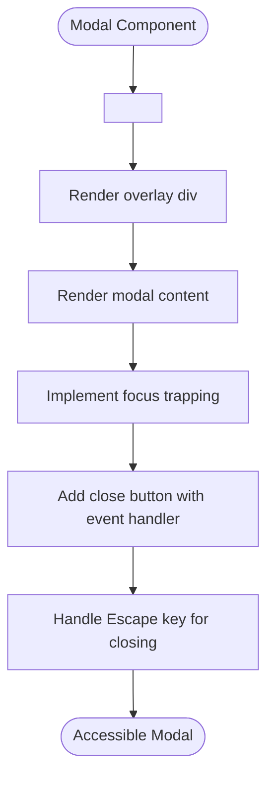

# Portal

<cite>
**Referenced Files in This Document**   
- [portal.ts](file://src/components/portal.ts)
- [portal.ssr.ts](file://src/components/portal.ssr.ts)
- [portal.via.ts](file://src/components/portal.via.ts)
- [render.ts](file://src/methods/render.ts)
- [creators.ts](file://src/utils/creators.ts)
- [use_render_effect.ts](file://src/hooks/use_render_effect.ts)
- [soby.ts](file://src/methods/soby.ts)
- [types.ts](file://src/types.ts)
</cite>

## Table of Contents
1. [Introduction](#introduction)
2. [Core Functionality](#core-functionality)
3. [Mount Prop and Target Selection](#mount-prop-and-target-selection)
4. [Event Bubbling and Propagation](#event-bubbling-and-propagation)
5. [SSR Considerations](#ssr-considerations)
6. [Via.js Integration](#viajs-integration)
7. [Usage Examples](#usage-examples)
8. [Styling and Z-Index Management](#styling-and-z-index-management)
9. [Unmount Cleanup](#unmount-cleanup)
10. [Conclusion](#conclusion)

## Introduction
The Portal component in Woby enables rendering children into a DOM node that exists outside the parent component's hierarchy. This functionality is essential for implementing UI elements such as modals, tooltips, and popovers that need to break out of their containing components to avoid clipping, z-index conflicts, or layout constraints. The Portal component provides a seamless way to manage these scenarios while preserving normal event propagation semantics and ensuring proper cleanup.

**Section sources**
- [portal.ts](file://src/components/portal.ts#L11-L49)

## Core Functionality
The Portal component renders its children into a separate DOM node, effectively teleporting content to a different location in the DOM tree. This is achieved by creating a new HTMLElement (by default a `div`) that serves as the portal container. When the component mounts, this container is inserted into the specified mount target, and the children are rendered inside it using Woby's render system.

The component accepts several props to control its behavior:
- `children`: The content to be rendered in the portal
- `when`: A conditional flag that determines whether the portal should be active
- `wrapper`: An optional custom element to use as the portal container
- `mount`: The target location where the portal should be mounted

When the `when` condition is false, the portal remains inactive and its content is not rendered. This conditional rendering is managed through Woby's reactivity system using the `useBoolean` hook.

**Diagram sources**
- [portal.ts](file://src/components/portal.ts#L11-L49)

**Section sources**
- [portal.ts](file://src/components/portal.ts#L11-L49)
- [types.ts](file://src/types.ts#L50-L100)

## Mount Prop and Target Selection
The `mount` prop in the Portal component determines where the portal content will be attached in the DOM. It accepts three types of values:
- **Selector string**: A CSS selector string that identifies the target element
- **Element**: A direct reference to a DOM element
- **Function**: A function that returns the target element

When no `mount` prop is provided, the Portal defaults to using `document.body` as the mount target. This default behavior ensures that portal content is rendered at the top level of the document, minimizing the risk of z-index conflicts and CSS containment issues.

The target selection process occurs within a `useRenderEffect` hook, which ensures that the portal is inserted into the DOM at the appropriate time during the rendering lifecycle. The implementation uses the `$$` function from Woby's reactivity system to resolve the mount target, allowing the prop to accept reactive values that can change over time.

If the resolved mount target is not a valid `Element`, the component throws an error to prevent incorrect DOM manipulation. This validation ensures type safety and helps catch configuration errors during development.

**Section sources**
- [portal.ts](file://src/components/portal.ts#L11-L49)
- [soby.ts](file://src/methods/soby.ts#L7-L8)

## Event Bubbling and Propagation
The Portal component preserves normal event propagation semantics, allowing events to bubble across portal boundaries as if the content were rendered in its original location. This behavior is crucial for maintaining expected user interactions and event handling patterns.

When an event occurs within portal content, it follows the standard DOM event flow:
1. The event is dispatched on the target element within the portal
2. It bubbles up through the portal's internal DOM hierarchy
3. It continues bubbling through the ancestors of the mount target
4. Finally, it reaches the document root

This seamless event propagation is achieved through the browser's native event system, as the Portal component does not intercept or modify event flow. Event listeners attached to elements outside the portal can still capture events originating from portal content, maintaining the illusion that the content exists in its original position.

The implementation leverages Woby's event handling system, which properly manages event listeners and ensures they are correctly attached to elements regardless of their physical location in the DOM tree. This allows developers to implement event handlers in their components without needing to account for portal-specific considerations.

**Section sources**
- [portal.ts](file://src/components/portal.ts#L11-L49)
- [setters.ts](file://src/utils/setters.ts#L624-L674)

## SSR Considerations
The Portal component includes specialized handling for server-side rendering (SSR) through the `portal.ssr.ts` implementation. This version maintains the same API and behavior as the client-side version but adapts to the constraints of SSR environments.

During SSR, the portal content is rendered in place rather than being teleported to a different location in the DOM. This approach ensures that the initial HTML output contains all content in a logical order, improving accessibility and SEO. The server-rendered markup includes the portal content at its original position in the component tree.

When the application hydrates on the client side, the portal functionality activates and moves the content to its designated mount target. This transition is handled seamlessly by the client-side Portal implementation, which detects the existing server-rendered content and properly attaches it to the specified mount point.

The SSR implementation uses `creators.ssr.ts` for DOM node creation, ensuring compatibility with server environments that may not have access to the full browser DOM API. This allows the component to function correctly in various SSR setups while maintaining consistency with the client-side behavior.

**Diagram sources**
- [portal.ssr.ts](file://src/components/portal.ssr.ts#L9-L47)
- [creators.ssr.ts](file://src/utils/creators.ssr.ts#L1-L31)

**Section sources**
- [portal.ssr.ts](file://src/components/portal.ssr.ts#L9-L47)
- [portal.ts](file://src/components/portal.ts#L11-L49)

## Via.js Integration
The Portal component supports alternative rendering environments through the `portal.via.ts` implementation, which integrates with Via.js. This version maintains the same core functionality while adapting to the specific requirements of the Via.js runtime.

The Via.js integration uses environment-specific imports for key dependencies:
- `render.via` for rendering children into the portal
- `creators.via` for creating the portal container element
- Standard Woby utilities for reactivity and effect management

This modular approach allows the Portal component to function consistently across different rendering targets while leveraging environment-optimized implementations. The Via.js version ensures that portal content is properly rendered and managed within the constraints of the target environment.

The integration preserves all core features, including conditional rendering, mount target selection, and proper cleanup. This consistency enables developers to use the Portal component across different environments without modifying their application code.

**Section sources**
- [portal.via.ts](file://src/components/portal.via.ts#L9-L47)
- [render.via.ts](file://src/methods/render.via.ts#L1-L31)
- [creators.via.ts](file://src/utils/creators.via.ts#L1-L31)

## Usage Examples
### Accessible Modal with Focus Trapping
The Portal component is commonly used to implement accessible modals that trap focus and manage keyboard navigation. By rendering the modal content at the document level, it ensures proper z-index stacking and prevents scrolling of the background content.

**Diagram sources**
- [portal.ts](file://src/components/portal.ts#L11-L49)

### Tooltip Positioning
Portals enable tooltips to break out of overflow-hidden containers and position themselves relative to their trigger elements. This is particularly useful when tooltips would otherwise be clipped by parent containers.

The tooltip can be positioned using absolute coordinates calculated based on the trigger element's position, with the portal ensuring the tooltip appears above other content in the z-index stack.

### Nested Portals
The Portal component supports nesting, allowing portals to be rendered within other portals. This capability enables complex UI patterns such as modal dialogs containing tooltips or dropdowns.

Each nested portal creates its own isolated DOM node, with event bubbling preserved across all portal boundaries. The nesting behavior follows the same principles as single portals, with each level managing its own mount target and lifecycle.

**Section sources**
- [portal.ts](file://src/components/portal.ts#L11-L49)
- [readme.md](file://readme.md#L1654-L1669)

## Styling and Z-Index Management
Proper styling of portal content requires careful consideration of CSS scope and stacking context. Since portal content is removed from its original DOM position, it no longer inherits styles from its parent components.

To address this, portal content should:
- Use CSS custom properties (variables) defined at the root level for consistent theming
- Establish their own stacking context using appropriate z-index values
- Include reset styles to avoid unintended inheritance
- Use CSS classes that are globally available or included in the portal's scope

Z-index management is particularly important for portal content, as multiple portals may compete for visibility. A common pattern is to use a z-index scale with sufficient gaps between values to allow for intermediate elements.

The Portal component itself does not impose any styling constraints, giving developers full control over the appearance of portal content. However, best practices suggest using a consistent z-index strategy across all portal-based components in an application.

**Section sources**
- [portal.ts](file://src/components/portal.ts#L11-L49)
- [types.ts](file://src/types.ts#L700-L750)

## Unmount Cleanup
The Portal component ensures proper cleanup when unmounted or when the `when` condition becomes false. This cleanup is implemented through the return value of the `useRenderEffect` hooks, which provide cleanup functions executed when the effect is disposed.

When the portal is deactivated:
1. The portal container is removed from its mount target using `removeChild`
2. Any active render effects are cleaned up
3. Event listeners and other resources are properly disposed

This cleanup process prevents memory leaks and ensures that the DOM remains in a consistent state. The use of Woby's reactivity system guarantees that cleanup occurs at the appropriate time in the component lifecycle.

The cleanup function is returned from the effect that inserts the portal into the DOM, ensuring that the portal container is always removed from its parent node when no longer needed. This atomic approach to DOM manipulation maintains the integrity of the DOM tree.

**Section sources**
- [portal.ts](file://src/components/portal.ts#L11-L49)
- [use_render_effect.ts](file://src/hooks/use_render_effect.ts#L1-L21)

## Conclusion
The Portal component in Woby provides a robust solution for rendering content outside the normal DOM hierarchy. Its implementation balances flexibility with safety, offering multiple ways to specify mount targets while validating inputs to prevent errors. The component seamlessly integrates with Woby's reactivity system, ensuring efficient updates and proper cleanup.

Key features include support for SSR, integration with alternative rendering environments via Via.js, and preservation of normal event propagation semantics. These capabilities make the Portal component suitable for a wide range of use cases, from simple tooltips to complex modal dialogs.

By following the patterns demonstrated in this documentation, developers can effectively leverage the Portal component to create sophisticated UI elements that transcend the limitations of traditional component hierarchies.

**Section sources**
- [portal.ts](file://src/components/portal.ts#L11-L49)
- [portal.ssr.ts](file://src/components/portal.ssr.ts#L9-L47)
- [portal.via.ts](file://src/components/portal.via.ts#L9-L47)