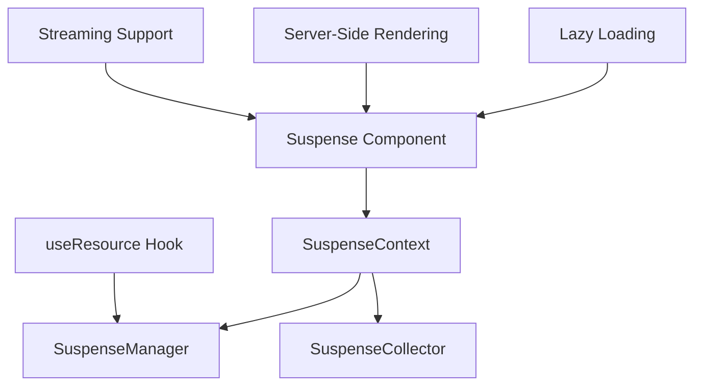
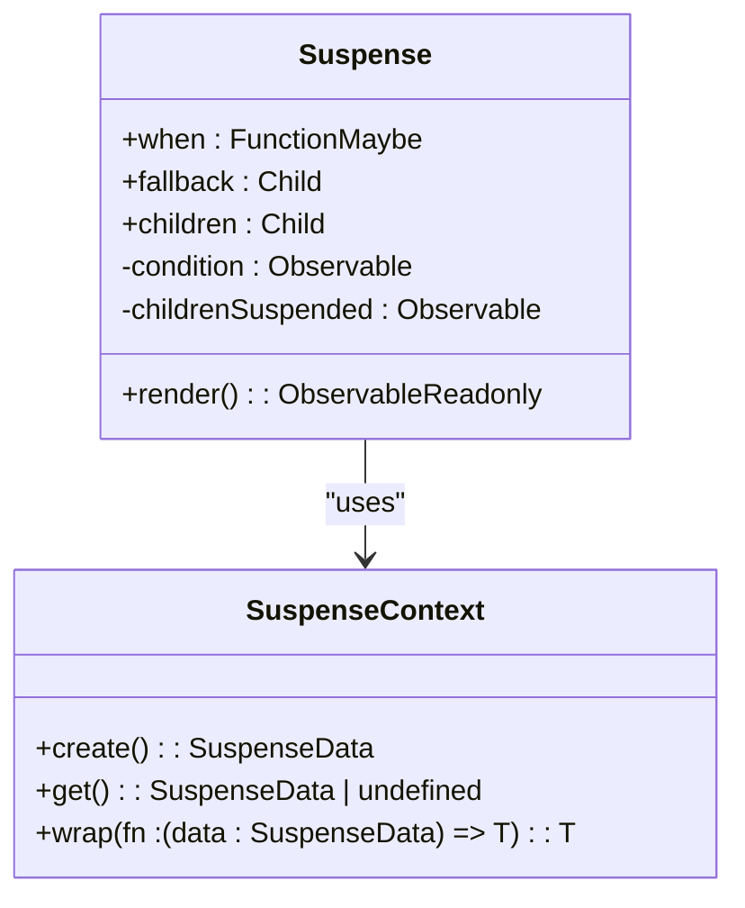
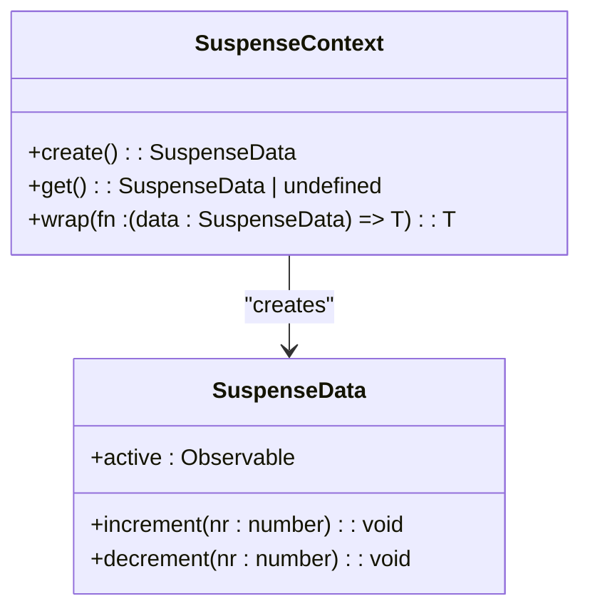
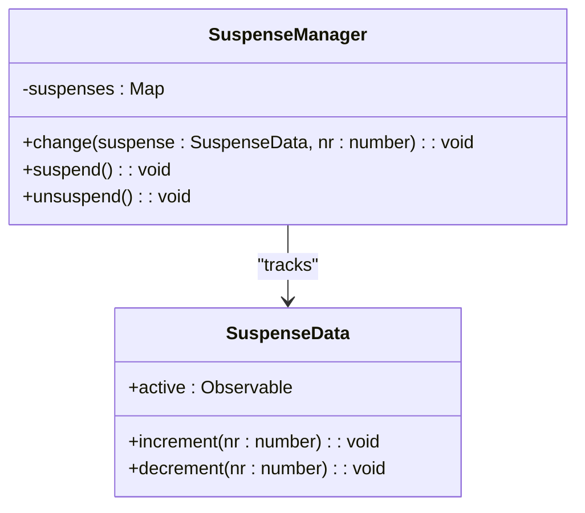
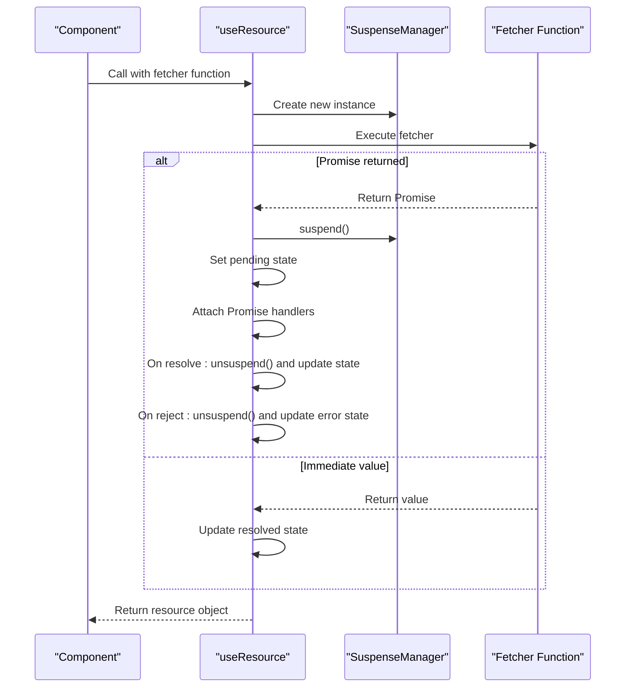
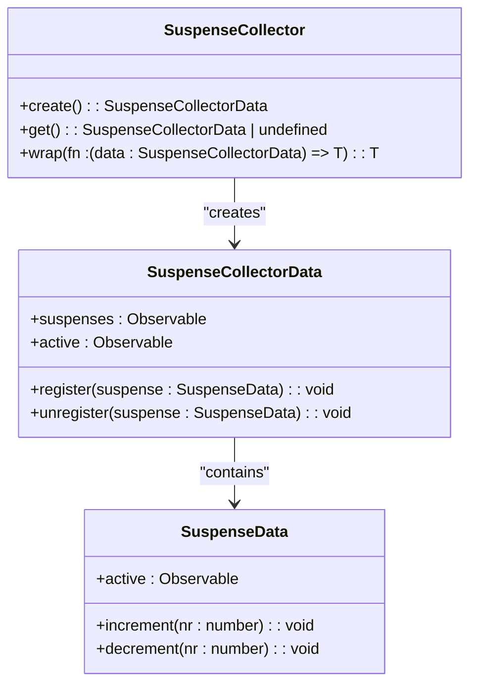
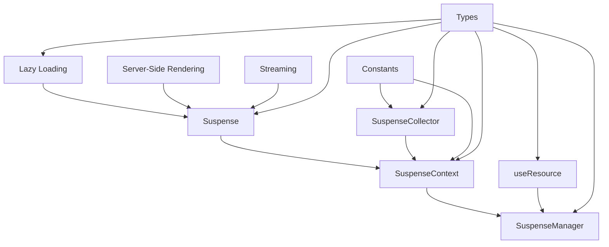

# Suspense

<cite>
**Referenced Files in This Document**   
- [suspense.ts](file://src/components/suspense.ts)
- [suspense.context.ts](file://src/components/suspense.context.ts)
- [suspense.manager.ts](file://src/components/suspense.manager.ts)
- [suspense.collector.ts](file://src/components/suspense.collector.ts)
- [use_resource.ts](file://src/hooks/use_resource.ts)
- [lazy.ts](file://src/methods/lazy.ts)
- [types.ts](file://src/types.ts)
- [constants.ts](file://src/constants.ts)
</cite>

## Table of Contents
1. [Introduction](#introduction)
2. [Core Components](#core-components)
3. [Architecture Overview](#architecture-overview)
4. [Detailed Component Analysis](#detailed-component-analysis)
5. [Dependency Analysis](#dependency-analysis)
6. [Performance Considerations](#performance-considerations)
7. [Troubleshooting Guide](#troubleshooting-guide)
8. [Conclusion](#conclusion)

## Introduction
The Suspense component in Woby provides a declarative mechanism for handling asynchronous operations such as data fetching, code splitting, and resource loading. It enables graceful handling of pending states by displaying fallback content while waiting for resources to resolve. This documentation details the internal architecture, integration with the useResource hook, and behavior during server-side rendering and streaming scenarios.

**Section sources**
- [suspense.ts](file://src/components/suspense.ts)
- [use_resource.ts](file://src/hooks/use_resource.ts)

## Core Components
The Suspense system in Woby consists of several key components that work together to manage asynchronous operations. The primary components include the Suspense component itself, SuspenseContext for parent-child coordination, SuspenseManager for tracking pending resources, and SuspenseCollector for batch resolution of suspended components.

**Section sources**
- [suspense.ts](file://src/components/suspense.ts)
- [suspense.context.ts](file://src/components/suspense.context.ts)
- [suspense.manager.ts](file://src/components/suspense.manager.ts)
- [suspense.collector.ts](file://src/components/suspense.collector.ts)

## Architecture Overview

**Diagram sources**
- [suspense.ts](file://src/components/suspense.ts)
- [suspense.context.ts](file://src/components/suspense.context.ts)
- [suspense.manager.ts](file://src/components/suspense.manager.ts)
- [suspense.collector.ts](file://src/components/suspense.collector.ts)
- [use_resource.ts](file://src/hooks/use_resource.ts)

## Detailed Component Analysis

### Suspense Component Analysis

The Suspense component serves as the primary interface for handling asynchronous operations in Woby. It accepts a `fallback` prop that is displayed while waiting for resources to resolve, and conditionally renders its children once all pending operations are complete.

**Diagram sources**
- [suspense.ts](file://src/components/suspense.ts#L11-L25)
- [suspense.context.ts](file://src/components/suspense.context.ts#L1-L54)

**Section sources**
- [suspense.ts](file://src/components/suspense.ts#L11-L25)
- [suspense.context.ts](file://src/components/suspense.context.ts#L1-L54)

### Suspense Context Analysis

The SuspenseContext provides the coordination mechanism between parent and child Suspense boundaries. It maintains the active state of suspense operations and enables proper nesting of suspense components.

**Diagram sources**
- [suspense.context.ts](file://src/components/suspense.context.ts#L1-L54)

**Section sources**
- [suspense.context.ts](file://src/components/suspense.context.ts#L1-L54)

### Suspense Manager Analysis

The SuspenseManager class is responsible for tracking pending resources and coordinating the suspension and resumption of components. It integrates with the useResource hook to signal pending states.

**Diagram sources**
- [suspense.manager.ts](file://src/components/suspense.manager.ts#L4-L67)
- [suspense.context.ts](file://src/components/suspense.context.ts#L1-L54)

**Section sources**
- [suspense.manager.ts](file://src/components/suspense.manager.ts#L4-L67)

### useResource Hook Analysis

The useResource hook integrates with Suspense to provide a clean API for handling asynchronous data fetching. It returns a resource object that can be used to track pending, error, and resolved states.

**Diagram sources**
- [use_resource.ts](file://src/hooks/use_resource.ts#L18-L104)
- [suspense.manager.ts](file://src/components/suspense.manager.ts#L4-L67)

**Section sources**
- [use_resource.ts](file://src/hooks/use_resource.ts#L18-L104)

### Suspense Collector Analysis

The SuspenseCollector enables batch resolution of multiple suspended components by keeping track of all Suspense instances within its scope. This is particularly useful for server-side rendering and streaming scenarios.

**Diagram sources**
- [suspense.collector.ts](file://src/components/suspense.collector.ts#L9-L42)
- [suspense.context.ts](file://src/components/suspense.context.ts#L1-L54)

**Section sources**
- [suspense.collector.ts](file://src/components/suspense.collector.ts#L9-L42)

## Dependency Analysis

**Diagram sources**
- [suspense.ts](file://src/components/suspense.ts)
- [suspense.context.ts](file://src/components/suspense.context.ts)
- [suspense.manager.ts](file://src/components/suspense.manager.ts)
- [suspense.collector.ts](file://src/components/suspense.collector.ts)
- [use_resource.ts](file://src/hooks/use_resource.ts)
- [lazy.ts](file://src/methods/lazy.ts)
- [constants.ts](file://src/constants.ts)
- [types.ts](file://src/types.ts)

**Section sources**
- [suspense.ts](file://src/components/suspense.ts)
- [suspense.context.ts](file://src/components/suspense.context.ts)
- [suspense.manager.ts](file://src/components/suspense.manager.ts)
- [suspense.collector.ts](file://src/components/suspense.collector.ts)
- [use_resource.ts](file://src/hooks/use_resource.ts)
- [lazy.ts](file://src/methods/lazy.ts)
- [constants.ts](file://src/constants.ts)
- [types.ts](file://src/types.ts)

## Performance Considerations
The Suspense component enables progressive rendering by allowing parts of the application to render immediately while other parts wait for data. This reduces perceived load times and improves user experience. The use of microtasks for decrementing suspense counters ensures that UI updates are batched efficiently. During server-side rendering, the SuspenseCollector enables streaming of content as data becomes available, rather than waiting for all resources to resolve before sending any content to the client.

**Section sources**
- [suspense.manager.ts](file://src/components/suspense.manager.ts#L4-L67)
- [suspense.collector.ts](file://src/components/suspense.collector.ts#L9-L42)

## Troubleshooting Guide
Common issues with Suspense include infinite fallback loops, which can occur when a resource continuously throws or rejects. This can be mitigated by implementing proper error handling in fetchers and using timeout strategies. Nested suspense boundaries require careful coordination to avoid premature resolution. The SuspenseManager's unsuspend method provides a way to forcibly resolve all pending operations, which can be useful in error recovery scenarios.

**Section sources**
- [use_resource.ts](file://src/hooks/use_resource.ts#L18-L104)
- [suspense.manager.ts](file://src/components/suspense.manager.ts#L4-L67)

## Conclusion
The Suspense component in Woby provides a robust mechanism for handling asynchronous operations with a clean, declarative API. Its integration with the useResource hook enables seamless data fetching, while the underlying architecture supports advanced features like server-side rendering and streaming. The component's design promotes progressive rendering and improved perceived performance, making it a valuable tool for building responsive web applications.