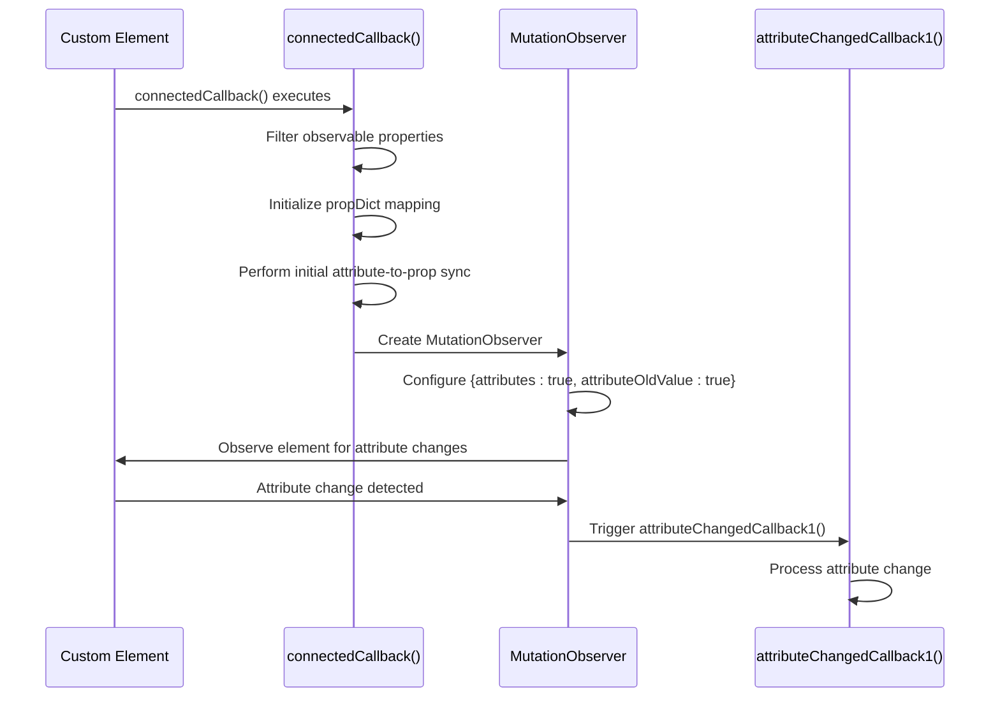
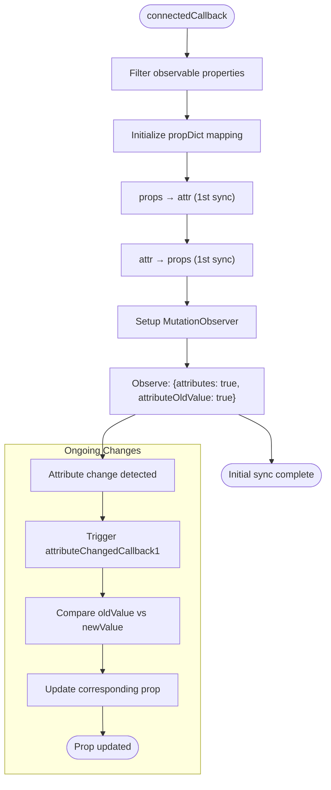
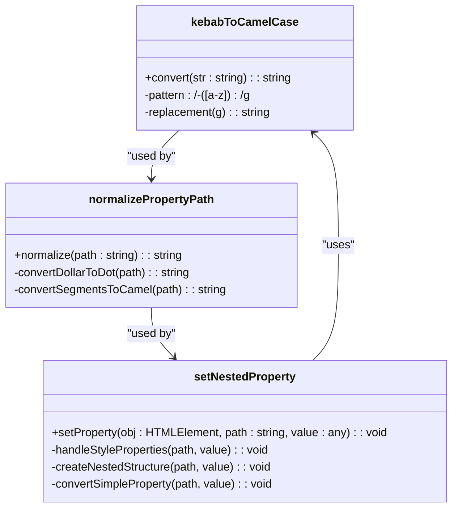
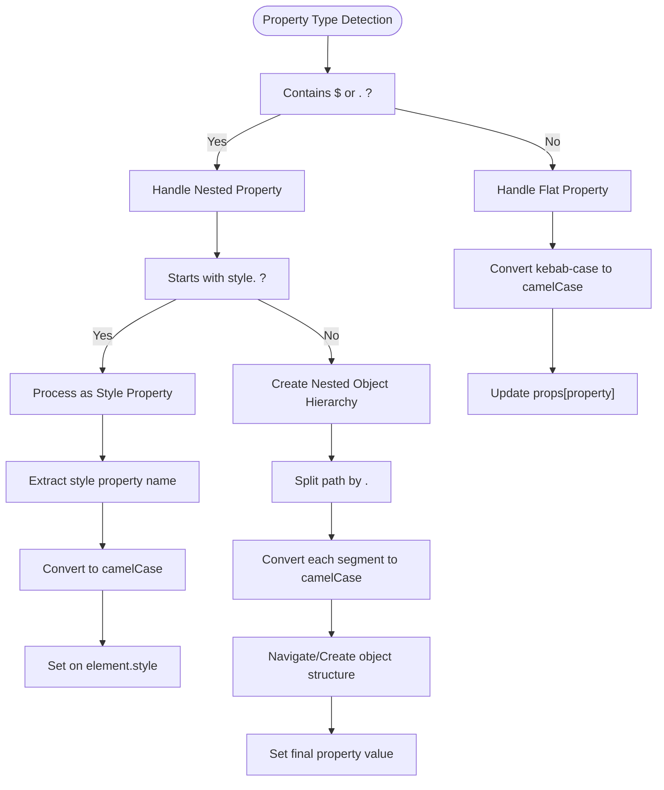
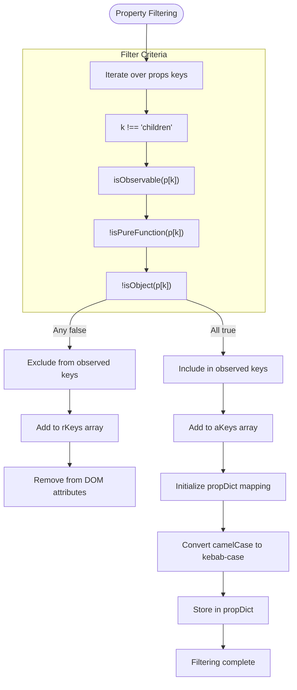
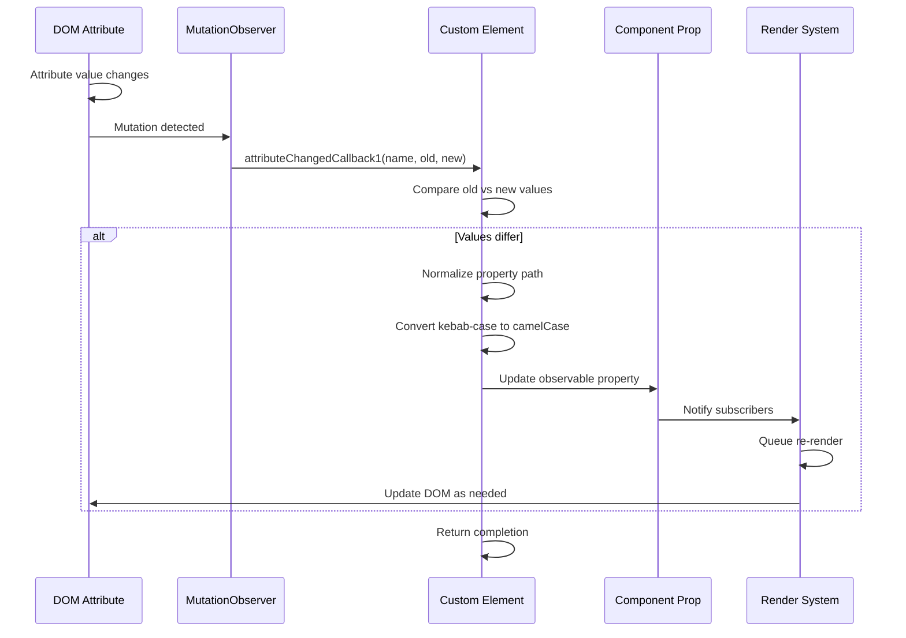
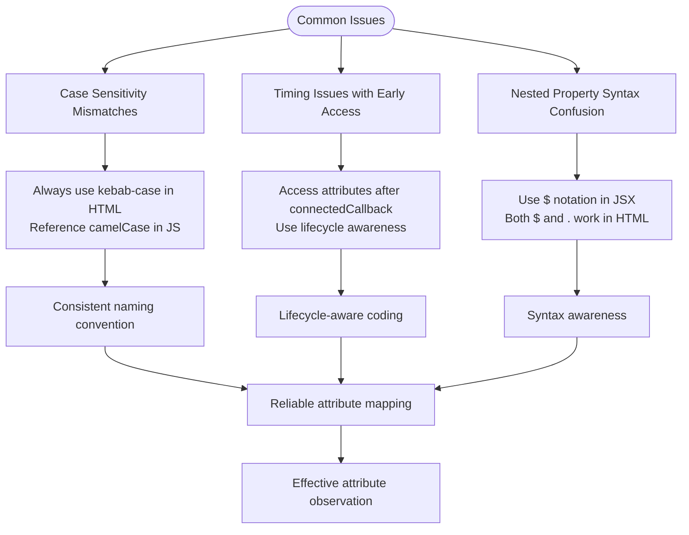

# Attribute Observation and Synchronization

<cite>
**Referenced Files in This Document**   
- [custom_element.ts](file://src/methods/custom_element.ts)
- [string.ts](file://src/utils/string.ts)
- [nested.ts](file://src/utils/nested.ts)
- [lang.ts](file://src/utils/lang.ts)
- [setters.ts](file://src/utils/setters.ts)
- [constants.ts](file://src/constants.ts)
</cite>

## Table of Contents
1. [Introduction](#introduction)
2. [Attribute Observation Mechanism](#attribute-observation-mechanism)
3. [Bidirectional Synchronization Flow](#bidirectional-synchronization-flow)
4. [Case Conversion System](#case-conversion-system)
5. [Property Handling Strategies](#property-handling-strategies)
6. [Observability Determination](#observability-determination)
7. [Reactive Update Examples](#reactive-update-examples)
8. [Common Issues and Solutions](#common-issues-and-solutions)

## Introduction
This document details the attribute observation and synchronization system in Woby custom elements. The framework implements a comprehensive mechanism for tracking attribute changes and synchronizing them with component properties through a combination of MutationObserver, connectedCallback, and attributeChangedCallback1. The system supports bidirectional data flow, automatic case conversion, nested property handling, and type-aware value transformation.

**Section sources**
- [custom_element.ts](file://src/methods/custom_element.ts#L0-L22)
- [custom_element.ts](file://src/methods/custom_element.ts#L341-L377)

## Attribute Observation Mechanism

The attribute observation system in Woby custom elements is established during the connectedCallback lifecycle method. When a custom element is connected to the DOM, it sets up a MutationObserver to monitor attribute changes on the element. This observer is configured to track attribute modifications with old value preservation, enabling the framework to detect and respond to changes effectively.

The MutationObserver is initialized with configuration options that specify attributes should be observed and old values should be recorded. This allows the system to compare previous and current attribute values, preventing unnecessary updates when values remain unchanged. The observer specifically watches for 'attributes' type mutations, which correspond to attribute additions, modifications, and removals.

**Diagram sources**
- [custom_element.ts](file://src/methods/custom_element.ts#L541-L583)

**Section sources**
- [custom_element.ts](file://src/methods/custom_element.ts#L541-L583)

## Bidirectional Synchronization Flow

Woby implements a bidirectional synchronization flow between HTML attributes and component properties. This flow operates in two distinct phases: initial synchronization during connectedCallback and ongoing change detection via attributeChangedCallback1.

During the initial phase in connectedCallback, the system performs two-way synchronization. First, it converts existing component props to attributes (props → attr), ensuring that the DOM representation reflects the initial state. Then, it processes existing attributes to update corresponding props (attr → props), allowing external attribute values to override default prop values. This dual approach ensures consistency between the component's internal state and its DOM representation.

The ongoing synchronization is handled by the MutationObserver, which triggers attributeChangedCallback1 whenever an attribute changes. This method processes the change by updating the corresponding prop, maintaining the reactive connection between the DOM and component state.

**Diagram sources**
- [custom_element.ts](file://src/methods/custom_element.ts#L541-L583)

**Section sources**
- [custom_element.ts](file://src/methods/custom_element.ts#L541-L583)

## Case Conversion System

The case conversion system in Woby handles the transformation between kebab-case attribute names (used in HTML) and camelCase property names (used in JavaScript). This conversion is essential for maintaining compatibility between the case-insensitive nature of HTML attributes and the conventional camelCase naming in JavaScript.

The kebabToCamelCase utility function implements this conversion by identifying hyphen-adjacent lowercase letters and transforming them into uppercase characters without the hyphen. For example, 'font-size' becomes 'fontSize' and 'background-color' becomes 'backgroundColor'. This function is used throughout the attribute synchronization process to ensure consistent property name mapping.

Additionally, the system handles nested property paths that may contain both $ and . notation. The normalizePropertyPath function first converts $ notation to dot notation, then applies kebab-to-camel conversion to each segment of the path. This enables support for complex property hierarchies while maintaining consistent naming conventions.

**Diagram sources**
- [string.ts](file://src/utils/string.ts#L27-L29)
- [nested.ts](file://src/utils/nested.ts#L30-L42)
- [custom_element.ts](file://src/methods/custom_element.ts#L194-L240)

**Section sources**
- [string.ts](file://src/utils/string.ts#L27-L29)
- [nested.ts](file://src/utils/nested.ts#L30-L42)

## Property Handling Strategies

Woby distinguishes between flat properties and nested properties in its attribute handling system. Flat properties are simple, top-level attributes that map directly to component props. These are processed by converting the attribute name from kebab-case to camelCase and updating the corresponding property in the component's props object.

Nested properties support more complex data structures through special syntax. The system recognizes both $ and . notation for nested paths (e.g., 'user$name' or 'user.name' in HTML, 'user$name' in JSX). When processing nested properties, the framework creates the necessary object hierarchy within the component's props and sets the final value at the specified path.

Style properties receive special handling due to their importance in web development. Properties prefixed with 'style.' or 'style$' are treated as CSS style declarations. The system converts these to the appropriate camelCase format for the style object (e.g., 'style.font-size' becomes 'fontSize' in the style object) and applies them directly to the element's style property.

**Diagram sources**
- [custom_element.ts](file://src/methods/custom_element.ts#L194-L240)
- [custom_element.ts](file://src/methods/custom_element.ts#L252-L284)
- [nested.ts](file://src/utils/nested.ts#L30-L42)

**Section sources**
- [custom_element.ts](file://src/methods/custom_element.ts#L194-L240)
- [custom_element.ts](file://src/methods/custom_element.ts#L252-L284)

## Observability Determination

The system determines which props become observed attributes through the isObservable check. During the connectedCallback phase, the framework filters component properties to identify those that should be observed. Properties are considered observable if they are wrapped with Woby's reactivity system (using the $ function) and meet specific criteria.

The filtering process excludes certain types of properties from observation: functions (identified by isPureFunction check) and objects (identified by isObject check) are not directly observed as attributes. The 'children' property is also explicitly excluded from attribute observation. This ensures that only primitive values and observables are synchronized with HTML attributes, maintaining a clean separation between data and behavior.

The propDict mapping system maintains a bidirectional relationship between camelCase property names and their kebab-case attribute equivalents. This dictionary is initialized during the custom element constructor and used throughout the synchronization process to quickly resolve property name conversions in both directions.

**Diagram sources**
- [custom_element.ts](file://src/methods/custom_element.ts#L541-L583)
- [lang.ts](file://src/utils/lang.ts#L180-L182)

**Section sources**
- [custom_element.ts](file://src/methods/custom_element.ts#L541-L583)
- [lang.ts](file://src/utils/lang.ts#L180-L182)

## Reactive Update Examples

When an attribute changes in the DOM, it triggers a reactive update cycle in the Woby component. The MutationObserver detects the change and calls attributeChangedCallback1 with the attribute name, old value, and new value. The method first checks if the values have actually changed (preventing unnecessary updates), then processes the change based on whether it involves a nested property or a flat property.

For nested properties, the system normalizes the property path, handles any style-specific processing, and updates the corresponding nested value in the component's props. For flat properties, it converts the kebab-case attribute name to camelCase and updates the direct property value. In both cases, the underlying observable system ensures that any dependent computations or renderings are automatically updated.

The bidirectional nature of the system means that changes can originate from either the DOM (attribute changes) or the component (prop changes), with the system ensuring synchronization in both directions. This enables flexible development patterns where attributes can be manipulated directly in HTML while maintaining reactivity within the component logic.

**Diagram sources**
- [custom_element.ts](file://src/methods/custom_element.ts#L541-L583)
- [custom_element.ts](file://src/methods/custom_element.ts#L419-L465)

**Section sources**
- [custom_element.ts](file://src/methods/custom_element.ts#L419-L465)

## Common Issues and Solutions

Several common issues can arise when working with attribute observation in Woby custom elements. Case sensitivity mismatches occur when developers expect case-preserving behavior from HTML attributes, but the system automatically converts to camelCase. To avoid this, developers should consistently use kebab-case in HTML and reference the camelCase equivalents in JavaScript.

Timing issues with early attribute access can occur when attempting to read attribute values before the connectedCallback has executed. Since attribute synchronization is established during connectedCallback, any attempts to access synchronized props before this lifecycle phase will not reflect the latest attribute values. The solution is to ensure that attribute-dependent logic is placed within or after the connectedCallback execution.

Another common issue involves nested property syntax confusion. Developers may attempt to use dot notation in JSX, but the system only supports $ notation in JSX context. In HTML, both $ and . notation are supported for backward compatibility. Understanding these syntax differences is crucial for proper implementation.

**Diagram sources**
- [custom_element.ts](file://src/methods/custom_element.ts#L541-L583)
- [string.ts](file://src/utils/string.ts#L27-L29)

**Section sources**
- [custom_element.ts](file://src/methods/custom_element.ts#L541-L583)
- [readme.md](file://readme.md#L114-L183)