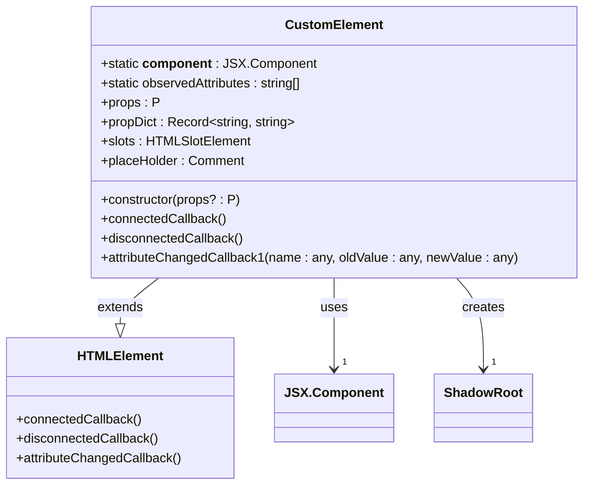
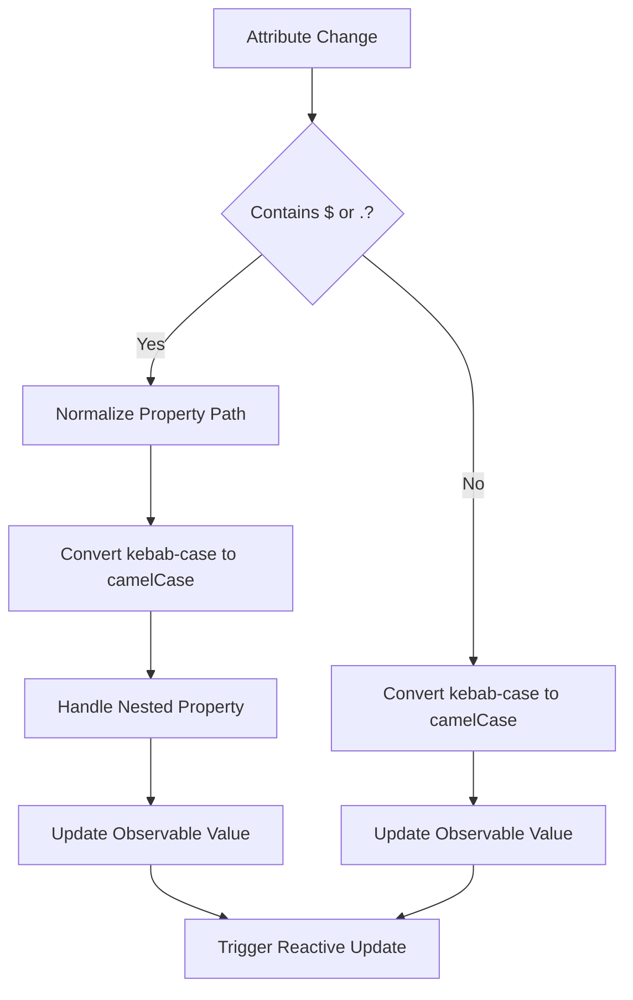
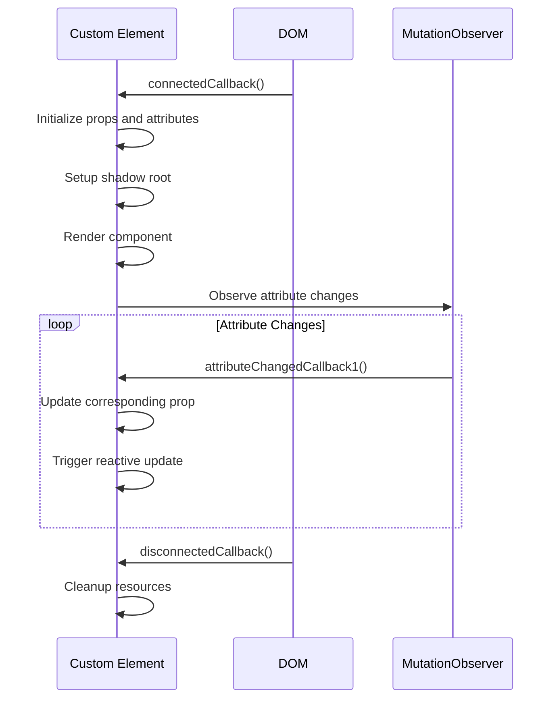
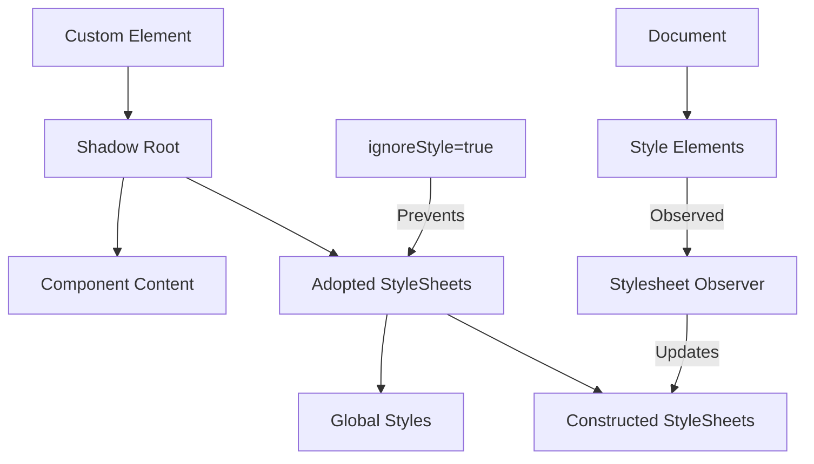
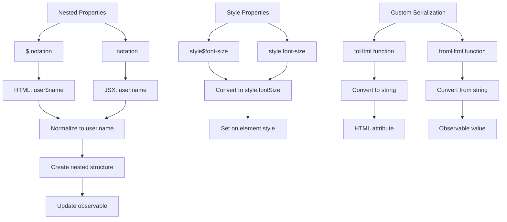
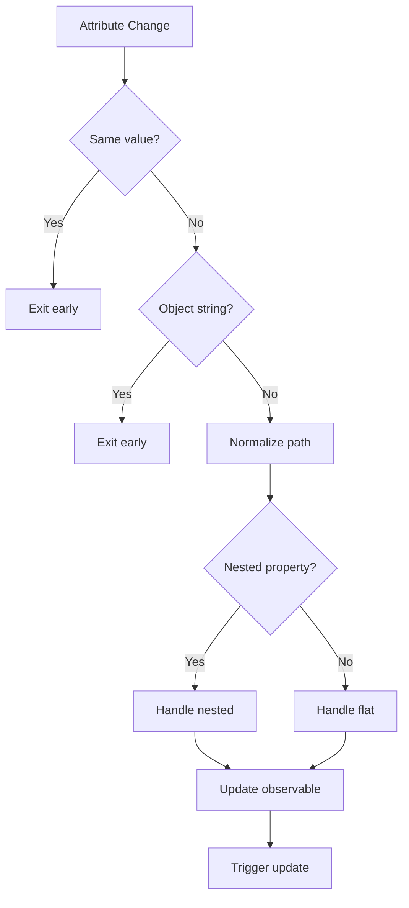

# Custom Elements

<cite>
**Referenced Files in This Document**   
- [custom_element.ts](file://src/methods/custom_element.ts)
- [nested.ts](file://src/utils/nested.ts)
- [string.ts](file://src/utils/string.ts)
- [defaults.ts](file://src/methods/defaults.ts)
- [stylesheets.ts](file://src/utils/stylesheets.ts)
- [setters.ts](file://src/utils/setters.ts)
- [types.ts](file://src/jsx/types.ts)
- [constants.ts](file://src/constants.ts)
</cite>

## Table of Contents
1. [Introduction](#introduction)
2. [Core Architecture](#core-architecture)
3. [Property Binding System](#property-binding-system)
4. [Lifecycle Management](#lifecycle-management)
5. [Shadow DOM and Style Encapsulation](#shadow-dom-and-style-encapsulation)
6. [Type Safety and JSX Integration](#type-safety-and-jsx-integration)
7. [Usage Examples](#usage-examples)
8. [Advanced Features](#advanced-features)
9. [Performance Considerations](#performance-considerations)

## Introduction
The `customElement()` API provides a bridge between Woby's reactive system and Web Components, enabling the creation of custom HTML elements with fully reactive properties. This integration allows components to be used seamlessly in both JSX/TSX and standard HTML contexts while maintaining reactivity and type safety. The API automatically handles attribute observation, property binding, and lifecycle management, making it easy to create encapsulated, reusable components that respond to changes in their properties.

**Section sources**
- [custom_element.ts](file://src/methods/custom_element.ts#L1-L50)

## Core Architecture



**Diagram sources**
- [custom_element.ts](file://src/methods/custom_element.ts#L452-L641)

**Section sources**
- [custom_element.ts](file://src/methods/custom_element.ts#L452-L641)

## Property Binding System



**Diagram sources**
- [custom_element.ts](file://src/methods/custom_element.ts#L605-L641)
- [nested.ts](file://src/utils/nested.ts#L30-L42)
- [string.ts](file://src/utils/string.ts#L27-L29)

**Section sources**
- [custom_element.ts](file://src/methods/custom_element.ts#L194-L240)
- [nested.ts](file://src/utils/nested.ts#L30-L42)
- [string.ts](file://src/utils/string.ts#L27-L29)

## Lifecycle Management



**Diagram sources**
- [custom_element.ts](file://src/methods/custom_element.ts#L541-L590)

**Section sources**
- [custom_element.ts](file://src/methods/custom_element.ts#L541-L590)

## Shadow DOM and Style Encapsulation



**Diagram sources**
- [custom_element.ts](file://src/methods/custom_element.ts#L480-L495)
- [stylesheets.ts](file://src/utils/stylesheets.ts#L1-L115)

**Section sources**
- [custom_element.ts](file://src/methods/custom_element.ts#L480-L495)
- [stylesheets.ts](file://src/utils/stylesheets.ts#L1-L115)

## Type Safety and JSX Integration

```mermaid
classDiagram
class ElementAttributes {
+Partial~HTMLAttributes~HTMLElement~~
+Partial~Record~ElementAttributesPattern~P~, any~~
}
class ElementAttributesPattern {
+keyof P
+keyof HTMLAttributes~HTMLElement~
+*
+style.${keyof StyleProperties}
+style.*
}
class ExtractProps {
+T extends (props : infer P) => any ? P : never
}
ElementAttributes --> ElementAttributesPattern : uses
ExtractProps --> ElementAttributes : uses
ElementAttributes --> "1" JSX.StyleProperties : references
```

**Diagram sources**
- [custom_element.ts](file://src/methods/custom_element.ts#L50-L88)
- [types.ts](file://src/jsx/types.ts#L1-L220)

**Section sources**
- [custom_element.ts](file://src/methods/custom_element.ts#L50-L88)
- [types.ts](file://src/jsx/types.ts#L1-L220)

## Usage Examples

```mermaid
flowchart TD
A[Define Component] --> B[Use defaults() helper]
B --> C[Define observable props]
C --> D[Create component function]
D --> E[Register with customElement()]
E --> F{Usage Context}
F --> G[HTML Usage]
F --> H[JSX Usage]
G --> I[Attribute binding]
H --> J[Property binding]
I --> K[Automatic type conversion]
J --> K
K --> L[Reactive updates]
```

**Diagram sources**
- [custom_element.ts](file://src/methods/custom_element.ts#L242-L450)
- [defaults.ts](file://src/methods/defaults.ts#L1-L164)

**Section sources**
- [custom_element.ts](file://src/methods/custom_element.ts#L242-L450)
- [defaults.ts](file://src/methods/defaults.ts#L1-L164)

## Advanced Features



**Diagram sources**
- [custom_element.ts](file://src/methods/custom_element.ts#L194-L240)
- [nested.ts](file://src/utils/nested.ts#L30-L42)
- [string.ts](file://src/utils/string.ts#L27-L29)

**Section sources**
- [custom_element.ts](file://src/methods/custom_element.ts#L194-L240)
- [nested.ts](file://src/utils/nested.ts#L30-L42)
- [string.ts](file://src/utils/string.ts#L27-L29)

## Performance Considerations



**Diagram sources**
- [custom_element.ts](file://src/methods/custom_element.ts#L605-L641)
- [setters.ts](file://src/utils/setters.ts#L1-L799)

**Section sources**
- [custom_element.ts](file://src/methods/custom_element.ts#L605-L641)
- [setters.ts](file://src/utils/setters.ts#L1-L799)