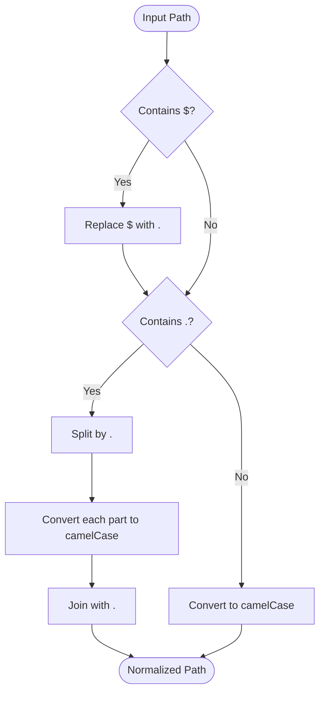
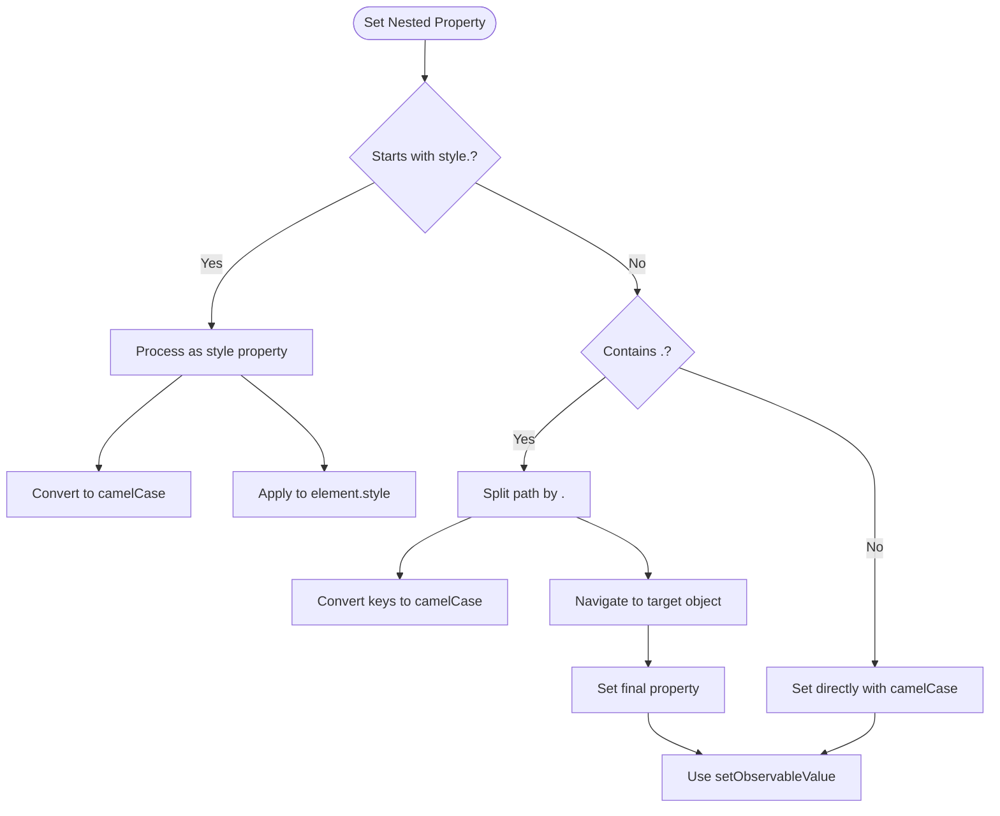
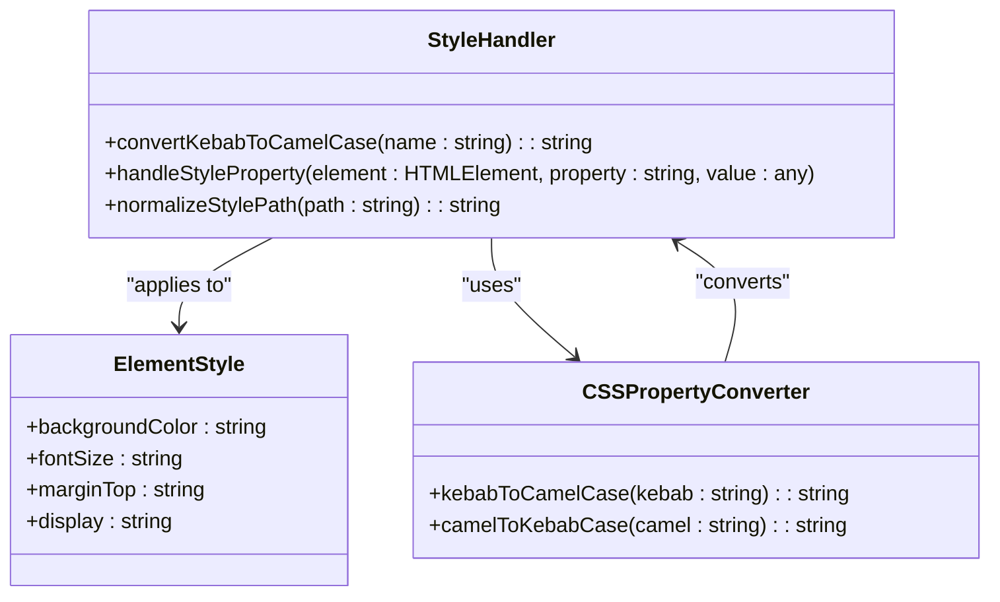
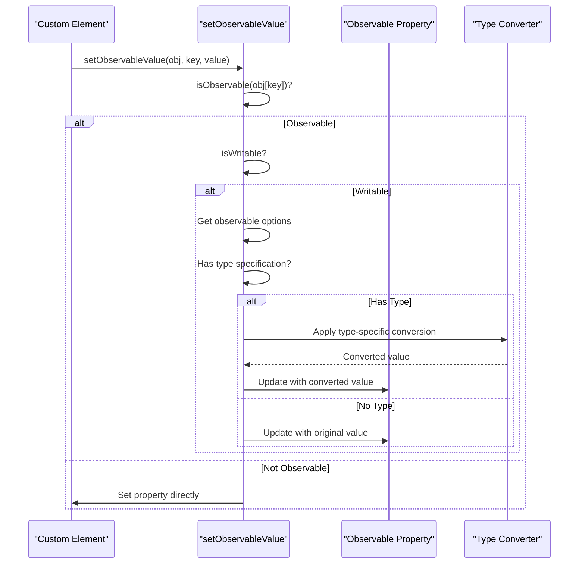
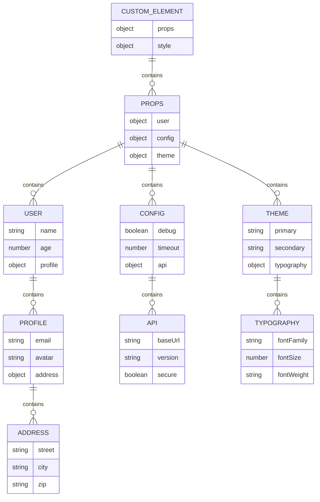
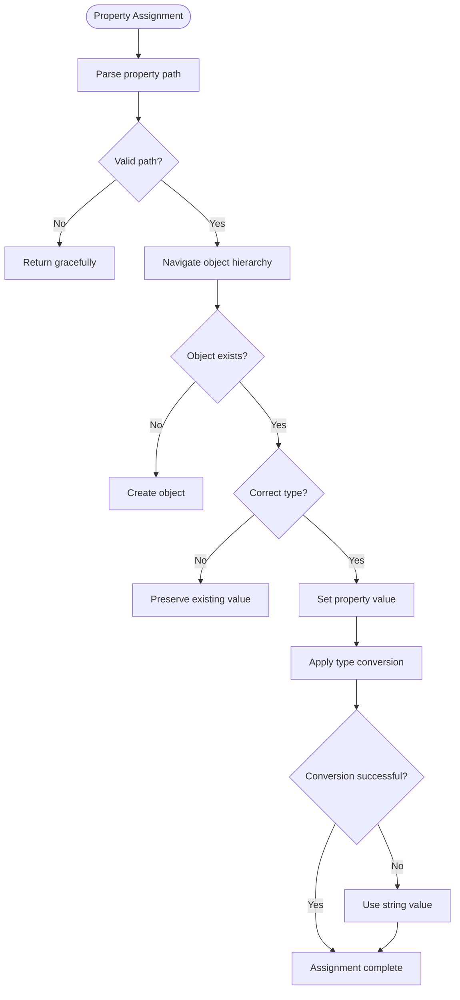
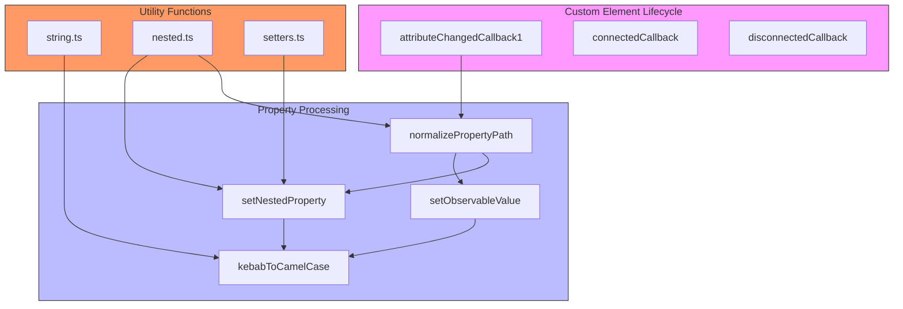

# Nested Property Handling

<cite>
**Referenced Files in This Document**   
- [nested.ts](file://src/utils/nested.ts)
- [custom_element.ts](file://src/methods/custom_element.ts)
- [string.ts](file://src/utils/string.ts)
- [setters.ts](file://src/utils/setters.ts)
- [html-style.ts](file://src/html/html-style.ts)
</cite>

## Table of Contents
1. [Introduction](#introduction)
2. [Property Path Normalization](#property-path-normalization)
3. [Nested Property Processing](#nested-property-processing)
4. [Style Property Handling](#style-property-handling)
5. [Observable Value Updates](#observable-value-updates)
6. [HTML vs JSX Usage Patterns](#html-vs-jsx-usage-patterns)
7. [Complex Nested Data Examples](#complex-nested-data-examples)
8. [Common Issues and Error Handling](#common-issues-and-error-handling)
9. [Architecture Overview](#architecture-overview)

## Introduction
The Woby framework provides comprehensive support for nested property handling in custom elements, enabling developers to work with complex data structures through intuitive attribute syntax. This documentation details the mechanisms for processing properties with $ or . notation (e.g., nested$prop$value or nested.prop.value), which are automatically detected and processed by the framework. The system handles both general nested objects and specialized style properties, with automatic conversion between kebab-case and camelCase naming conventions. The implementation supports both HTML and JSX usage patterns while maintaining reactivity through the framework's observable system.

## Property Path Normalization

The `normalizePropertyPath` utility function standardizes property paths by converting between different notation styles and naming conventions. This function serves as the foundation for nested property processing, ensuring consistent handling of property paths regardless of input format.



**Diagram sources**
- [nested.ts](file://src/utils/nested.ts#L30-L42)
- [string.ts](file://src/utils/string.ts#L27-L29)

**Section sources**
- [nested.ts](file://src/utils/nested.ts#L30-L42)

## Nested Property Processing

The `setNestedProperty` function handles the assignment of values to nested properties in custom elements. This function processes both general nested objects and style-specific properties, creating the necessary object structure when required. For non-style properties containing dots, the function splits the path by periods, converts each segment to camelCase, and navigates through the object structure to set the final property value.

When processing the first key in a path, the function prioritizes the `props` object if the direct property doesn't exist, ensuring proper encapsulation of component properties. For subsequent keys, it creates intermediate objects as needed to maintain the nested structure. The final property value is set using the `setObservableValue` function, which handles type conversion and observable updates.



**Diagram sources**
- [custom_element.ts](file://src/methods/custom_element.ts#L194-L240)
- [nested.ts](file://src/utils/nested.ts#L61-L103)

**Section sources**
- [custom_element.ts](file://src/methods/custom_element.ts#L194-L240)

## Style Property Handling

Style properties are processed with special handling to ensure proper application to the element's style object. Properties with the prefix "style." are identified and processed differently from other nested properties. The framework automatically converts kebab-case CSS property names to camelCase JavaScript property names, which is the standard convention for accessing CSS properties through the DOM API.

For example, a property like "style$font-size" or "style.font-size" is normalized to "style.fontSize" and applied directly to the element's style object. This conversion is performed using the `kebabToCamelCase` utility function, which systematically transforms hyphenated names to camelCase by capitalizing letters that follow hyphens.

The style property handling system also integrates with the framework's observable system, allowing reactive updates to style properties. When a style attribute changes, the corresponding style property is updated on the element, triggering any associated rendering updates.



**Diagram sources**
- [custom_element.ts](file://src/methods/custom_element.ts#L196-L197)
- [html-style.ts](file://src/html/html-style.ts#L27-L45)
- [string.ts](file://src/utils/string.ts#L27-L29)

**Section sources**
- [custom_element.ts](file://src/methods/custom_element.ts#L194-L240)
- [html-style.ts](file://src/html/html-style.ts)

## Observable Value Updates

The `setObservableValue` function manages updates to observable properties, handling type conversion based on the observable's configuration. When setting a value on an observable property, the function first checks if the target property is indeed an observable and writable. If so, it retrieves the observable's options to determine the appropriate type conversion strategy.

The function supports various data types including number, boolean, bigint, object, function, symbol, and undefined. For each type, specific conversion logic is applied. For example, string values are converted to numbers using the `Number()` function, while boolean values are interpreted from various string representations like "true", "1", or empty strings.

When type conversion fails (e.g., attempting to parse an invalid number), the function gracefully falls back to treating the value as a string. This error handling ensures that the application remains stable even when receiving unexpected input. The function also respects custom serialization functions (`fromHtml`) defined in the observable's options, allowing components to implement specialized parsing logic.



**Diagram sources**
- [custom_element.ts](file://src/methods/custom_element.ts#L111-L181)

**Section sources**
- [custom_element.ts](file://src/methods/custom_element.ts#L111-L181)

## HTML vs JSX Usage Patterns

The framework supports different usage patterns for nested properties in HTML versus JSX contexts. In HTML, dot notation is used for nested properties (e.g., style.color or nested.prop.value), while in JSX, the dollar sign notation is preferred (e.g., style$color or nested$prop$value). This distinction accommodates the different parsing requirements of HTML and JavaScript.

In HTML, attributes are case-insensitive and hyphenated naming is standard, making dot notation a natural choice for property paths. In JSX, which is JavaScript-based, the dollar sign serves as a clear delimiter that doesn't conflict with JavaScript syntax. The `normalizePropertyPath` function handles both notations interchangeably, converting $ to . internally for consistent processing.

The framework's attribute handling system detects nested properties by checking for either $ or . characters in attribute names. When such characters are found, the attribute is processed as a nested property rather than a flat property. This detection occurs in the `attributeChangedCallback1` method of custom elements, which routes nested properties to the appropriate processing functions.

```mermaid
flowchart LR
subgraph HTMLContext["HTML Context"]
A[style.color="red"]
B[nested.prop.value="test"]
C[font.size="16px"]
end
subgraph JSXContext["JSX Context"]
D[style$color="red"]
E[nested$prop$value="test"]
F[font$size="16px"]
end
A --> Normalizer["normalizePropertyPath"]
B --> Normalizer
C --> Normalizer
D --> Normalizer
E --> Normalizer
F --> Normalizer
Normalizer --> Result["style.color, nested.prop.value, etc."]
Result --> Processor["setNestedProperty"]
```

**Diagram sources**
- [custom_element.ts](file://src/methods/custom_element.ts#L452-L641)
- [setters.ts](file://src/utils/setters.ts#L18-L45)

**Section sources**
- [custom_element.ts](file://src/methods/custom_element.ts#L452-L641)

## Complex Nested Data Examples

The framework supports complex nested data structures through its property handling system. Examples include deeply nested objects, arrays within nested structures, and mixed data types. The system creates the necessary object hierarchy automatically when setting nested properties, eliminating the need for manual object creation.

For instance, a property path like "user$profile$address$street" would automatically create the user, profile, and address objects if they don't already exist, then set the street property on the address object. This hierarchical creation occurs within the element's props object, maintaining proper encapsulation.

The system also handles array indices in property paths, allowing access to specific array elements. While the current implementation focuses on object nesting, the architecture supports extension to array indexing through similar path parsing mechanisms.



**Diagram sources**
- [custom_element.ts](file://src/methods/custom_element.ts#L194-L240)
- [nested.ts](file://src/utils/nested.ts#L61-L103)

**Section sources**
- [custom_element.ts](file://src/methods/custom_element.ts#L194-L240)

## Common Issues and Error Handling

The nested property system includes several safeguards against common issues. Path parsing errors are mitigated by the robust `normalizePropertyPath` function, which handles malformed or unexpected input gracefully. The function's regular expression-based replacement ensures that all $ characters are properly converted to dots, even in edge cases.

Type coercion issues in nested contexts are addressed through the `setObservableValue` function's comprehensive type conversion system. When type conversion fails (e.g., attempting to parse a non-numeric string as a number), the system falls back to treating the value as a string, preventing application crashes.

The system also handles cases where intermediate objects in a nested path cannot be created or accessed. By checking the existence and type of each object in the path, the system ensures that new objects are created only when necessary and appropriate. This prevents overwriting existing non-object values with empty objects.



**Diagram sources**
- [custom_element.ts](file://src/methods/custom_element.ts#L111-L181)
- [nested.ts](file://src/utils/nested.ts#L30-L42)

**Section sources**
- [custom_element.ts](file://src/methods/custom_element.ts#L111-L181)

## Architecture Overview

The nested property handling system in Woby custom elements follows a modular architecture with clear separation of concerns. The system consists of utility functions for path normalization and property setting, integrated with the custom element lifecycle methods that detect and process attribute changes.

The architecture follows a pipeline pattern where attribute changes are detected, normalized, and processed through specialized functions based on the property type. Style properties are routed to style-specific handlers, while general nested properties are processed through the object hierarchy creation system. All property updates flow through the observable system to maintain reactivity.

The system is designed to be extensible, allowing additional property types and processing strategies to be added without modifying the core architecture. The use of utility functions and clear interfaces makes it easy to understand and modify the behavior of nested property handling.



**Diagram sources**
- [custom_element.ts](file://src/methods/custom_element.ts)
- [nested.ts](file://src/utils/nested.ts)
- [string.ts](file://src/utils/string.ts)
- [setters.ts](file://src/utils/setters.ts)

**Section sources**
- [custom_element.ts](file://src/methods/custom_element.ts)
- [nested.ts](file://src/utils/nested.ts)