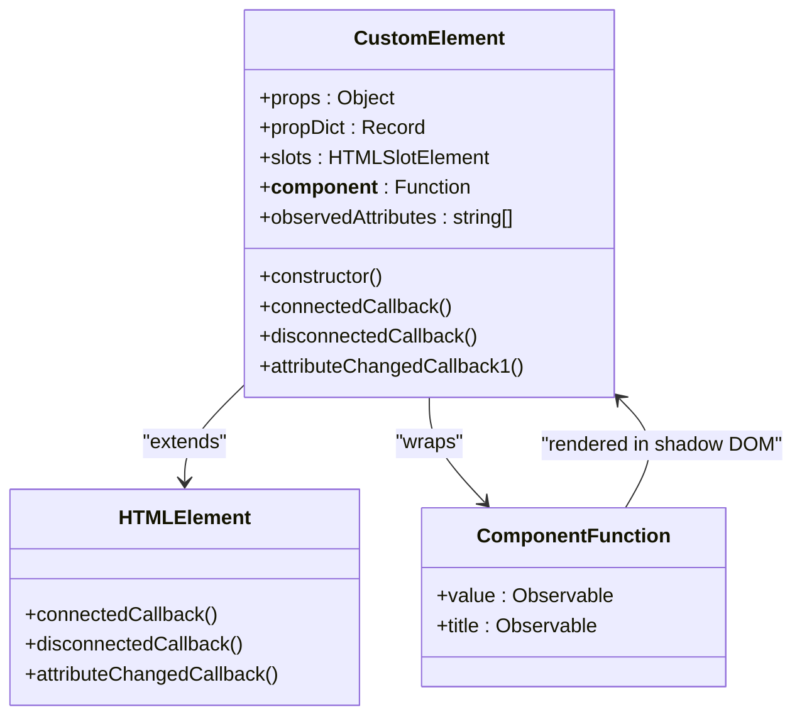
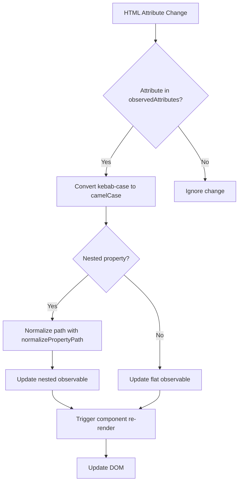
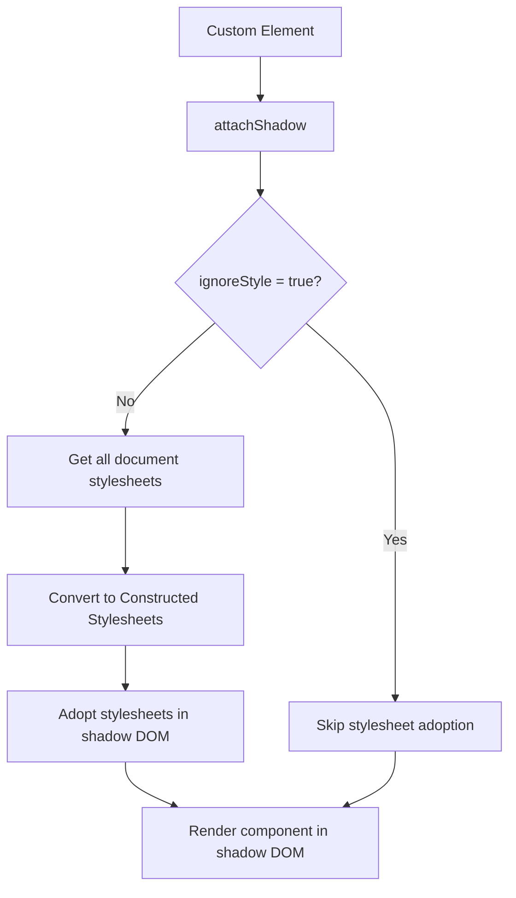
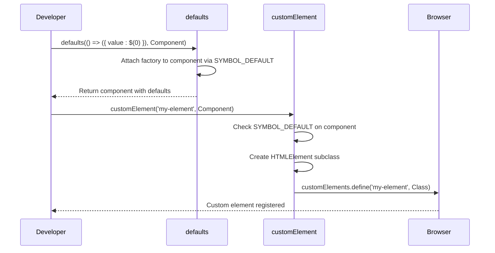

# Registration and Setup

<cite>
**Referenced Files in This Document**   
- [custom_element.ts](file://src/methods/custom_element.ts)
- [defaults.ts](file://src/methods/defaults.ts)
- [constants.ts](file://src/constants.ts)
- [string.ts](file://src/utils/string.ts)
- [nested.ts](file://src/utils/nested.ts)
- [stylesheets.ts](file://src/utils/stylesheets.ts)
</cite>

## Table of Contents
1. [Introduction](#introduction)
2. [Custom Element Registration API](#custom-element-registration-api)
3. [Tag Name Requirements](#tag-name-requirements)
4. [Component Function Integration](#component-function-integration)
5. [Internal Class Structure](#internal-class-structure)
6. [Attribute Observation and Prop Mapping](#attribute-observation-and-prop-mapping)
7. [Shadow DOM Configuration](#shadow-dom-configuration)
8. [Duplicate Definition Handling](#duplicate-definition-handling)
9. [Retrieving Existing Components](#retrieving-existing-components)
10. [Default Props with defaults()](#default-props-with-defaults)
11. [Common Issues and Troubleshooting](#common-issues-and-troubleshooting)

## Introduction
This document provides comprehensive documentation for the custom element registration system in Woby, a framework for building reactive web components. The system enables developers to register functional components as custom HTML elements that can be used both in JSX/TSX and standard HTML. The registration process involves creating a custom element class that extends HTMLElement, automatically mapping attributes to component props, and managing the component lifecycle within a shadow DOM. This documentation covers the complete API, internal implementation details, and practical usage patterns for effective component registration.

## Custom Element Registration API
The `customElement()` API serves as the primary mechanism for registering Woby components as custom HTML elements. This function takes a tag name and a component function as parameters, creating a custom element that integrates with the browser's Custom Elements API while maintaining reactivity through Woby's observable system. The API automatically handles attribute-to-prop mapping, type conversion for observable values, and shadow DOM attachment. Components registered through this API can be instantiated both programmatically and declaratively in markup, providing seamless integration between functional component patterns and standard web platform features.

**Section sources**
- [custom_element.ts](file://src/methods/custom_element.ts#L452-L641)

## Tag Name Requirements
When registering a custom element, the tag name must contain a hyphen (-) to comply with the Web Components specification. This requirement ensures that custom elements are distinguishable from standard HTML elements and prevents naming conflicts with existing or future HTML tags. The hyphen serves as a namespace delimiter, typically following the convention of prefixing the element name with the organization or project name (e.g., "woby-counter", "my-app-header"). This naming convention is enforced by the browser's Custom Elements API and is a fundamental requirement for successful element registration.

**Section sources**
- [custom_element.ts](file://src/methods/custom_element.ts#L452-L641)

## Component Function Integration
The `customElement()` function integrates component functions by wrapping them in a class that extends HTMLElement. The component function must be prepared with default props using the `defaults()` helper function, which attaches a factory function to the component via the `SYMBOL_DEFAULT` property. This factory function creates the initial props object with observable values. During registration, the API verifies the presence of this symbol and logs an error if missing, ensuring that components have properly defined default props. The component function is then invoked within the custom element's shadow DOM, with props automatically synchronized between HTML attributes and the component's observable state.

**Diagram sources**
- [custom_element.ts](file://src/methods/custom_element.ts#L452-L641)
- [defaults.ts](file://src/methods/defaults.ts#L143-L162)

**Section sources**
- [custom_element.ts](file://src/methods/custom_element.ts#L452-L641)
- [defaults.ts](file://src/methods/defaults.ts#L143-L162)

## Internal Class Structure
The `customElement()` function creates an internal class that extends HTMLElement, implementing the necessary lifecycle callbacks for custom element behavior. This class includes static properties like `__component__` (referencing the original component function) and `observedAttributes` (an array of attribute names to monitor). Instance properties include `props` (the component's props object), `propDict` (a mapping between kebab-case and camelCase property names), and `slots` (for content distribution). The constructor initializes the component with default props, attaches a shadow DOM, and sets up the initial rendering. The class structure ensures proper encapsulation while maintaining reactivity between HTML attributes and component state.

**Section sources**
- [custom_element.ts](file://src/methods/custom_element.ts#L452-L641)

## Attribute Observation and Prop Mapping
The custom element system automatically maps HTML attributes to component props through the `observedAttributes` static property. This array is populated with the keys of the component's default props, enabling the element to monitor changes to these attributes. When an attribute changes, the `attributeChangedCallback1` method is invoked, which converts the kebab-case attribute name to camelCase and updates the corresponding observable prop. The system supports nested properties using dot notation (e.g., "user.name") or dollar notation (e.g., "user$name"), which are normalized and processed to update deeply nested observables. Style properties are specially handled, with attributes like "style.font-size" being converted to the appropriate CSSStyleDeclaration property.

**Diagram sources**
- [custom_element.ts](file://src/methods/custom_element.ts#L452-L641)
- [nested.ts](file://src/utils/nested.ts#L30-L42)
- [string.ts](file://src/utils/string.ts#L27-L29)

**Section sources**
- [custom_element.ts](file://src/methods/custom_element.ts#L452-L641)
- [nested.ts](file://src/utils/nested.ts#L30-L42)

## Shadow DOM Configuration
Custom elements in Woby are configured with shadow DOM encapsulation to provide style and DOM isolation. The shadow root is attached in 'open' mode, allowing external JavaScript to access the shadow DOM if needed. The attachment includes the `serializable` option set to true, enabling the shadow DOM to be serialized for server-side rendering and other use cases. By default, the element adopts all document stylesheets into its shadow root, ensuring consistent styling. This behavior can be disabled by setting the `ignoreStyle` prop to true in the component's defaults, which prevents stylesheet adoption and maintains complete style isolation.

**Diagram sources**
- [custom_element.ts](file://src/methods/custom_element.ts#L452-L641)
- [stylesheets.ts](file://src/utils/stylesheets.ts#L29-L59)

**Section sources**
- [custom_element.ts](file://src/methods/custom_element.ts#L452-L641)
- [stylesheets.ts](file://src/utils/stylesheets.ts#L29-L59)

## Duplicate Definition Handling
The `customElement()` function includes a warning mechanism to handle duplicate element definitions. Before defining a new custom element, the API checks if an element with the same tag name already exists using `customElements.get()`. If a duplicate is detected, a warning is logged to the console indicating that the element already exists. This warning includes guidance for development environments, noting that duplicate definitions can be safely ignored during development when hot module replacement is active. The warning also provides instructions for retrieving the existing component via the `__component__` property, allowing developers to access the original component function for debugging or inspection.

**Section sources**
- [custom_element.ts](file://src/methods/custom_element.ts#L452-L641)

## Retrieving Existing Components
Existing custom elements can be retrieved and inspected through the `__component__` static property on the custom element class. This property, attached during the registration process, references the original component function that was used to create the element. To access this property, developers can use `customElements.get('element-tag-name')` to retrieve the element constructor, then access the `__component__` property to obtain the original component function. This mechanism enables debugging, testing, and runtime inspection of registered components, providing visibility into the component hierarchy and state management patterns.

**Section sources**
- [custom_element.ts](file://src/methods/custom_element.ts#L452-L641)

## Default Props with defaults()
The `defaults()` helper function is essential for preparing components for custom element registration. It attaches a factory function to the component that creates the default props object with properly initialized observable values. This function ensures that props like `children` are wrapped in observables and handles the merging of provided props with defaults. The `defaults()` function uses the `SYMBOL_DEFAULT` symbol to store the factory function, which is later accessed by `customElement()` during registration. Components can also include style encapsulation options like `ignoreStyle` in their defaults to control shadow DOM behavior.

**Diagram sources**
- [defaults.ts](file://src/methods/defaults.ts#L143-L162)
- [constants.ts](file://src/constants.ts#L26-L26)
- [custom_element.ts](file://src/methods/custom_element.ts#L452-L641)

**Section sources**
- [defaults.ts](file://src/methods/defaults.ts#L143-L162)
- [constants.ts](file://src/constants.ts#L26-L26)

## Common Issues and Troubleshooting
Common issues in custom element registration include missing default props, duplicate definitions in development environments, and improper tag naming. The most frequent error occurs when a component is registered without using the `defaults()` helper, resulting in a console error about missing default props. In development, duplicate registration warnings can be safely ignored when using hot module replacement, but persistent issues may indicate improper module loading. Tag names without hyphens will fail registration due to browser requirements. Style encapsulation issues can arise when global styles are unexpectedly adopted into shadow DOM, which can be resolved by setting `ignoreStyle: true` in the component's defaults. Debugging should begin by verifying the presence of `SYMBOL_DEFAULT` on the component and checking the `__component__` property on registered elements.

**Section sources**
- [custom_element.ts](file://src/methods/custom_element.ts#L452-L641)
- [defaults.ts](file://src/methods/defaults.ts#L143-L162)