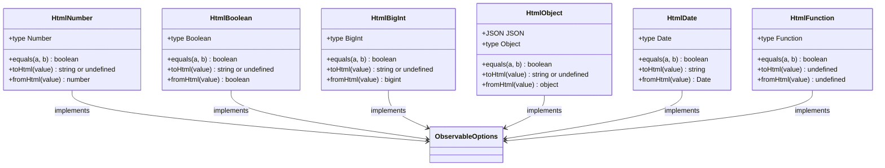
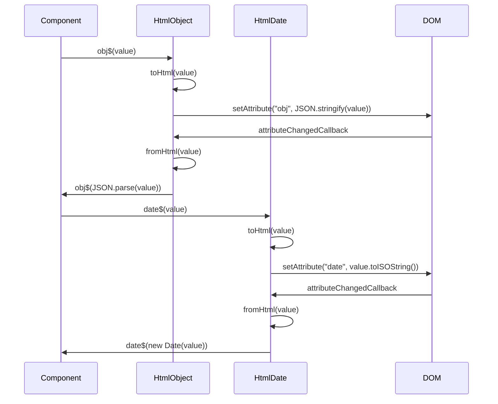
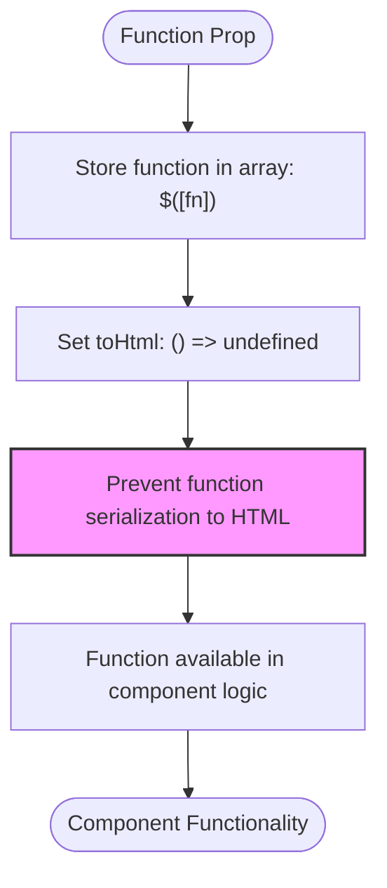

# Type Conversion and Serialization

<cite>
**Referenced Files in This Document**   
- [custom_element.ts](file://src/methods/custom_element.ts#L111-L181)
- [html-number.ts](file://src/html/html-number.ts#L11-L19)
- [html-boolean.ts](file://src/html/html-boolean.ts#L6-L11)
- [html-bigint.ts](file://src/html/html-bigint.ts#L19-L32)
- [html-object.ts](file://src/html/html-object.ts#L15-L38)
- [html-date.ts](file://src/html/html-date.ts#L48-L61)
- [html-function.ts](file://src/html/html-function.ts#L10-L24)
- [index.ts](file://src/html/index.ts)
</cite>

## Table of Contents
1. [Introduction](#introduction)
2. [Automatic Type Conversion](#automatic-type-conversion)
3. [Custom Serialization with fromHtml and toHtml](#custom-serialization-with-fromhtml-and-tohtml)
4. [Built-in HTML Type Utilities](#built-in-html-type-utilities)
5. [Object and Date Serialization](#object-and-date-serialization)
6. [Function Handling and Privacy](#function-handling-and-privacy)
7. [Common Issues and Best Practices](#common-issues-and-best-practices)

## Introduction
Woby custom elements provide robust mechanisms for type conversion and serialization between HTML attributes and JavaScript values. This system enables seamless two-way synchronization between string-based HTML attributes and typed JavaScript values through observables. The framework automatically handles basic type conversions while providing extensible mechanisms for custom serialization of complex types like objects and dates. This documentation details the implementation patterns, built-in utilities, and best practices for effective type management in Woby components.

## Automatic Type Conversion
The `setObservableValue` function in Woby's custom element implementation handles automatic type conversion between string attributes and JavaScript values based on observable options. When an HTML attribute changes, the framework inspects the observable's type option and performs appropriate conversion to maintain type integrity.

For number types, the framework uses JavaScript's `Number()` constructor to convert string attributes to numeric values. Boolean conversion follows HTML standards, treating "true", "1", and empty strings as true, while all other values are treated as false. BigInt values are converted using the `BigInt()` constructor, with fallback to string values if parsing fails. Object types are parsed using `JSON.parse()`, also with string fallback on parse errors.

This automatic conversion enables developers to work with properly typed values in their components while maintaining compatibility with HTML's string-only attribute system. The type information is specified in the observable options, allowing the framework to determine the appropriate conversion strategy.

**Section sources**
- [custom_element.ts](file://src/methods/custom_element.ts#L111-L181)

## Custom Serialization with fromHtml and toHtml
Woby provides `fromHtml` and `toHtml` options in observable configurations to enable custom serialization logic for complex types. These functions allow developers to define how values are converted between JavaScript objects and HTML attribute strings.

The `fromHtml` function converts string values from HTML attributes to JavaScript values, while `toHtml` converts JavaScript values to strings for HTML attribute representation. This mechanism is essential for types that don't have straightforward string representations, such as dates, complex objects, or custom data structures.

When no custom functions are provided, Woby falls back to default conversion strategies based on the type option. However, when `fromHtml` or `toHtml` functions are specified, they take precedence over the default behavior, allowing complete control over the serialization process.

**Section sources**
- [custom_element.ts](file://src/methods/custom_element.ts#L111-L181)

## Built-in HTML Type Utilities
Woby provides a comprehensive set of built-in HTML type utilities that implement consistent conversion patterns for common HTML attribute types. These utilities are exported from the `src/html` directory and can be used directly in observable configurations.

The `HtmlNumber` utility handles numeric values with proper NaN handling, converting empty strings to NaN and ensuring only valid numbers are returned. `HtmlBoolean` implements standard HTML boolean semantics, treating "true", "1", and empty strings as true. `HtmlBigInt` safely converts strings to BigInt values, with appropriate error handling for invalid inputs.

These utilities follow a consistent pattern, implementing the `ObservableOptions` interface with proper `equals`, `type`, `toHtml`, and `fromHtml` properties. They provide reliable, tested conversion logic that can be reused across components, ensuring consistency in type handling.

**Diagram sources**
- [html-number.ts](file://src/html/html-number.ts#L11-L19)
- [html-boolean.ts](file://src/html/html-boolean.ts#L6-L11)
- [html-bigint.ts](file://src/html/html-bigint.ts#L19-L32)
- [html-object.ts](file://src/html/html-object.ts#L15-L38)
- [html-date.ts](file://src/html/html-date.ts#L48-L61)
- [html-function.ts](file://src/html/html-function.ts#L10-L24)

## Object and Date Serialization
For object and date types, Woby uses JSON serialization and ISO string conversion respectively. The `HtmlObject` utility uses `JSON.stringify()` to convert objects to strings for HTML attributes and `JSON.parse()` to reconstruct objects from attribute values. This approach enables complex nested objects to be serialized and deserialized automatically.

Date serialization uses the `toISOString()` method to convert Date objects to standardized string representations that can be stored in HTML attributes. The `fromHtml` function then reconstructs Date objects from these ISO strings. This ensures consistent timezone handling and preserves date precision across serialization cycles.

The framework includes error handling for both object and date serialization, providing fallback mechanisms when parsing fails. For objects, invalid JSON falls back to the original string value, while invalid date strings result in NaN dates. This graceful degradation prevents application errors while maintaining data integrity.

**Diagram sources**
- [html-object.ts](file://src/html/html-object.ts#L15-L38)
- [html-date.ts](file://src/html/html-date.ts#L48-L61)

## Function Handling and Privacy
Functions in Woby are handled specially to maintain privacy and prevent exposure in HTML attributes. The `HtmlFunction` utility implements a pattern where functions are stored in arrays within observables, with `toHtml` configured to return `undefined`. This prevents function representations from appearing in HTML markup.

When a function needs to be passed as a prop to a custom element, it is wrapped in an array using the observable syntax `$([function])`. The `toHtml` option is set to return `undefined`, ensuring the function is not serialized to HTML attributes. This pattern allows functions to be used within components while maintaining clean, semantic HTML output.

The framework treats function equality by reference, ensuring that function identity is preserved across updates. Since functions cannot be meaningfully created from string attributes, the `fromHtml` function for `HtmlFunction` returns `undefined`, preventing any attempt to reconstruct functions from attribute values.

**Diagram sources**
- [html-function.ts](file://src/html/html-function.ts#L10-L24)
- [custom_element.ts](file://src/methods/custom_element.ts#L111-L181)

## Common Issues and Best Practices
Several common issues arise when working with type conversion and serialization in Woby custom elements. Circular references in objects can cause `JSON.stringify()` to fail, requiring custom serialization strategies or the use of libraries that handle circular structures. Precision loss with large numbers can occur when numbers exceed JavaScript's safe integer limits, making BigInt the preferred choice for large integers.

Timezone handling with dates requires careful consideration, as `toISOString()` converts dates to UTC. Developers should be aware of this behavior and handle timezone conversions appropriately in their applications. For complex objects, consider using alternative serialization libraries like JSON5 or implementing custom `toHtml`/`fromHtml` functions that handle special cases.

Best practices include always specifying type information for non-string observables, using the built-in HTML type utilities when possible, and testing both HTML and JSX usage patterns to ensure consistent behavior. For functions, always use the array pattern with `toHtml: () => undefined` to prevent exposure in HTML attributes.

**Section sources**
- [html-number.ts](file://src/html/html-number.ts#L11-L19)
- [html-boolean.ts](file://src/html/html-boolean.ts#L6-L11)
- [html-bigint.ts](file://src/html/html-bigint.ts#L19-L32)
- [html-object.ts](file://src/html/html-object.ts#L15-L38)
- [html-date.ts](file://src/html/html-date.ts#L48-L61)
- [html-function.ts](file://src/html/html-function.ts#L10-L24)