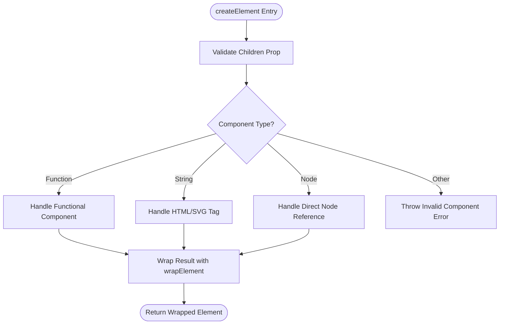
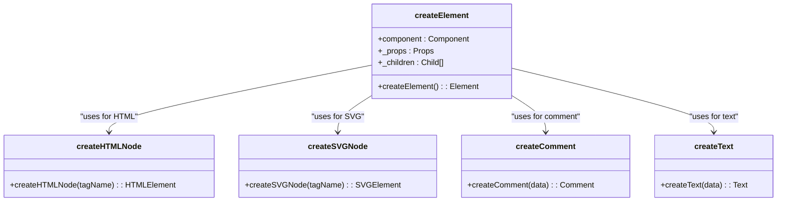
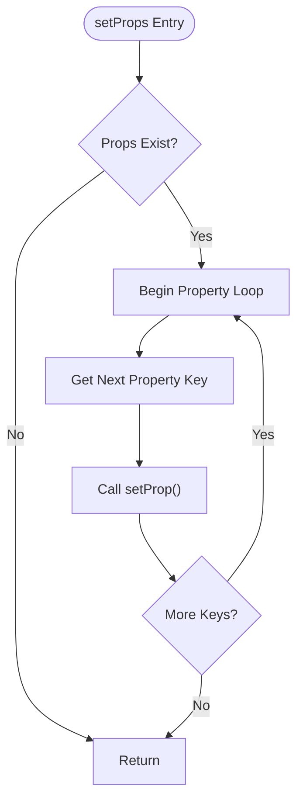
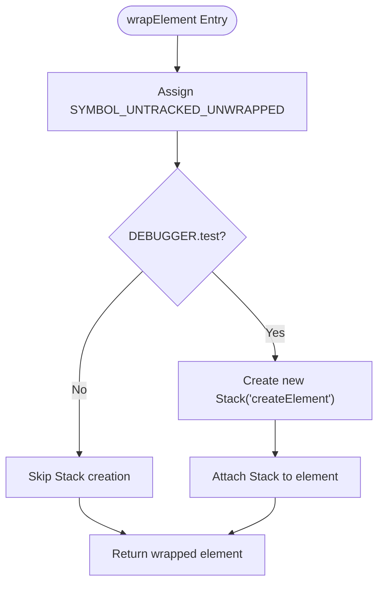

# Browser Element Creation

<cite>
**Referenced Files in This Document**   
- [create_element.ts](file://src/methods/create_element.ts)
- [custom_element.ts](file://src/methods/custom_element.ts)
- [wrap_element.ts](file://src/methods/wrap_element.ts)
- [soby.ts](file://src/soby.ts)
- [setters.ts](file://src/utils/setters.ts)
- [fragment.ts](file://src/utils/fragment.ts)
</cite>

## Table of Contents
1. [Introduction](#introduction)
2. [Core Element Creation Process](#core-element-creation-process)
3. [Component Type Handling](#component-type-handling)
4. [Property Normalization and Children Handling](#property-normalization-and-children-handling)
5. [Reactivity Tracking with Stack System](#reactivity-tracking-with-stack-system)
6. [Execution Ordering with wrapElement](#execution-ordering-with-wrapelement)
7. [Special Node Handling](#special-node-handling)
8. [Integration with Custom Elements](#integration-with-custom-elements)
9. [Common Issues and Performance Considerations](#common-issues-and-performance-considerations)
10. [Practical Examples](#practical-examples)

## Introduction
The `createElement()` function serves as the core mechanism for transforming JSX into DOM elements within the Woby framework. This documentation provides a comprehensive analysis of its internal workings, covering component creation, property handling, reactivity tracking, and integration with web standards. The system supports multiple component types including functional components, class components, HTML/SVG tags, custom elements, and direct node references, all while maintaining reactivity through the soby's Stack system.

**Section sources**
- [create_element.ts](file://src/methods/create_element.ts#L1-L129)

## Core Element Creation Process
The `createElement()` function orchestrates the creation of elements by evaluating the component type and applying appropriate construction logic. It handles four primary component categories: functional components, class components, string-based tags (HTML/SVG), and direct DOM node references. The process begins with children validation to prevent conflicts between rest arguments and explicit children props, ensuring clean data flow.



**Diagram sources**
- [create_element.ts](file://src/methods/create_element.ts#L53-L129)

**Section sources**
- [create_element.ts](file://src/methods/create_element.ts#L53-L129)

## Component Type Handling
The framework distinguishes between different component types through type checking and applies specialized creation logic accordingly. Functional components are invoked with props, class components are instantiated, string tags generate appropriate DOM nodes, and custom elements are constructed through the customElements registry.

### Functional and Class Components
When encountering a function component, `createElement()` merges children into props if present and wraps the component invocation in an untracked context to prevent reactivity during construction. Class components are instantiated using the `new` operator with the provided props.

```mermaid
sequenceDiagram
participant Client as "Application Code"
participant Create as "createElement"
participant Wrap as "wrapElement"
participant Untrack as "untrack"
participant Component as "Functional Component"
Client->>Create : createElement(Component, props, children)
Create->>Create : Validate children
Create->>Create : Merge children into props
Create->>Wrap : Wrap component function
Wrap->>Untrack : Execute in untracked context
Untrack->>Component : Invoke component(props)
Component-->>Untrack : Return JSX
Untrack-->>Wrap : Return result
Wrap-->>Create : Return wrapped element
Create-->>Client : Return final element
```

**Diagram sources**
- [create_element.ts](file://src/methods/create_element.ts#L70-L78)

### HTML/SVG and Custom Elements
String components trigger DOM node creation through specialized factory functions. The system detects SVG elements and applies appropriate namespace handling. Custom elements registered via `customElements.define()` are instantiated directly, while standard HTML tags use generic node creation.



**Diagram sources**
- [create_element.ts](file://src/methods/create_element.ts#L80-L119)
- [utils/creators.ts](file://src/utils/creators.ts)

**Section sources**
- [create_element.ts](file://src/methods/create_element.ts#L80-L119)

## Property Normalization and Children Handling
The framework implements a robust system for property normalization and children management. Props are processed through `setProps()` which iterates through all properties and applies them via `setProp()`, while children are handled by `setChild()` with support for fragments through `FragmentUtils`.

### Property Processing
The `setProps()` function iterates through all properties in the props object, applying each one through the `setProp()` utility. This two-step process allows for centralized property handling and potential optimizations.



**Diagram sources**
- [setters.ts](file://src/utils/setters.ts#L1081-L1089)

### Children Management
Children are normalized from rest parameters into a single value or array, then processed through `setChild()` which resolves dynamic content and applies it to the parent element. The system prevents conflicts between children passed as props and rest arguments.

**Section sources**
- [create_element.ts](file://src/methods/create_element.ts#L55-L60)
- [setters.ts](file://src/utils/setters.ts#L386-L389)
- [fragment.ts](file://src/utils/fragment.ts)

## Reactivity Tracking with Stack System
The framework maintains reactivity through soby's Stack system, which tracks execution context during element creation. The `untrack()` function prevents reactive dependencies from being established during the construction phase, while the Stack object provides debugging and error tracking capabilities.

### Untracking Mechanism
During element creation, operations are wrapped in `untrack()` to prevent unwanted reactivity. This is crucial for performance and to avoid memory leaks from unnecessary subscriptions.

```mermaid
sequenceDiagram
participant Create as "createElement"
participant Untrack as "untrack"
participant Stack as "Stack"
participant Setters as "setProps/setChild"
Create->>Untrack : Begin untracked block
Untrack->>Stack : Create new Stack
Stack-->>Untrack : Return Stack
Untrack->>Setters : Call setProps with Stack
Setters->>Setters : Process properties
Setters->>Untrack : Complete
Untrack-->>Create : Return result
```

**Diagram sources**
- [create_element.ts](file://src/methods/create_element.ts#L95-L107)
- [soby.ts](file://src/soby.ts)

**Section sources**
- [create_element.ts](file://src/methods/create_element.ts#L95-L107)

## Execution Ordering with wrapElement
The `wrapElement()` function ensures proper execution ordering by tagging functions with metadata that controls their evaluation. It marks elements as untracked and optionally attaches a Stack for debugging purposes, maintaining execution context throughout the rendering process.



**Diagram sources**
- [wrap_element.ts](file://src/methods/wrap_element.ts#L9-L17)

**Section sources**
- [wrap_element.ts](file://src/methods/wrap_element.ts#L9-L17)

## Special Node Handling
The system provides specialized handling for comment and text nodes through string identifiers 'comment' and 'text'. These nodes are created with specific data properties and integrated into the DOM tree like other elements.

**Section sources**
- [create_element.ts](file://src/methods/create_element.ts#L83-L87)

## Integration with Custom Elements
The `customElement()` API enables seamless integration with Web Components, allowing Woby components to be used as standard custom elements. The system handles attribute-to-property mapping, type conversion, and nested property support.

### Custom Element Registration
Custom elements are registered with the browser's CustomElementRegistry and can be used in both JSX and HTML contexts. The framework automatically converts kebab-case attributes to camelCase properties and handles style property mapping.

**Section sources**
- [custom_element.ts](file://src/methods/custom_element.ts#L1-L642)

## Common Issues and Performance Considerations
The framework addresses several common issues in element creation, including children prop conflicts and invalid component types. Performance is optimized through untracking during construction and efficient property setting.

### Children Prop Conflict
The system throws an error when children are provided both as a prop and as rest arguments, preventing ambiguous data flow and potential bugs.

### Performance Implications
Frequent element creation should be minimized in performance-critical paths. The untracking mechanism helps reduce overhead, but excessive component instantiation can still impact performance.

**Section sources**
- [create_element.ts](file://src/methods/create_element.ts#L55-L60)

## Practical Examples
The following examples demonstrate common usage patterns for `createElement()` in various scenarios.

### Functional Component Creation
Creating functional components with props and children, leveraging the framework's reactivity system.

### HTML Element Creation
Generating standard HTML elements with attributes and text content.

### Fragment Usage
Using fragments to group multiple elements without introducing additional DOM nodes.

**Section sources**
- [create_element.ts](file://src/methods/create_element.ts#L1-L129)
- [custom_element.ts](file://src/methods/custom_element.ts#L1-L642)
- [wrap_element.ts](file://src/methods/wrap_element.ts#L9-L17)