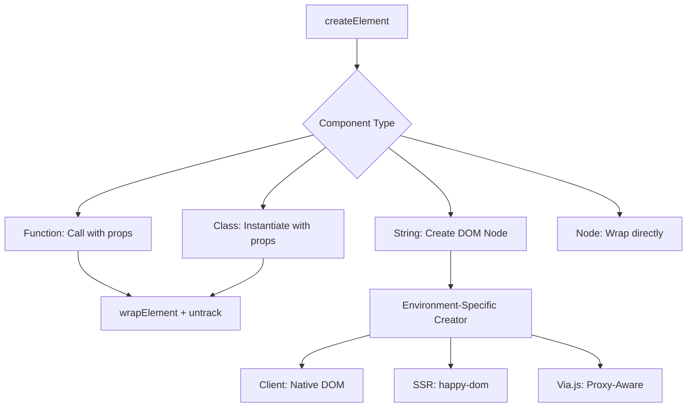
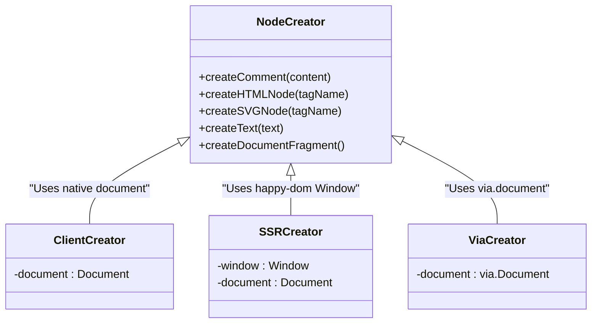
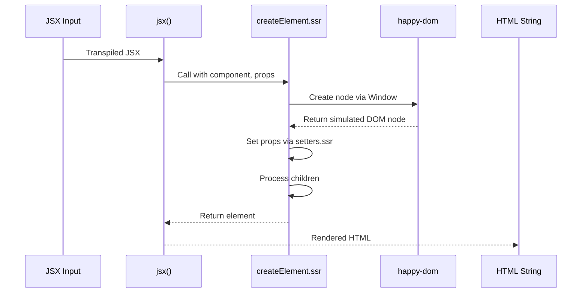

# Element Creation

<cite>
**Referenced Files in This Document**   
- [create_element.ts](file://src/methods/create_element.ts)
- [create_element.ssr.ts](file://src/methods/create_element.ssr.ts)
- [create_element.via.ts](file://src/methods/create_element.via.ts)
- [runtime.ts](file://src/jsx/runtime.ts)
- [creators.ts](file://src/utils/creators.ts)
- [creators.ssr.ts](file://src/utils/creators.ssr.ts)
- [creators.via.ts](file://src/utils/creators.via.ts)
- [setters.ts](file://src/utils/setters.ts)
- [jsx-runtime.ts](file://src/jsx-runtime.ts)
- [ssr/jsx-runtime.ts](file://src/ssr/jsx-runtime.ts)
</cite>

## Table of Contents
1. [Introduction](#introduction)
2. [Core Element Creation Logic](#core-element-creation-logic)
3. [Environment-Specific Implementations](#environment-specific-implementations)
4. [JSX Transformation and Runtime](#jsx-transformation-and-runtime)
5. [Node Creation Mechanisms](#node-creation-mechanisms)
6. [Property and Child Handling](#property-and-child-handling)
7. [Server-Side Rendering Behavior](#server-side-rendering-behavior)
8. [Via.js Integration for Proxy-Based Rendering](#viajs-integration-for-proxy-based-rendering)
9. [Common Issues and Error Handling](#common-issues-and-error-handling)
10. [Performance Considerations](#performance-considerations)

## Introduction
The `createElement()` function serves as the foundational mechanism for transforming JSX/TSX syntax into executable DOM elements within the Woby framework. It supports multiple environments including client-side, server-side rendering (SSR), and proxy-based rendering via Via.js. This documentation details its implementation across different contexts, covering type-specific handling for functional components, class components, HTML/SVG elements, comments, text nodes, and fragments. The system incorporates stack-based tracking for reactivity, property normalization, and children resolution while maintaining consistency across execution environments.

## Core Element Creation Logic

The core `createElement` function located in `create_element.ts` handles four primary component types:
1. Functional components - invoked with props
2. Class components - instantiated with props
3. String tags - create HTML/SVG elements or custom elements
4. Direct node references - wrapped as-is

It validates against conflicting children props and normalizes input before processing. The function uses `wrapElement` to ensure proper execution order from parent to child and employs `untrack` from the reactivity system to prevent unnecessary tracking during creation.

**Section sources**
- [create_element.ts](file://src/methods/create_element.ts#L1-L130)

## Environment-Specific Implementations

### Client-Side Implementation
The standard implementation uses browser-native DOM APIs through dynamically bound creators that adapt to the presence of Via.js.

### Server-Side Rendering (SSR)
The SSR version utilizes `happy-dom`'s `Window` instance to simulate browser environment, enabling DOM construction without a real browser.

### Via.js Proxy-Based Rendering
The Via.js variant integrates with proxy-based rendering by marking SVG elements with both direct properties and symbolic flags (`IsSvgSymbol`) for proper handling in proxy contexts.

**Diagram sources**
- [create_element.ts](file://src/methods/create_element.ts#L1-L130)
- [create_element.ssr.ts](file://src/methods/create_element.ssr.ts#L1-L81)
- [create_element.via.ts](file://src/methods/create_element.via.ts#L1-L81)

## JSX Transformation and Runtime

The JSX runtime in `runtime.ts` exports `jsx`, `jsxDEV`, and `jsxs` functions that serve as entry points from compiled JSX. These functions:
- Normalize props using `getProps`
- Handle default props for custom elements
- Mark props with `SYMBOL_JSX` flag
- Delegate to `createElement` after wrapping with `wrapCloneElement`

The system distinguishes between React 16 and 17 style calls, supporting both spread children and explicit key parameters.

**Section sources**
- [runtime.ts](file://src/jsx/runtime.ts#L1-L79)
- [jsx-runtime.ts](file://src/jsx-runtime.ts#L1)

## Node Creation Mechanisms

### Client-Side Node Creation
Uses native `document` methods bound at runtime, with special handling for SVG elements via `createElementNS`.

### SSR Node Creation
Implements `happy-dom`'s `Window` instance to provide full DOM API support on the server, allowing consistent element creation.

### Via.js Node Creation
Directly references `via.document` when available, enabling seamless integration with the proxy-based rendering system.

**Diagram sources**
- [creators.ts](file://src/utils/creators.ts#L1-L32)
- [creators.ssr.ts](file://src/utils/creators.ssr.ts#L1-L19)
- [creators.via.ts](file://src/utils/creators.via.ts#L1-L15)

## Property and Child Handling

The framework employs sophisticated property and child management through the `setters` module. Key features include:

- **Attribute Normalization**: Converts camelCase to kebab-case for SVG attributes
- **Boolean Attributes**: Special handling for HTML boolean attributes
- **Nested Properties**: Supports dot-notation for nested object properties
- **Class Management**: Comprehensive class toggling and binding
- **Event Delegation**: Optimized event handling with passive/capture support
- **Child Diffing**: Efficient DOM updates through intelligent diffing algorithm

Children are processed through a multi-stage resolution system that handles functions, arrays, and reactive values, with special optimization paths for common cases like single text nodes.

**Section sources**
- [setters.ts](file://src/utils/setters.ts#L1-L1090)

## Server-Side Rendering Behavior

The SSR implementation in `create_element.ssr.ts` adapts the core creation logic for server environments:

- Uses `happy-dom` instead of native DOM
- Maintains stack traces as `Error` objects rather than `Stack`
- Properly initializes custom element props
- Handles children through `FragmentUtils.make()`
- Integrates with SSR-specific setters and diffing

This enables full component tree rendering to static HTML while preserving the ability to hydrate on the client.

**Diagram sources**
- [create_element.ssr.ts](file://src/methods/create_element.ssr.ts#L1-L81)
- [ssr/jsx-runtime.ts](file://src/ssr/jsx-runtime.ts#L1)

## Via.js Integration for Proxy-Based Rendering

The Via.js implementation introduces proxy-aware rendering capabilities:

- Marks SVG elements with `IsSvgSymbol` for proxy detection
- Uses `via.document` when available
- Ignores symbolic properties during proxy operations
- Maintains compatibility with standard DOM APIs

This allows the framework to work seamlessly in environments where DOM access is mediated through proxies, enabling advanced features like remote rendering and distributed UI.

**Section sources**
- [create_element.via.ts](file://src/methods/create_element.via.ts#L1-L81)
- [creators.via.ts](file://src/utils/creators.via.ts#L1-L15)

## Common Issues and Error Handling

The system includes several safeguards against common issues:

- **Children Conflicts**: Throws error when children are provided both as prop and rest arguments
- **Invalid Components**: Rejects non-function, non-string, non-node components
- **Missing Default Props**: Warns when custom elements lack default props
- **Reactivity Conflicts**: Uses `untrack` to prevent unwanted dependency tracking

Error messages are descriptive and point to specific usage problems, aiding in debugging complex component hierarchies.

**Section sources**
- [create_element.ts](file://src/methods/create_element.ts#L1-L130)
- [runtime.ts](file://src/jsx/runtime.ts#L1-L79)

## Performance Considerations

The element creation system incorporates several performance optimizations:

- **Fast Paths**: Special handling for common cases like single text nodes
- **Batched Operations**: Uses microtasks for non-immediate directives
- **Efficient Diffing**: Minimizes DOM operations through intelligent comparison
- **Memoization**: Caches attribute name transformations
- **Lazy Resolution**: Defers child evaluation until necessary

Frequent element creation should consider:
- Reusing component references when possible
- Avoiding inline function creation in JSX
- Using memoization for expensive computations
- Minimizing deep prop drilling

The stack-based tracking system ensures that reactivity is maintained without unnecessary overhead.

**Section sources**
- [create_element.ts](file://src/methods/create_element.ts#L1-L130)
- [setters.ts](file://src/utils/setters.ts#L1-L1090)