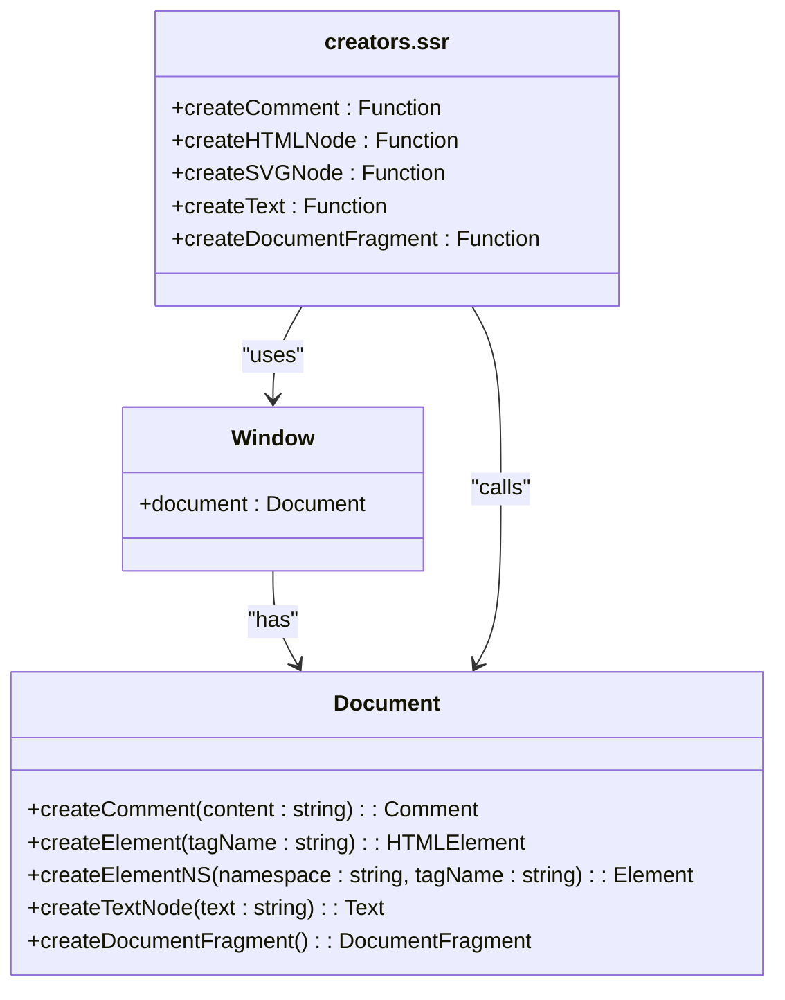
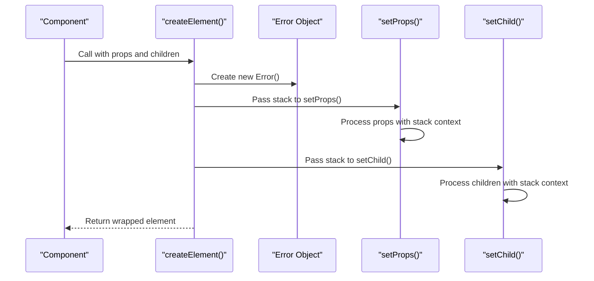
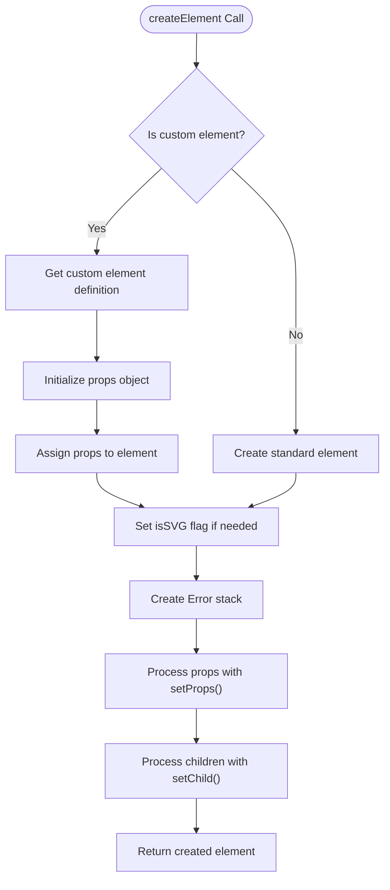
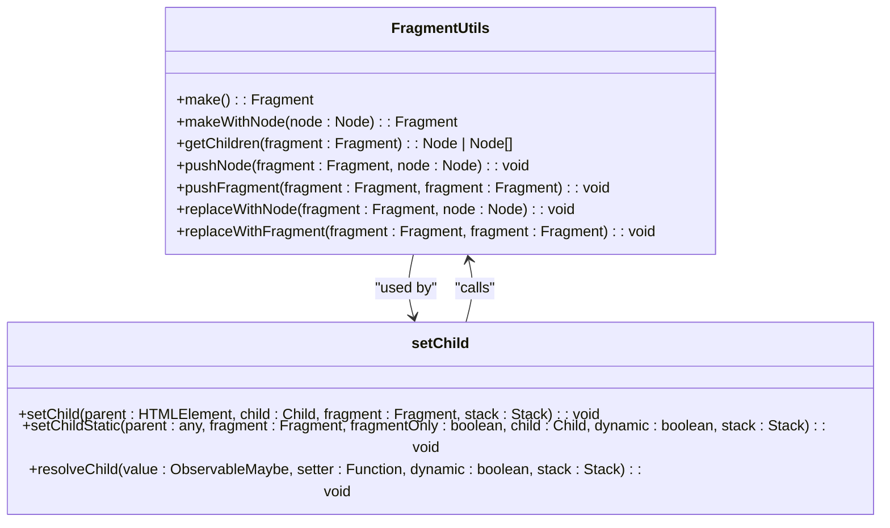
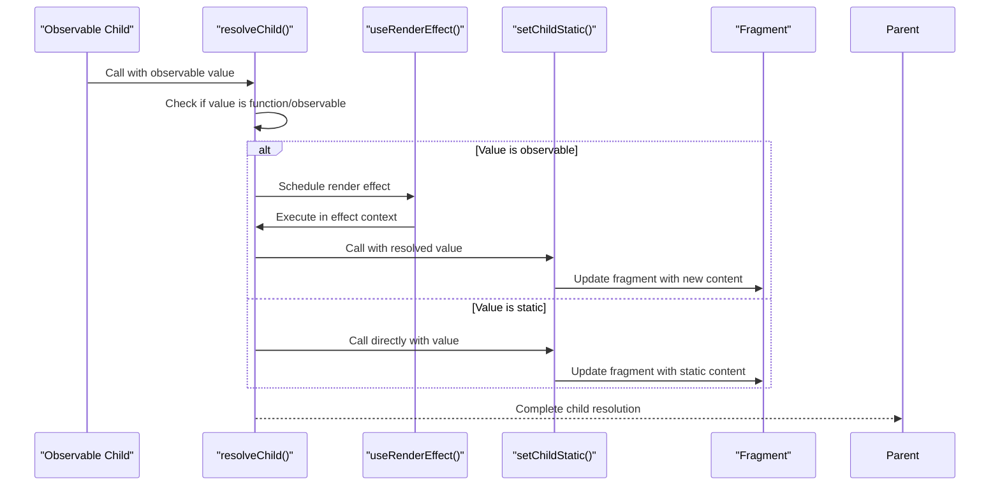
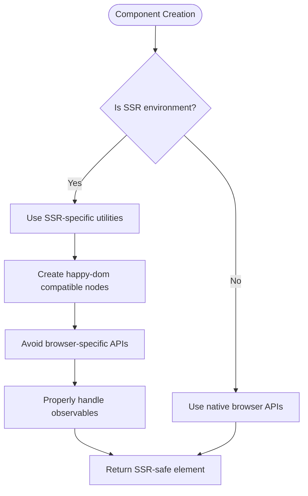
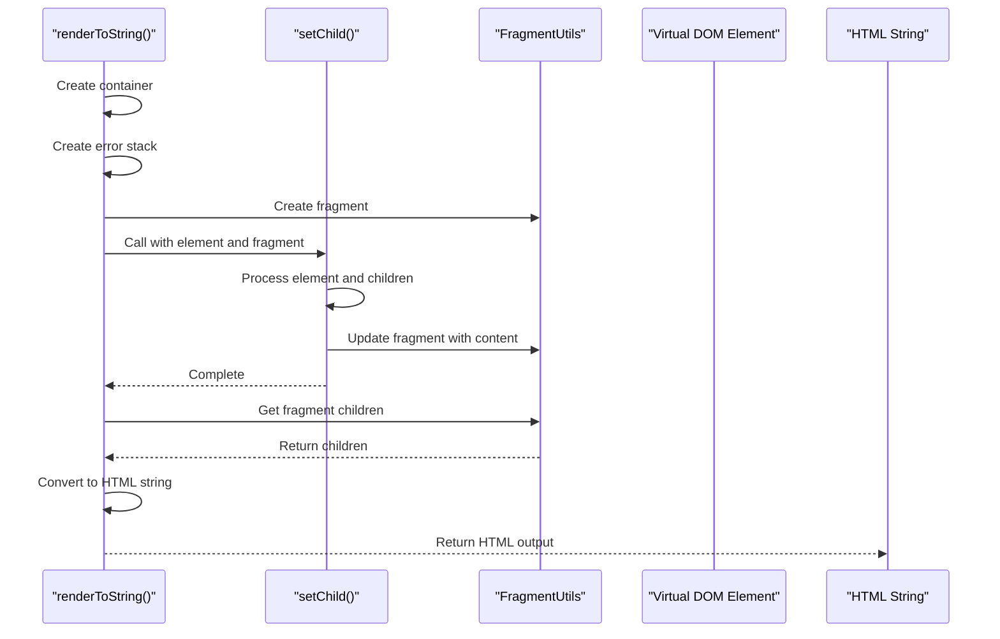
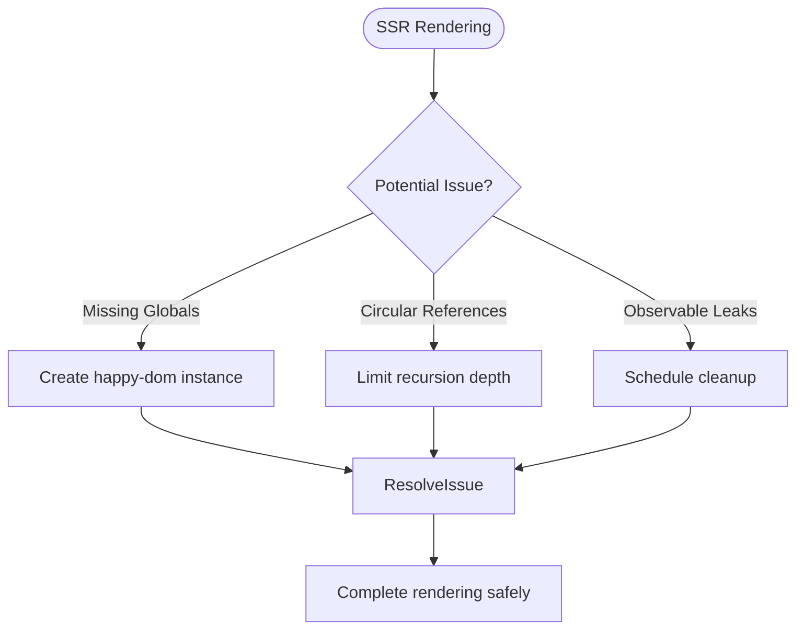
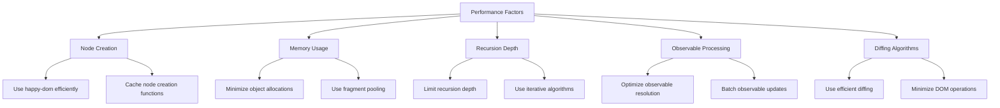

# Server-Side Element Creation

<cite>
**Referenced Files in This Document**   
- [create_element.ssr.ts](file://src/methods/create_element.ssr.ts)
- [creators.ssr.ts](file://src/utils/creators.ssr.ts)
- [setters.ssr.ts](file://src/utils/setters.ssr.ts)
- [render_to_string.ssr.ts](file://src/methods/render_to_string.ssr.ts)
- [jsx-runtime.ssr.tsx](file://src/jsx/jsx-runtime.ssr.tsx)
- [custom_element.ts](file://src/methods/custom_element.ts)
- [resolvers.ssr.ts](file://src/utils/resolvers.ssr.ts)
- [diff.ssr.ts](file://src/utils/diff.ssr.ts)
</cite>

## Table of Contents
1. [Introduction](#introduction)
2. [createElement() in SSR Context](#createelement-in-ssr-context)
3. [Virtual DOM Construction](#virtual-dom-construction)
4. [SSR vs Browser Implementation Differences](#ssr-vs-browser-implementation-differences)
5. [Custom Elements and Props Handling](#custom-elements-and-props-handling)
6. [Recursive Children Population](#recursive-children-population)
7. [Observable Children and Reactivity](#observable-children-and-reactivity)
8. [SSR-Safe Component Creation](#ssr-safe-component-creation)
9. [Integration with renderToString()](#integration-with-rendertostring)
10. [Common SSR Issues](#common-ssr-issues)
11. [Performance Considerations](#performance-considerations)
12. [Architecture Overview](#architecture-overview)

## Introduction
This document provides comprehensive documentation for the `createElement()` function in a server-side rendering (SSR) context within the Woby framework. It details how virtual DOM representations are constructed using happy-dom-compatible node creation through `createHTMLNode` and `createSVGNode` from `creators.ssr`. The documentation covers the differences from browser implementations, special handling of custom elements, recursive children population, observable support, and reactivity preservation during server rendering. It also addresses SSR-specific issues and performance considerations for rendering large component trees on the server.

## createElement() in SSR Context

The `createElement()` function in SSR context is responsible for creating virtual DOM elements that can be rendered to static HTML on the server. Unlike the browser implementation, the SSR version is optimized for server environments where DOM APIs are simulated rather than natively available.

The SSR implementation of `createElement()` handles three primary types of components:
- Functional components
- String-based HTML/SVG elements
- DOM node instances

When processing string-based components, the function determines whether to use `createHTMLNode` or `createSVGNode` based on the element type, ensuring proper namespace handling for SVG elements.

**Section sources**
- [create_element.ssr.ts](file://src/methods/create_element.ssr.ts#L15-L79)

## Virtual DOM Construction

Virtual DOM construction in the SSR context relies on happy-dom-compatible node creation functions that simulate browser DOM APIs on the server. The implementation creates a happy-dom window instance to provide the necessary DOM environment for server-side rendering.



**Diagram sources**
- [creators.ssr.ts](file://src/utils/creators.ssr.ts#L9-L18)

The virtual DOM construction process involves:
1. Creating a happy-dom window instance for SSR
2. Extracting the document object from the window
3. Defining creation functions that wrap document methods
4. Using these functions to create various node types (comments, HTML nodes, SVG nodes, text nodes, document fragments)

This approach allows the framework to maintain DOM API compatibility while running in a server environment without a real browser DOM.

**Section sources**
- [creators.ssr.ts](file://src/utils/creators.ssr.ts#L9-L18)

## SSR vs Browser Implementation Differences

The SSR implementation of `createElement()` differs significantly from the browser version in several key aspects:

### Stack Tracking Mechanism
Unlike the browser implementation that uses soby's Stack for tracking, the SSR version utilizes Error objects for stack tracking. This approach provides better compatibility with server environments and debugging tools.



**Diagram sources**
- [create_element.ssr.ts](file://src/methods/create_element.ssr.ts#L15-L79)
- [setters.ssr.ts](file://src/utils/setters.ssr.ts#L356-L360)

### Node Creation Functions
The SSR implementation uses specialized node creation functions that are compatible with happy-dom, while the browser version can use native DOM APIs directly.

### Observable Handling
The SSR version has specific optimizations for handling observables in a server context, where reactivity needs to be preserved without relying on browser-specific features.

**Section sources**
- [create_element.ssr.ts](file://src/methods/create_element.ssr.ts#L15-L79)
- [create_element.ts](file://src/methods/create_element.ts#L53-L129)

## Custom Elements and Props Handling

The SSR implementation includes special handling for custom elements and props assignment. When a custom element is detected, the framework retrieves its definition from the custom elements registry and initializes it with the provided props.



**Diagram sources**
- [create_element.ssr.ts](file://src/methods/create_element.ssr.ts#L15-L79)
- [custom_element.ts](file://src/methods/custom_element.ts#L600-L642)

Key aspects of custom elements handling in SSR:
- Custom elements are retrieved from the registry using `customElements.get()`
- Props are assigned to the element's props property
- The element is initialized with the provided props
- Special processing is applied for SVG elements
- Stack context is maintained throughout the creation process

The framework also handles nested properties and style properties in custom elements, converting kebab-case attribute names to camelCase property names automatically.

**Section sources**
- [create_element.ssr.ts](file://src/methods/create_element.ssr.ts#L15-L79)
- [custom_element.ts](file://src/methods/custom_element.ts#L1-L642)

## Recursive Children Population

Children population in the SSR context is handled recursively through the `setChild()` function, which processes both direct children and nested structures. The implementation uses a fragment-based approach to manage child nodes efficiently.



**Diagram sources**
- [setters.ssr.ts](file://src/utils/setters.ssr.ts#L356-L360)
- [fragment.ssr.ts](file://src/utils/fragment.ssr.ts)

The recursive population process involves:
1. Creating a fragment to manage the children
2. Resolving the child value, which may be a function, observable, or static value
3. Processing each child according to its type
4. Using diffing algorithms to efficiently update the DOM when children change
5. Maintaining proper stack context throughout the recursion

The implementation includes optimizations for common cases, such as single text children or void children, to minimize unnecessary DOM operations.

**Section sources**
- [setters.ssr.ts](file://src/utils/setters.ssr.ts#L356-L360)
- [resolvers.ssr.ts](file://src/utils/resolvers.ssr.ts#L0-L182)

## Observable Children and Reactivity

The SSR implementation supports observable children and preserves reactivity during server rendering. This is achieved through a combination of observable resolution and render effects that maintain the reactive context.



**Diagram sources**
- [resolvers.ssr.ts](file://src/utils/resolvers.ssr.ts#L0-L182)
- [setters.ssr.ts](file://src/utils/setters.ssr.ts#L356-L360)

Key aspects of observable handling:
- Observable values are detected and processed appropriately
- Render effects are used to track changes to observables
- The stack context is preserved to maintain reactivity
- Static values are optimized to avoid unnecessary reactivity overhead
- Array flattening and static resolution are performed to improve performance

The implementation ensures that reactivity is preserved during server rendering, allowing components to respond to changes in observable values even in the SSR context.

**Section sources**
- [resolvers.ssr.ts](file://src/utils/resolvers.ssr.ts#L0-L182)
- [setters.ssr.ts](file://src/utils/setters.ssr.ts#L356-L360)

## SSR-Safe Component Creation

Creating SSR-safe components requires adherence to specific patterns and practices to ensure compatibility with the server environment. The framework provides utilities and guidelines for creating components that work seamlessly in both server and client contexts.



**Diagram sources**
- [create_element.ssr.ts](file://src/methods/create_element.ssr.ts#L15-L79)
- [creators.ssr.ts](file://src/utils/creators.ssr.ts#L9-L18)

Best practices for SSR-safe component creation:
- Use the SSR-specific createElement implementation
- Avoid direct references to browser globals (window, document, etc.)
- Use happy-dom-compatible APIs for DOM manipulation
- Properly handle observables and reactivity
- Ensure proper cleanup of resources
- Use SSR-safe hooks and utilities

Components should be designed to work in both server and client environments, with appropriate fallbacks and conditional logic where necessary.

**Section sources**
- [create_element.ssr.ts](file://src/methods/create_element.ssr.ts#L15-L79)
- [creators.ssr.ts](file://src/utils/creators.ssr.ts#L9-L18)

## Integration with renderToString()

The `createElement()` function integrates with `renderToString()` to produce static HTML output from virtual DOM representations. This integration is crucial for server-side rendering and hydration on the client side.



**Diagram sources**
- [render_to_string.ssr.ts](file://src/methods/render_to_string.ssr.ts#L0-L42)
- [setters.ssr.ts](file://src/utils/setters.ssr.ts#L356-L360)

The integration process involves:
1. Creating a container object to hold the rendered content
2. Creating an error object for stack tracking
3. Using a fragment to manage the child nodes
4. Calling `setChild()` to process the element and its children
5. Extracting the rendered content from the fragment
6. Converting the content to an HTML string

The implementation handles various content types, including text nodes, elements with outerHTML, and textContent, ensuring proper serialization to HTML.

**Section sources**
- [render_to_string.ssr.ts](file://src/methods/render_to_string.ssr.ts#L0-L42)
- [setters.ssr.ts](file://src/utils/setters.ssr.ts#L356-L360)

## Common SSR Issues

Several common issues can arise when using `createElement()` in SSR contexts. Understanding and addressing these issues is crucial for reliable server-side rendering.

### Missing Global Objects
Server environments lack browser globals like window and document. The framework addresses this by creating a happy-dom window instance to provide the necessary DOM environment.

### Circular References
Circular references in component trees can cause infinite loops during rendering. The implementation uses stack tracking and careful recursion management to prevent this issue.

### Observable Disconnection
Observables must be properly disconnected to prevent memory leaks. The framework ensures proper cleanup through:
- Stack context management
- Proper disposal of render effects
- Cleanup functions in hooks



**Diagram sources**
- [creators.ssr.ts](file://src/utils/creators.ssr.ts#L9-L18)
- [setters.ssr.ts](file://src/utils/setters.ssr.ts#L356-L360)

Additional considerations:
- Proper error handling and stack traces
- Memory management for large component trees
- Performance optimization for repeated renders
- Compatibility with various server environments

**Section sources**
- [creators.ssr.ts](file://src/utils/creators.ssr.ts#L9-L18)
- [setters.ssr.ts](file://src/utils/setters.ssr.ts#L356-L360)

## Performance Considerations

Rendering large component trees on the server requires careful performance optimization to ensure fast response times and efficient resource usage.

### Key Performance Factors
- **Node creation overhead**: Minimizing the cost of creating virtual DOM nodes
- **Memory usage**: Managing memory efficiently for large component trees
- **Recursion depth**: Preventing stack overflows with deep component hierarchies
- **Observable processing**: Optimizing the handling of observable values
- **Diffing algorithms**: Using efficient algorithms to minimize DOM operations



**Diagram sources**
- [creators.ssr.ts](file://src/utils/creators.ssr.ts#L9-L18)
- [diff.ssr.ts](file://src/utils/diff.ssr.ts#L0-L202)

### Optimization Strategies
1. **Fragment reuse**: Reusing fragment objects to reduce memory allocation
2. **Static value optimization**: Detecting and optimizing static values that don't require reactivity
3. **Batched updates**: Grouping related operations to minimize overhead
4. **Efficient diffing**: Using optimized diffing algorithms to minimize DOM operations
5. **Lazy evaluation**: Deferring expensive operations until necessary

The implementation includes several performance optimizations:
- Fast paths for common cases (single text children, void children)
- Efficient array flattening and static resolution
- Optimized property and attribute setting
- Minimal stack operations for non-reactive content

**Section sources**
- [creators.ssr.ts](file://src/utils/creators.ssr.ts#L9-L18)
- [diff.ssr.ts](file://src/utils/diff.ssr.ts#L0-L202)
- [setters.ssr.ts](file://src/utils/setters.ssr.ts#L356-L360)

## Architecture Overview

The SSR element creation system follows a modular architecture with clear separation of concerns. The core components work together to create virtual DOM representations that can be rendered to static HTML.

```mermaid
graph TB
subgraph "Core Components"
createElement["createElement.ssr.ts"]
creators["creators.ssr.ts"]
setters["setters.ssr.ts"]
resolvers["resolvers.ssr.ts"]
diff["diff.ssr.ts"]
end
subgraph "Integration Points"
renderToString["render_to_string.ssr.ts"]
jsxRuntime["jsx-runtime.ssr.tsx"]
customElement["custom_element.ts"]
end
createElement --> creators : "Uses node creation"
createElement --> setters : "Delegates to setters"
createElement --> resolvers : "Uses value resolution"
setters --> diff : "Uses diffing algorithm"
setters --> resolvers : "Uses value resolution"
renderToString --> createElement : "Uses for rendering"
renderToString --> setters : "Uses for child processing"
jsxRuntime --> createElement : "JSX integration"
customElement --> createElement : "Uses for component creation"
style createElement fill:#f9f,stroke:#333
style creators fill:#bbf,stroke:#333
style setters fill:#bbf,stroke:#333
style resolvers fill:#bbf,stroke:#333
style diff fill:#bbf,stroke:#333
style renderToString fill:#f96,stroke:#333
style jsxRuntime fill:#f96,stroke:#333
style customElement fill:#f96,stroke:#333
```

**Diagram sources**
- [create_element.ssr.ts](file://src/methods/create_element.ssr.ts#L15-L79)
- [creators.ssr.ts](file://src/utils/creators.ssr.ts#L9-L18)
- [setters.ssr.ts](file://src/utils/setters.ssr.ts#L356-L360)
- [resolvers.ssr.ts](file://src/utils/resolvers.ssr.ts#L0-L182)
- [diff.ssr.ts](file://src/utils/diff.ssr.ts#L0-L202)
- [render_to_string.ssr.ts](file://src/methods/render_to_string.ssr.ts#L0-L42)
- [jsx-runtime.ssr.tsx](file://src/jsx/jsx-runtime.ssr.tsx#L0-L40)
- [custom_element.ts](file://src/methods/custom_element.ts#L1-L642)

The architecture is designed to be:
- **Modular**: Each component has a specific responsibility
- **Extensible**: New features can be added without modifying core components
- **Efficient**: Optimized for performance in server environments
- **Compatible**: Works with both JSX and direct API usage
- **Maintainable**: Clear separation of concerns makes the codebase easier to understand and modify

This architecture enables efficient server-side rendering while maintaining compatibility with client-side rendering and hydration.

**Section sources**
- [create_element.ssr.ts](file://src/methods/create_element.ssr.ts#L15-L79)
- [creators.ssr.ts](file://src/utils/creators.ssr.ts#L9-L18)
- [setters.ssr.ts](file://src/utils/setters.ssr.ts#L356-L360)
- [resolvers.ssr.ts](file://src/utils/resolvers.ssr.ts#L0-L182)
- [diff.ssr.ts](file://src/utils/diff.ssr.ts#L0-L202)
- [render_to_string.ssr.ts](file://src/methods/render_to_string.ssr.ts#L0-L42)
- [jsx-runtime.ssr.tsx](file://src/jsx/jsx-runtime.ssr.tsx#L0-L40)
- [custom_element.ts](file://src/methods/custom_element.ts#L1-L642)