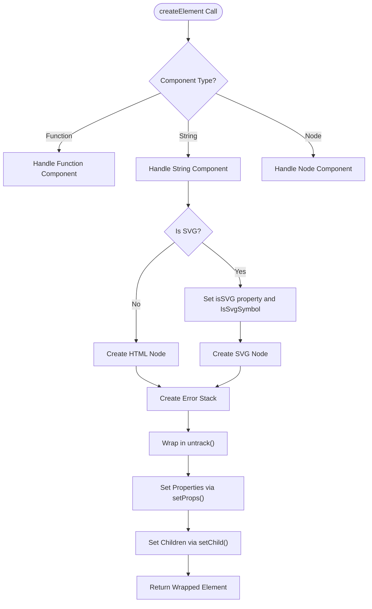
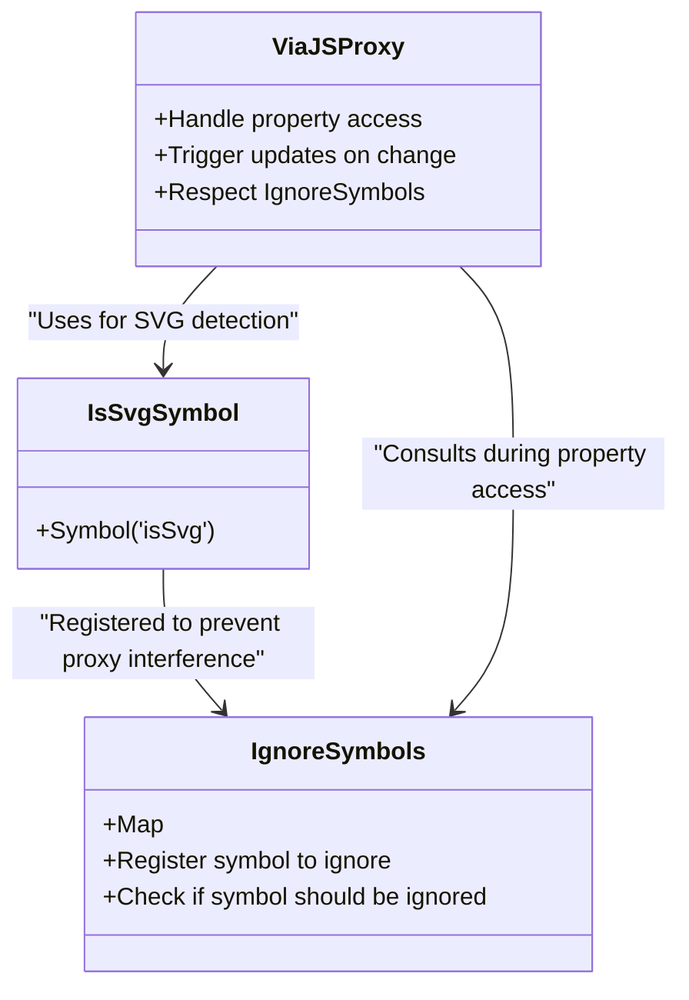
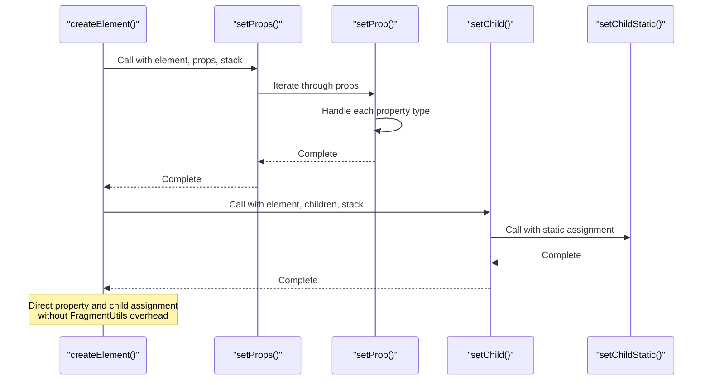
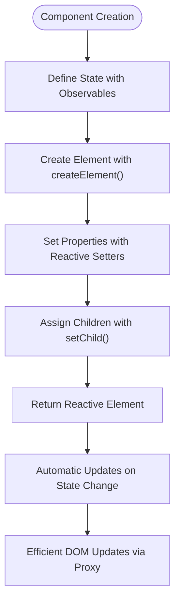
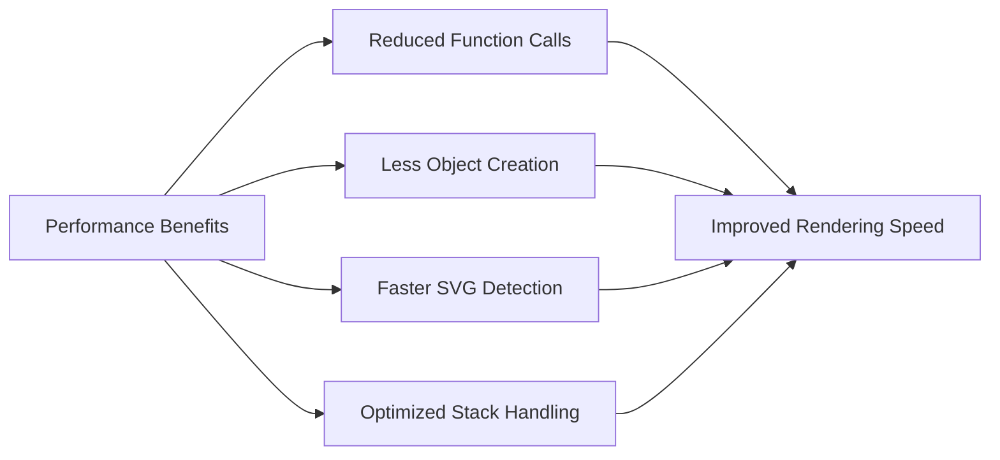
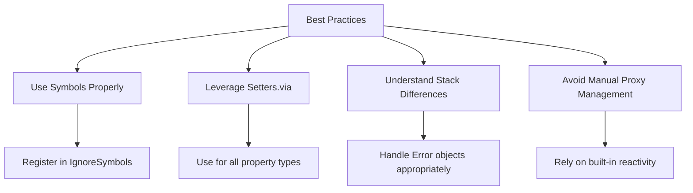

# Via.js Proxy-Based Element Creation

<cite>
**Referenced Files in This Document**  
- [create_element.via.ts](file://src/methods/create_element.via.ts)
- [setters.via.ts](file://src/utils/setters.via.ts)
- [constants.ts](file://src/constants.ts)
- [via-runtime.ts](file://src/via/via-runtime.ts)
- [creators.via.ts](file://src/utils/creators.via.ts)
</cite>

## Table of Contents
1. [Introduction](#introduction)
2. [Core Implementation](#core-implementation)
3. [Symbol-Based Reactivity Integration](#symbol-based-reactivity-integration)
4. [Property and Child Assignment](#property-and-child-assignment)
5. [Architectural Differences from Standard Implementation](#architectural-differences-from-standard-implementation)
6. [Reactive Component Examples](#reactive-component-examples)
7. [Integration Challenges and Solutions](#integration-challenges-and-solutions)
8. [Performance Benefits](#performance-benefits)
9. [Best Practices for Hybrid Rendering](#best-practices-for-hybrid-rendering)
10. [Conclusion](#conclusion)

## Introduction

The `createElement()` function in Woby, when integrated with via.js, implements a proxy-based reactivity system that enables transparent and efficient DOM updates. This documentation details how the function creates reactive elements that seamlessly work with via.js's reactivity model, leveraging symbol-based detection for SVG elements and specific ignore symbols to prevent proxy interference. The implementation optimizes property setting through `setters.via` and eliminates the need for `FragmentUtils` in child assignment, resulting in a streamlined and performant rendering pipeline.

**Section sources**
- [create_element.via.ts](file://src/methods/create_element.via.ts#L19-L80)

## Core Implementation

The `createElement()` function in the via.js integration creates elements that are inherently reactive through proxy-based mechanisms. When a string component (representing an HTML/SVG tag) is provided, the function determines whether to create an HTML or SVG node based on the `isSVGElement()` check. The key innovation lies in how SVG detection is handled through the `IsSvgSymbol` symbol, which is set directly on the element to indicate its SVG nature.

The function returns a wrapped element that maintains reactivity through the via.js proxy system. This wrapping ensures that the element can participate in the reactivity chain and respond to state changes without requiring explicit subscription mechanisms.



**Diagram sources**
- [create_element.via.ts](file://src/methods/create_element.via.ts#L19-L80)
- [creators.via.ts](file://src/utils/creators.via.ts#L1-L14)

**Section sources**
- [create_element.via.ts](file://src/methods/create_element.via.ts#L19-L80)
- [creators.via.ts](file://src/utils/creators.via.ts#L1-L14)

## Symbol-Based Reactivity Integration

The integration with via.js's reactivity system relies heavily on symbol-based mechanisms to ensure proper proxy handling and avoid interference. The `IsSvgSymbol` symbol is used to mark SVG elements, allowing the system to distinguish between HTML and SVG contexts without relying on string comparisons or complex type checking.

Additionally, the `IgnoreSymbols` mechanism from via.js is employed to prevent certain properties from being proxied, which is crucial for maintaining performance and avoiding infinite loops in the reactivity system. By registering `IsSvgSymbol` in `IgnoreSymbols`, the system ensures that this marker property does not trigger unnecessary reactivity updates while still being available for SVG detection.



**Diagram sources**
- [create_element.via.ts](file://src/methods/create_element.via.ts#L13-L13)
- [setters.via.ts](file://src/utils/setters.via.ts#L1-L799)

**Section sources**
- [create_element.via.ts](file://src/methods/create_element.via.ts#L13-L13)
- [setters.via.ts](file://src/utils/setters.via.ts#L1-L799)

## Property and Child Assignment

The property and child assignment process in the via.js integration is optimized for proxy-based updates. Instead of using the standard `FragmentUtils`, the implementation directly calls `setChild()` with the stack, streamlining the child assignment process. This optimization reduces overhead and improves performance by eliminating an intermediate step in the rendering pipeline.

Property setting is handled through the `setters.via` module, which provides specialized functions for different property types (attributes, classes, styles, events, etc.). These setters are designed to work seamlessly with via.js's reactivity system, ensuring that property changes trigger the appropriate updates without causing unnecessary re-renders.



**Diagram sources**
- [create_element.via.ts](file://src/methods/create_element.via.ts#L19-L80)
- [setters.via.ts](file://src/utils/setters.via.ts#L850-L859)
- [setters.via.ts](file://src/utils/setters.via.ts#L127-L129)

**Section sources**
- [create_element.via.ts](file://src/methods/create_element.via.ts#L19-L80)
- [setters.via.ts](file://src/utils/setters.via.ts#L127-L859)

## Architectural Differences from Standard Implementation

The via.js implementation of `createElement()` differs significantly from the standard version in several key aspects. Most notably, it uses an `Error` object as a stack instead of a custom `Stack` class, which simplifies the implementation and reduces memory overhead. This approach leverages JavaScript's built-in error stack trace mechanism for tracking component hierarchy.

Another major difference is the direct return of proxied elements without additional wrapping for fragment handling. This streamlines the rendering process and improves performance by reducing the number of intermediate objects created during element creation.

```mermaid
graph TB
subgraph "Standard Implementation"
A[Custom Stack Class]
B[FragmentUtils.make()]
C[Complex Wrapping]
D[Multiple Intermediate Objects]
end
subgraph "Via.js Implementation"
E[Error Object as Stack]
F[Direct setChild]
G[Minimal Wrapping]
H[Reduced Object Creation]
end
A --> |Replaced by| E
B --> |Eliminated| F
C --> |Simplified| G
D --> |Optimized| H
style A fill:#f9f,stroke:#333
style B fill:#f9f,stroke:#333
style C fill:#f9f,stroke:#333
style D fill:#f9f,stroke:#333
style E fill:#bbf,stroke:#333
style F fill:#bbf,stroke:#333
style G fill:#bbf,stroke:#333
style H fill:#bbf,stroke:#333
```

**Diagram sources**
- [create_element.via.ts](file://src/methods/create_element.via.ts#L19-L80)
- [create_element.ts](file://src/methods/create_element.ts#L53-L129)

**Section sources**
- [create_element.via.ts](file://src/methods/create_element.via.ts#L19-L80)
- [create_element.ts](file://src/methods/create_element.ts#L53-L129)

## Reactive Component Examples

Creating reactive components with the via.js integration follows a straightforward pattern. Components automatically update when their state changes, thanks to the proxy-based reactivity system. The following example demonstrates a simple counter component that updates in response to user interaction:



**Diagram sources**
- [create_element.via.ts](file://src/methods/create_element.via.ts#L19-L80)
- [setters.via.ts](file://src/utils/setters.via.ts#L1-L799)

**Section sources**
- [create_element.via.ts](file://src/methods/create_element.via.ts#L19-L80)
- [setters.via.ts](file://src/utils/setters.via.ts#L1-L799)

## Integration Challenges and Solutions

Integrating `createElement()` with via.js's reactivity model presents several challenges, including proper symbol handling, avoiding infinite loops in proxies, and ensuring compatibility across different rendering scenarios. The solution involves careful management of symbols and proxy traps to prevent unwanted side effects.

One key challenge is ensuring that the `IsSvgSymbol` does not trigger unnecessary reactivity updates while still being available for SVG detection. This is solved by registering the symbol in `IgnoreSymbols`, which tells the proxy system to ignore changes to this property.

Another challenge is preventing infinite loops when properties are updated within reactive contexts. This is addressed through the use of `untrack()` wrappers around property setting operations, which temporarily disable reactivity tracking during critical sections of code.

```mermaid
graph TD
A[Integration Challenges] --> B[Symbol Handling]
A --> C[Infinite Loops]
A --> D[Compatibility Issues]
B --> B1[Register IsSvgSymbol in IgnoreSymbols]
C --> C1[Use untrack() for critical sections]
D --> D1[Ensure consistent stack handling]
B1 --> E[Solutions Implemented]
C1 --> E
D1 --> E
```

**Diagram sources**
- [create_element.via.ts](file://src/methods/create_element.via.ts#L13-L13)
- [setters.via.ts](file://src/utils/setters.via.ts#L1-L799)

**Section sources**
- [create_element.via.ts](file://src/methods/create_element.via.ts#L13-L13)
- [setters.via.ts](file://src/utils/setters.via.ts#L1-L799)

## Performance Benefits

The integration of `createElement()` with via.js's proxy-based reactivity system provides significant performance benefits. By eliminating the need for `FragmentUtils` and using direct property setters, the implementation reduces the number of function calls and object creations during rendering.

The use of an `Error` object as a stack also contributes to performance improvements by leveraging built-in JavaScript functionality instead of custom implementations. This reduces memory overhead and improves execution speed.

Additionally, the symbol-based approach to SVG detection is more efficient than string-based methods, as symbol comparison is faster and more reliable than string manipulation and comparison.



**Diagram sources**
- [create_element.via.ts](file://src/methods/create_element.via.ts#L19-L80)
- [creators.via.ts](file://src/utils/creators.via.ts#L1-L14)

**Section sources**
- [create_element.via.ts](file://src/methods/create_element.via.ts#L19-L80)
- [creators.via.ts](file://src/utils/creators.via.ts#L1-L14)

## Best Practices for Hybrid Rendering

When working with the via.js integration in hybrid rendering scenarios, several best practices should be followed. First, always use the appropriate symbols for SVG detection and ensure they are properly registered in `IgnoreSymbols` to prevent proxy interference.

Second, leverage the streamlined property setting via `setters.via` rather than attempting to implement custom property assignment logic. This ensures compatibility with the reactivity system and takes advantage of the optimized implementation.

Third, be mindful of the stack handling differences between the via.js implementation and standard implementations. Using an `Error` object as a stack requires different error handling considerations and debugging approaches.



**Diagram sources**
- [create_element.via.ts](file://src/methods/create_element.via.ts#L19-L80)
- [setters.via.ts](file://src/utils/setters.via.ts#L1-L799)

**Section sources**
- [create_element.via.ts](file://src/methods/create_element.via.ts#L19-L80)
- [setters.via.ts](file://src/utils/setters.via.ts#L1-L799)

## Conclusion

The `createElement()` function's integration with via.js represents a sophisticated approach to proxy-based reactivity in web development. By leveraging symbols for SVG detection and implementing optimized property and child assignment, the system achieves high performance while maintaining transparency in its reactivity model. The architectural differences from standard implementations, such as the use of Error objects for stacks and the elimination of FragmentUtils, demonstrate thoughtful optimization for the specific requirements of proxy-based updates. Developers working with this system should follow best practices for symbol handling and leverage the provided setters to ensure optimal performance and compatibility in hybrid rendering scenarios.