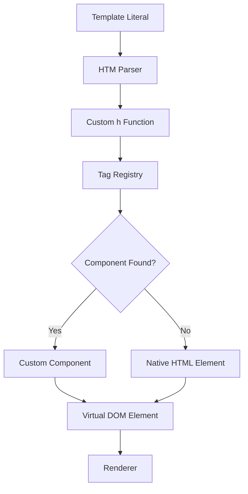
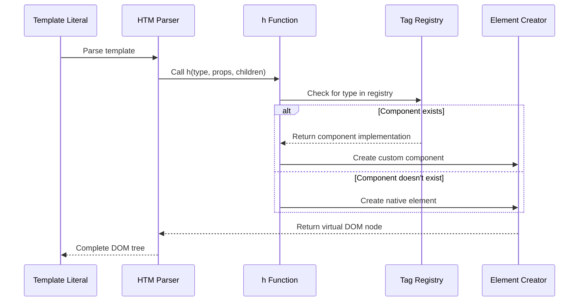
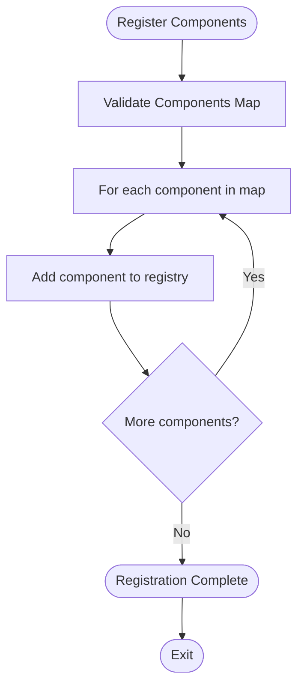
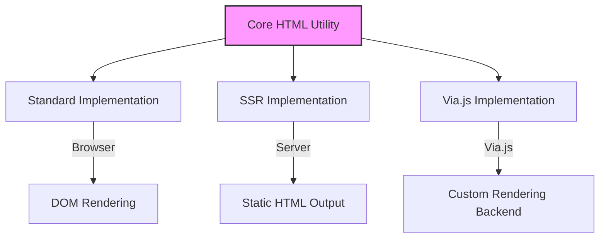
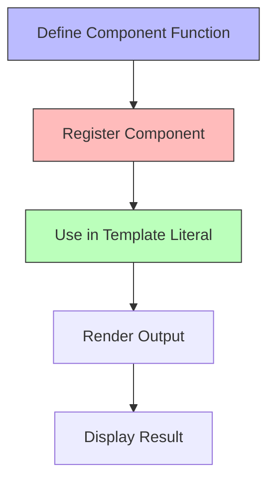

# HTML Tag Utilities

<cite>
**Referenced Files in This Document**   
- [html.ts](file://src/methods/html.ts)
- [htm.ts](file://src/utils/htm.ts)
- [h.ts](file://src/methods/h.ts)
- [resolvers.ts](file://src/utils/resolvers.ts)
- [index.ts](file://src/methods/index.ts)
- [html.ssr.ts](file://src/methods/html.ssr.ts)
- [html.via.ts](file://src/methods/html.via.ts)
- [creators.ts](file://src/utils/creators.ts)
</cite>

## Table of Contents
1. [Introduction](#introduction)
2. [Core Architecture](#core-architecture)
3. [Tag Registry System](#tag-registry-system)
4. [Component Registration](#component-registration)
5. [Environment-Specific Implementations](#environment-specific-implementations)
6. [Usage Patterns](#usage-patterns)
7. [Performance Considerations](#performance-considerations)
8. [Conclusion](#conclusion)

## Introduction
The HTML utility system provides a powerful tag registry mechanism that enables shorthand element creation through template literals. This system allows developers to define custom components and map them to HTML-like tags, creating a framework-agnostic approach to UI development. The core functionality revolves around the `html` constant, which combines the `htm` parser with a custom `h` function to enable seamless component resolution and rendering.

**Section sources**
- [html.ts](file://src/methods/html.ts#L1-L15)
- [htm.ts](file://src/utils/htm.ts#L1-L146)

## Core Architecture

The HTML utility system is built on a layered architecture that combines parsing, component resolution, and element creation. At its core, the system uses the `htm` library to parse template literals and convert them into virtual DOM structures. This parsing is enhanced with a custom `h` function that intercepts element creation and applies the tag registry logic.

**Diagram sources**
- [html.ts](file://src/methods/html.ts#L1-L15)
- [htm.ts](file://src/utils/htm.ts#L1-L146)
- [h.ts](file://src/methods/h.ts#L1-L24)

**Section sources**
- [html.ts](file://src/methods/html.ts#L1-L15)
- [htm.ts](file://src/utils/htm.ts#L1-L146)
- [h.ts](file://src/methods/h.ts#L1-L24)

## Tag Registry System

The tag registry system is the foundation of the HTML utility's component resolution mechanism. It maintains a mapping of tag names to component implementations, allowing custom components to be used with familiar HTML-like syntax. The registry is implemented as a simple JavaScript object that stores component mappings.

When the `html` function processes a template literal, it uses the bound `h` function to create elements. This custom `h` function first checks the registry for a matching component before falling back to native element creation. This two-step resolution process enables seamless integration of custom components while maintaining compatibility with standard HTML elements.

**Diagram sources**
- [html.ts](file://src/methods/html.ts#L1-L15)
- [h.ts](file://src/methods/h.ts#L1-L24)

**Section sources**
- [html.ts](file://src/methods/html.ts#L1-L15)

## Component Registration

The component registration system provides a simple API for mapping component names to their implementations. The `register` function accepts a map of component names to component functions and adds them to the global registry. This enables framework-agnostic component usage, as registered components can be used anywhere template literals are processed with the `html` function.

Component registration follows a merge pattern, where new component mappings are assigned to the existing registry without overwriting previous registrations. This allows multiple registration calls to coexist and build up a comprehensive component library over time.

**Diagram sources**
- [html.ts](file://src/methods/html.ts#L1-L15)
- [resolvers.ts](file://src/utils/resolvers.ts#L1-L200)

**Section sources**
- [html.ts](file://src/methods/html.ts#L1-L15)

## Environment-Specific Implementations

The HTML utility system provides environment-specific implementations to maintain compatibility across different rendering backends. Separate implementations exist for standard browser rendering, server-side rendering (SSR), and the Via.js environment. Each implementation adapts the core functionality to the specific requirements and constraints of its target environment.

The SSR implementation focuses on generating static HTML output optimized for initial page loads, while the Via.js implementation targets a specific runtime environment with its own rendering constraints. Despite these differences, all implementations maintain the same API and component resolution behavior, ensuring consistent developer experience across environments.

**Diagram sources**
- [html.ts](file://src/methods/html.ts#L1-L15)
- [html.ssr.ts](file://src/methods/html.ssr.ts#L1-L15)
- [html.via.ts](file://src/methods/html.via.ts#L1-L15)

**Section sources**
- [html.ts](file://src/methods/html.ts#L1-L15)
- [html.ssr.ts](file://src/methods/html.ssr.ts#L1-L15)
- [html.via.ts](file://src/methods/html.via.ts#L1-L15)

## Usage Patterns

The HTML utility system supports several usage patterns that facilitate rapid prototyping and component development. The most common pattern involves registering custom components and using them in template literals with familiar HTML-like syntax. This approach enables developers to create reusable UI components that can be instantiated with minimal boilerplate.

For rapid prototyping, developers can register components inline and immediately use them in templates. This workflow reduces the overhead of traditional component import and instantiation patterns, allowing for faster iteration and experimentation.

**Diagram sources**
- [html.ts](file://src/methods/html.ts#L1-L15)
- [creators.ts](file://src/utils/creators.ts#L1-L50)

**Section sources**
- [html.ts](file://src/methods/html.ts#L1-L15)

## Performance Considerations

The tag resolution system is designed with performance in mind, minimizing overhead during the rendering process. The registry lookup is a simple object property access, which is highly optimized in modern JavaScript engines. The fallback to native elements is also efficient, as it delegates directly to the underlying rendering system.

However, developers should be aware of the performance implications of complex component hierarchies and frequent re-renders. The system's reactivity model, combined with the resolution of observable values in props and children, can lead to performance bottlenecks if not managed properly.

Key performance considerations include:
- Minimizing the number of registered components to reduce memory usage
- Avoiding expensive operations in component functions
- Using static components when possible to reduce re-evaluation
- Leveraging the system's built-in optimization for static children

**Section sources**
- [resolvers.ts](file://src/utils/resolvers.ts#L1-L200)
- [html.ts](file://src/methods/html.ts#L1-L15)

## Conclusion

The HTML tag utility system provides a flexible and efficient approach to component-based UI development. By combining template literal parsing with a tag registry system, it enables a natural syntax for creating both native and custom elements. The system's environment-specific implementations ensure broad compatibility, while its performance-optimized architecture supports demanding applications. With its focus on simplicity and reusability, this utility system serves as a powerful foundation for modern web development.