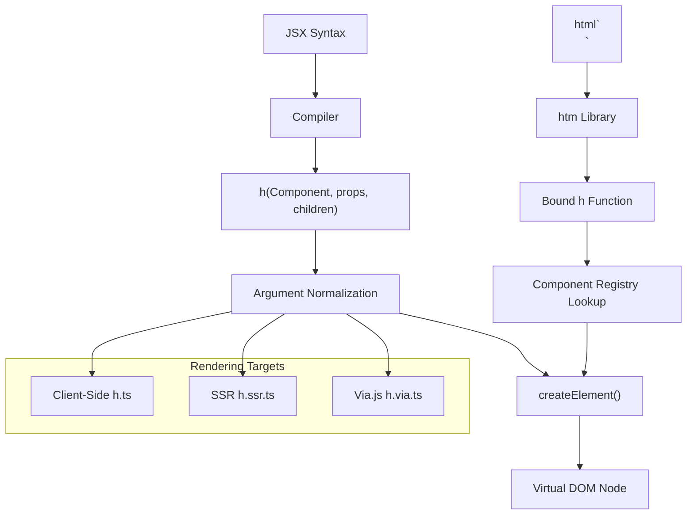
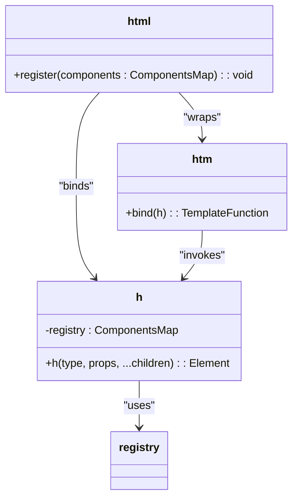
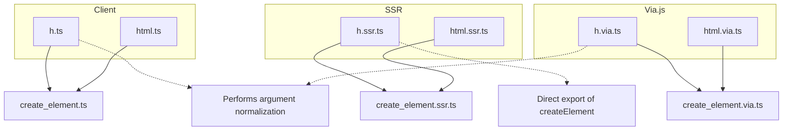

# Hyperscript Utilities

<cite>
**Referenced Files in This Document**   
- [h.ts](file://src/methods/h.ts)
- [html.ts](file://src/methods/html.ts)
- [h.ssr.ts](file://src/methods/h.ssr.ts)
- [h.via.ts](file://src/methods/h.via.ts)
- [html.ssr.ts](file://src/methods/html.ssr.ts)
- [html.via.ts](file://src/methods/html.via.ts)
- [jsx-runtime.ts](file://src/jsx-runtime.ts)
- [ssr/jsx-runtime.ts](file://src/ssr/jsx-runtime.ts)
</cite>

## Table of Contents
1. [Introduction](#introduction)
2. [Core Components](#core-components)
3. [Architecture Overview](#architecture-overview)
4. [Detailed Component Analysis](#detailed-component-analysis)
5. [Dependency Analysis](#dependency-analysis)
6. [Performance Considerations](#performance-considerations)
7. [Troubleshooting Guide](#troubleshooting-guide)
8. [Conclusion](#conclusion)

## Introduction
This document provides comprehensive documentation for the `h()` function and associated HTML utilities within the Woby framework. The `h()` function serves as the primary JSX compilation target, transforming JSX syntax into virtual DOM elements through delegation to `createElement()`. It normalizes arguments and manages child elements passed via props or rest parameters. The `html` utilities extend this functionality with tag registry support for shorthand element creation, enabling concise template syntax. Multiple implementations—standard, SSR, and Via.js—ensure compatibility across rendering environments while maintaining consistent behavior. This documentation covers usage patterns, integration with JSX tooling, performance characteristics, and implementation differences across targets.

## Core Components

The core components include the `h()` function and `html` utility, which serve as the foundation for JSX transformation and hyperscript-based DOM creation. The `h()` function is polymorphic, accepting various argument combinations to support both direct child passing and props-based children. It normalizes inputs before delegating to `createElement()` for actual element instantiation. The `html` utility leverages the `htm` library to provide tagged template literal syntax, binding to a custom `h` function that supports component registry lookups. Each rendering target (client, SSR, Via.js) provides its own implementation of these functions to ensure environment-specific optimizations while preserving interface compatibility.

**Section sources**
- [h.ts](file://src/methods/h.ts#L1-L25)
- [html.ts](file://src/methods/html.ts#L1-L16)

## Architecture Overview

The architecture centers around the JSX transformation pipeline, where source code containing JSX is compiled into calls to the `h()` function. This function acts as an abstraction layer over `createElement()`, handling argument normalization and child reconciliation. Different environments use specialized versions of `h()` and `html` that delegate to their respective `createElement` implementations. The system supports multiple JSX runtimes through separate entry points in `jsx-runtime.ts` and `ssr/jsx-runtime.ts`, allowing tree-shaking and target-specific optimizations. The `html` utility enhances developer ergonomics by enabling HTML-like syntax through template literals with dynamic component resolution via a registry.



**Diagram sources**
- [h.ts](file://src/methods/h.ts#L1-L25)
- [html.ts](file://src/methods/html.ts#L1-L16)
- [jsx-runtime.ts](file://src/jsx-runtime.ts#L1)
- [ssr/jsx-runtime.ts](file://src/ssr/jsx-runtime.ts#L1)

## Detailed Component Analysis

### h() Function Implementation

The `h()` function serves as the standard JSX factory function, designed to handle multiple calling signatures. It accepts a component type, optional props, and variable-length children arguments. When children are present either as rest parameters or within props, it merges them appropriately into the props object under the `children` key. If no children are provided and props is not an object, it treats the second argument as a direct child. This flexibility allows seamless interoperability between JSX-generated code and manual hyperscript usage. The function delegates to `createElement()` after normalization, ensuring consistent element creation logic.

```mermaid
flowchart TD
Start([h() Call]) --> HasChildren{"Children.length > 0?"}
HasChildren --> |Yes| MergeProps["Merge children into props"]
HasChildren --> |No| IsObjectProps{"isObject(props)?"}
IsObjectProps --> |No| TreatAsChild["Treat props as child"]
IsObjectProps --> |Yes| KeepProps["Keep props as-is"]
MergeProps --> CallCreate["createElement(component, mergedProps)"]
KeepProps --> CallCreate
TreatAsChild --> CallCreateDirect["createElement(component, null, props)"]
CallCreate --> End([Return Element])
CallCreateDirect --> End
```

**Diagram sources**
- [h.ts](file://src/methods/h.ts#L1-L25)

**Section sources**
- [h.ts](file://src/methods/h.ts#L1-L25)

### html Utility and Tag Registry

The `html` utility provides a template literal interface for creating elements using near-native HTML syntax. It uses the `htm` library, binding it to a custom `h` function that checks a global registry before creating elements. This allows shorthand tags (e.g., `html`<my-component/>``) to resolve to registered components without requiring imports. The registry is mutable via the `register` method, enabling dynamic component mapping. This pattern improves developer experience by reducing boilerplate while maintaining compatibility with the underlying virtual DOM system.



**Diagram sources**
- [html.ts](file://src/methods/html.ts#L1-L16)

**Section sources**
- [html.ts](file://src/methods/html.ts#L1-L16)

### Multi-Target Implementations

The framework provides distinct implementations of `h()` and `html` for different rendering targets: client-side, server-side rendering (SSR), and Via.js. The SSR versions (`h.ssr.ts`, `html.ssr.ts`) export `createElement` directly as `h`, bypassing argument normalization for performance in server contexts where JSX transformations are pre-compiled. The Via.js versions mirror the standard implementation but use `create_element.via.ts` for platform-specific behavior. All variants maintain identical interfaces, ensuring code portability across environments.



**Diagram sources**
- [h.ssr.ts](file://src/methods/h.ssr.ts#L1)
- [html.ssr.ts](file://src/methods/html.ssr.ts#L1-L12)
- [h.via.ts](file://src/methods/h.via.ts#L1-L37)
- [html.via.ts](file://src/methods/html.via.ts#L1-L14)

**Section sources**
- [h.ssr.ts](file://src/methods/h.ssr.ts#L1)
- [html.ssr.ts](file://src/methods/html.ssr.ts#L1-L12)
- [h.via.ts](file://src/methods/h.via.ts#L1-L37)
- [html.via.ts](file://src/methods/html.via.ts#L1-L14)

## Dependency Analysis

The `h()` and `html` utilities depend on core modules including `createElement`, `lang` utilities for type checking, and the `htm` library for template parsing. The `createElement` functions vary by target but share a common interface. The `lang` utilities (`isObject`, `isArray`) are used for argument type detection in `h()`. The `html` utility depends on `assign` for merging registry entries and binding the `htm` function. These dependencies are structured to allow tree-shaking, with each target importing only necessary modules.

```mermaid
dependencyGraph
h --> createElement
h --> lang
html --> htm
html --> createElement
html --> lang
htm --> h
lang --> typeUtils
```

**Diagram sources**
- [h.ts](file://src/methods/h.ts#L1-L25)
- [html.ts](file://src/methods/html.ts#L1-L16)
- [utils/lang.ts](file://src/utils/lang.ts)

**Section sources**
- [h.ts](file://src/methods/h.ts#L1-L25)
- [html.ts](file://src/methods/html.ts#L1-L16)

## Performance Considerations

The standard `h()` function incurs minimal overhead due to argument normalization, which involves object spreading and conditional logic. In SSR contexts, this overhead is eliminated by directly exporting `createElement` as `h`, optimizing for server-side rendering performance where JSX is pre-compiled. The `html` utility introduces slight parsing overhead from `htm`, but this is typically negligible compared to DOM operations. Registry lookups in `html` are O(1) and do not impact runtime performance significantly. For high-frequency updates, direct `createElement` calls may be preferred over `h()` when argument structures are known statically.

**Section sources**
- [h.ts](file://src/methods/h.ts#L1-L25)
- [h.ssr.ts](file://src/methods/h.ssr.ts#L1)
- [html.ts](file://src/methods/html.ts#L1-L16)

## Troubleshooting Guide

Common issues include incorrect JSX pragma configuration, leading to calls to the wrong `h()` function. Ensure the correct JSX runtime is specified in compiler settings (e.g., `jsxImportSource` in TypeScript). Missing component registrations in `html` templates result in unrecognized custom elements being treated as native tags. Verify that all shorthand components are registered via `html.register()`. Type errors may occur when mixing children in props and rest parameters; follow the documented calling conventions. In SSR environments, ensure that `h.ssr.ts` is used to avoid unnecessary normalization overhead.

**Section sources**
- [h.ts](file://src/methods/h.ts#L1-L25)
- [html.ts](file://src/methods/html.ts#L1-L16)
- [h.ssr.ts](file://src/methods/h.ssr.ts#L1)
- [html.ssr.ts](file://src/methods/html.ssr.ts#L1-L12)

## Conclusion

The `h()` function and `html` utilities form a robust foundation for JSX and hyperscript-based UI development in Woby. By providing a consistent interface across rendering targets and supporting both JSX and template literal syntax, they offer flexibility without sacrificing performance. The multi-implementation strategy ensures optimal behavior in client, server, and specialized environments like Via.js. Developers can leverage these tools to write expressive, portable UI code while benefiting from environment-specific optimizations under the hood.