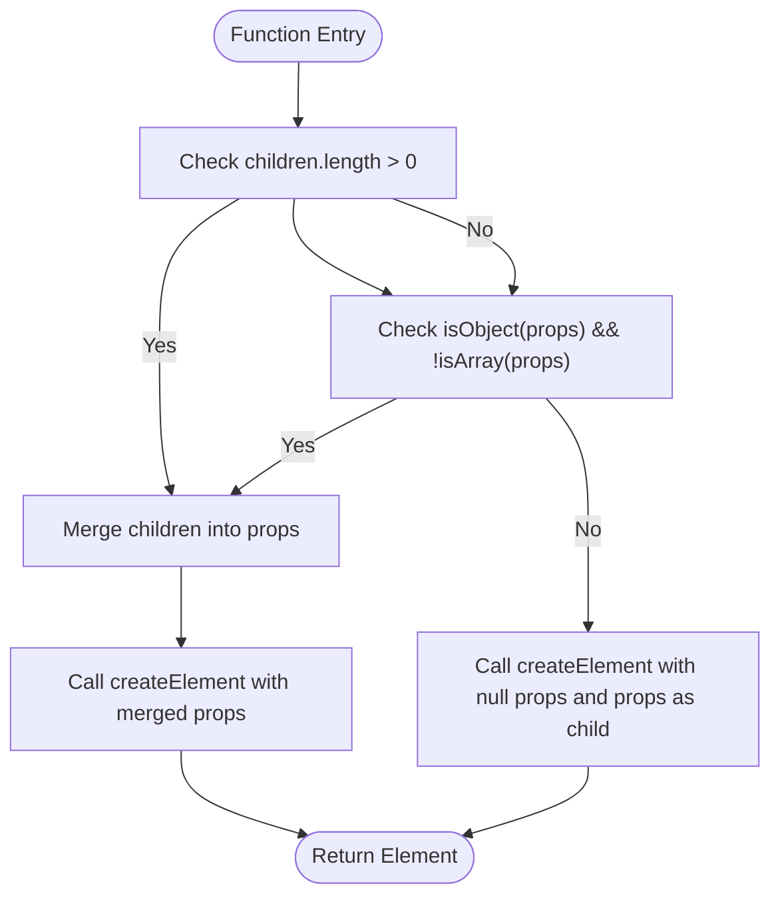

# h() Function

<cite>
**Referenced Files in This Document**   
- [h.ts](file://src/methods/h.ts)
- [h.via.ts](file://src/methods/h.via.ts)
- [h.ssr.ts](file://src/methods/h.ssr.ts)
- [create_element.ts](file://src/methods/create_element.ts)
- [create_element.via.ts](file://src/methods/create_element.via.ts)
- [create_element.ssr.ts](file://src/methods/create_element.ssr.ts)
- [jsx-runtime.ts](file://src/jsx-runtime.ts)
</cite>

## Table of Contents
1. [Introduction](#introduction)
2. [Function Signatures and Overloads](#function-signatures-and-overloads)
3. [JSX Compilation Process](#jsx-compilation-process)
4. [Children Handling and Props Normalization](#children-handling-and-props-normalization)
5. [Implementation Across Environments](#implementation-across-environments)
6. [Performance Implications](#performance-implications)
7. [JSX Tooling Integration](#jsx-tooling-integration)
8. [Practical Usage Examples](#practical-usage-examples)
9. [Conclusion](#conclusion)

## Introduction
The `h()` function serves as the core JSX compilation target in Woby, transforming JSX syntax into the framework's virtual element representation. It acts as a lightweight wrapper around `createElement()`, handling argument normalization and children processing before delegating to the core element creation logic. This function is essential for enabling JSX syntax in Woby applications, providing a familiar interface for developers while maintaining the framework's reactive principles.

The `h()` function is designed to be compatible with standard JSX tooling configurations while adapting to different runtime environments such as browser, server-side rendering (SSR), and the via.js environment. Its implementation varies slightly across these environments to optimize performance and maintain API consistency.

**Section sources**
- [h.ts](file://src/methods/h.ts#L7-L23)
- [h.via.ts](file://src/methods/h.via.ts#L7-L35)
- [h.ssr.ts](file://src/methods/h.ssr.ts#L1)

## Function Signatures and Overloads
The `h()` function features multiple overloads to accommodate different usage patterns while maintaining type safety. The primary signature accepts a component, optional props, and rest parameters for children:

```typescript
export function h<P extends { children?: Child } = {}>(
  component: Component<P>, 
  props?: P | null, 
  ...children: Child[]
): Element
```

This signature supports three distinct calling patterns:
1. Component with props and children as rest parameters
2. Component with only children (props parameter used as child)
3. Component with props object that may contain children

The generic type parameter `P` extends an object with an optional `children` property, allowing for proper type inference when working with component props. This design enables TypeScript to correctly infer the shape of props while maintaining flexibility for components that may or may not accept children.

The function also includes a specialized overload for cases where only a single child is provided, optimizing the call signature for common usage patterns while maintaining backward compatibility with JSX compilation standards.

**Section sources**
- [h.ts](file://src/methods/h.ts#L7-L23)
- [h.via.ts](file://src/methods/h.via.ts#L7-L35)

## JSX Compilation Process
The `h()` function serves as the primary target for JSX compilation in Woby, transforming JSX syntax into function calls that create virtual elements. When JSX is processed by a compiler like Babel or TypeScript, elements are converted into `h()` calls following a specific transformation pattern.

For example, the JSX expression `<div className="container">Hello</div>` is compiled to:
```javascript
h("div", { className: "container" }, "Hello")
```

This transformation process involves several steps:
1. The element type (tag name or component reference) becomes the first argument
2. Attributes and props are collected into an object passed as the second argument
3. Child elements are passed as rest parameters following the props object

The compiled output maintains the hierarchical structure of the original JSX while converting it into a format that Woby can efficiently process. This approach enables static analysis of component trees and facilitates tree-shaking in production builds.

The `h()` function's role in this process is critical, as it normalizes the arguments from the compiled JSX and prepares them for processing by `createElement()`. This separation of concerns allows Woby to maintain a clean compilation target while handling complex element creation logic in a dedicated function.

**Section sources**
- [h.ts](file://src/methods/h.ts#L8-L23)
- [h.via.ts](file://src/methods/h.via.ts#L8-L35)

## Children Handling and Props Normalization
The `h()` function implements sophisticated logic for handling children and normalizing props, ensuring consistent behavior across different usage patterns. The function must accommodate two primary ways of passing children: through the `children` prop or as rest parameters.

When children are provided as rest parameters or when props is an object (but not an array), the function merges children into the props object:



**Diagram sources**
- [h.ts](file://src/methods/h.ts#L8-L23)
- [h.via.ts](file://src/methods/h.via.ts#L8-L35)

The normalization process follows these rules:
1. If children are provided as rest parameters OR props is an object (not an array), children are merged into the props object
2. If no children are provided and props is not an object, props is treated as a single child
3. When merging, if no props object exists, a new object with children is created
4. When merging with existing props, the children are added to the props object using object spread

This logic prevents the invalid scenario of providing children both as a prop and as rest parameters, which would create ambiguity in the element structure. The implementation throws an error in `createElement()` when this condition is detected, ensuring data integrity in the virtual DOM.

**Section sources**
- [h.ts](file://src/methods/h.ts#L8-L23)
- [create_element.ts](file://src/methods/create_element.ts#L53-L129)

## Implementation Across Environments
Woby provides specialized implementations of the `h()` function for different runtime environments, maintaining API compatibility while optimizing for specific use cases. The framework includes distinct versions for standard browser execution, server-side rendering (SSR), and the via.js environment.

### Standard Environment (h.ts)
The standard implementation in `h.ts` serves as the primary version for browser-based applications. It imports `createElement` from the main implementation and applies the argument normalization logic described earlier. This version is optimized for client-side rendering with full DOM access and reactive updates.

### SSR Environment (h.ssr.ts)
The SSR implementation takes a different approach by directly re-exporting `createElement` as `h`:
```typescript
export { createElement as h } from '../methods/create_element.ssr'
```

This direct re-export eliminates the overhead of argument normalization in server-side rendering contexts where JSX compilation has already normalized the arguments. This optimization improves rendering performance by reducing function call overhead during server-side rendering operations.

### via.js Environment (h.via.ts)
The via.js implementation maintains the same argument normalization logic as the standard version but imports `createElement` from the via.js-specific implementation:
```typescript
import { createElement } from '../methods/create_element.via'
```

This version is optimized for the via.js runtime, which may have different requirements for element creation and property setting. The via.js environment likely involves proxy-based reactivity or other specialized DOM manipulation techniques that require a customized `createElement` implementation.

Despite these implementation differences, all versions maintain the same public API, ensuring that components written using JSX can run across different environments without modification.

**Section sources**
- [h.ts](file://src/methods/h.ts#L8-L23)
- [h.via.ts](file://src/methods/h.via.ts#L8-L35)
- [h.ssr.ts](file://src/methods/h.ssr.ts#L1)
- [create_element.ts](file://src/methods/create_element.ts#L53-L129)
- [create_element.via.ts](file://src/methods/create_element.via.ts#L19-L80)
- [create_element.ssr.ts](file://src/methods/create_element.ssr.ts#L15-L79)

## Performance Implications
The argument normalization performed by the `h()` function has several performance implications that affect both runtime efficiency and bundle size. Understanding these implications is crucial for optimizing Woby applications.

### Runtime Overhead
The conditional logic and object manipulation in the `h()` function introduce runtime overhead for every element creation. The function must:
- Check the length of the children array
- Determine if props is an object (but not an array)
- Potentially create a new object with merged properties
- Perform type assertions and casting

This overhead is typically minimal for most applications but can become significant in components that render large numbers of elements or in deeply nested component trees.

### Optimization Opportunities
The SSR implementation demonstrates a key optimization strategy: eliminating unnecessary normalization when the input is already in the correct format. Since JSX compilation typically produces normalized output, the SSR version bypasses the normalization step entirely by directly re-exporting `createElement`.

For performance-critical applications, developers can:
1. Minimize deep JSX nesting to reduce the number of `h()` calls
2. Use fragments strategically to group elements without additional wrapper components
3. Consider using the underlying `createElement()` function directly in performance-critical paths (though this sacrifices JSX readability)

### Bundle Size Considerations
The multiple implementations of `h()` across different environments contribute to bundle size. However, modern bundlers can tree-shake unused versions when targeting specific environments. For example, when building for SSR, the browser-specific `h.ts` and `h.via.ts` implementations can be eliminated from the final bundle.

The framework's modular design allows for environment-specific optimizations while maintaining a consistent developer experience across different deployment targets.

**Section sources**
- [h.ts](file://src/methods/h.ts#L8-L23)
- [h.ssr.ts](file://src/methods/h.ssr.ts#L1)
- [create_element.ts](file://src/methods/create_element.ts#L53-L129)

## JSX Tooling Integration
The `h()` function is designed to integrate seamlessly with standard JSX tooling configurations, enabling developers to use familiar development workflows. The function serves as a compatible target for JSX compilation in various toolchains.

### TypeScript Configuration
In TypeScript projects, the `h()` function can be specified as the JSX factory function in `tsconfig.json`:
```json
{
  "compilerOptions": {
    "jsx": "react",
    "jsxFactory": "h",
    "jsxFragmentFactory": "Fragment"
  }
}
```

This configuration directs the TypeScript compiler to transform JSX syntax into calls to the `h()` function, enabling type checking and IntelliSense support for JSX elements.

### Babel Integration
For Babel-based toolchains, the `@babel/plugin-transform-react-jsx` plugin can be configured to use `h()` as the pragma:
```javascript
{
  "plugins": [
    ["@babel/plugin-transform-react-jsx", {
      "pragma": "h",
      "pragmaFrag": "Fragment"
    }]
  ]
}
```

This configuration ensures that JSX elements are compiled to `h()` calls during the transpilation process.

### Development Environment Support
The consistent naming and signature of the `h()` function enable broad editor and IDE support. Most modern JavaScript editors recognize `h()` as a valid JSX factory function and provide appropriate syntax highlighting, code completion, and error detection for JSX syntax.

The framework's `jsx-runtime.ts` file exports the necessary runtime functions to support modern JSX transform features, allowing developers to use JSX without explicitly importing the `h` function in every file that uses JSX syntax.

**Section sources**
- [jsx-runtime.ts](file://src/jsx-runtime.ts#L1)
- [h.ts](file://src/methods/h.ts#L7-L23)

## Practical Usage Examples
The `h()` function enables several practical usage patterns in Woby applications, from standard JSX compilation to manual element creation.

### JSX Compilation Output
When JSX is compiled, it produces `h()` calls that represent the element tree:
```jsx
// Input JSX
<App>
  <Header title="My App" />
  <Main>
    <Content text="Hello World" />
  </Main>
</App>

// Compiled output
h(App, null,
  h(Header, { title: "My App" }),
  h(Main, null,
    h(Content, { text: "Hello World" })
  )
)
```

### Manual h() Usage
Developers can also call `h()` directly when creating elements programmatically:
```javascript
// Creating an element with props and children
const element = h('div', { className: 'container' }, 'Hello', 'World');

// Creating an element with only a single child
const childElement = h('span', 'Just text');

// Creating a component with props object containing children
const propsElement = h(MyComponent, { 
  name: 'Test', 
  children: [h('p', 'Paragraph')]
});
```

### Dynamic Element Creation
The `h()` function is particularly useful for dynamic element creation based on runtime conditions:
```javascript
function renderList(items, Component) {
  return h('ul', null,
    items.map(item => 
      h('li', { key: item.id },
        h(Component, { data: item })
      )
    )
  );
}
```

These examples demonstrate the flexibility of the `h()` function in both compiled and manual usage scenarios, providing a consistent interface for element creation across different contexts.

**Section sources**
- [h.ts](file://src/methods/h.ts#L8-L23)
- [create_element.ts](file://src/methods/create_element.ts#L53-L129)

## Conclusion
The `h()` function serves as a critical bridge between JSX syntax and Woby's virtual element system, enabling a familiar and productive development experience. By normalizing JSX compilation output and delegating to `createElement()`, it provides a clean abstraction that separates syntax transformation from element creation logic.

The function's implementation demonstrates thoughtful design considerations for different runtime environments, with optimized versions for SSR that eliminate unnecessary normalization overhead. This environment-specific optimization showcases Woby's commitment to performance across deployment targets.

Understanding the `h()` function's role in the compilation pipeline, its argument normalization logic, and its integration with development tooling is essential for Woby developers. This knowledge enables effective debugging, performance optimization, and informed decision-making when structuring components and managing element creation in Woby applications.

The consistent API across environments ensures that components remain portable while allowing the framework to optimize for specific use cases, striking a balance between developer convenience and runtime efficiency.

**Section sources**
- [h.ts](file://src/methods/h.ts#L7-L23)
- [h.via.ts](file://src/methods/h.via.ts#L7-L35)
- [h.ssr.ts](file://src/methods/h.ssr.ts#L1)