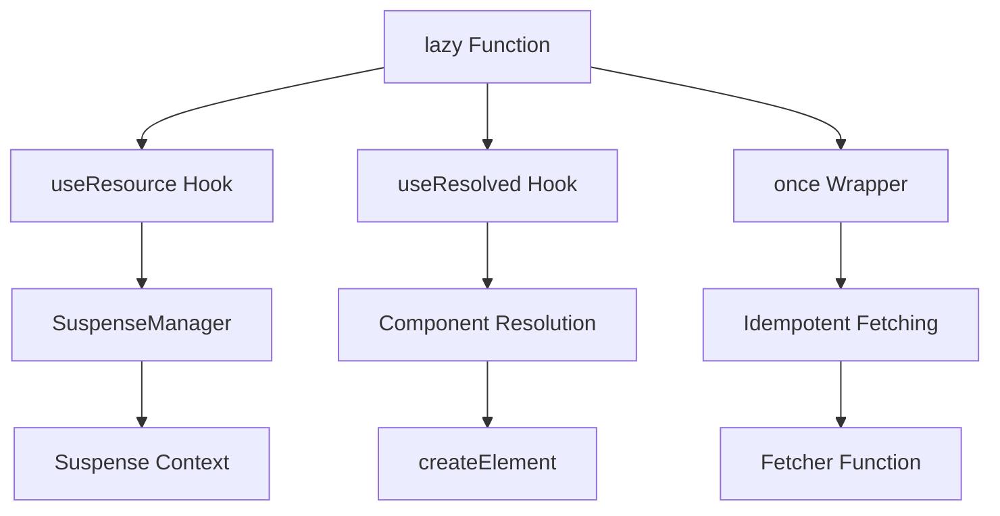
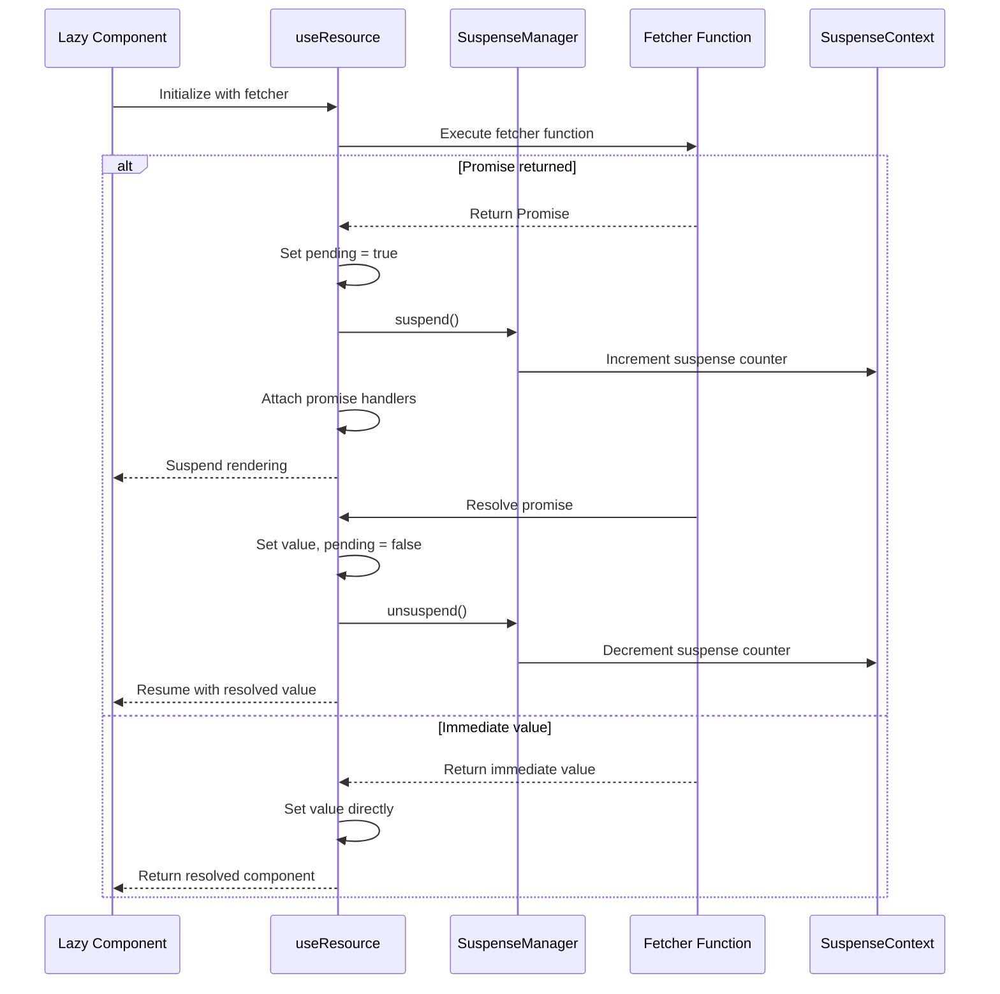
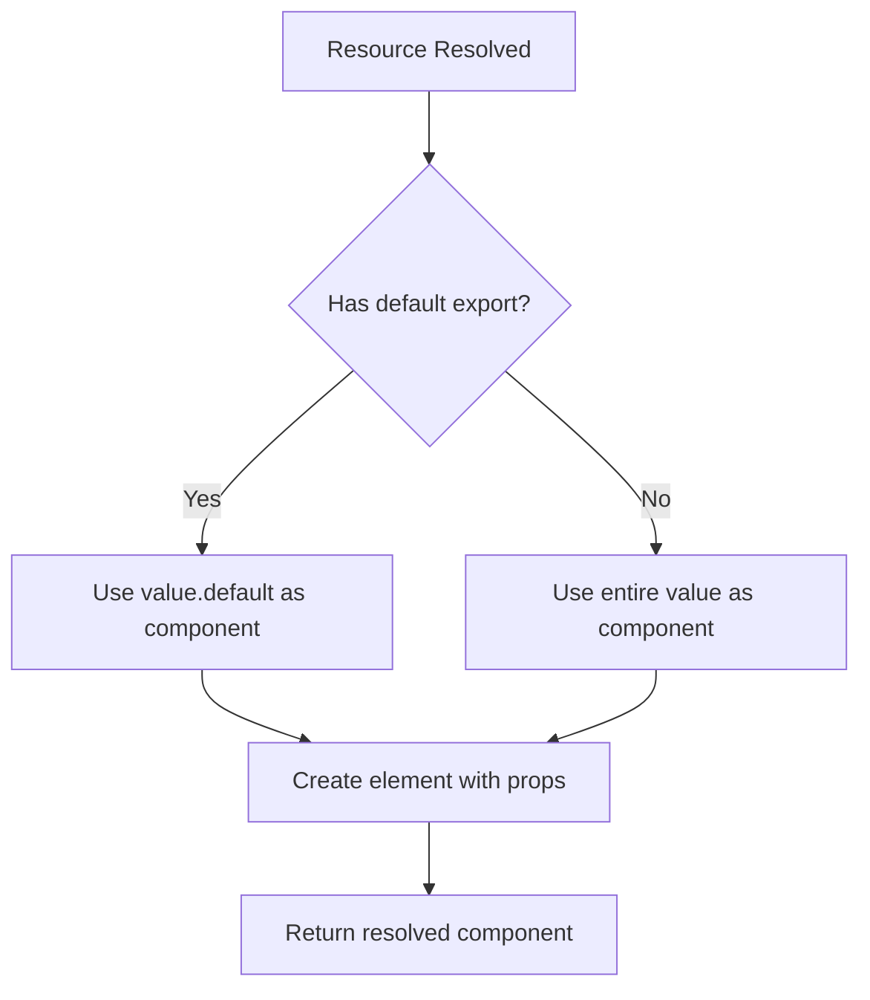
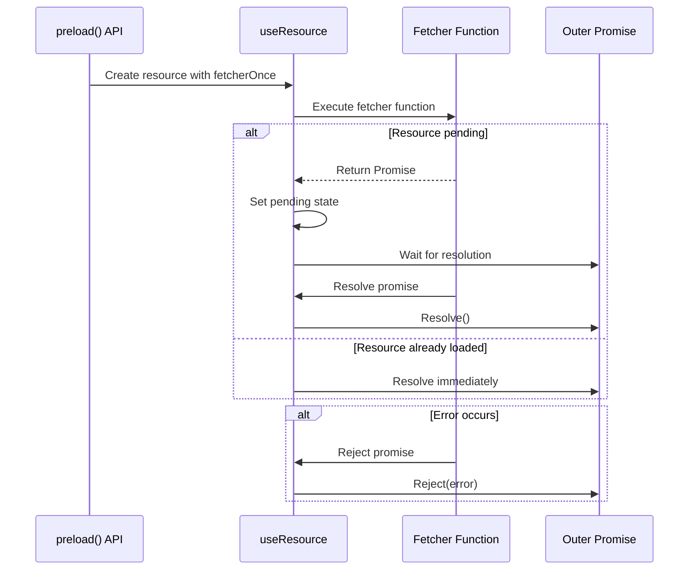
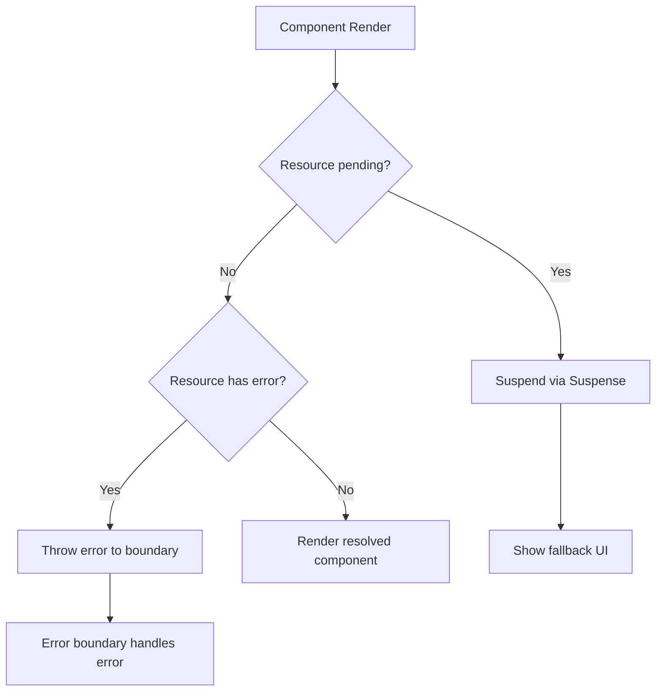

# Browser Environment

<cite>
**Referenced Files in This Document**   
- [lazy.ts](file://src/methods/lazy.ts)
- [use_resource.ts](file://src/hooks/use_resource.ts)
- [use_resolved.ts](file://src/hooks/use_resolved.ts)
- [suspense.manager.ts](file://src/components/suspense.manager.ts)
- [suspense.context.ts](file://src/components/suspense.context.ts)
- [lang.ts](file://src/utils/lang.ts)
- [soby.ts](file://src/methods/soby.ts)
- [types.ts](file://src/types.ts)
</cite>

## Table of Contents
1. [Introduction](#introduction)
2. [Core Architecture](#core-architecture)
3. [Lazy Loading Mechanism](#lazy-loading-mechanism)
4. [Resource Management](#resource-management)
5. [Component Resolution Process](#component-resolution-process)
6. [Preload Method Implementation](#preload-method-implementation)
7. [Practical Usage Examples](#practical-usage-examples)
8. [Error Handling and Suspense Integration](#error-handling-and-suspense-integration)
9. [Performance Optimization](#performance-optimization)
10. [Common Issues and Solutions](#common-issues-and-solutions)

## Introduction
The lazy() function in the Woby framework provides a sophisticated mechanism for asynchronous component loading in browser environments. This documentation details how the function leverages useResource() and useResolved() hooks to enable Suspense integration, allowing components to be loaded on-demand while maintaining a seamless user experience. The implementation supports both default and named exports, incorporates idempotent fetching through the once() wrapper, and enables proactive loading via the preload() method. This system facilitates efficient code splitting and resource caching, making it ideal for loading route components, heavy UI elements, and third-party libraries.

**Section sources**
- [lazy.ts](file://src/methods/lazy.ts#L11-L59)

## Core Architecture
The lazy() function operates through a coordinated system of hooks and utilities that manage asynchronous loading, state tracking, and component resolution. At its core, the function creates a wrapper component that orchestrates the loading process through resource management and suspense mechanisms. The architecture integrates several key components: the useResource() hook for managing asynchronous operations, the useResolved() hook for handling resolved values, and the once() utility for ensuring idempotent fetching. This design enables efficient resource utilization and prevents redundant network requests.

**Diagram sources**
- [lazy.ts](file://src/methods/lazy.ts#L11-L59)
- [use_resource.ts](file://src/hooks/use_resource.ts#L18-L104)
- [use_resolved.ts](file://src/hooks/use_resolved.ts#L64-L99)

**Section sources**
- [lazy.ts](file://src/methods/lazy.ts#L11-L59)
- [use_resource.ts](file://src/hooks/use_resource.ts#L18-L104)
- [use_resolved.ts](file://src/hooks/use_resolved.ts#L64-L99)

## Lazy Loading Mechanism
The lazy() function implements a robust lazy loading mechanism that defers component loading until the component is actually needed in the render tree. When invoked with a fetcher function, it returns a component that can be rendered immediately, even though its implementation is not yet loaded. The mechanism works by creating a resource through useResource() that tracks the loading state, including pending, error, and value states. During rendering, if the resource is still pending, the component will suspend, triggering the Suspense boundary. Once the resource resolves, the component is created and rendered.

**Section sources**
- [lazy.ts](file://src/methods/lazy.ts#L11-L59)
- [use_resource.ts](file://src/hooks/use_resource.ts#L18-L104)

## Resource Management
Resource management in the lazy() function is handled through the useResource() hook, which creates a reactive resource object that tracks the state of asynchronous operations. The hook maintains observables for pending, error, and value states, allowing components to react appropriately to different stages of the loading process. When the fetcher function returns a promise, the resource enters a pending state, suspending the component through the SuspenseManager. Upon resolution, the resource updates its state and notifies dependent components. The implementation includes proper cleanup mechanisms to prevent memory leaks and ensure that disposed components do not process resolved values.

**Diagram sources**
- [use_resource.ts](file://src/hooks/use_resource.ts#L18-L104)
- [suspense.manager.ts](file://src/components/suspense.manager.ts#L4-L67)
- [suspense.context.ts](file://src/components/suspense.context.ts#L12-L54)

**Section sources**
- [use_resource.ts](file://src/hooks/use_resource.ts#L18-L104)
- [suspense.manager.ts](file://src/components/suspense.manager.ts#L4-L67)

## Component Resolution Process
The component resolution process in the lazy() function handles both default and named exports from dynamically loaded modules. When a resource resolves, the useResolved() hook processes the value to determine the actual component to instantiate. The implementation checks for the presence of a default export in the resolved module; if found, it uses that component, otherwise it treats the entire module as the component. This flexibility allows developers to structure their modules according to preference while maintaining compatibility with the lazy loading system. The resolved component is then wrapped in createElement() to create the final renderable output.

**Diagram sources**
- [lazy.ts](file://src/methods/lazy.ts#L11-L59)
- [use_resolved.ts](file://src/hooks/use_resolved.ts#L64-L99)

**Section sources**
- [lazy.ts](file://src/methods/lazy.ts#L11-L59)
- [use_resolved.ts](file://src/hooks/use_resolved.ts#L64-L99)

## Preload Method Implementation
The preload() method enables proactive loading of lazy components before they are needed in the render tree. This method creates a resource using the same fetcher function but does not participate in the rendering process. Instead, it resolves the promise and either resolves the outer promise on success or rejects it on error. By calling preload(), applications can initiate component loading during idle time or in anticipation of user navigation, significantly improving perceived performance. The implementation leverages the same resource caching mechanism as the main component, ensuring that preloaded components are immediately available when subsequently rendered.

**Diagram sources**
- [lazy.ts](file://src/methods/lazy.ts#L11-L59)
- [use_resource.ts](file://src/hooks/use_resource.ts#L18-L104)

**Section sources**
- [lazy.ts](file://src/methods/lazy.ts#L11-L59)

## Practical Usage Examples
The lazy() function can be applied in various scenarios to optimize application performance and user experience. Common use cases include lazy loading route components, heavy UI elements, and third-party libraries. For route-based loading, components can be loaded only when their corresponding route is accessed. Heavy UI elements like complex charts or data grids can be loaded on demand when the user interacts with them. Third-party libraries with large bundle sizes can be loaded only when needed, reducing initial load time. The preload() method can be used to anticipate user actions, such as preloading the next route during navigation or loading components during idle periods.

**Section sources**
- [lazy.ts](file://src/methods/lazy.ts#L11-L59)

## Error Handling and Suspense Integration
Error handling in the lazy() function is tightly integrated with the Suspense mechanism. When a fetch operation fails, the error is captured in the resource state and re-thrown when the component attempts to render. This triggers the nearest error boundary, allowing applications to handle loading failures gracefully. The implementation ensures that errors are properly propagated and that the component remains in a failed state until explicitly retried. Suspense integration allows components to suspend during loading, displaying fallback content while resources are fetched. This creates a smooth user experience by preventing partial or inconsistent rendering states.

**Diagram sources**
- [lazy.ts](file://src/methods/lazy.ts#L11-L59)
- [use_resource.ts](file://src/hooks/use_resource.ts#L18-L104)

**Section sources**
- [lazy.ts](file://src/methods/lazy.ts#L11-L59)
- [use_resource.ts](file://src/hooks/use_resource.ts#L18-L104)

## Performance Optimization
The lazy() function incorporates several performance optimizations to enhance application efficiency. The once() wrapper ensures idempotent fetching, preventing multiple executions of the same fetcher function and eliminating redundant network requests. Resource caching allows loaded components to be reused across multiple instances, reducing memory usage and improving rendering performance. The preload() method enables strategic loading of components during idle periods, improving perceived performance. Code splitting is facilitated by the modular design, allowing applications to load only the code needed for the current view. These optimizations work together to minimize bundle sizes, reduce network overhead, and improve overall application responsiveness.

**Section sources**
- [lazy.ts](file://src/methods/lazy.ts#L11-L59)
- [lang.ts](file://src/utils/lang.ts#L175-L193)

## Common Issues and Solutions
Common issues with lazy loading include chunk loading failures and race conditions during rapid navigation. Chunk loading failures can occur due to network issues or incorrect module paths and are typically handled through error boundaries and retry mechanisms. Race conditions may arise when multiple navigation events occur rapidly, potentially leading to inconsistent states. These can be mitigated through proper resource management and by ensuring that disposed components do not process resolved values. Additional considerations include handling of circular dependencies, managing memory usage for large components, and ensuring proper cleanup of event listeners and subscriptions in lazy-loaded components.

**Section sources**
- [lazy.ts](file://src/methods/lazy.ts#L11-L59)
- [use_resource.ts](file://src/hooks/use_resource.ts#L18-L104)