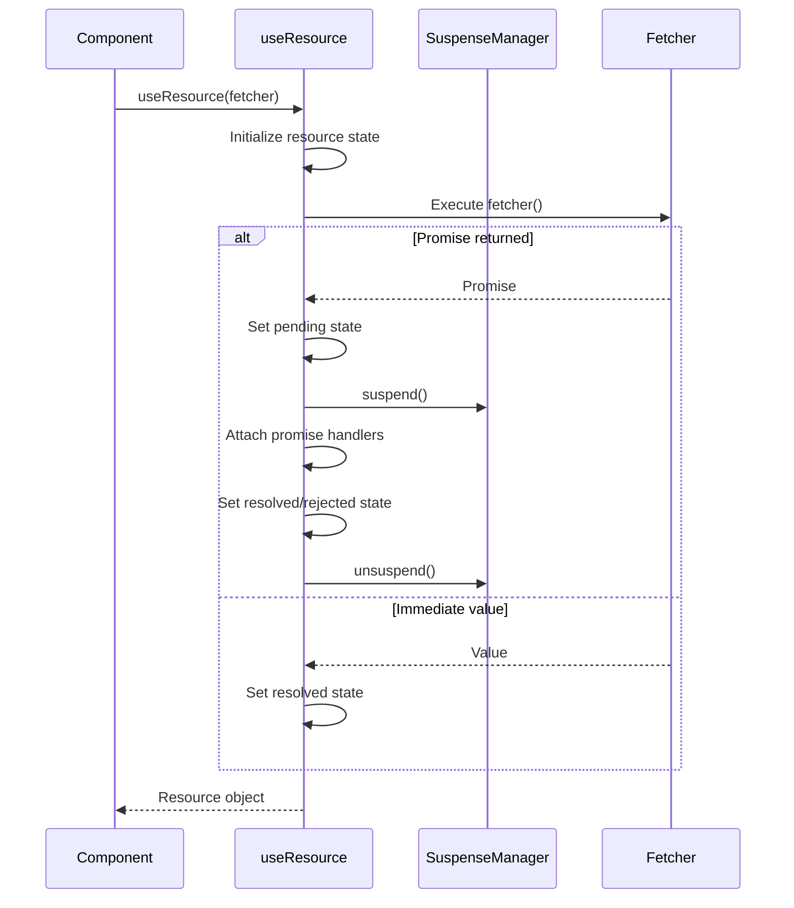
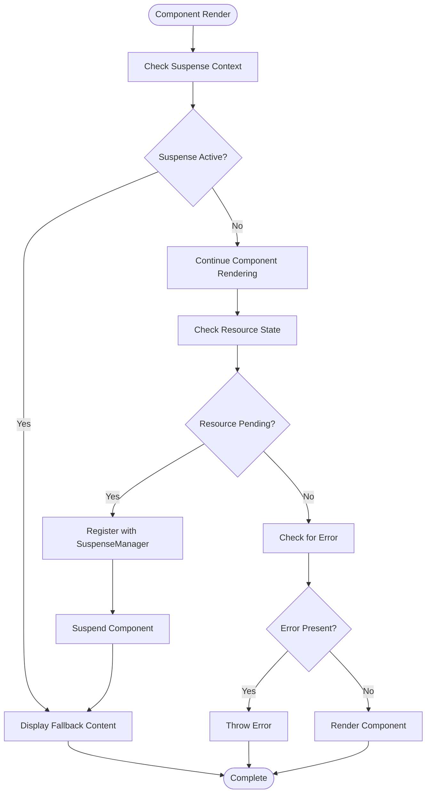
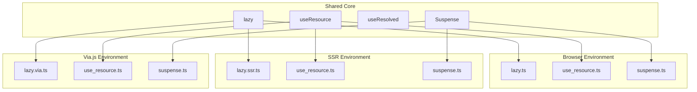

# Lazy Loading

<cite>
**Referenced Files in This Document**   
- [lazy.ts](file://src/methods/lazy.ts)
- [lazy.ssr.ts](file://src/methods/lazy.ssr.ts)
- [lazy.via.ts](file://src/methods/lazy.via.ts)
- [use_resource.ts](file://src/hooks/use_resource.ts)
- [suspense.ts](file://src/components/suspense.ts)
- [suspense.manager.ts](file://src/components/suspense.manager.ts)
- [use_resolved.ts](file://src/hooks/use_resolved.ts)
- [types.ts](file://src/types.ts)
</cite>

## Table of Contents
1. [Introduction](#introduction)
2. [Core Components](#core-components)
3. [Architecture Overview](#architecture-overview)
4. [Detailed Component Analysis](#detailed-component-analysis)
5. [Dependency Analysis](#dependency-analysis)
6. [Performance Considerations](#performance-considerations)
7. [Troubleshooting Guide](#troubleshooting-guide)
8. [Conclusion](#conclusion)

## Introduction
This document provides comprehensive documentation for the lazy loading system in the Woby framework. It covers the implementation of asynchronous component loading through the `lazy()` function, integration with Suspense for handling loading states, and the use of resource management via `useResource()`. The documentation details how code splitting is implemented across different environments including browser, SSR (Server-Side Rendering), and Via.js contexts. It also explains the fetcher function pattern, preload strategies, error handling mechanisms, and performance optimization techniques for efficient bundle loading.

## Core Components

The lazy loading system in Woby is built around several core components that work together to enable asynchronous component loading and efficient resource management. The primary components include the `lazy()` function for defining lazily-loaded components, the `useResource()` hook for managing asynchronous data fetching, and the Suspense mechanism for handling loading states. These components are implemented consistently across different environments (browser, SSR, Via.js) with environment-specific variations handled through separate implementation files. The system leverages observable patterns and promise resolution to provide a seamless experience for developers implementing code splitting in their applications.

**Section sources**
- [lazy.ts](file://src/methods/lazy.ts#L11-L59)
- [use_resource.ts](file://src/hooks/use_resource.ts#L18-L104)
- [suspense.ts](file://src/components/suspense.ts#L0-L25)

## Architecture Overview

The lazy loading architecture in Woby follows a consistent pattern across all environments, with the core logic implemented in shared components and environment-specific adaptations handled through separate files. The system is built on a foundation of reactive programming principles, using observables to track the state of asynchronously loaded components and resources.

```mermaid
graph TD
A[lazy()] --> B[Fetcher Function]
B --> C[useResource()]
C --> D[Resource State]
D --> E{Pending?}
E --> |Yes| F[Suspend Execution]
E --> |No| G{Error?}
G --> |Yes| H[Throw Error]
G --> |No| I[Resolve Component]
I --> J[createElement]
A --> K[preload()]
K --> C
L[Suspense] --> M[Handle Suspended State]
M --> N[Display Fallback]
F --> M
```

**Diagram sources**
- [lazy.ts](file://src/methods/lazy.ts#L11-L59)
- [use_resource.ts](file://src/hooks/use_resource.ts#L18-L104)
- [suspense.ts](file://src/components/suspense.ts#L0-L25)

## Detailed Component Analysis

### Lazy Function Implementation

The `lazy()` function serves as the primary interface for defining lazily-loaded components in the Woby framework. It accepts a fetcher function that returns a promise resolving to a component module, and returns a component that can be used like any other component but loads asynchronously.

```mermaid
classDiagram
class LazyFetcher {
<<type>>
+() : Promise<{default : ComponentFunction<P>} | ComponentFunction<P>>
}
class LazyResult {
<<type>>
+preload() : Promise<void>
}
class lazy {
+lazy(fetcher : LazyFetcher) : LazyResult
}
LazyResult <|-- lazy : returns
LazyFetcher <.. lazy : parameter
```

**Diagram sources**
- [types.ts](file://src/types.ts#L1201-L1201)
- [lazy.ts](file://src/methods/lazy.ts#L11-L59)

**Section sources**
- [lazy.ts](file://src/methods/lazy.ts#L11-L59)
- [types.ts](file://src/types.ts#L1201-L1201)

### Resource Management with useResource

The `useResource()` hook provides the underlying mechanism for managing asynchronous resources in the lazy loading system. It handles the lifecycle of promises, tracks their state (pending, resolved, rejected), and integrates with the Suspense system to coordinate rendering.



**Diagram sources**
- [use_resource.ts](file://src/hooks/use_resource.ts#L18-L104)
- [suspense.manager.ts](file://src/components/suspense.manager.ts#L0-L67)

**Section sources**
- [use_resource.ts](file://src/hooks/use_resource.ts#L18-L104)

### Suspense Integration

The Suspense mechanism in Woby works in conjunction with the lazy loading system to handle the display of fallback content while components are being loaded. It provides a declarative way to specify what should be shown during the loading state.



**Diagram sources**
- [suspense.ts](file://src/components/suspense.ts#L0-L25)
- [suspense.manager.ts](file://src/components/suspense.manager.ts#L0-L67)

**Section sources**
- [suspense.ts](file://src/components/suspense.ts#L0-L25)
- [suspense.manager.ts](file://src/components/suspense.manager.ts#L0-L67)

## Dependency Analysis

The lazy loading system in Woby has a well-defined dependency structure that ensures consistent behavior across different environments while allowing for necessary adaptations. The core functionality is shared across all environments, with environment-specific implementations provided for platform-dependent operations.



**Diagram sources**
- [lazy.ts](file://src/methods/lazy.ts#L11-L59)
- [lazy.ssr.ts](file://src/methods/lazy.ssr.ts#L10-L58)
- [lazy.via.ts](file://src/methods/lazy.via.ts#L10-L58)
- [use_resource.ts](file://src/hooks/use_resource.ts#L18-L104)
- [suspense.ts](file://src/components/suspense.ts#L0-L25)

**Section sources**
- [lazy.ts](file://src/methods/lazy.ts#L11-L59)
- [lazy.ssr.ts](file://src/methods/lazy.ssr.ts#L10-L58)
- [lazy.via.ts](file://src/methods/lazy.via.ts#L10-L58)

## Performance Considerations

The lazy loading implementation in Woby is designed with performance as a primary consideration. The system minimizes unnecessary work by ensuring that fetcher functions are only executed once through the use of the `once()` utility function. This prevents redundant network requests or module loading operations when the same lazy component is used multiple times.

The integration with Suspense allows for efficient rendering by suspending component trees that depend on asynchronous resources, preventing partial or inconsistent rendering states. The system also supports proactive loading through the `preload()` method, enabling developers to initiate component loading before it's actually needed, potentially eliminating loading delays when the component is eventually rendered.

Code splitting is facilitated naturally through the lazy loading mechanism, allowing applications to divide their code into smaller bundles that are loaded on demand. This can significantly reduce initial load times and improve the perceived performance of applications, especially those with complex routing structures or large component libraries.

**Section sources**
- [lazy.ts](file://src/methods/lazy.ts#L11-L59)
- [use_resource.ts](file://src/hooks/use_resource.ts#L18-L104)

## Troubleshooting Guide

When working with the lazy loading system in Woby, several common issues may arise. Understanding these issues and their solutions can help developers effectively implement and debug lazy-loaded components.

One common issue is related to error handling in asynchronous components. When a fetcher function fails to load a component, the error is thrown and must be caught by an error boundary. Developers should ensure that appropriate error boundaries are in place to handle these cases gracefully.

Another potential issue is related to the timing of preload operations. Since `preload()` returns a promise, developers must ensure they properly await its completion when coordinating loading sequences. Failure to do so may result in components not being available when expected.

Memory leaks can occur if Suspense contexts are not properly cleaned up. The system uses `useCleanup()` to ensure that resources are released when components are unmounted, but developers should verify that their components are not holding references to suspended resources after unmounting.

Finally, when using lazy loading in SSR contexts, developers must ensure that all necessary components are loaded before serialization to avoid hydration mismatches between server-rendered and client-rendered content.

**Section sources**
- [lazy.ts](file://src/methods/lazy.ts#L11-L59)
- [use_resource.ts](file://src/hooks/use_resource.ts#L18-L104)
- [suspense.manager.ts](file://src/components/suspense.manager.ts#L0-L67)

## Conclusion

The lazy loading system in Woby provides a robust and flexible solution for asynchronous component loading and code splitting. By leveraging the `lazy()` function, `useResource()` hook, and Suspense integration, developers can implement efficient loading patterns that improve application performance and user experience. The system is designed to work consistently across different environments, including browser, SSR, and Via.js contexts, ensuring a uniform developer experience regardless of deployment target. With proper implementation and attention to best practices, the lazy loading capabilities can significantly enhance the performance and scalability of Woby applications.