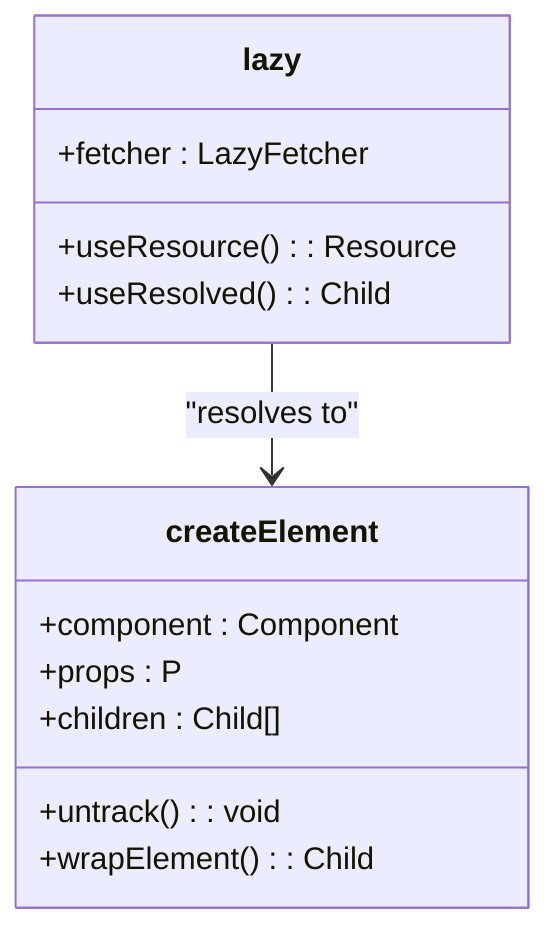
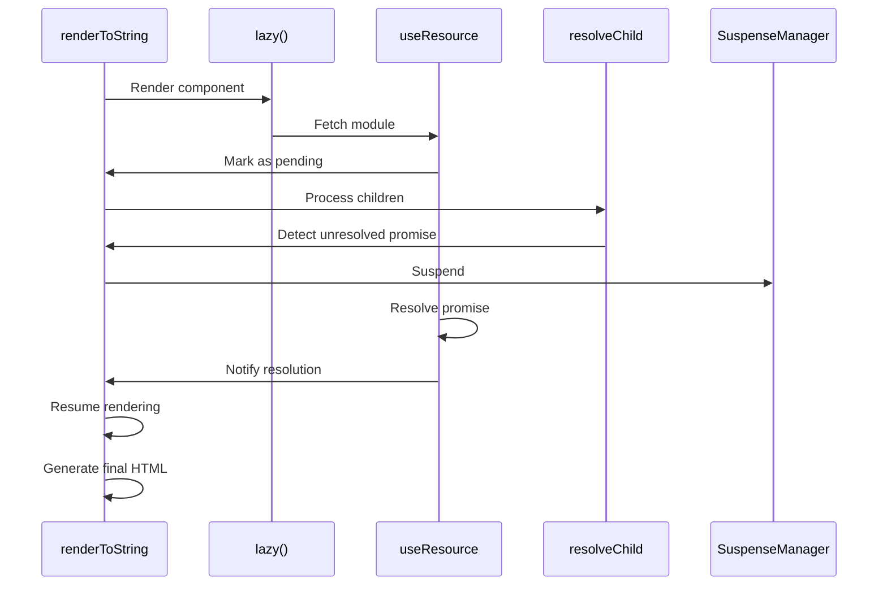
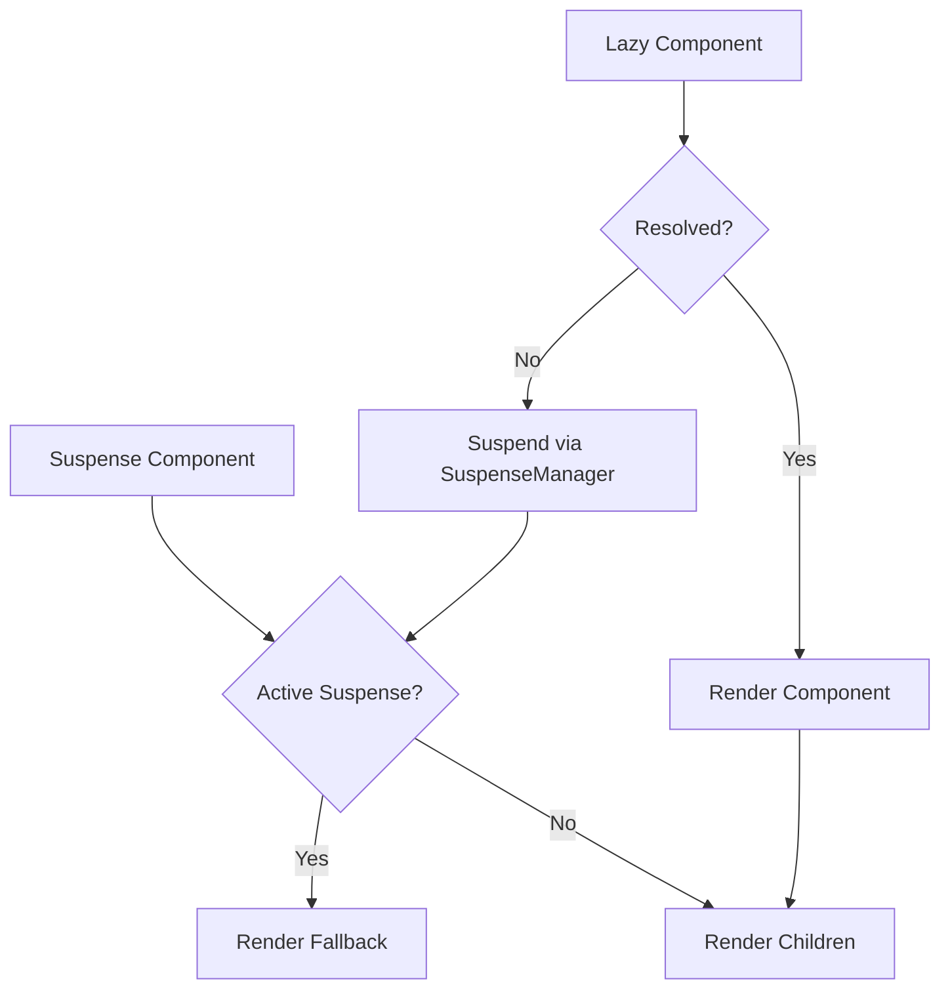
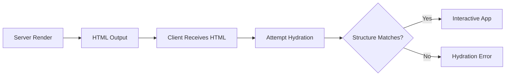

# Server-Side Rendering

<cite>
**Referenced Files in This Document**   
- [lazy.ssr.ts](file://src/methods/lazy.ssr.ts)
- [create_element.ssr.ts](file://src/methods/create_element.ssr.ts)
- [resolvers.ssr.ts](file://src/utils/resolvers.ssr.ts)
- [suspense.context.ts](file://src/components/suspense.context.ts)
- [suspense.manager.ts](file://src/components/suspense.manager.ts)
- [suspense.collector.ts](file://src/components/suspense.collector.ts)
- [render_to_string.ssr.ts](file://src/methods/render_to_string.ssr.ts)
- [jsx-runtime.ssr.tsx](file://src/jsx/jsx-runtime.ssr.tsx)
- [diff.ssr.ts](file://src/utils/diff.ssr.ts)
- [fragment.ssr.ts](file://src/utils/fragment.ssr.ts)
- [use_resource.ts](file://src/hooks/use_resource.ts)
</cite>

## Table of Contents
1. [Introduction](#introduction)
2. [Lazy Function in SSR Context](#lazy-function-in-ssr-context)
3. [Integration with create_element.ssr](#integration-with-create_element.ssr)
4. [Asynchronous Component Resolution During Serialization](#asynchronous-component-resolution-during-serialization)
5. [Differences from Browser Implementation](#differences-from-browser-implementation)
6. [Suspense Boundaries in SSR](#suspense-boundaries-in-ssr)
7. [Best Practices for Chunk Organization](#best-practices-for-chunk-organization)
8. [Critical CSS Extraction](#critical-css-extraction)
9. [Hydration Alignment](#hydration-alignment)
10. [Implementation Examples](#implementation-examples)
11. [Common Pitfalls](#common-pitfalls)
12. [Conclusion](#conclusion)

## Introduction
This document provides a comprehensive analysis of the `lazy()` function within server-side rendering (SSR) contexts in the Woby framework. It details how lazy-loaded components are resolved asynchronously during string serialization, their integration with the SSR rendering pipeline via `create_element.ssr`, and the handling of Suspense boundaries. The document also covers hydration alignment, best practices for code splitting, and common issues such as async waterfalls and hydration mismatches.

**Section sources**
- [lazy.ssr.ts](file://src/methods/lazy.ssr.ts#L10-L58)

## Lazy Function in SSR Context
The `lazy()` function enables dynamic component loading by accepting a fetcher function that returns a promise resolving to a component module. In SSR, this function is implemented in `lazy.ssr.ts` and integrates with Woby’s reactive system to suspend rendering until the component is resolved.

During SSR, the `lazy()` function wraps the asynchronous import in a resource observable using `useResource()`, which tracks pending, error, and resolved states. When the component is not yet loaded, the renderer suspends execution and queues the resolution task.

```mermaid
flowchart TD
Start([lazy() invoked]) --> Fetcher["Fetcher returns Promise<Component>"]
Fetcher --> UseResource["useResource(fetcher) creates resource"]
UseResource --> Pending{"Is resource pending?"}
Pending --> |Yes| Suspend["Suspend rendering via SuspenseManager"]
Pending --> |No| ResolveComponent["Resolve component module"]
ResolveComponent --> CreateElement["Create element with createElement.ssr"]
CreateElement --> Output["Return rendered output"]
Suspend --> ResolveComponent
```

**Diagram sources**
- [lazy.ssr.ts](file://src/methods/lazy.ssr.ts#L10-L58)
- [use_resource.ts](file://src/hooks/use_resource.ts#L10-L105)

**Section sources**
- [lazy.ssr.ts](file://src/methods/lazy.ssr.ts#L10-L58)
- [use_resource.ts](file://src/hooks/use_resource.ts#L10-L105)

## Integration with create_element.ssr
The `lazy()` function relies on `createElement.ssr` to instantiate components once they are resolved. The SSR version of `createElement` handles function components, strings (for DOM elements), and nodes, wrapping them appropriately for non-interactive environments.

When a lazy component resolves, `createElement.ssr` receives the component definition and props, then executes it within an untracked context to prevent reactivity during SSR. This ensures deterministic output during serialization.



**Diagram sources**
- [create_element.ssr.ts](file://src/methods/create_element.ssr.ts#L1-L80)
- [lazy.ssr.ts](file://src/methods/lazy.ssr.ts#L10-L58)

**Section sources**
- [create_element.ssr.ts](file://src/methods/create_element.ssr.ts#L1-L80)

## Asynchronous Component Resolution During Serialization
During SSR, when `renderToString()` processes a component tree containing a `lazy()` component, the system detects unresolved promises and suspends rendering. The `SuspenseManager` tracks active suspensions and prevents premature output.

The `resolveChild` utility in `resolvers.ssr.ts` recursively processes children, detecting observables and functions. If a child is pending (e.g., from a lazy component), it triggers suspension via `useRenderEffect` and `SuspenseManager.suspend()`.

Once all pending resources are resolved, the final HTML string is assembled from the fragment buffer.



**Diagram sources**
- [render_to_string.ssr.ts](file://src/methods/render_to_string.ssr.ts#L1-L42)
- [resolvers.ssr.ts](file://src/utils/resolvers.ssr.ts#L1-L182)
- [suspense.manager.ts](file://src/components/suspense.manager.ts#L1-L67)

**Section sources**
- [render_to_string.ssr.ts](file://src/methods/render_to_string.ssr.ts#L1-L42)
- [resolvers.ssr.ts](file://src/utils/resolvers.ssr.ts#L1-L182)

## Differences from Browser Implementation
While the API surface of `lazy()` remains consistent between SSR and browser environments, the underlying behavior differs significantly:

| Feature | SSR Implementation | Browser Implementation |
|-------|--------------------|------------------------|
| "Promise Handling" | Serialized suspension via SuspenseManager | Immediate resolution with hydration |
| "Reactivity" | Untracked execution to avoid side effects | Fully reactive updates |
| "Resource Cleanup" | Not applicable (stateless) | Disposal via useCleanup |
| "Error Propagation" | Thrown during render phase | Caught by Error Boundaries |
| "Preload Behavior" | Pre-resolves during SSR | Initiates fetch on mount |

The SSR version avoids microtask queuing and instead relies on synchronous suspension tracking to ensure all async dependencies are resolved before output.

**Section sources**
- [lazy.ssr.ts](file://src/methods/lazy.ssr.ts#L10-L58)
- [lazy.ts](file://src/methods/lazy.ts#L11-L59)

## Suspense Boundaries in SSR
Suspense in SSR uses context-based tracking via `SuspenseContext` and `SuspenseCollector`. Each `<Suspense>` boundary creates a new context that tracks whether any child components are still pending.

If a lazy component suspends, `SuspenseManager.change()` increments the suspense counter. The collector aggregates all active suspenses, allowing the renderer to determine when the entire tree is ready.

Fallback content is rendered immediately if the wrapped content is suspended, ensuring non-blank output during async resolution.



**Diagram sources**
- [suspense.ts](file://src/components/suspense.ts#L1-L25)
- [suspense.context.ts](file://src/components/suspense.context.ts#L1-L54)
- [suspense.collector.ts](file://src/components/suspense.collector.ts#L1-L42)

**Section sources**
- [suspense.ts](file://src/components/suspense.ts#L1-L25)
- [suspense.context.ts](file://src/components/suspense.context.ts#L1-L54)

## Best Practices for Chunk Organization
To optimize SSR performance with lazy loading:
- Group related components into shared chunks to reduce HTTP requests
- Avoid deeply nested lazy imports that create waterfall delays
- Use `preload()` strategically in parent components to initiate early fetching
- Co-locate components with similar load timing to minimize round trips

Example:
```ts
const DashboardWidget = lazy(() => import('./widgets/dashboard'))
// Prefer: import('./sections/admin') over multiple small lazy() calls
```

**Section sources**
- [lazy.ssr.ts](file://src/methods/lazy.ssr.ts#L10-L58)

## Critical CSS Extraction
During SSR, critical CSS should be extracted and inlined in the `<head>` to avoid flash-of-unstyled-content (FOUC). Since lazy components may introduce new styles, consider:
- Preloading style assets alongside component chunks
- Using a style registry to collect CSS rules during render
- Deferring non-critical styles to client-side injection

The framework does not currently provide built-in CSS extraction, so external tools or manual registration are required.

**Section sources**
- [render_to_string.ssr.ts](file://src/methods/render_to_string.ssr.ts#L1-L42)

## Hydration Alignment
For successful hydration:
- Ensure the same component resolution order on server and client
- Avoid conditional lazy imports that differ between environments
- Match props and initial state exactly between SSR output and client mount

Mismatched hydration occurs when the client expects a different component structure than what was rendered on the server, often due to race conditions in async resolution.



**Diagram sources**
- [render_to_string.ssr.ts](file://src/methods/render_to_string.ssr.ts#L1-L42)
- [render.ssr.ts](file://src/methods/render.ssr.ts#L1-L27)

**Section sources**
- [render_to_string.ssr.ts](file://src/methods/render_to_string.ssr.ts#L1-L42)
- [render.ssr.ts](file://src/methods/render.ssr.ts#L1-L27)

## Implementation Examples
### Basic Lazy Component
```ts
const AsyncComponent = lazy(() => import('./components/Async'))

const App = () => (
  <Suspense fallback={<Spinner />}>
    <AsyncComponent />
  </Suspense>
)
```

### Preloading Strategy
```ts
const HeavyComponent = lazy(() => import('./heavy'))

const Parent = () => {
  useEffect(() => {
    HeavyComponent.preload()
  }, [])
  return (
    <Suspense fallback="Loading...">
      <HeavyComponent />
    </Suspense>
  )
}
```

**Section sources**
- [lazy.ssr.ts](file://src/methods/lazy.ssr.ts#L10-L58)
- [suspense.ts](file://src/components/suspense.ts#L1-L25)

## Common Pitfalls
### Async Waterfalls
Avoid chaining lazy imports where one depends on another:
```ts
// ❌ Bad: Sequential loading
const A = lazy(() => import('./A'))
const B = lazy(() => import('./B')) // Waits for A
```

### Hydration Mismatches
Ensure identical component trees:
```ts
// ❌ May cause mismatch
const ConditionalLazy = () => Math.random() > 0.5 
  ? <LazyA /> 
  : <LazyB />
```

### Unhandled Suspense
Always wrap lazy components in `<Suspense>`:
```ts
// ❌ Will throw during SSR
<LazyComponent />

// ✅ Correct
<Suspense fallback="Loading..."><LazyComponent /></Suspense>
```

**Section sources**
- [lazy.ssr.ts](file://src/methods/lazy.ssr.ts#L10-L58)
- [suspense.ts](file://src/components/suspense.ts#L1-L25)

## Conclusion
The `lazy()` function in SSR contexts enables efficient code splitting while maintaining seamless user experience through Suspense integration. By leveraging `create_element.ssr` and reactive resource management, Woby ensures proper asynchronous resolution during serialization. Developers must carefully manage chunk organization, hydration alignment, and error boundaries to avoid common pitfalls. With proper implementation, lazy loading enhances performance without sacrificing SSR benefits.