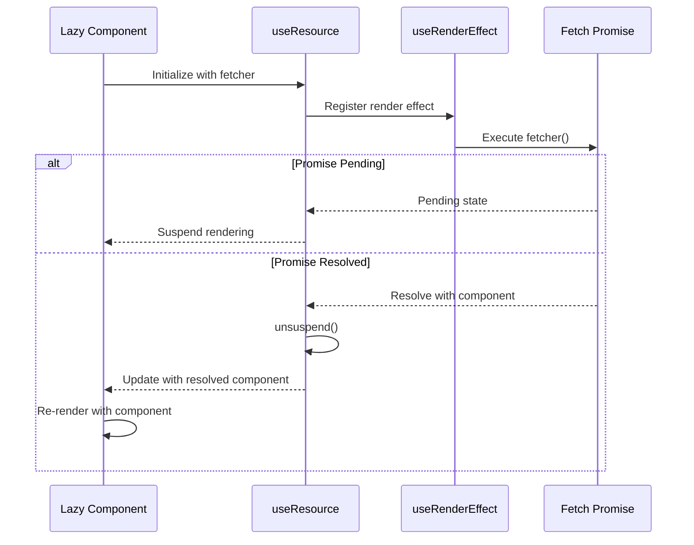
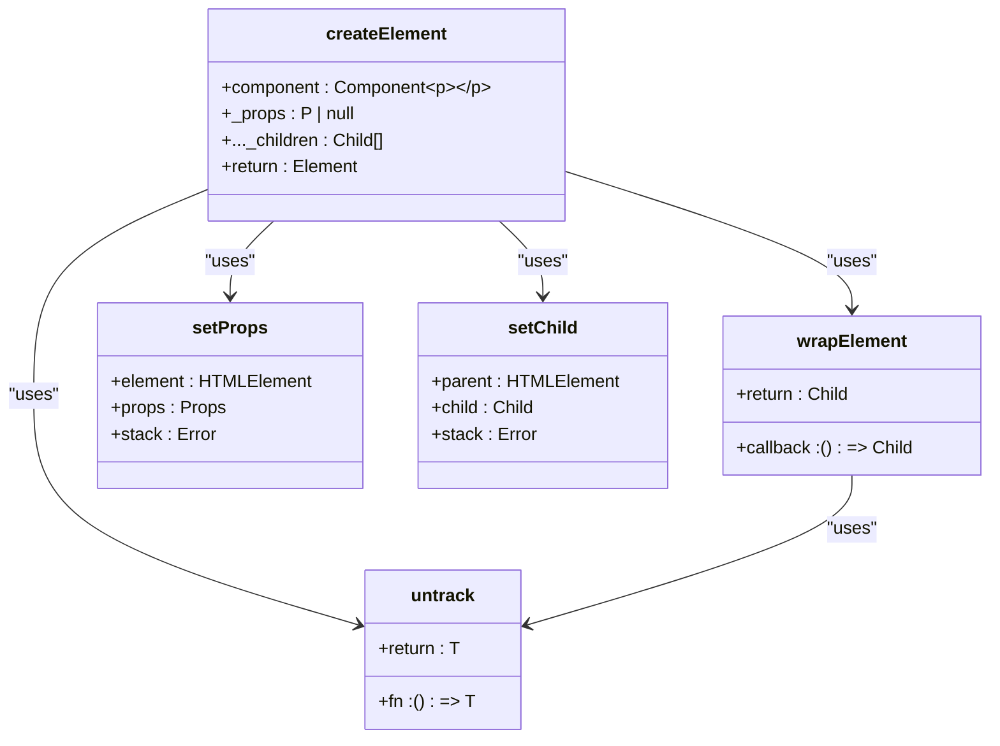
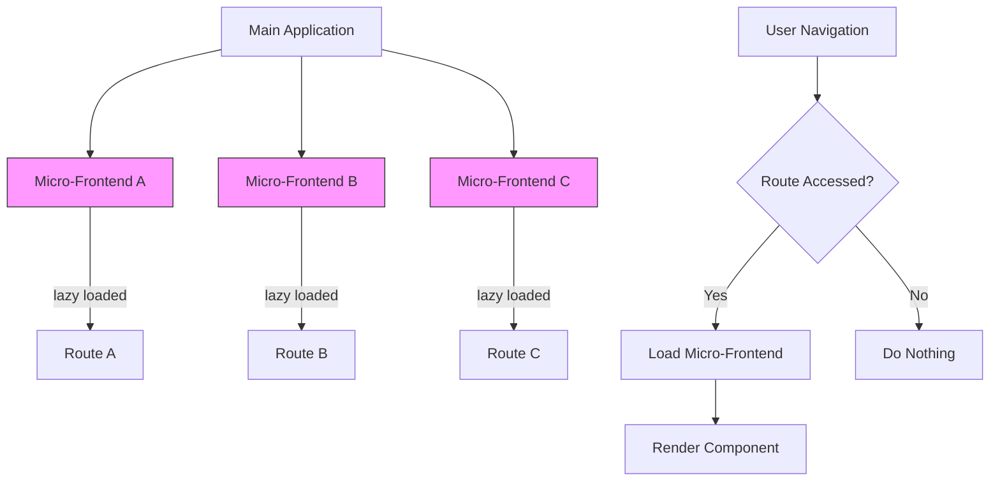

# Via.js Integration

<cite>
**Referenced Files in This Document**   
- [lazy.via.ts](file://src/methods/lazy.via.ts)
- [create_element.via.ts](file://src/methods/create_element.via.ts)
- [via-runtime.ts](file://src/via/via-runtime.ts)
- [use_resource.ts](file://src/hooks/use_resource.ts)
- [use_resolved.ts](file://src/hooks/use_resolved.ts)
- [jsx-runtime.via.tsx](file://src/jsx/jsx-runtime.via.tsx)
- [via.ts](file://src/via.ts)
</cite>

## Table of Contents
1. [Introduction](#introduction)
2. [lazy() Function Implementation](#lazy-function-implementation)
3. [Integration with Via.js Rendering Model](#integration-with-viajs-rendering-model)
4. [Event Loop and Asynchronous Resolution](#event-loop-and-asynchronous-resolution)
5. [create_element.via Integration](#create_elementvia-integration)
6. [Performance Benefits in Micro-Frontend Architectures](#performance-benefits-in-micro-frontend-architectures)
7. [Usage Examples](#usage-examples)
8. [Limitations and Configuration Requirements](#limitations-and-configuration-requirements)
9. [Conclusion](#conclusion)

## Introduction
The `lazy()` function in the Via.js runtime environment enables deferred component loading, optimizing application performance by loading components only when needed. This documentation details the implementation of `lazy()` within the Via.js context, its integration with the rendering model and event loop, and its application in complex architectural scenarios such as micro-frontend systems.

**Section sources**
- [lazy.via.ts](file://src/methods/lazy.via.ts#L10-L58)
- [via.ts](file://src/via.ts#L1-L14)

## lazy() Function Implementation
The `lazy()` function accepts a fetcher function that returns a promise resolving to a component. It wraps the fetcher with `once()` to ensure it executes only once. The returned component function uses `useResource()` to manage the asynchronous loading state and `useResolved()` to handle the resolution of the loaded component. When the resource is resolved, it creates the component element using `createElement()` from the Via.js-specific implementation.

```mermaid
flowchart TD
Start([lazy() called]) --> Fetcher["Fetcher function wrapped with once()"]
Fetcher --> Resource["useResource() manages async state"]
Resource --> Resolved["useResolved() handles resolution"]
Resolved --> Pending{"Pending?"}
Pending --> |Yes| ReturnNull["Return null"]
Pending --> |No| Error{"Error?"}
Error --> |Yes| ThrowError["Throw error"]
Error --> |No| CreateElement["resolve(createElement<P>(component, props))"]
CreateElement --> Output["Return rendered component"]
```

**Diagram sources**
- [lazy.via.ts](file://src/methods/lazy.via.ts#L10-L58)
- [use_resource.ts](file://src/hooks/use_resource.ts#L18-L104)
- [use_resolved.ts](file://src/hooks/use_resolved.ts#L64-L99)

**Section sources**
- [lazy.via.ts](file://src/methods/lazy.via.ts#L10-L58)
- [use_resource.ts](file://src/hooks/use_resource.ts#L18-L104)
- [use_resolved.ts](file://src/hooks/use_resolved.ts#L64-L99)

## Integration with Via.js Rendering Model
The `lazy()` function integrates with Via.js's rendering model through the use of `wrapElement()` and `untrack()` functions. The `createElement` function in Via.js wraps component execution to ensure proper ordering from parent to child. The `untrack()` function prevents unnecessary re-execution of the component function during rendering cycles, optimizing performance.

```mermaid
graph TB
A[Component Render] --> B[wrapElement()]
B --> C[untrack()]
C --> D[Component Execution]
D --> E[Parent to Child Order]
E --> F[Optimized Rendering]
```

**Diagram sources**
- [create_element.via.ts](file://src/methods/create_element.via.ts#L10-L80)
- [jsx-runtime.via.tsx](file://src/jsx/jsx-runtime.via.tsx#L1-L47)

**Section sources**
- [create_element.via.ts](file://src/methods/create_element.via.ts#L10-L80)
- [jsx-runtime.via.tsx](file://src/jsx/jsx-runtime.via.tsx#L1-L47)

## Event Loop and Asynchronous Resolution
The `lazy()` function synchronizes asynchronous resolution with Via.js's event loop through the `useResource()` hook. This hook uses `useRenderEffect()` to initiate the fetch operation during the render phase. The promise resolution is handled with `.then()` callbacks that update the resource state, triggering re-renders when the component is ready. The `unsuspend()` function is called upon resolution or rejection, integrating with Via.js's suspense mechanism.



**Diagram sources**
- [lazy.via.ts](file://src/methods/lazy.via.ts#L10-L58)
- [use_resource.ts](file://src/hooks/use_resource.ts#L18-L104)
- [use_render_effect.ts](file://src/hooks/use_render_effect.ts#L1-L21)

**Section sources**
- [lazy.via.ts](file://src/methods/lazy.via.ts#L10-L58)
- [use_resource.ts](file://src/hooks/use_resource.ts#L18-L104)
- [use_render_effect.ts](file://src/hooks/use_render_effect.ts#L1-L21)

## create_element.via Integration
The `lazy()` function relies on `create_element.via.ts` for proper element creation within the Via.js context. The `createElement` function handles different component types (function, string, node) and integrates with Via.js's symbol system through `IgnoreSymbols`. For SVG elements, it sets special flags to ensure correct rendering. The function uses `wrapElement()` to maintain execution order and `untrack()` to optimize performance.



**Diagram sources**
- [create_element.via.ts](file://src/methods/create_element.via.ts#L10-L80)
- [lazy.via.ts](file://src/methods/lazy.via.ts#L10-L58)

**Section sources**
- [create_element.via.ts](file://src/methods/create_element.via.ts#L10-L80)
- [lazy.via.ts](file://src/methods/lazy.via.ts#L10-L58)

## Performance Benefits in Micro-Frontend Architectures
The `lazy()` function provides significant performance benefits in micro-frontend architectures by enabling independent loading of frontend modules. Each micro-frontend can be loaded on-demand when its routes are accessed, reducing initial bundle size. The integration with Via.js ensures that components from different runtimes can be seamlessly composed, as the rendering model and event loop synchronization maintain consistent behavior across runtime boundaries.



**Diagram sources**
- [lazy.via.ts](file://src/methods/lazy.via.ts#L10-L58)
- [via-runtime.ts](file://src/via/via-runtime.ts#L1-L2)

**Section sources**
- [lazy.via.ts](file://src/methods/lazy.via.ts#L10-L58)
- [via-runtime.ts](file://src/via/via-runtime.ts#L1-L2)

## Usage Examples
The `lazy()` function can be used to load components dynamically in Via.js applications. Common use cases include route-based code splitting and conditional component loading. The `preload()` method allows for proactive loading of components before they are needed, improving perceived performance.

```mermaid
flowchart TD
A[Application Start] --> B{Component Needed?}
B --> |No| C[Do Nothing]
B --> |Yes| D[Call lazy() with fetcher]
D --> E[Component loads asynchronously]
E --> F{Loaded?}
F --> |No| G[Show loading state]
F --> |Yes| H[Render component]
I[Proactive Loading] --> J[Call preload()]
J --> K[Start loading component]
K --> L[Component ready when needed]
```

**Diagram sources**
- [lazy.via.ts](file://src/methods/lazy.via.ts#L10-L58)

**Section sources**
- [lazy.via.ts](file://src/methods/lazy.via.ts#L10-L58)

## Limitations and Configuration Requirements
When using `lazy()` across runtime boundaries, certain limitations and configuration requirements must be considered. The fetcher function must return a component compatible with Via.js's rendering model. Components loaded via `lazy()` cannot be statically analyzed, which may affect tree-shaking. The `IgnoreSymbols` mechanism in Via.js must be properly configured to handle symbols from different runtimes. Additionally, error boundaries should be used to handle potential loading failures gracefully.

**Section sources**
- [lazy.via.ts](file://src/methods/lazy.via.ts#L10-L58)
- [create_element.via.ts](file://src/methods/create_element.via.ts#L10-L80)
- [via.ts](file://src/via.ts#L1-L14)

## Conclusion
The `lazy()` function in Via.js provides a robust mechanism for lazy loading components, integrating seamlessly with the runtime's rendering model and event loop. By leveraging `create_element.via` and Via.js's reactivity system, it ensures proper component creation and synchronization. This functionality is particularly beneficial in micro-frontend architectures, where it enables efficient code splitting and on-demand loading of independent frontend modules. Proper configuration and error handling are essential when using `lazy()` across runtime boundaries to ensure reliable application behavior.