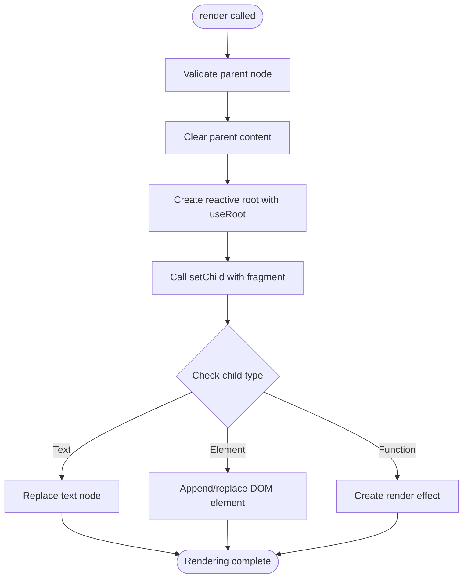

# Browser Rendering

<cite>
**Referenced Files in This Document**   
- [render.ts](file://src/methods/render.ts)
- [soby.ts](file://src/hooks/soby.ts)
- [setters.ts](file://src/utils/setters.ts)
- [fragment.ts](file://src/utils/fragment.ts)
- [types.ts](file://src/types.ts)
</cite>

## Table of Contents
1. [Introduction](#introduction)
2. [Render Function Signature and Parameters](#render-function-signature-and-parameters)
3. [Reactive Root Creation with useRoot](#reactive-root-creation-with-useroot)
4. [DOM Manipulation with setChild](#dom-manipulation-with-setchild)
5. [Disposal Mechanism and Cleanup](#disposal-mechanism-and-cleanup)
6. [Practical Usage Example](#practical-usage-example)
7. [Error Handling for Invalid Nodes](#error-handling-for-invalid-nodes)
8. [Internal Stack Management](#internal-stack-management)
9. [Handling ShadowRoot Containers](#handling-shadowroot-containers)
10. [Common Issues and Solutions](#common-issues-and-solutions)

## Introduction
The Woby framework provides a robust browser rendering system through its `render()` function, which serves as the primary mechanism for mounting components to the DOM. This documentation details the implementation and usage of the rendering system, focusing on the core `render.ts` file and its integration with reactive programming concepts. The system enables efficient DOM updates, proper cleanup of reactive effects, and safe handling of various container types including ShadowRoot.

**Section sources**
- [render.ts](file://src/methods/render.ts#L8-L29)

## Render Function Signature and Parameters
The `render()` function has the following signature: `render(child: Child, parent?: Element | null | ShadowRoot): Disposer`. It accepts two parameters where `child` represents the content to be rendered, which can be any valid JSX child type including elements, strings, numbers, or functions that return children. The `parent` parameter is the DOM container where the content will be mounted, which can be an HTMLElement or ShadowRoot. The function returns a `Disposer` function that can be called to unmount the component and clean up associated resources.

The `Child` type is defined to support a wide range of content types, enabling flexible component composition. This includes primitive values, DOM nodes, arrays of children, and functions that compute children reactively. The optional parent parameter allows for rendering to be deferred or conditionally applied based on the availability of the target container.

**Section sources**
- [render.ts](file://src/methods/render.ts#L8-L29)
- [types.ts](file://src/types.ts#L15-L15)

## Reactive Root Creation with useRoot
The rendering system integrates with Woby's reactivity model through the `useRoot` hook, which creates a reactive root for tracking dependencies and managing effect cleanup. When `render()` is called, it invokes `useRoot` to establish a new reactive context for the mounted component. This root serves as the foundation for tracking all reactive dependencies within the component tree, ensuring that updates are properly propagated and cleaned up.

The `useRoot` hook receives a callback function that contains the rendering logic, along with stack and dispose parameters. The stack parameter provides debugging information about the call context, while the dispose function is used to clean up all reactive effects created within the root when the component is unmounted. This mechanism ensures that no memory leaks occur from abandoned reactive subscriptions.

**Section sources**
- [render.ts](file://src/methods/render.ts#L8-L29)
- [soby.ts](file://src/hooks/soby.ts#L7-L7)

## DOM Manipulation with setChild
The `setChild` utility function handles the actual DOM manipulation required to render content. It takes the parent container, child content, a fragment object, and stack information as parameters. The fragment system, implemented through `FragmentUtils`, efficiently tracks the current state of children in the DOM, enabling optimized updates by minimizing direct DOM operations.

`setChild` delegates to `setChildStatic` which implements various optimization paths based on the nature of the content being rendered. For simple cases like text nodes, it uses direct text replacement. For complex children, it employs a diffing algorithm to determine the minimal set of DOM operations needed. The function also handles reactive children by establishing appropriate effect tracking, ensuring that updates to observable values trigger corresponding DOM updates.



**Diagram sources**
- [render.ts](file://src/methods/render.ts#L8-L29)
- [setters.ts](file://src/utils/setters.ts#L386-L389)
- [fragment.ts](file://src/utils/fragment.ts#L11-L147)

**Section sources**
- [setters.ts](file://src/utils/setters.ts#L386-L389)
- [fragment.ts](file://src/utils/fragment.ts#L11-L147)

## Disposal Mechanism and Cleanup
The disposal mechanism ensures proper cleanup of resources when a component is unmounted. The `render()` function returns a disposer function that, when called, executes the cleanup logic defined in the `useRoot` callback. This cleanup process has two main components: disposing of all reactive effects and clearing the DOM content.

The dispose function provided by `useRoot` recursively cleans up all effects created within the reactive root, preventing memory leaks from abandoned subscriptions. After disposing of effects, the parent container's content is cleared by setting `textContent` to an empty string. This two-step process ensures that both JavaScript references and DOM nodes are properly cleaned up, maintaining application performance and preventing memory bloat.

**Section sources**
- [render.ts](file://src/methods/render.ts#L8-L29)

## Practical Usage Example
To mount a component to a DOM element, first ensure the target container exists in the document. Then call the `render()` function with the component and container as arguments. The function returns a disposer that can be used to unmount the component when needed. For example:

```typescript
const container = document.getElementById('app');
const disposer = render(MyComponent(props), container);

// Later, to unmount:
disposer();
```

This pattern allows for controlled mounting and unmounting of components, making it suitable for dynamic UIs where components are added and removed based on application state. The disposer function can be stored and called at appropriate times, such as during route changes or component lifecycle events.

**Section sources**
- [render.ts](file://src/methods/render.ts#L8-L29)

## Error Handling for Invalid Nodes
The rendering system includes validation to prevent rendering to invalid parent nodes. The function checks whether the provided parent is a valid HTMLElement or ShadowRoot before proceeding with rendering. If the parent is null, undefined, or not an instance of HTMLElement or ShadowRoot, it throws an error with the message "Invalid parent node".

This validation prevents common mistakes such as attempting to render to non-DOM objects or elements that don't exist in the document. The error provides immediate feedback during development, helping developers identify and fix issues with their rendering targets. The check is performed at the beginning of the render function, ensuring that no DOM manipulation occurs with invalid containers.

**Section sources**
- [render.ts](file://src/methods/render.ts#L8-L29)

## Internal Stack Management
The rendering system uses stack traces to track the context of render operations, aiding in debugging and error reporting. When `useRoot` is called, it receives a stack parameter that captures the current call context. This stack information is passed through to `setChild` and other rendering utilities, allowing for detailed error messages that include the call path.

The stack management system helps identify the source of rendering issues by providing context about where in the component tree a problem occurred. This is particularly useful in complex applications with deeply nested components, as it enables developers to trace rendering errors back to their origin. The stack information is also used by the disposal mechanism to ensure that effects are cleaned up in the correct context.

**Section sources**
- [render.ts](file://src/methods/render.ts#L8-L29)
- [setters.ts](file://src/utils/setters.ts#L386-L389)

## Handling ShadowRoot Containers
The rendering system fully supports ShadowRoot containers, enabling integration with Web Components and encapsulated styling. Unlike some rendering systems that restrict rendering to regular DOM elements, Woby's `render()` function explicitly allows ShadowRoot as a valid parent type. This enables components to be mounted within shadow DOM trees, preserving style encapsulation and DOM boundaries.

When rendering to a ShadowRoot, the same cleanup and reactivity mechanisms apply. The disposal function will properly clean up effects and clear the shadow root's content. This support for ShadowRoot makes Woby components suitable for use within custom elements and other shadow DOM-based architectures, providing flexibility in component design and integration.

**Section sources**
- [render.ts](file://src/methods/render.ts#L8-L29)

## Common Issues and Solutions
Common issues in the rendering system include double rendering, memory leaks, and improper cleanup. Double rendering can occur when the render function is called multiple times with the same container, which can be prevented by ensuring components are mounted only once or by disposing of previous renderings. Memory leaks are mitigated by the comprehensive disposal mechanism that cleans up all reactive effects.

For ShadowRoot containers, ensure that the shadow root is properly initialized before rendering. When dealing with dynamic content, use the disposer function to clean up previous renderings before mounting new content. To prevent memory leaks, always call the disposer function when a component is no longer needed, such as during route changes or conditional rendering scenarios.

**Section sources**
- [render.ts](file://src/methods/render.ts#L8-L29)
- [setters.ts](file://src/utils/setters.ts#L386-L389)