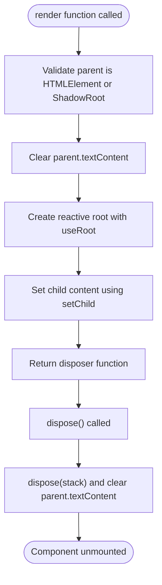
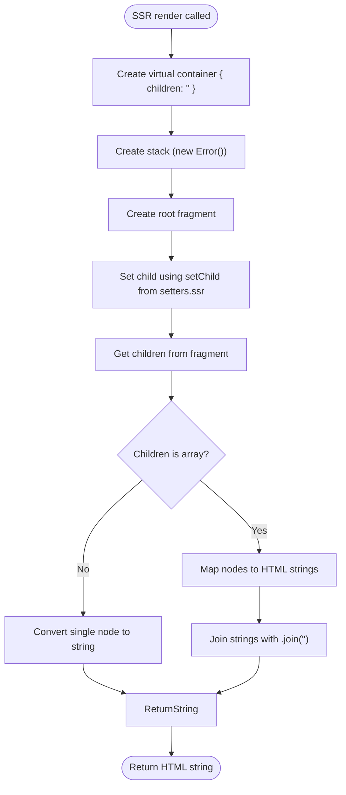
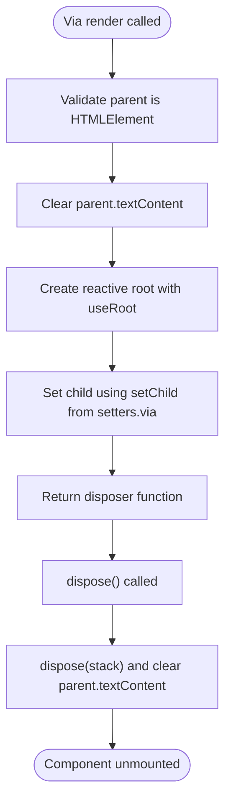
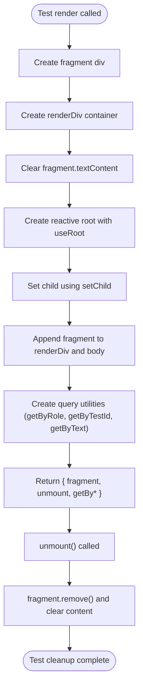
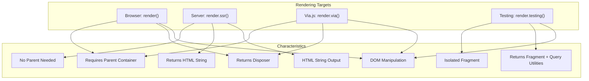
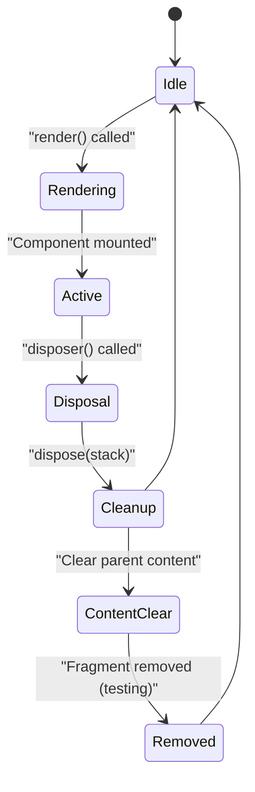

# Rendering Methods

<cite>
**Referenced Files in This Document**   
- [render.ts](file://src/methods/render.ts)
- [render.ssr.ts](file://src/methods/render.ssr.ts)
- [render.via.ts](file://src/methods/render.via.ts)
- [render.testing.ts](file://src/methods/render.testing.ts)
- [setters.ts](file://src/utils/setters.ts)
- [setters.ssr.ts](file://src/utils/setters.ssr.ts)
- [setters.via.ts](file://src/utils/setters.via.ts)
- [fragment.ts](file://src/utils/fragment.ts)
- [fragment.ssr.ts](file://src/utils/fragment.ssr.ts)
- [types.ts](file://src/types.ts)
</cite>

## Table of Contents
1. [Introduction](#introduction)
2. [Browser Rendering with render()](#browser-rendering-with-render)
3. [Server-Side Rendering with render.ssr.ts](#server-side-rendering-with-renderssrts)
4. [Via.js Integration with render.via.ts](#viajs-integration-with-renderviats)
5. [Testing with render.testing.ts](#testing-with-rendertestingts)
6. [Rendering Targets Comparison](#rendering-targets-comparison)
7. [Lifecycle Management and Disposal](#lifecycle-management-and-disposal)
8. [Practical Examples](#practical-examples)
9. [Conclusion](#conclusion)

## Introduction
Woby provides multiple rendering methods tailored for different execution environments and use cases. This documentation details the various render functions available in the Woby framework, including browser rendering, server-side rendering, Via.js integration, and testing utilities. Each implementation is designed to handle specific requirements while maintaining consistent API patterns for component rendering and lifecycle management.

## Browser Rendering with render()
The primary rendering method for browser environments is implemented in `render.ts`. This function mounts components to DOM elements and manages their lifecycle.

The `render()` function signature is:
```typescript
export const render = (child: Child, parent?: Element | null | ShadowRoot): Disposer
```

**Parameters:**
- `child`: The component or content to render (of type `Child`)
- `parent`: Optional parent container (Element, ShadowRoot, or null)

**Return Value:**
- `Disposer`: A cleanup function that unmounts the component and releases resources

The function validates that the parent is a valid HTMLElement or ShadowRoot before proceeding. It clears the parent's content and uses `useRoot` to establish a reactive root for the component tree. The disposal mechanism ensures proper cleanup by calling the dispose function and clearing the parent's content when unmounting.



**Section sources**
- [render.ts](file://src/methods/render.ts#L8-L29)
- [types.ts](file://src/types.ts#L15)
- [types.ts](file://src/types.ts#L57)

## Server-Side Rendering with render.ssr.ts
The server-side rendering implementation in `render.ssr.ts` generates HTML strings for SSR scenarios without DOM manipulation.

The SSR `render()` function signature is:
```typescript
export const render = (child: Child): string
```

**Parameters:**
- `child`: The component or content to render (of type `Child`)

**Return Value:**
- `string`: HTML string representation of the rendered content

Unlike the browser version, this implementation doesn't require a parent container since it generates string output. It creates a virtual container object and uses SSR-specific utilities like `FragmentUtils` and `setChild` from the SSR module. The function captures the rendered content and converts it to a string, handling both single nodes and arrays of nodes.

The SSR rendering process:
1. Creates a container object with a children property
2. Creates an error object as a stack reference
3. Creates a fragment for the root content
4. Sets the child content using SSR-specific setter
5. Extracts the rendered content from the fragment
6. Converts the content to string format



**Section sources**
- [render.ssr.ts](file://src/methods/render.ssr.ts#L7-L25)
- [setters.ssr.ts](file://src/utils/setters.ssr.ts#L356-L360)
- [fragment.ssr.ts](file://src/utils/fragment.ssr.ts#L8-L144)

## Via.js Integration with render.via.ts
The Via.js rendering implementation in `render.via.ts` provides a specialized rendering pipeline for the Via.js environment.

The Via.js `render()` function signature is:
```typescript
export const render = (child: Child, parent?: Element | null): Disposer
```

**Parameters:**
- `child`: The component or content to render (of type `Child`)
- `parent`: Optional parent container (Element or null)

**Return Value:**
- `Disposer`: A cleanup function for component disposal

Key differences from the standard browser rendering:
- Only accepts HTMLElement as parent (excludes ShadowRoot)
- Uses Via.js-specific setter utilities
- Simplified parameter structure for the `setChild` function

The Via.js implementation follows a similar pattern to the browser version but with environment-specific optimizations. It validates the parent element, clears its content, establishes a reactive root, and returns a disposer function for cleanup.



**Section sources**
- [render.via.ts](file://src/methods/render.via.ts#L4-L24)
- [setters.via.ts](file://src/utils/setters.via.ts#L127-L129)

## Testing with render.testing.ts
The testing implementation in `render.testing.ts` provides utilities for isolated component evaluation in test environments.

The testing `render()` function signature is:
```typescript
export const render = (child: JSX.Child)
```

**Parameters:**
- `child`: The component or content to render (of type `JSX.Child`)

**Return Value:**
- Object containing:
  - `fragment`: The rendered DOM fragment
  - `unmount`: Function to unmount the component
  - `getByRole`: Query utility for elements by role
  - `getByTestId`: Query utility for elements by test ID
  - `getByText`: Query utility for elements by text content

This implementation creates an isolated environment for testing components:
1. Creates a div element as a fragment container
2. Establishes a reactive root for the component
3. Appends the rendered content to the document body for visibility
4. Provides query utilities for testing interactions
5. Returns cleanup functions for proper test isolation

The disposal mechanism removes the fragment from the DOM and clears its content, ensuring test isolation.



**Section sources**
- [render.testing.ts](file://src/methods/render.testing.ts#L8-L80)

## Rendering Targets Comparison
Woby's rendering methods are designed for different execution contexts, each with specific characteristics and use cases.

### Target Environments
| Implementation | Environment | Output Type | Parent Requirements |
|----------------|-------------|-------------|-------------------|
| `render()` | Browser | DOM manipulation | HTMLElement or ShadowRoot |
| `render.ssr()` | Server | HTML string | None (string output) |
| `render.via()` | Via.js | DOM manipulation | HTMLElement only |
| `render.testing()` | Test | DOM + utilities | Isolated fragment |

### Key Differences
**Parameter Requirements:**
- Browser `render()`: Supports both HTMLElement and ShadowRoot
- Via.js `render()`: Only supports HTMLElement
- SSR `render()`: No parent parameter needed
- Testing `render()`: Creates isolated fragment

**Return Values:**
- Browser/Via.js: Return `Disposer` function for cleanup
- SSR: Returns HTML string
- Testing: Returns object with fragment and query utilities

**Memory Management:**
All implementations include proper disposal mechanisms, but the cleanup process varies:
- Browser/Via.js: Clear parent content and call dispose
- SSR: No DOM cleanup needed (string output)
- Testing: Remove fragment from DOM and clear content



**Section sources**
- [render.ts](file://src/methods/render.ts#L8-L29)
- [render.ssr.ts](file://src/methods/render.ssr.ts#L7-L25)
- [render.via.ts](file://src/methods/render.via.ts#L4-L24)
- [render.testing.ts](file://src/methods/render.testing.ts#L8-L80)

## Lifecycle Management and Disposal
All Woby rendering implementations include robust lifecycle management and memory cleanup mechanisms.

### Common Disposal Pattern
The disposal mechanism follows a consistent pattern across implementations:
1. Call the dispose function with the stack reference
2. Clear the parent container's content
3. Remove references to prevent memory leaks

For the testing implementation, additional cleanup includes removing the fragment from the DOM.

### Memory Management
Each rendering method handles memory management appropriately for its environment:
- **Browser/Via.js**: The `useRoot` hook manages the reactive context, and the disposer function ensures proper cleanup of subscriptions and DOM references.
- **SSR**: Since it generates string output without DOM manipulation, memory management is handled by the JavaScript runtime's garbage collection.
- **Testing**: The implementation ensures complete isolation by removing the test fragment from the DOM and clearing all references.

### Error Handling
All implementations include validation for the parent container (where applicable) and throw descriptive errors for invalid inputs. The browser and Via.js implementations verify that the parent is a valid HTMLElement before proceeding with rendering.



**Section sources**
- [render.ts](file://src/methods/render.ts#L8-L29)
- [render.via.ts](file://src/methods/render.via.ts#L4-L24)
- [render.testing.ts](file://src/methods/render.testing.ts#L8-L80)

## Practical Examples
This section provides practical examples demonstrating the usage of Woby's rendering methods in different scenarios.

### DOM Mounting Example
```typescript
import { render } from 'woby'

// Mount component to DOM element
const disposer = render(
  <MyComponent />,
  document.getElementById('app')
)

// Later, clean up the component
disposer()
```

### Server-Side Rendering Example
```typescript
import { render } from 'woby/ssr'

// Generate HTML string for SSR
const htmlString = render(<MyComponent />)
// Send htmlString in HTTP response
```

### Via.js Rendering Example
```typescript
import { render } from 'woby/via'

// Render in Via.js environment
const disposer = render(
  <MyComponent />,
  document.getElementById('container')
)

// Clean up when needed
disposer()
```

### Testing Example
```typescript
import { render } from 'woby/testing'

// Render component for testing
const { fragment, unmount, getByTestId, getByText } = render(
  <MyComponent />
)

// Query elements
const button = getByTestId('submit-button')
const heading = getByText('Welcome')

// Interact with component
button.click()

// Clean up after test
unmount()
```

These examples demonstrate the consistent API patterns across different rendering targets while highlighting the specific usage patterns for each environment.

**Section sources**
- [render.ts](file://src/methods/render.ts#L8-L29)
- [render.ssr.ts](file://src/methods/render.ssr.ts#L7-L25)
- [render.via.ts](file://src/methods/render.via.ts#L4-L24)
- [render.testing.ts](file://src/methods/render.testing.ts#L8-L80)

## Conclusion
Woby's rendering methods provide a comprehensive solution for component rendering across different environments. The framework offers specialized implementations for browser, server-side, Via.js, and testing scenarios, each optimized for its specific use case while maintaining consistent API patterns.

Key takeaways:
- The browser `render()` function provides full DOM manipulation capabilities with proper disposal
- The SSR implementation generates HTML strings without DOM dependencies
- The Via.js version offers optimized rendering for the Via.js environment
- The testing utilities provide isolated component evaluation with query capabilities

All implementations include robust lifecycle management and memory cleanup mechanisms, ensuring proper resource management and preventing memory leaks. The consistent API design allows developers to switch between different rendering targets with minimal code changes, making Woby a flexible solution for various application architectures.

**Section sources**
- [render.ts](file://src/methods/render.ts#L8-L29)
- [render.ssr.ts](file://src/methods/render.ssr.ts#L7-L25)
- [render.via.ts](file://src/methods/render.via.ts#L4-L24)
- [render.testing.ts](file://src/methods/render.testing.ts#L8-L80)