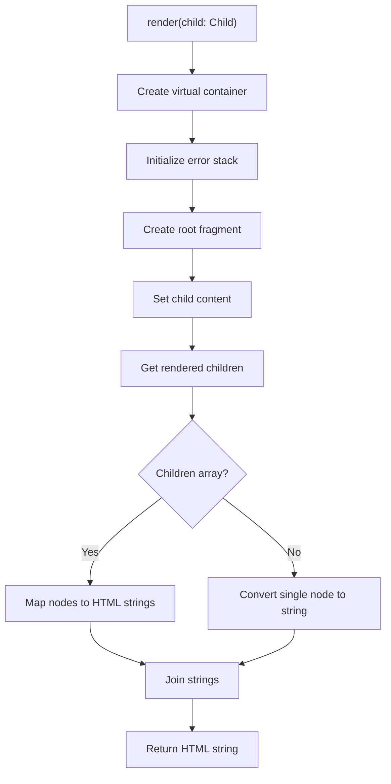
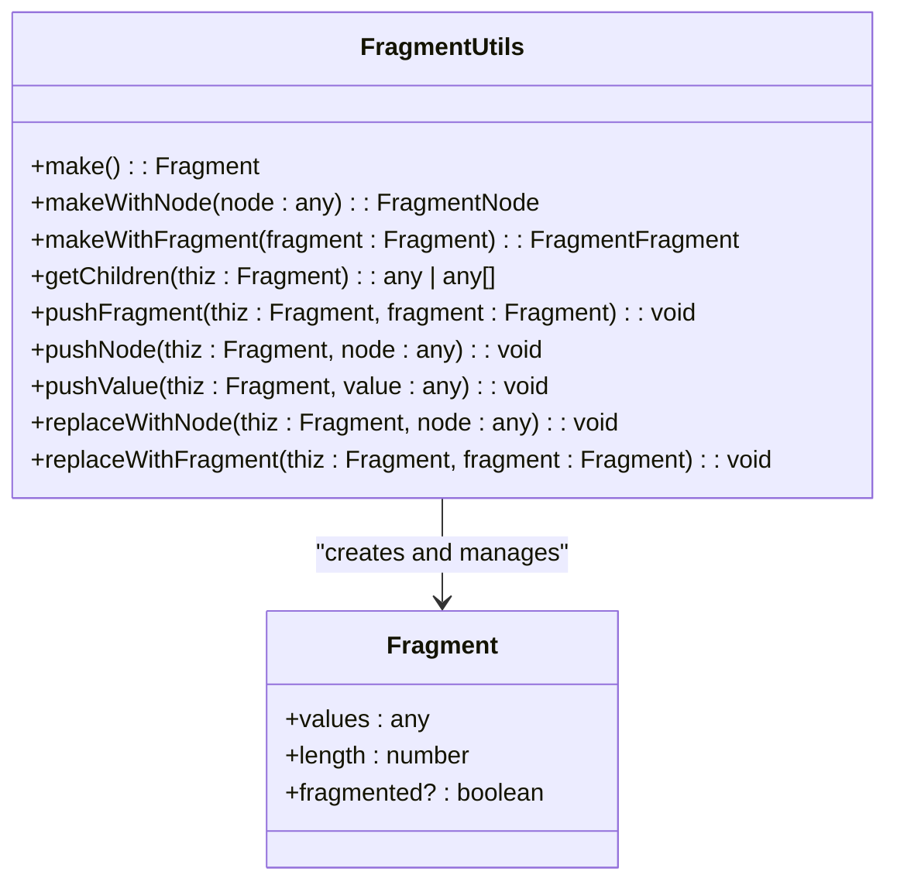
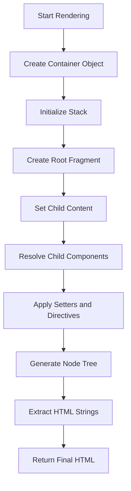
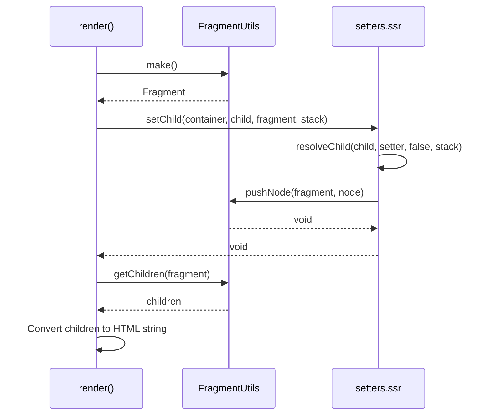
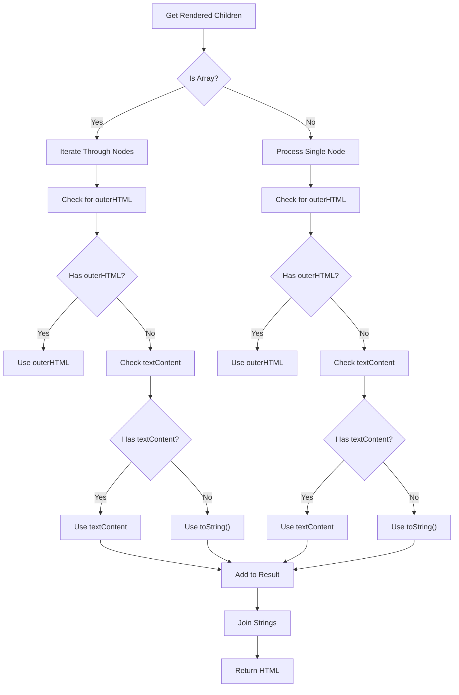
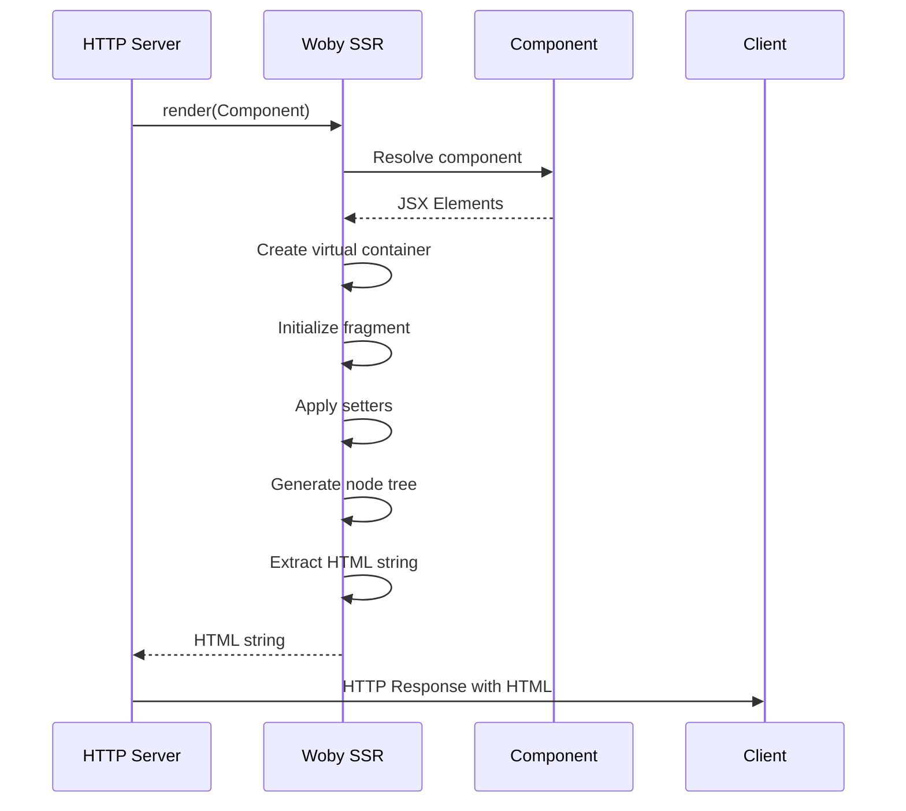
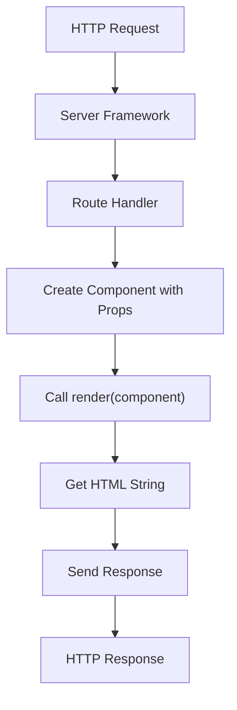
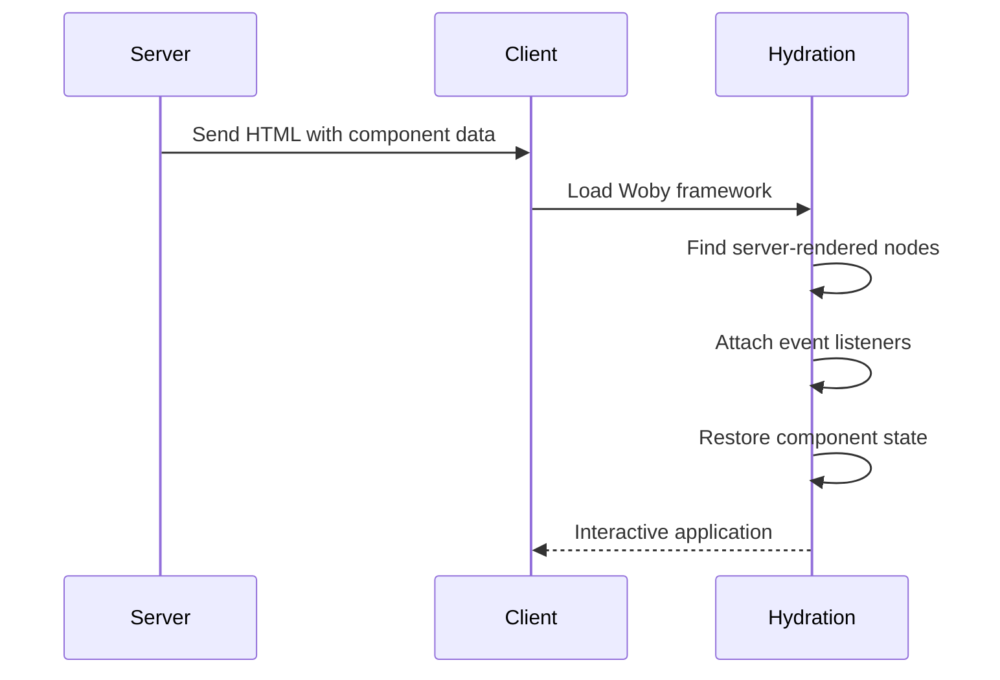
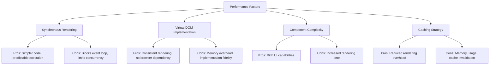
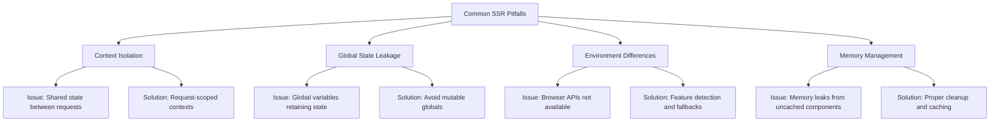

# Server-Side Rendering

<cite>
**Referenced Files in This Document**   
- [render.ssr.ts](file://src/methods/render.ssr.ts)
- [fragment.ssr.ts](file://src/utils/fragment.ssr.ts)
- [setters.ssr.ts](file://src/utils/setters.ssr.ts)
- [creators.ssr.ts](file://src/utils/creators.ssr.ts)
- [resolvers.ssr.ts](file://src/utils/resolvers.ssr.ts)
- [render_to_string.ssr.ts](file://src/methods/render_to_string.ssr.ts)
</cite>

## Table of Contents
1. [Introduction](#introduction)
2. [SSR Rendering Method Overview](#ssr-rendering-method-overview)
3. [Virtual Container and Fragment Management](#virtual-container-and-fragment-management)
4. [String-Based Output Generation](#string-based-output-generation)
5. [FragmentUtils and Render Tree Construction](#fragmentutils-and-render-tree-construction)
6. [Node Conversion and HTML String Extraction](#node-conversion-and-html-string-extraction)
7. [Server-Side Rendering Example](#server-side-rendering-example)
8. [Integration with Server Frameworks](#integration-with-server-frameworks)
9. [Hydration Considerations](#hydration-considerations)
10. [Performance Implications](#performance-implications)
11. [Common SSR Pitfalls](#common-ssr-pitfalls)

## Introduction
Woby's server-side rendering (SSR) implementation provides a robust mechanism for rendering components on the server using a virtual DOM environment. The framework leverages happy-dom or similar DOM implementations to create a browser-like environment in Node.js, enabling consistent rendering behavior between server and client. This documentation details the inner workings of Woby's SSR rendering method, focusing on the `render()` function in `render.ssr.ts` and its supporting utilities.

## SSR Rendering Method Overview

The SSR rendering process in Woby is centered around the `render()` function, which operates in a Node.js environment to generate HTML strings from components. The function creates a virtual container object and uses FragmentUtils to construct the render tree, ultimately converting the rendered children into HTML strings for server responses.

**Diagram sources**
- [render.ssr.ts](file://src/methods/render.ssr.ts#L7-L25)

**Section sources**
- [render.ssr.ts](file://src/methods/render.ssr.ts#L7-L25)

## Virtual Container and Fragment Management

Woby's SSR implementation creates a virtual container object to serve as the rendering target in the server environment. This container is a plain JavaScript object with a children property, simulating a DOM element without requiring an actual browser environment.

The rendering process utilizes fragments to manage component trees efficiently. A fragment is created as the root container for the render tree, allowing for the composition of multiple child elements without introducing additional DOM nodes.

**Diagram sources**
- [fragment.ssr.ts](file://src/utils/fragment.ssr.ts#L8-L144)

**Section sources**
- [fragment.ssr.ts](file://src/utils/fragment.ssr.ts#L8-L144)
- [render.ssr.ts](file://src/methods/render.ssr.ts#L7-L25)

## String-Based Output Generation

The SSR rendering method generates string-based output by traversing the rendered component tree and extracting HTML representations of each node. The process begins with creating a container object and an error stack, which serves as a lightweight context for tracking the rendering operation.

The core of string generation lies in the conversion of rendered children to HTML strings. When the render tree is complete, the children are extracted from the fragment and converted to their string representations using outerHTML or textContent properties.

**Diagram sources**
- [render.ssr.ts](file://src/methods/render.ssr.ts#L7-L25)
- [setters.ssr.ts](file://src/utils/setters.ssr.ts#L356-L360)

**Section sources**
- [render.ssr.ts](file://src/methods/render.ssr.ts#L7-L25)
- [setters.ssr.ts](file://src/utils/setters.ssr.ts#L356-L360)

## FragmentUtils and Render Tree Construction

FragmentUtils is a utility class that plays a crucial role in constructing the render tree during SSR. It provides methods for creating and manipulating fragments, which serve as containers for DOM nodes and other fragments in the render tree.

The FragmentUtils.make() method creates a new fragment with initialized values and length properties. Fragments can contain single nodes, arrays of nodes, or other fragments, allowing for flexible tree structures. The utility provides methods to push nodes and fragments into existing fragments, as well as to retrieve children from fragments in various formats.

**Diagram sources**
- [fragment.ssr.ts](file://src/utils/fragment.ssr.ts#L8-L144)
- [setters.ssr.ts](file://src/utils/setters.ssr.ts#L356-L360)
- [render.ssr.ts](file://src/methods/render.ssr.ts#L7-L25)

**Section sources**
- [fragment.ssr.ts](file://src/utils/fragment.ssr.ts#L8-L144)
- [setters.ssr.ts](file://src/utils/setters.ssr.ts#L356-L360)

## Node Conversion and HTML String Extraction

The process of converting rendered children into HTML strings involves handling both individual nodes and arrays of nodes. When the render tree is complete, the children are extracted from the fragment using FragmentUtils.getChildren().

For arrays of nodes, each node is processed to extract its HTML representation. The system checks for outerHTML property first, which provides the complete HTML markup including tags. If outerHTML is not available, it falls back to textContent for text nodes, or uses toString() as a final fallback.

**Diagram sources**
- [render.ssr.ts](file://src/methods/render.ssr.ts#L7-L25)
- [render_to_string.ssr.ts](file://src/methods/render_to_string.ssr.ts#L7-L41)

**Section sources**
- [render.ssr.ts](file://src/methods/render.ssr.ts#L7-L25)
- [render_to_string.ssr.ts](file://src/methods/render_to_string.ssr.ts#L7-L41)

## Server-Side Rendering Example

A typical server-side rendering implementation using Woby involves creating a component and rendering it to an HTML string for inclusion in an HTTP response. The process is synchronous, making it suitable for server environments where blocking operations are acceptable.

**Diagram sources**
- [render.ssr.ts](file://src/methods/render.ssr.ts#L7-L25)
- [setters.ssr.ts](file://src/utils/setters.ssr.ts#L356-L360)

**Section sources**
- [render.ssr.ts](file://src/methods/render.ssr.ts#L7-L25)

## Integration with Server Frameworks

Woby's SSR capabilities can be integrated with various server frameworks such as Express, Fastify, or custom HTTP servers. The synchronous nature of the rendering process makes it straightforward to incorporate into request handlers, where the rendered HTML string can be directly sent as a response.

The integration typically involves importing the render function and using it within route handlers to generate HTML for specific components based on request parameters or application state.

**Diagram sources**
- [render.ssr.ts](file://src/methods/render.ssr.ts#L7-L25)

**Section sources**
- [render.ssr.ts](file://src/methods/render.ssr.ts#L7-L25)

## Hydration Considerations

When using SSR with Woby, hydration is the process of attaching event listeners and making the server-rendered HTML interactive on the client side. The framework must ensure that the client-side component tree matches the server-rendered HTML to enable seamless hydration.

Key considerations include maintaining consistent component state between server and client, ensuring event handlers are properly attached, and managing any differences in environment-specific code execution.

**Diagram sources**
- [render.ssr.ts](file://src/methods/render.ssr.ts#L7-L25)

**Section sources**
- [render.ssr.ts](file://src/methods/render.ssr.ts#L7-L25)

## Performance Implications

The synchronous rendering approach used by Woby's SSR implementation has several performance implications. On the positive side, it simplifies the rendering logic and avoids the complexity of asynchronous operations. However, it can block the event loop during rendering, potentially affecting server throughput.

Performance optimization strategies include component memoization, selective server rendering of critical content, and implementing caching mechanisms for frequently rendered components.

**Diagram sources**
- [render.ssr.ts](file://src/methods/render.ssr.ts#L7-L25)
- [creators.ssr.ts](file://src/utils/creators.ssr.ts#L8-L18)

**Section sources**
- [render.ssr.ts](file://src/methods/render.ssr.ts#L7-L25)
- [creators.ssr.ts](file://src/utils/creators.ssr.ts#L8-L18)

## Common SSR Pitfalls

Several common pitfalls can occur when implementing SSR with Woby. Context isolation is crucial to prevent state leakage between requests, as shared state can lead to security vulnerabilities and inconsistent rendering results.

Global state leakage is another significant concern, where mutable global variables can retain state from previous requests, causing unexpected behavior. Proper request-scoped state management and avoiding global mutable state are essential for reliable SSR.

**Diagram sources**
- [render.ssr.ts](file://src/methods/render.ssr.ts#L7-L25)
- [resolvers.ssr.ts](file://src/utils/resolvers.ssr.ts#L7-L182)

**Section sources**
- [render.ssr.ts](file://src/methods/render.ssr.ts#L7-L25)
- [resolvers.ssr.ts](file://src/utils/resolvers.ssr.ts#L7-L182)