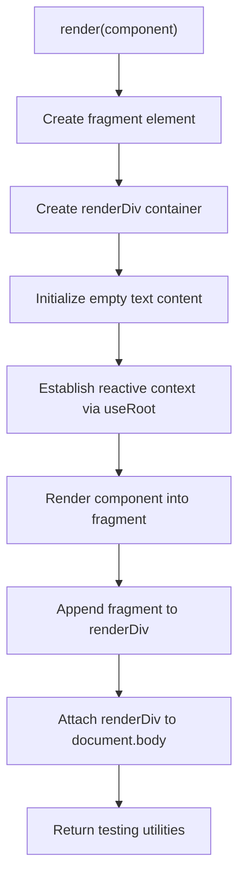
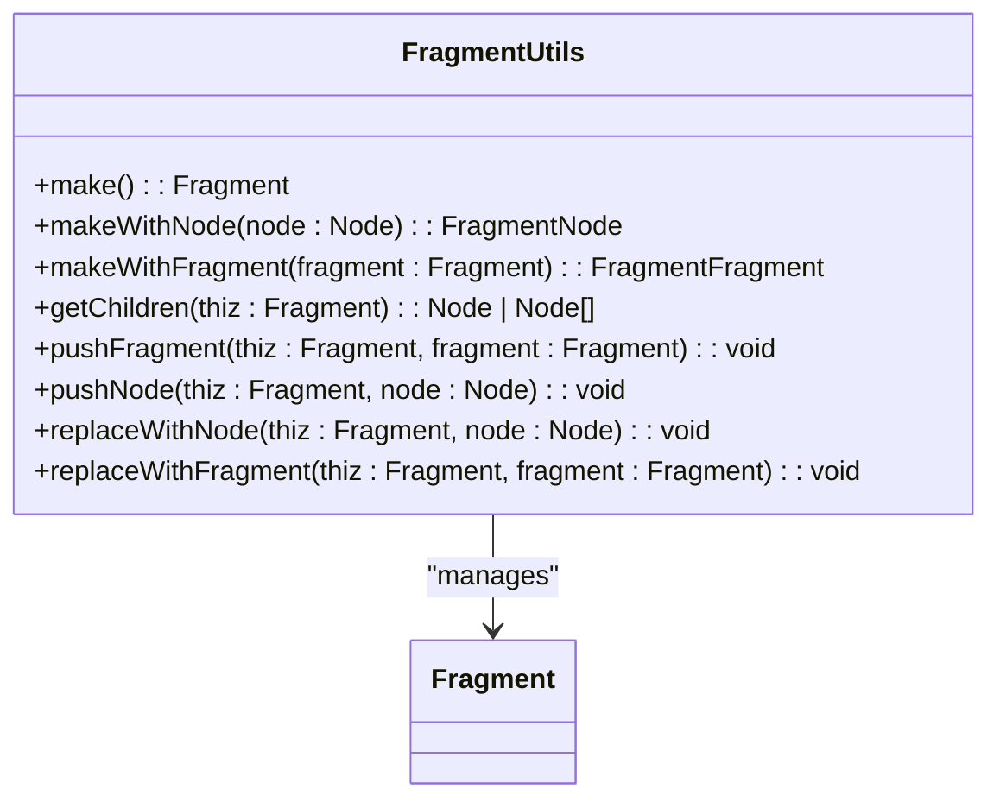
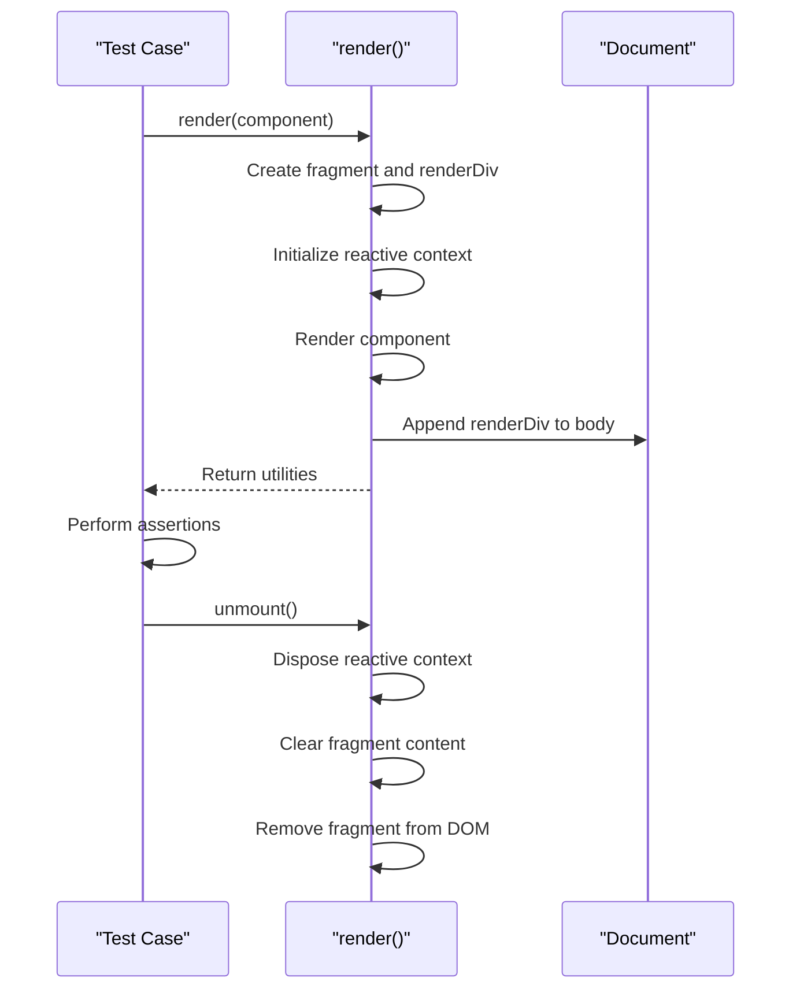

# Testing Rendering

<cite>
**Referenced Files in This Document**   
- [render.testing.ts](file://src/methods/render.testing.ts)
- [types.ts](file://src/types.ts)
- [fragment.ts](file://src/utils/fragment.ts)
- [setters.ts](file://src/utils/setters.ts)
- [soby.ts](file://src/hooks/soby.ts)
- [jsx/types.ts](file://src/jsx/types.ts)
</cite>

## Table of Contents
1. [Introduction](#introduction)
2. [Core Functionality](#core-functionality)
3. [Testing Utilities](#testing-utilities)
4. [Internal Implementation](#internal-implementation)
5. [Usage Examples](#usage-examples)
6. [Integration with Testing Frameworks](#integration-with-testing-frameworks)
7. [Best Practices](#best-practices)
8. [Conclusion](#conclusion)

## Introduction

The Woby testing renderer provides a comprehensive solution for unit testing components in an isolated DOM environment. The `render` function creates a controlled testing context that enables developers to verify component output, test event handling, and validate state changes in a predictable manner. This documentation explains the architecture, functionality, and best practices for using the testing renderer effectively.

**Section sources**
- [render.testing.ts](file://src/methods/render.testing.ts)

## Core Functionality

The `render` function creates an isolated DOM environment for testing components by establishing a temporary rendering context within the document body. When invoked with a component or JSX element, it generates two container elements: a fragment for holding the rendered component and a renderDiv for managing attachment to the DOM. The function leverages Woby's reactivity system through the `useRoot` hook to establish a reactive context for the component being tested.

The rendering process begins by creating a clean fragment element with empty text content, ensuring no residual state affects the test. The component is then rendered into this fragment using the `setChild` utility, which handles the DOM manipulation and reactivity setup. The rendered fragment is appended to the renderDiv, which is subsequently attached to the document body, making the component accessible for testing while maintaining isolation from other tests.



**Diagram sources **
- [render.testing.ts](file://src/methods/render.testing.ts#L8-L80)

**Section sources**
- [render.testing.ts](file://src/methods/render.testing.ts#L8-L80)

## Testing Utilities

The `render` function returns several utilities for querying and interacting with the rendered component. These utilities provide convenient methods for locating elements and verifying component behavior.

### getByRole

The `getByRole` utility allows querying elements by their HTML tag name. It uses TypeScript generics to provide type-safe access to elements based on the specified tag, returning the appropriate DOM interface for the queried element type.

```typescript
const getByRole = <K extends keyof IntrinsicElementsMap>(tag: K) => fragment.querySelector(tag) as any as IntrinsicElementsMap[K]
```

**Section sources**
- [render.testing.ts](file://src/methods/render.testing.ts#L43-L43)

### getByTestId

The `getByTestId` utility locates elements using the `data-testid` attribute, a common pattern in component testing. It searches for elements with the specified test ID and throws an error if no matching element is found, ensuring tests fail fast when expected elements are missing.

```typescript
const getByTestId = <T extends HTMLElement = HTMLElement>(id: string) => {
    if (fragment.querySelector(`[data-testid="${id}"]`) as T) {
        return fragment.querySelector(`[data-testid="${id}"]`) as T
    }
    else {
        throw new Error("Element test ID not found ")
    }
}
```

**Section sources**
- [render.testing.ts](file://src/methods/render.testing.ts#L44-L52)

### getByText

The `getByText` utility searches for elements containing specific text content, supporting both string and regular expression matching. It recursively traverses the DOM tree to find matching elements, throwing an error if no element is found.

```typescript
const getByText = <T extends HTMLElement = HTMLElement>(text: string | RegExp) => {
    function allDescendants(node) {
        for (var i = 0; i < node.children.length; i++) {
            var child = node.children[i]
            if (typeof text === "string") {
                if (child.textContent == text) {
                    return child as T
                }
            }
            else {
                if (text.test(child.textContent)) {
                    return child as T
                }
            }
            const returnValue = allDescendants(child)
            if (returnValue) {
                return returnValue
            }
        }
        return null
    }
    const returnValue = allDescendants(fragment)
    if (!returnValue) {
        throw new Error("Element not found")
    }
}
```

**Section sources**
- [render.testing.ts](file://src/methods/render.testing.ts#L53-L78)

## Internal Implementation

The testing renderer's implementation relies on several core Woby utilities and patterns to create an isolated testing environment. The function uses temporary div elements to contain the rendered component, preventing interference with other tests and ensuring a clean state for each test case.

### Fragment Management

The renderer creates a fragment element to serve as the root container for the rendered component. This fragment is managed through Woby's `FragmentUtils`, which provides methods for creating, updating, and traversing fragment structures. The fragment abstraction allows efficient DOM manipulation and enables the renderer to handle complex component hierarchies.



**Diagram sources **
- [fragment.ts](file://src/utils/fragment.ts#L11-L147)

**Section sources**
- [fragment.ts](file://src/utils/fragment.ts#L11-L147)

### Automatic Attachment and Cleanup

The renderer automatically attaches the rendered component to the document body, making it accessible for testing interactions and assertions. This attachment is handled through the `document.body.append(renderDiv)` call, which ensures the component is part of the live DOM during testing.

The cleanup mechanism is implemented through the `unmount` function, which disposes of the reactive context, clears the fragment content, and removes the fragment from the DOM. This ensures that each test runs in isolation and prevents memory leaks between test cases.



**Diagram sources **
- [render.testing.ts](file://src/methods/render.testing.ts#L8-L80)

**Section sources**
- [render.testing.ts](file://src/methods/render.testing.ts#L8-L80)

## Usage Examples

### Testing Component Output

To verify component output, use the testing utilities to query rendered elements and assert their properties:

```typescript
// Example test structure
const { getByText, getByTestId, unmount } = render(<MyComponent title="Test" />)

// Assert text content
expect(getByText("Test")).toBeInTheDocument()

// Assert element with test ID
expect(getByTestId("header")).toHaveTextContent("Test")

// Cleanup after test
unmount()
```

### Testing Event Handling

The renderer enables testing of event handlers by allowing interaction with rendered elements:

```typescript
const { getByTestId, unmount } = render(<Button onClick={mockCallback} />)

// Simulate user interaction
getByTestId("button").click()

// Assert handler was called
expect(mockCallback).toHaveBeenCalled()

unmount()
```

### Testing State Changes

Components with reactive state can be tested by triggering state changes and verifying the resulting DOM updates:

```typescript
const { getByText, getByTestId, unmount } = render(<Counter />)

// Initial state
expect(getByText("0")).toBeInTheDocument()

// Trigger state change
getByTestId("increment").click()

// Verify updated state
expect(getByText("1")).toBeInTheDocument()

unmount()
```

**Section sources**
- [render.testing.ts](file://src/methods/render.testing.ts#L8-L80)

## Integration with Testing Frameworks

The Woby testing renderer integrates seamlessly with popular testing frameworks like Jest and Vitest. The isolated DOM environment ensures that tests are hermetic and do not interfere with each other, while the automatic cleanup mechanism prevents memory leaks.

When using with Jest or Vitest, the renderer can be used directly in test cases without additional setup:

```typescript
import { render } from '@woby/testing'

describe('MyComponent', () => {
  it('renders correctly', () => {
    const { getByText, unmount } = render(<MyComponent />)
    
    expect(getByText('Hello')).toBeInTheDocument()
    
    unmount()
  })
})
```

The renderer's design aligns with testing best practices by providing automatic cleanup and isolated test environments, reducing the need for manual setup and teardown code.

**Section sources**
- [render.testing.ts](file://src/methods/render.testing.ts#L8-L80)

## Best Practices

### Avoiding Memory Leaks

To prevent memory leaks in test suites, always call the `unmount` function after each test:

```typescript
// Always unmount components after testing
afterEach(() => {
  const { unmount } = render(<MyComponent />)
  unmount()
})
```

Alternatively, use testing framework hooks to ensure cleanup:

```typescript
let result
beforeEach(() => {
  result = render(<MyComponent />)
})

afterEach(() => {
  result.unmount()
})
```

### Using Test IDs

Prefer using `data-testid` attributes for querying elements in tests, as they provide a stable interface that won't break with UI changes:

```tsx
// In component
<div data-testid="user-profile">...</div>

// In test
const { getByTestId } = render(<UserProfile />)
expect(getByTestId("user-profile")).toBeInTheDocument()
```

### Isolating Tests

Ensure each test runs in complete isolation by rendering components fresh for each test case and avoiding shared state between tests.

**Section sources**
- [render.testing.ts](file://src/methods/render.testing.ts#L8-L80)

## Conclusion

The Woby testing renderer provides a robust foundation for unit testing components in an isolated environment. By creating temporary DOM containers and managing their lifecycle automatically, it enables reliable and efficient component testing. The provided utilities—`getByRole`, `getByTestId`, and `getByText`—offer convenient ways to query rendered elements, while the `unmount` function ensures proper cleanup and prevents memory leaks. When integrated with testing frameworks like Jest or Vitest, the renderer facilitates the creation of maintainable, isolated tests that verify component behavior comprehensively.