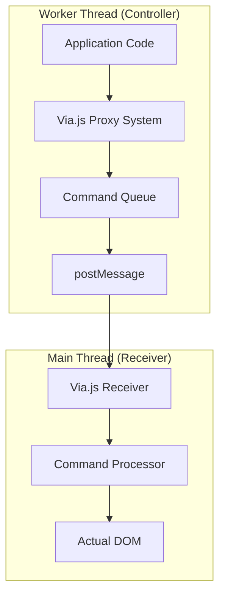

# Via.js Rendering

<cite>
**Referenced Files in This Document**  
- [render.via.ts](file://src/methods/render.via.ts)
- [setters.via.ts](file://src/utils/setters.via.ts)
- [render.ts](file://src/methods/render.ts)
- [soby.ts](file://src/hooks/soby.ts)
- [README.md](file://src/via/README.md)
</cite>

## Table of Contents
1. [Introduction](#introduction)
2. [Architecture Overview](#architecture-overview)
3. [Core Components](#core-components)
4. [Via.js Integration](#viajs-integration)
5. [Rendering Pipeline](#rendering-pipeline)
6. [Performance Considerations](#performance-considerations)
7. [Usage Example](#usage-example)
8. [Compatibility and Limitations](#compatibility-and-limitations)
9. [Conclusion](#conclusion)

## Introduction

The Via.js rendering implementation in Woby provides a specialized rendering pipeline optimized for Web Worker environments. This document explains how the `render.via.ts` implementation integrates with the Via.js runtime to enable high-performance rendering while maintaining compatibility with the standard browser renderer. The implementation leverages Via.js's proxy-based command queuing system to minimize postMessage overhead and improve execution speed in worker contexts.

**Section sources**
- [render.via.ts](file://src/methods/render.via.ts#L1-L28)

## Architecture Overview

The Via.js rendering architecture consists of two main components: the controller (worker) side and the receiver (DOM) side. The controller side uses the `via` object to make DOM calls that are automatically translated into commands and sent to the main thread via postMessage. The receiver side processes these commands and performs the actual DOM operations.



**Diagram sources**  
- [README.md](file://src/via/README.md#L0-L155)

## Core Components

The Via.js rendering pipeline consists of several key components that work together to provide optimized rendering performance. The core functionality is implemented in `render.via.ts`, which exports a `render` function that serves as the entry point for the rendering process.

The implementation differs from the standard browser renderer in several ways, including a simplified setter system and specialized handling for Via.js's proxy-based architecture. The `setChild` function in `setters.via.ts` plays a crucial role in the rendering pipeline by efficiently managing child elements in the Via.js context.


**Diagram sources**  
- [render.via.ts](file://src/methods/render.via.ts#L4-L24)
- [setters.via.ts](file://src/utils/setters.via.ts#L127-L129)
- [soby.ts](file://src/hooks/soby.ts#L7-L7)

**Section sources**
- [render.via.ts](file://src/methods/render.via.ts#L1-L28)
- [setters.via.ts](file://src/utils/setters.via.ts#L0-L861)

## Via.js Integration

The Via.js integration enables Woby components to render in Web Worker environments by leveraging Via.js's proxy-based command queuing system. When DOM operations are performed in the worker, Via.js intercepts these operations using JavaScript Proxy objects and builds a queue of commands that are sent to the main thread in a single postMessage call.

This approach eliminates the need to post strings of JavaScript code for evaluation (which would be a security risk) and reduces overhead compared to other solutions like ComLink that create multiple MessageChannels. Via.js commands are automatically submitted at the next microtask, ensuring efficient batch processing of DOM operations.

The integration requires setting up a messaging bridge between the worker and main thread. On the controller (worker) side, Via.js is configured with:

```js
Via.postMessage = (data => self.postMessage(data));
self.addEventListener("message", e => Via.onMessage(e.data));
```

And on the receiver (DOM) side:

```js
worker.onmessage = (e => ViaReceiver.OnMessage(e.data));
ViaReceiver.postMessage = (data => worker.postMessage(data));
```

Once the bridge is established, the `via` object can be used to access the remote global object, allowing DOM operations to be performed as if they were running on the main thread.

**Section sources**
- [README.md](file://src/via/README.md#L52-L155)

## Rendering Pipeline

The Via.js rendering pipeline in `render.via.ts` follows a streamlined process optimized for worker environments. The `render` function takes a child element and a parent node as parameters, with the parent node being required and must be an instance of HTMLElement.

The pipeline begins by validating the parent node and clearing its content with `parent.textContent = ''`. It then creates a root scope using `useRoot` from the soby library, which manages the lifecycle of the rendered component. Within this root scope, `setChild` is called to render the child element into the parent.

A key difference from the standard browser renderer is the simplified setter system in `setters.via.ts`. Unlike the standard renderer which uses `FragmentUtils.make()` to create a fragment context, the Via.js renderer passes the stack directly to `setChild`. This optimization reduces overhead by eliminating the need for fragment management in the Via.js context.

The disposal mechanism is implemented as a function that calls `dispose(stack)` to clean up the root scope and clears the parent's content again to ensure complete cleanup.


**Diagram sources**  
- [render.via.ts](file://src/methods/render.via.ts#L4-L24)
- [setters.via.ts](file://src/utils/setters.via.ts#L127-L129)

**Section sources**
- [render.via.ts](file://src/methods/render.via.ts#L4-L24)
- [render.ts](file://src/methods/render.ts#L8-L29)

## Performance Considerations

The Via.js rendering implementation provides several performance advantages over standard browser rendering, particularly in Web Worker environments. By batching DOM operations into a single postMessage call, it significantly reduces communication overhead between threads.

The proxy-based command queuing system allows multiple DOM operations to be recorded and sent in a single batch, which is more efficient than making individual postMessage calls for each operation. This is particularly beneficial for complex UI updates that involve multiple DOM manipulations.

Memory management is handled through Via.js's WeakRef-based cleanup system, which automatically identifies when proxy objects are garbage collected and sends cleanup messages to the receiver side. This prevents memory leaks that would otherwise occur from strong references in the ID-to-object map.

The rendering pipeline is optimized for speed by minimizing the number of operations performed in the worker thread. The simplified setter system in `setters.via.ts` reduces the overhead of property setting operations, and the direct stack passing eliminates the need for fragment creation and management.

However, there are some performance considerations to keep in mind. The postMessage overhead is still relatively high compared to direct DOM manipulation, and JavaScript engines may experience GC thrashing when building command lists. Future improvements could include using binary formats with ArrayBuffer transfer or shared memory (SharedArrayBuffer) to further reduce overhead.

**Section sources**
- [README.md](file://src/via/README.md#L141-L155)
- [setters.via.ts](file://src/utils/setters.via.ts#L0-L861)

## Usage Example

Here is an example demonstrating how to use Via.js rendering for high-performance applications:

```typescript
import { render } from 'woby/methods/render.via';

// Create a container element in the main thread
const container = document.getElementById('app');

// In the Web Worker, render a component using Via.js
const App = () => {
  return (
    <div>
      <h1>Hello from Web Worker!</h1>
      <p>This content is rendered via Via.js</p>
    </div>
  );
};

// Render the component
const dispose = render(App(), container);

// Later, clean up the component
// dispose();
```

To set up the Via.js environment, you need to configure the messaging bridge:

```typescript
// In the Web Worker
Via.postMessage = (data => self.postMessage(data));
self.addEventListener("message", e => Via.onMessage(e.data));

// In the main thread
const worker = new Worker('worker.js');
worker.onmessage = (e => ViaReceiver.OnMessage(e.data));
ViaReceiver.postMessage = (data => worker.postMessage(data));
```

This example demonstrates the key advantage of Via.js rendering: the ability to write DOM-manipulating code in a Web Worker while having it execute on the main thread, preventing UI jank from heavy JavaScript operations.

**Section sources**
- [render.via.ts](file://src/methods/render.via.ts#L4-L24)
- [README.md](file://src/via/README.md#L28-L41)

## Compatibility and Limitations

The Via.js rendering implementation has specific compatibility requirements and limitations that developers should be aware of. Via.js requires WeakRef support for proper memory management, which is available in Chrome 84+, Firefox 79+, and Safari 14.1+. In browsers without WeakRef support, Via.js will still function but may leak memory over time.

One significant limitation is that APIs requiring synchronous calls in callbacks, such as `e.preventDefault()`, do not work with Via.js. This is because the postMessage round-trip required to invoke callbacks means that by the time new commands are sent back, the event handler has already finished executing.

The rendering target has specific constraints regarding property setting. Certain properties like `innerHTML`, `outerHTML`, and `textContent` are forbidden props in the Via.js context, as they could lead to security vulnerabilities or inconsistent state.

The simplified setter system in `setters.via.ts` means that some features available in the standard browser renderer may not be fully supported. For example, the fragment management system used in the standard renderer is not needed in the Via.js context, which limits interoperability between the two rendering targets.

Developers should also be aware that retrieving values from the DOM requires asynchronous access through the `get()` function, as it requires a postMessage round-trip. This means that any code relying on immediate return values from DOM operations will need to be refactored to use promises.

**Section sources**
- [README.md](file://src/via/README.md#L6-L26)
- [setters.via.ts](file://src/utils/setters.via.ts#L800-L860)

## Conclusion

The Via.js rendering implementation in Woby provides a powerful solution for high-performance applications that need to run JavaScript logic in Web Workers while still manipulating the DOM. By leveraging Via.js's proxy-based command queuing system, it enables developers to write code that appears to directly manipulate the DOM from a worker context, with operations automatically synchronized to the main thread.

The implementation offers significant advantages in terms of reduced bundle size and improved execution speed, particularly for applications with heavy computational requirements. The simplified setter system and optimized rendering pipeline make it well-suited for performance-critical applications.

However, developers must be aware of the compatibility requirements and limitations, particularly regarding browser support for WeakRefs and the inability to use synchronous DOM APIs in event callbacks. With proper understanding of these constraints, the Via.js rendering target can be a valuable tool for building responsive, high-performance web applications.

[No sources needed since this section summarizes without analyzing specific files]