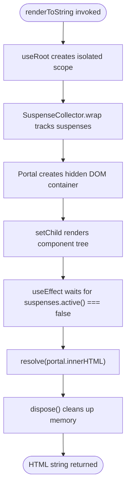
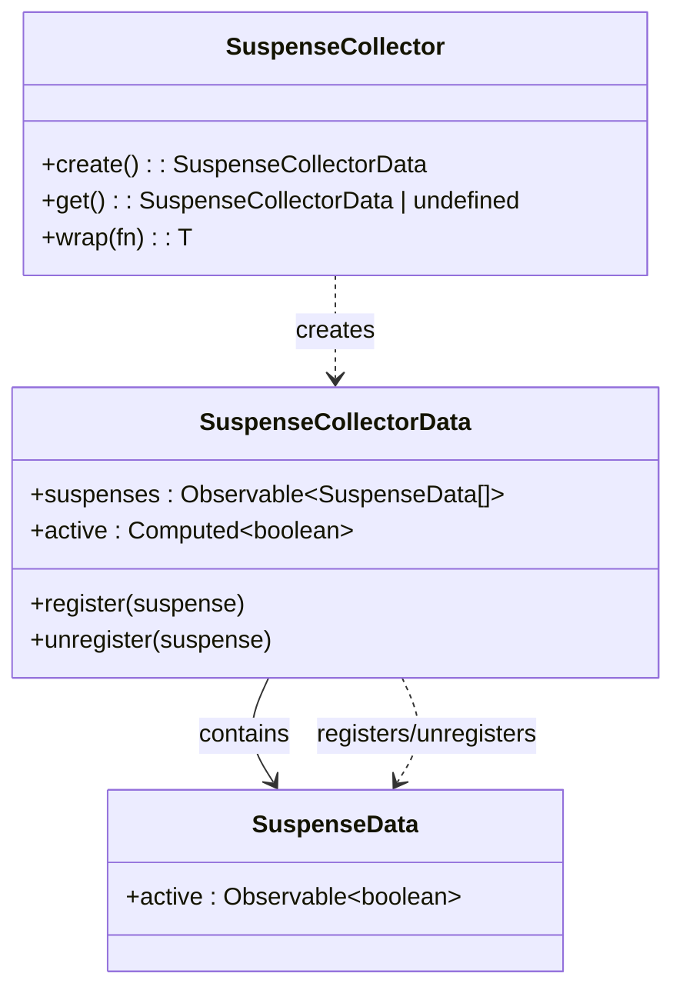
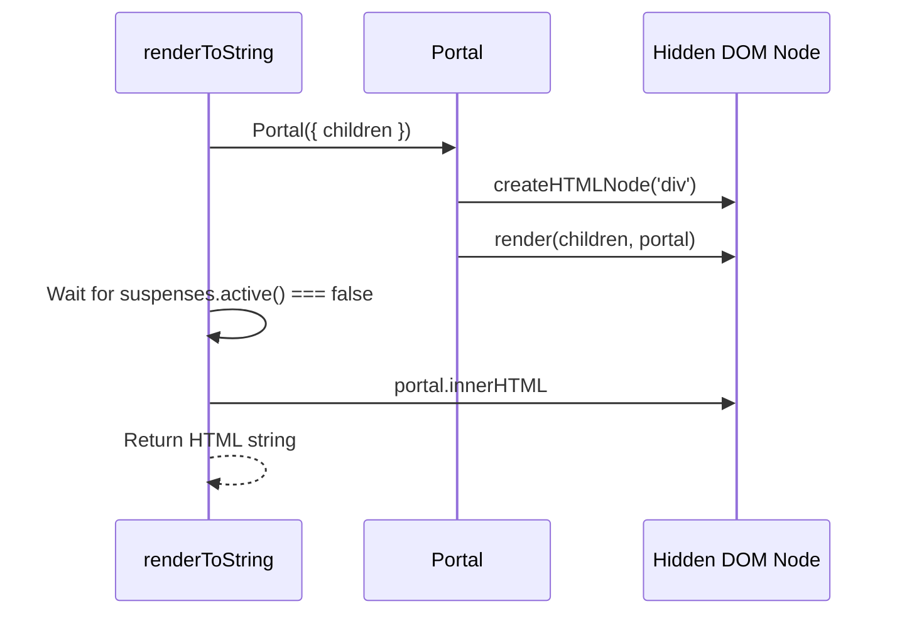

# Asynchronous Server-Side Rendering

<cite>
**Referenced Files in This Document**  
- [render_to_string.ssr.ts](file://src/methods/render_to_string.ssr.ts)
- [render_to_string.ts](file://src/methods/render_to_string.ts)
- [suspense.collector.ts](file://src/components/suspense.collector.ts)
- [portal.ssr.ts](file://src/components/portal.ssr.ts)
- [ssr-runtime.ts](file://src/ssr/ssr-runtime.ts)
</cite>

## Table of Contents
1. [Introduction](#introduction)
2. [Core Implementation of renderToString](#core-implementation-of-rendertostring)
3. [SuspenseCollector: Tracking Pending Suspense Boundaries](#suspensecollector-tracking-pending-suspense-boundaries)
4. [Component Lifecycle with useRoot](#component-lifecycle-with-useroot)
5. [HTML Extraction via portal.innerHTML](#html-extraction-via-portalinnerhtml)
6. [Memory Management with Disposer Pattern](#memory-management-with-disposer-pattern)
7. [Integration with HTTP Servers](#integration-with-http-servers)
8. [Handling Suspense-Enabled Components](#handling-suspense-enabled-components)
9. [Error Resilience and Recovery](#error-resilience-and-recovery)
10. [Performance Implications of Async SSR](#performance-implications-of-async-ssr)
11. [Interaction with Resource Hooks](#interaction-with-resource-hooks)
12. [Streaming Response Compatibility](#streaming-response-compatibility)
13. [Comparison with Synchronous SSR](#comparison-with-synchronous-ssr)
14. [Use Cases in Serverless and Edge Functions](#use-cases-in-serverless-and-edge-functions)

## Introduction

Woby's asynchronous server-side rendering (SSR) system enables full hydration of components that rely on asynchronous data fetching, lazy loading, or other deferred operations. Unlike traditional SSR approaches that block on rendering until all data is available, Woby leverages reactive programming and Suspense semantics to resolve only when all async resources are ready. This document details the implementation of `renderToString()` and its integration with `SuspenseCollector`, `useRoot`, portal mechanisms, and disposer patterns for efficient, memory-safe rendering on the server.

**Section sources**
- [render_to_string.ts](file://src/methods/render_to_string.ts#L12-L38)
- [suspense.collector.ts](file://src/components/suspense.collector.ts#L1-L42)

## Core Implementation of renderToString

The `renderToString` function returns a Promise that resolves to a fully rendered HTML string only after all Suspense boundaries have completed. It creates an isolated rendering root using `useRoot`, wraps execution in a `SuspenseCollector` context, and renders content into a hidden DOM portal. The function waits for all pending Suspense operations to settle before extracting the final HTML.



**Diagram sources**
- [render_to_string.ts](file://src/methods/render_to_string.ts#L12-L38)
- [portal.ssr.ts](file://src/components/portal.ssr.ts#L9-L47)

**Section sources**
- [render_to_string.ts](file://src/methods/render_to_string.ts#L12-L38)

## SuspenseCollector: Tracking Pending Suspense Boundaries

`SuspenseCollector` is a context-based mechanism that aggregates active Suspense boundaries during SSR. It maintains a reactive list of suspense instances and exposes an `active()` computed signal that returns `true` if any Suspense is still pending. During rendering, this collector is instantiated at the root level and passed down through context, allowing each Suspense component to register itself upon creation.

The `wrap` method creates a new collector instance and establishes it as the current context, ensuring proper nesting and isolation of suspense tracking. This enables the renderer to deterministically know when all async dependencies have resolved.



**Diagram sources**
- [suspense.collector.ts](file://src/components/suspense.collector.ts#L1-L42)

**Section sources**
- [suspense.collector.ts](file://src/components/suspense.collector.ts#L1-L42)

## Component Lifecycle with useRoot

`useRoot` establishes a new computation scope that is detached from any parent reactive context. This is essential in SSR to prevent memory leaks and ensure that reactive computations are properly cleaned up after rendering completes. When `renderToString` invokes `useRoot`, it receives a `dispose` function that can be called to tear down all associated observers, effects, and subscriptions.

This root isolation ensures that server-rendered components do not retain references across requests, making the system safe for concurrent rendering in server environments.

**Section sources**
- [render_to_string.ts](file://src/methods/render_to_string.ts#L12-L38)
- [suspense.collector.ts](file://src/components/suspense.collector.ts#L1-L42)

## HTML Extraction via portal.innerHTML

During SSR, Woby uses a `Portal` component to render the virtual DOM into a detached HTML element (typically a `<div>`). This portal acts as a render target and is never inserted into the actual document body on the server. Once rendering is complete and all Suspense boundaries are resolved, the `innerHTML` of this portal is extracted and returned as the final HTML string.

The portal mechanism allows Woby to simulate browser-like DOM operations without requiring a full browser environment, enabling compatibility with lightweight runtimes like Node.js, Deno, or edge workers.



**Diagram sources**
- [portal.ssr.ts](file://src/components/portal.ssr.ts#L9-L47)
- [render_to_string.ts](file://src/methods/render_to_string.ts#L12-L38)

**Section sources**
- [portal.ssr.ts](file://src/components/portal.ssr.ts#L9-L47)

## Memory Management with Disposer Pattern

Woby employs a disposer pattern to ensure memory safety during SSR. The `useRoot` hook returns a `dispose` function that must be explicitly called to clean up all reactive resources. In `renderToString`, this disposal occurs once rendering is complete and the HTML is ready to be sent.

This pattern prevents memory leaks by destroying all subscriptions, effects, and observables created during the render process. It is especially critical in high-throughput server environments where thousands of requests may be processed concurrently.

**Section sources**
- [render_to_string.ts](file://src/methods/render_to_string.ts#L12-L38)

## Integration with HTTP Servers

To integrate with HTTP servers, `renderToString` can be used within request handlers to generate HTML responses. The async nature of the function allows it to be awaited within Express, Fastify, or similar frameworks.

Example integration:
```ts
app.get('/', async (req, res) => {
  const html = await renderToString(<App />);
  res.send(`<!DOCTYPE html><html>${html}</html>`);
});
```

This approach enables full server-side rendering of Suspense-enabled components without blocking the event loop.

**Section sources**
- [render_to_string.ts](file://src/methods/render_to_string.ts#L12-L38)

## Handling Suspense-Enabled Components

Components that use `useResource`, `lazy`, or other async hooks automatically trigger Suspense when their data is not yet available. During SSR, these components register themselves with the current `SuspenseCollector`. The renderer waits until `suspenses.active()` returns `false` before proceeding to extract HTML.

This ensures that the final output contains fully resolved content rather than loading states or placeholders.

**Section sources**
- [suspense.collector.ts](file://src/components/suspense.collector.ts#L1-L42)
- [render_to_string.ts](file://src/methods/render_to_string.ts#L12-L38)

## Error Resilience and Recovery

While not explicitly shown in the current implementation, error resilience can be achieved by wrapping the render process in try-catch blocks and providing fallback rendering paths. Future enhancements could include error boundaries that intercept failures during SSR and return graceful fallback HTML.

Currently, unhandled rejections in async resources may cause the `renderToString` promise to hang or reject, requiring proper error handling in resource definitions.

**Section sources**
- [render_to_string.ts](file://src/methods/render_to_string.ts#L12-L38)

## Performance Implications of Async SSR

Async SSR introduces latency due to waiting for all resources to resolve. However, it improves perceived performance by eliminating client-side hydration waterfalls. Parallel data fetching and resource coalescing (via `useResource`) help mitigate this cost.

The use of reactive disposal and isolated roots ensures minimal memory overhead per request, making the system scalable under load.

**Section sources**
- [render_to_string.ts](file://src/methods/render_to_string.ts#L12-L38)
- [suspense.collector.ts](file://src/components/suspense.collector.ts#L1-L42)

## Interaction with Resource Hooks

Hooks like `useResource` integrate directly with the Suspense mechanism. When a resource is pending, it throws a promise, which is caught by the nearest Suspense boundary. The `SuspenseCollector` tracks this state, preventing the renderer from completing until the resource resolves.

This tight integration allows declarative data fetching with automatic dependency tracking and resolution.

**Section sources**
- [suspense.collector.ts](file://src/components/suspense.collector.ts#L1-L42)
- [render_to_string.ts](file://src/methods/render_to_string.ts#L12-L38)

## Streaming Response Compatibility

While the current `renderToString` returns a single Promise, the architecture supports streaming by exposing lower-level APIs that could emit chunks as they become available. With modifications, Woby could support progressive hydration by flushing content as Suspense boundaries resolve, improving Time to First Byte (TTFB).

However, full streaming would require coordination between the renderer and HTTP response pipeline to handle partial flushes.

**Section sources**
- [render_to_string.ts](file://src/methods/render_to_string.ts#L12-L38)

## Comparison with Synchronous SSR

| Feature | Synchronous SSR | Woby Async SSR |
|-------|------------------|----------------|
| Data readiness | Blocks on initial render | Waits for all async resources |
| Hydration | Often requires client-side fetch | Fully resolved on server |
| Memory safety | Risk of leaks without cleanup | Disposer pattern ensures cleanup |
| Suspense support | Limited or none | Full Suspense boundary support |
| Complexity | Simpler, but less flexible | More complex, but highly capable |

Woby's approach is superior for modern applications with async data dependencies.

**Section sources**
- [render_to_string.ssr.ts](file://src/methods/render_to_string.ssr.ts#L6-L40)
- [render_to_string.ts](file://src/methods/render_to_string.ts#L12-L38)

## Use Cases in Serverless and Edge Functions

The lightweight, memory-safe design of Woby's async SSR makes it ideal for serverless and edge computing environments:

- **Serverless**: Efficient per-invocation rendering with no state retention
- **Edge Functions**: Fast startup and low memory footprint suitable for CDN-edge runtimes
- **Jamstack**: Pre-rendering with async data sources (CMS, APIs)
- **Dynamic Pages**: Real-time content generation with database or API calls

The disposer pattern and isolated roots ensure that each function invocation is clean and independent.

**Section sources**
- [render_to_string.ts](file://src/methods/render_to_string.ts#L12-L38)
- [use_root.ts](file://src/hooks/use_root.ts) *(inferred from useRoot usage)*