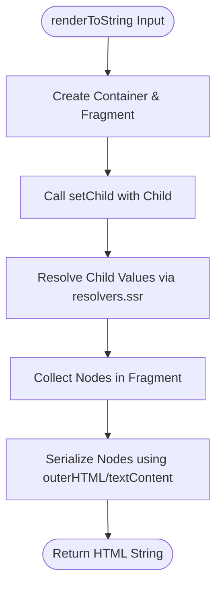
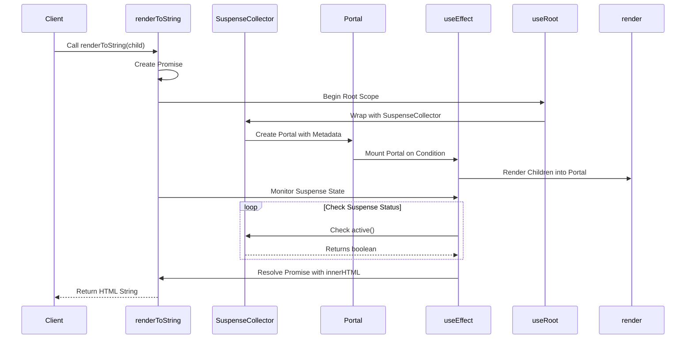
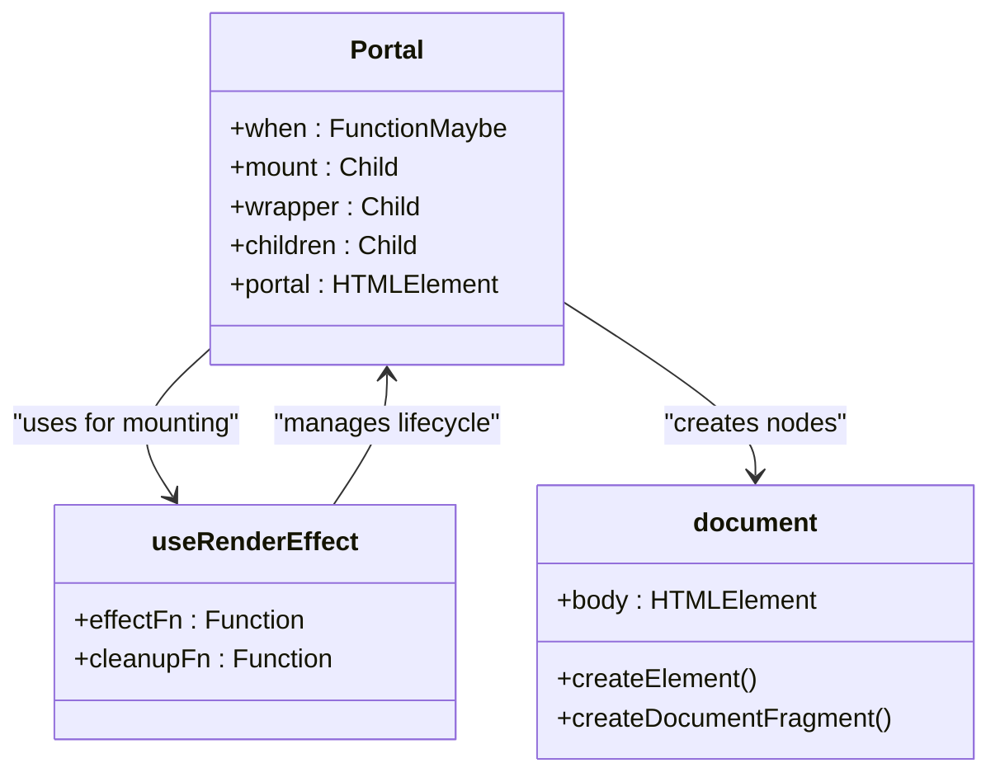

# Server-Side Rendering

<cite>
**Referenced Files in This Document**   
- [render_to_string.ssr.ts](file://src/methods/render_to_string.ssr.ts)
- [render_to_string.ts](file://src/methods/render_to_string.ts)
- [suspense.collector.ts](file://src/components/suspense.collector.ts)
- [resolvers.ssr.ts](file://src/utils/resolvers.ssr.ts)
- [setters.ssr.ts](file://src/utils/setters.ssr.ts)
- [portal.ssr.ts](file://src/components/portal.ssr.ts)
- [creators.ssr.ts](file://src/utils/creators.ssr.ts)
- [ssr-runtime.ts](file://src/ssr/ssr-runtime.ts)
- [jsx-runtime.ssr.tsx](file://src/jsx/jsx-runtime.ssr.tsx)
- [ssr.ts](file://src/ssr.ts)
</cite>

## Table of Contents
1. [Introduction](#introduction)
2. [Synchronous SSR with renderToString](#synchronous-ssr-with-rendertostring)
3. [Asynchronous SSR and Suspense Support](#asynchronous-ssr-and-suspense-support)
4. [Rendering Pipeline and String Output](#rendering-pipeline-and-string-output)
5. [Portal Handling in SSR](#portal-handling-in-ssr)
6. [SuspenseCollector and Resource Tracking](#suspensecollector-and-resource-tracking)
7. [Disposer Pattern and Cleanup](#disposer-pattern-and-cleanup)
8. [Use Cases: HTTP Responses, SSG, and Pre-rendering](#use-cases-http-responses-ssg-and-pre-rendering)
9. [Streaming SSR Possibilities](#streaming-ssr-possibilities)
10. [Error Handling During Server Rendering](#error-handling-during-server-rendering)
11. [Performance Optimization for High-Throughput Scenarios](#performance-optimization-for-high-throughput-scenarios)

## Introduction
Woby provides robust server-side rendering (SSR) capabilities through its `renderToString()` function, enabling efficient generation of HTML on the server for improved performance, SEO, and initial load experience. This documentation details both synchronous and asynchronous rendering approaches, the underlying rendering pipeline, portal handling, hydration considerations, and advanced patterns such as resource tracking via `SuspenseCollector` and cleanup using the disposer pattern.

**Section sources**
- [render_to_string.ssr.ts](file://src/methods/render_to_string.ssr.ts#L6-L40)
- [render_to_string.ts](file://src/methods/render_to_string.ts#L12-L38)

## Synchronous SSR with renderToString
The synchronous version of `renderToString` is designed for server environments where blocking execution is acceptable. It immediately renders a React-like component tree into a string representation using a virtual DOM constructed via `happy-dom`. The implementation uses a fragment-based container to collect child nodes, processes them through `setChild`, and serializes the result using `outerHTML` or `textContent`.

This method avoids asynchronous operations, making it ideal for traditional server contexts where fast, deterministic rendering is required without the complexity of Suspense or dynamic resource loading.



**Diagram sources**
- [render_to_string.ssr.ts](file://src/methods/render_to_string.ssr.ts#L6-L40)
- [setters.ssr.ts](file://src/utils/setters.ssr.ts#L750-L799)
- [resolvers.ssr.ts](file://src/utils/resolvers.ssr.ts#L1-L182)

**Section sources**
- [render_to_string.ssr.ts](file://src/methods/render_to_string.ssr.ts#L6-L40)
- [resolvers.ssr.ts](file://src/utils/resolvers.ssr.ts#L1-L182)

## Asynchronous SSR and Suspense Support
The asynchronous `renderToString` function supports Suspense-enabled components by leveraging `useRoot`, `SuspenseCollector`, and `useEffect` to track pending resources. It wraps the rendering process in a suspense-aware context, allowing components to suspend during rendering when waiting for async data (e.g., resource loading).

The function returns a `Promise<string>` and resolves only when all Suspense boundaries have been fulfilled. This is achieved by monitoring active suspenses through `SuspenseCollector.active()`, ensuring that the final HTML output includes fully resolved content before being sent to the client.



**Diagram sources**
- [render_to_string.ts](file://src/methods/render_to_string.ts#L12-L38)
- [suspense.collector.ts](file://src/components/suspense.collector.ts#L1-L42)
- [portal.ssr.ts](file://src/components/portal.ssr.ts#L6-L48)

**Section sources**
- [render_to_string.ts](file://src/methods/render_to_string.ts#L12-L38)
- [suspense.collector.ts](file://src/components/suspense.collector.ts#L1-L42)

## Rendering Pipeline and String Output
Woby's SSR rendering pipeline transforms JSX into a string representation through a multi-step process involving fragment management, child resolution, and DOM serialization. The pipeline begins with fragment creation, proceeds through recursive child resolution using `resolveChild`, applies diffing logic for updates, and finally serializes node content via `outerHTML`.

Key components include:
- `FragmentUtils.make()` for managing render fragments
- `setChild()` for assigning children to containers
- `resolveChild()` for handling observables, functions, and arrays
- `diff()` for efficient DOM updates during re-renders

The final output is a concatenated string of HTML content derived from either `outerHTML` (for elements) or `textContent` (for text nodes), ensuring compatibility with standard HTML delivery.

**Section sources**
- [render_to_string.ssr.ts](file://src/methods/render_to_string.ssr.ts#L6-L40)
- [setters.ssr.ts](file://src/utils/setters.ssr.ts#L750-L799)
- [resolvers.ssr.ts](file://src/utils/resolvers.ssr.ts#L1-L182)

## Portal Handling in SSR
Portals in Woby allow rendering components into DOM nodes outside the parent hierarchy, even during SSR. The `Portal` component accepts a `mount` target and an optional `wrapper`, creating a virtual `div` element if none is provided. During SSR, it inserts the portal node into the specified mount point (defaulting to `document.body`) and renders children into it.

The implementation uses `useRenderEffect` to manage side effects, ensuring proper insertion and cleanup. The returned value includes metadata containing the portal element, enabling hydration on the client side.



**Diagram sources**
- [portal.ssr.ts](file://src/components/portal.ssr.ts#L6-L48)
- [creators.ssr.ts](file://src/utils/creators.ssr.ts#L1-L18)

**Section sources**
- [portal.ssr.ts](file://src/components/portal.ssr.ts#L6-L48)

## SuspenseCollector and Resource Tracking
`SuspenseCollector` is responsible for tracking all active Suspense instances within a rendering scope. It maintains a list of suspense objects and exposes an `active()` method that returns `true` if any suspense is still pending. This enables the asynchronous `renderToString` to delay resolution until all async dependencies are resolved.

The collector uses `useMemo` to reactively compute the active state and provides `register` and `unregister` methods to manage lifecycle. It is created per rendering root and injected via context, ensuring isolation between concurrent renders.

```mermaid
flowchart TD
A[SuspenseCollector.create] --> B[Initialize suspenses array]
B --> C[Define active() via useMemo]
C --> D[Define register/unregister]
D --> E[Return data object]
E --> F[Used in SuspenseContext.wrap]
F --> G[Wrapped in context provider]
G --> H[Accessed by Suspense components]
H --> I[Register on suspend]
I --> J[Unregister on resolve]
J --> K[active() reflects state]
```

**Diagram sources**
- [suspense.collector.ts](file://src/components/suspense.collector.ts#L1-L42)
- [suspense.ts](file://src/components/suspense.ts#L1-L25)

**Section sources**
- [suspense.collector.ts](file://src/components/suspense.collector.ts#L1-L42)

## Disposer Pattern and Cleanup
Woby employs a disposer pattern for resource cleanup during SSR, particularly within `useRoot` and `useRenderEffect`. The `dispose` function is passed to the root callback and is invoked when rendering completes or errors occur. This ensures that any side effects, timers, or subscriptions are properly cleaned up.

In `useRenderEffect`, cleanup functions are scheduled via `useMicrotask`, guaranteeing execution after rendering. This mechanism prevents memory leaks and maintains consistency between server and client behavior.

**Section sources**
- [render_to_string.ts](file://src/methods/render_to_string.ts#L12-L38)
- [hooks/use_render_effect.ts](file://src/hooks/use_render_effect.ts)

## Use Cases: HTTP Responses, SSG, and Pre-rendering
Woby's SSR capabilities support multiple production use cases:
- **HTTP Responses**: Generate complete HTML for Express/Koa responses using `renderToString`.
- **Static Site Generation (SSG)**: Pre-render pages at build time by invoking `renderToString` synchronously.
- **Pre-rendering Workflows**: Integrate with build tools to output static HTML files for SEO-critical routes.

The synchronous API is preferred for SSG due to its simplicity and determinism, while the asynchronous version suits dynamic server environments with data fetching requirements.

**Section sources**
- [render_to_string.ssr.ts](file://src/methods/render_to_string.ssr.ts#L6-L40)
- [render_to_string.ts](file://src/methods/render_to_string.ts#L12-L38)

## Streaming SSR Possibilities
While not directly implemented in the current codebase, Woby's architecture supports streaming SSR through incremental rendering and chunked transfer encoding. By integrating with Node.js streams and leveraging Suspense boundaries, it could progressively flush HTML chunks as components resolve, improving Time to First Byte (TTFB) and perceived performance.

Future enhancements could include a `renderToStream` function that emits HTML in chunks, coordinated with `SuspenseCollector` to manage pending content.

**Section sources**
- [suspense.collector.ts](file://src/components/suspense.collector.ts#L1-L42)
- [render_to_string.ts](file://src/methods/render_to_string.ts#L12-L38)

## Error Handling During Server Rendering
Error handling in Woby's SSR is managed through standard JavaScript try-catch mechanisms and observable error boundaries. While the provided code does not include explicit error boundary logic in SSR, the use of `Promise` in asynchronous rendering allows for `.catch()` handling at the integration level.

For robust production use, wrapping `renderToString` calls in try-catch blocks and implementing custom error boundaries using `useErrorBoundary` (if available) is recommended to gracefully handle rendering failures.

**Section sources**
- [render_to_string.ts](file://src/methods/render_to_string.ts#L12-L38)
- [error_boundary.ts](file://src/components/error_boundary.ts)

## Performance Optimization for High-Throughput Scenarios
To optimize SSR performance in high-throughput environments:
- Use the synchronous `renderToString` when no Suspense is involved.
- Minimize observable usage in SSR-only components to reduce tracking overhead.
- Cache rendered results for frequently accessed routes.
- Avoid unnecessary re-renders by memoizing props and using `useMemo`.

The use of `happy-dom` for virtual DOM operations ensures fast node creation and serialization without browser dependencies.

**Section sources**
- [render_to_string.ssr.ts](file://src/methods/render_to_string.ssr.ts#L6-L40)
- [creators.ssr.ts](file://src/utils/creators.ssr.ts#L1-L18)
- [resolvers.ssr.ts](file://src/utils/resolvers.ssr.ts#L1-L182)