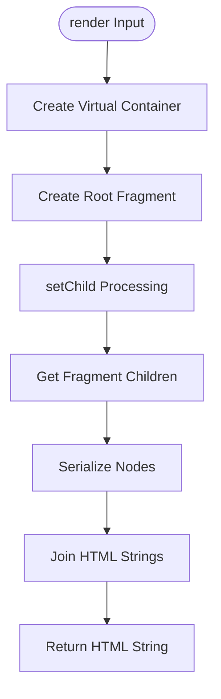
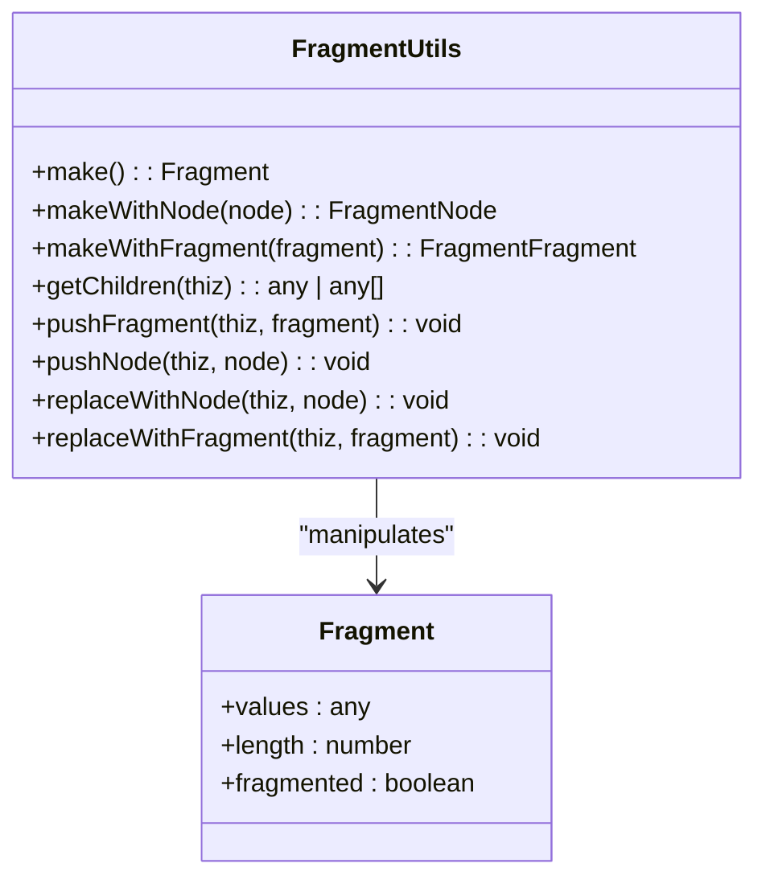
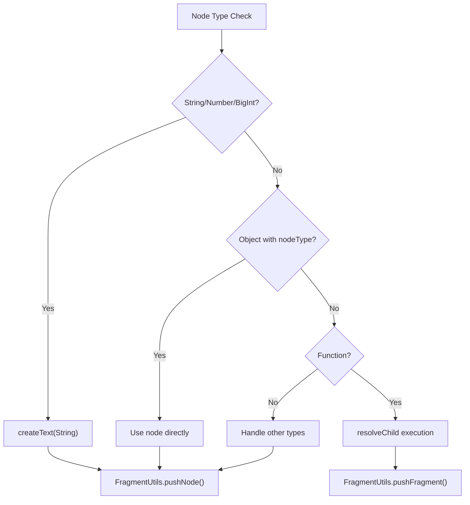
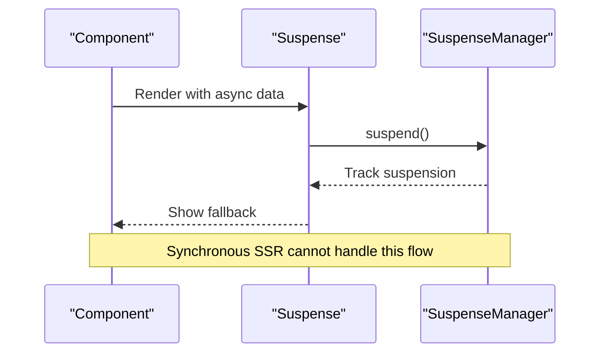

# Synchronous Server-Side Rendering

<cite>
**Referenced Files in This Document**   
- [render.ssr.ts](file://src/methods/render.ssr.ts)
- [render_to_string.ssr.ts](file://src/methods/render_to_string.ssr.ts)
- [setters.ssr.ts](file://src/utils/setters.ssr.ts)
- [fragment.ssr.ts](file://src/utils/fragment.ssr.ts)
- [fragment.ts](file://src/components/fragment.ts)
- [suspense.ts](file://src/components/suspense.ts)
- [suspense.manager.ts](file://src/components/suspense.manager.ts)
</cite>

## Table of Contents
1. [Introduction](#introduction)
2. [Core Rendering Pipeline](#core-rendering-pipeline)
3. [Fragment Management System](#fragment-management-system)
4. [Node Serialization Logic](#node-serialization-logic)
5. [Usage Scenarios](#usage-scenarios)
6. [Performance Characteristics](#performance-characteristics)
7. [Limitations and Constraints](#limitations-and-constraints)
8. [Edge Case Handling](#edge-case-handling)
9. [Hydration Requirements](#hydration-requirements)

## Introduction
Woby's synchronous server-side rendering (SSR) implementation provides a direct string rendering pipeline optimized for immediate HTML generation without asynchronous overhead. This system leverages FragmentUtils and setters.ssr to efficiently serialize virtual DOM structures into HTML strings during server execution. The implementation is specifically designed for high-throughput scenarios where minimal latency and predictable performance are critical.

**Section sources**
- [render.ssr.ts](file://src/methods/render.ssr.ts#L1-L26)
- [render_to_string.ssr.ts](file://src/methods/render_to_string.ssr.ts#L1-L41)

## Core Rendering Pipeline

The synchronous SSR pipeline follows a direct execution model that eliminates async/await patterns and Promise dependencies. At its core, the system creates a virtual container and processes the component tree through a series of synchronous operations.

**Diagram sources**
- [render.ssr.ts](file://src/methods/render.ssr.ts#L1-L26)
- [setters.ssr.ts](file://src/utils/setters.ssr.ts#L253-L296)

**Section sources**
- [render.ssr.ts](file://src/methods/render.ssr.ts#L1-L26)
- [setters.ssr.ts](file://src/utils/setters.ssr.ts#L1-L799)

## Fragment Management System

Woby's SSR implementation utilizes a sophisticated fragment management system that tracks child nodes through a virtual container structure. The FragmentUtils provides essential operations for managing the fragment lifecycle and node relationships.

**Diagram sources**
- [fragment.ssr.ts](file://src/utils/fragment.ssr.ts#L1-L144)

**Section sources**
- [fragment.ssr.ts](file://src/utils/fragment.ssr.ts#L1-L144)
- [fragment.ts](file://src/components/fragment.ts#L1-L7)

## Node Serialization Logic

The serialization process handles different child types through specific logic paths, ensuring proper HTML output for various data types. The system distinguishes between strings, objects with outerHTML/textContent properties, and other types.

**Diagram sources**
- [setters.ssr.ts](file://src/utils/setters.ssr.ts#L227-L269)
- [fragment.ssr.ts](file://src/utils/fragment.ssr.ts#L1-L144)

**Section sources**
- [setters.ssr.ts](file://src/utils/setters.ssr.ts#L1-L799)
- [fragment.ssr.ts](file://src/utils/fragment.ssr.ts#L1-L144)

## Usage Scenarios

### Traditional Server Environments
The synchronous SSR implementation excels in traditional server environments where request-response cycles require immediate HTML generation. The direct string rendering approach eliminates async boundaries, making it ideal for Express.js, Fastify, or similar frameworks.

### Static Site Generation
For static site generation (SSG), the synchronous pipeline provides predictable build times and deterministic output. The system can be integrated into build processes to pre-render pages during deployment.

### Build-Time Rendering
During build-time rendering, the synchronous nature ensures that all pages are rendered in a single execution context without requiring event loop management or async coordination.

**Section sources**
- [render.ssr.ts](file://src/methods/render.ssr.ts#L1-L26)
- [render_to_string.ssr.ts](file://src/methods/render_to_string.ssr.ts#L1-L41)

## Performance Characteristics

The synchronous SSR implementation offers significant performance advantages for high-throughput scenarios:

- **Reduced Overhead**: Eliminates Promise creation and event loop scheduling
- **Predictable Latency**: Consistent execution time without async variability
- **Memory Efficiency**: Minimal intermediate object creation
- **CPU Optimization**: Direct function calls without async trampolines

These characteristics make the implementation particularly suitable for applications requiring high request-per-second rates and low-latency responses.

**Section sources**
- [render.ssr.ts](file://src/methods/render.ssr.ts#L1-L26)
- [setters.ssr.ts](file://src/utils/setters.ssr.ts#L1-L799)

## Limitations and Constraints

### Suspense Support
The synchronous SSR implementation has inherent limitations regarding Suspense support. Unlike the async counterpart, it cannot handle suspended components that require resolution of asynchronous data.

**Diagram sources**
- [suspense.ts](file://src/components/suspense.ts#L1-L25)
- [suspense.manager.ts](file://src/components/suspense.manager.ts#L1-L67)

**Section sources**
- [suspense.ts](file://src/components/suspense.ts#L1-L25)
- [suspense.manager.ts](file://src/components/suspense.manager.ts#L1-L67)

## Edge Case Handling

### Null/Undefined Children
The system properly handles null and undefined children by treating them as void elements. During serialization, these values are filtered out and do not contribute to the final HTML output.

### Nested Fragments
Nested fragments are flattened during the serialization process using the getChildrenFragmented method. This ensures that fragment boundaries do not affect the final HTML structure.

### Empty Arrays
Empty arrays are treated as void children and result in placeholder comments in the output, maintaining the structural integrity of the DOM tree.

**Section sources**
- [setters.ssr.ts](file://src/utils/setters.ssr.ts#L1-L799)
- [fragment.ssr.ts](file://src/utils/fragment.ssr.ts#L1-L144)

## Hydration Requirements

For successful client-side hydration, the synchronous SSR output must match the initial client render. Key requirements include:

- **Consistent HTML Structure**: The server-generated HTML must exactly match what the client would produce
- **Event Handler Alignment**: Event handlers must be attachable to the hydrated elements
- **State Synchronization**: Component state must be transferable from server to client
- **Attribute Preservation**: All attributes and properties must be preserved during serialization

The synchronous nature of the SSR implementation helps ensure consistency between server and client renders by eliminating timing-related variations.

**Section sources**
- [render.ssr.ts](file://src/methods/render.ssr.ts#L1-L26)
- [setters.ssr.ts](file://src/utils/setters.ssr.ts#L1-L799)