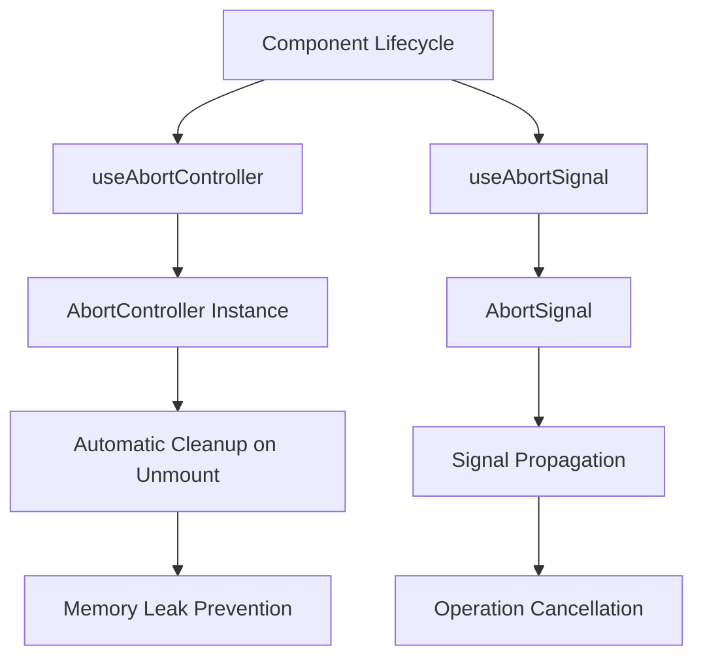
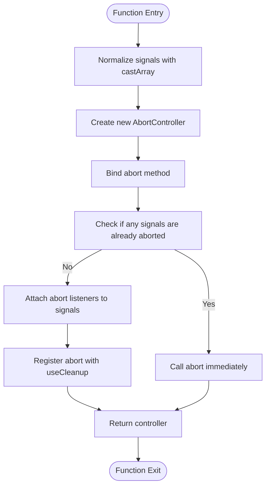
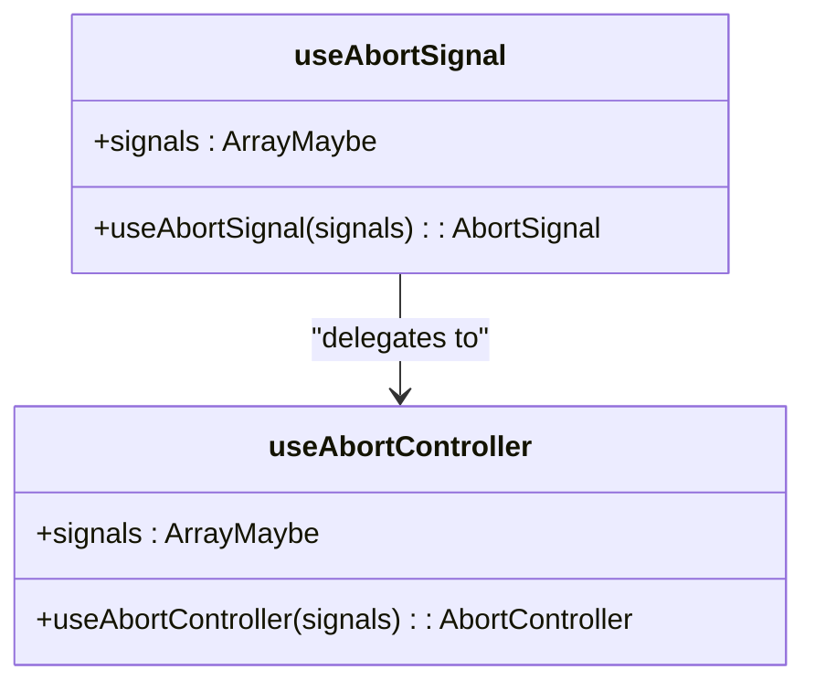
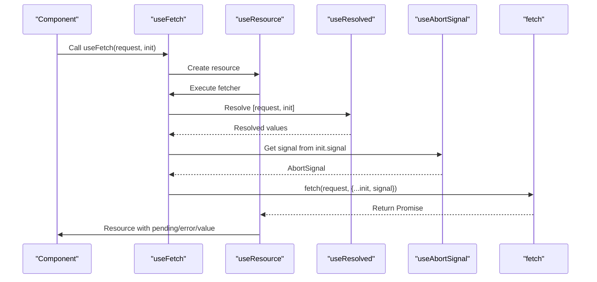
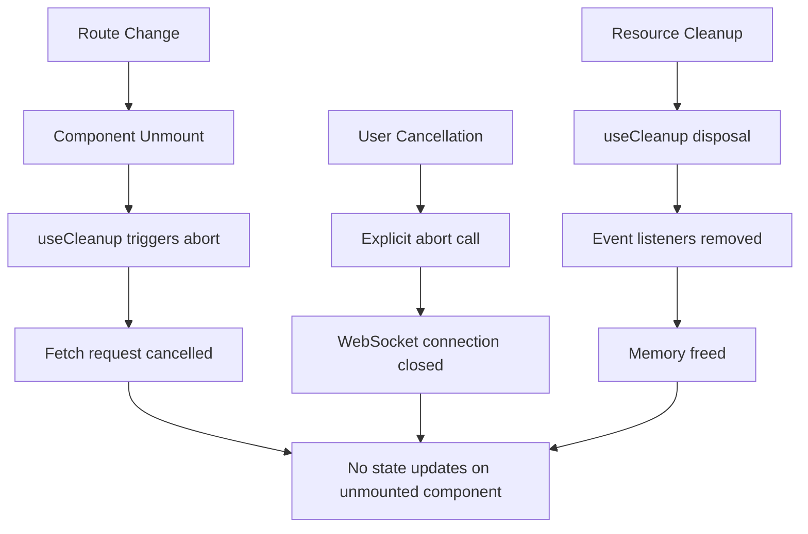
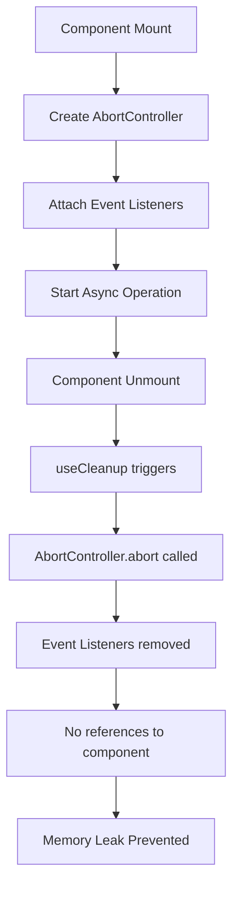

# Abort Control and Cancellation Hooks

<cite>
**Referenced Files in This Document**   
- [use_abort_controller.ts](file://src/hooks/use_abort_controller.ts)
- [use_abort_signal.ts](file://src/hooks/use_abort_signal.ts)
- [use_fetch.ts](file://src/hooks/use_fetch.ts)
- [use_event_listener.ts](file://src/hooks/use_event_listener.ts)
- [use_resolved.ts](file://src/hooks/use_resolved.ts)
- [use_resource.ts](file://src/hooks/use_resource.ts)
- [soby.ts](file://src/hooks/soby.ts)
</cite>

## Table of Contents
1. [Introduction](#introduction)
2. [Core Abort Control Hooks](#core-abort-control-hooks)
3. [useAbortController Implementation](#useabortcontroller-implementation)
4. [useAbortSignal Implementation](#useabortsigal-implementation)
5. [Integration with Async Operations](#integration-with-async-operations)
6. [Common Usage Scenarios](#common-usage-scenarios)
7. [Memory Leak Prevention](#memory-leak-prevention)
8. [Conclusion](#conclusion)

## Introduction
Woby's abort control hooks provide a robust mechanism for managing cancellation of asynchronous operations in component-based applications. These hooks leverage the AbortController API to ensure proper cleanup of ongoing operations when components unmount or when operations need to be explicitly cancelled. The system prevents memory leaks and ensures that asynchronous operations do not complete on unmounted components, which could lead to errors or unexpected behavior.

**Section sources**
- [readme.md](file://readme.md#L1758-L1829)

## Core Abort Control Hooks
Woby provides two primary hooks for abort control: `useAbortController` and `useAbortSignal`. These hooks simplify the management of AbortController instances and their associated signals in a component lifecycle-aware manner. The hooks automatically handle the disposal of controllers when components unmount, preventing memory leaks and ensuring proper cleanup of resources.

The `useAbortController` hook creates an AbortController instance that is automatically disposed when the component unmounts. The `useAbortSignal` hook provides a convenient way to derive an AbortSignal from the component's cancellation token, allowing for integration with existing cancellation mechanisms.

**Diagram sources**
- [use_abort_controller.ts](file://src/hooks/use_abort_controller.ts#L1-L31)
- [use_abort_signal.ts](file://src/hooks/use_abort_signal.ts#L1-L11)

**Section sources**
- [use_abort_controller.ts](file://src/hooks/use_abort_controller.ts#L1-L31)
- [use_abort_signal.ts](file://src/hooks/use_abort_signal.ts#L1-L11)

## useAbortController Implementation
The `useAbortController` hook creates an AbortController instance and ensures its proper disposal when the component unmounts. The implementation accepts an optional array of AbortSignal instances that can trigger the controller's abort method when they are aborted. This allows for chaining of cancellation signals and integration with external cancellation mechanisms.

The hook first normalizes the input signals using `castArray` to handle both single signals and arrays of signals. It then creates a new AbortController instance and binds its abort method to ensure proper context. If any of the provided signals are already aborted, the controller is immediately aborted. Otherwise, event listeners are attached to each signal to trigger the controller's abort method when the signals are aborted.

**Diagram sources**
- [use_abort_controller.ts](file://src/hooks/use_abort_controller.ts#L1-L31)

**Section sources**
- [use_abort_controller.ts](file://src/hooks/use_abort_controller.ts#L1-L31)

## useAbortSignal Implementation
The `useAbortSignal` hook provides a convenient way to obtain an AbortSignal from the component's cancellation token. It internally uses `useAbortController` to create a controller and returns its signal property. This abstraction simplifies the usage pattern when only the signal is needed, rather than the full controller.

The implementation is minimal, delegating the core functionality to `useAbortController` while providing a clean interface for obtaining a signal. This approach ensures consistency in behavior and disposal mechanisms between the two hooks.

**Diagram sources**
- [use_abort_signal.ts](file://src/hooks/use_abort_signal.ts#L1-L11)
- [use_abort_controller.ts](file://src/hooks/use_abort_controller.ts#L1-L31)

**Section sources**
- [use_abort_signal.ts](file://src/hooks/use_abort_signal.ts#L1-L11)

## Integration with Async Operations
The abort control hooks are designed to integrate seamlessly with asynchronous operations such as fetch requests, WebSocket connections, and long-running computations. The `useFetch` hook demonstrates this integration by using `useAbortSignal` to obtain a signal that is automatically cancelled when the component unmounts.

When a fetch request is initiated, the hook resolves the request and init parameters using `useResolved`, which handles observable values. It then obtains an AbortSignal using `useAbortSignal`, combining any existing signal from the init parameters with the component's cancellation signal. This signal is passed to the fetch request, ensuring that the request is cancelled when the component unmounts or when the signal is explicitly aborted.

**Diagram sources**
- [use_fetch.ts](file://src/hooks/use_fetch.ts#L1-L25)
- [use_resource.ts](file://src/hooks/use_resource.ts#L1-L105)
- [use_resolved.ts](file://src/hooks/use_resolved.ts#L1-L100)

**Section sources**
- [use_fetch.ts](file://src/hooks/use_fetch.ts#L1-L25)

## Common Usage Scenarios
The abort control hooks address several common scenarios in component-based applications. Route changes often result in component unmounting, and without proper cancellation, ongoing operations could attempt to update state on unmounted components. User cancellations, such as closing a modal or navigating away from a page, require immediate cancellation of ongoing operations to provide responsive feedback.

Resource cleanup is another critical scenario where these hooks excel. When a component is unmounted, any ongoing operations should be cancelled to free up system resources and prevent memory leaks. The hooks ensure that AbortController instances are properly disposed of, and any associated event listeners are removed.

**Diagram sources**
- [use_abort_controller.ts](file://src/hooks/use_abort_controller.ts#L1-L31)
- [use_event_listener.ts](file://src/hooks/use_event_listener.ts#L1-L95)
- [soby.ts](file://src/hooks/soby.ts#L1-L10)

**Section sources**
- [use_abort_controller.ts](file://src/hooks/use_abort_controller.ts#L1-L31)
- [use_event_listener.ts](file://src/hooks/use_event_listener.ts#L1-L95)

## Memory Leak Prevention
The primary benefit of Woby's abort control hooks is the prevention of memory leaks in component-based applications. By automatically disposing of AbortController instances when components unmount, the hooks ensure that no references to the component or its state are retained by ongoing operations.

The implementation leverages `useCleanup` from the soby package to register the abort method for execution when the component is disposed. This ensures that the AbortController is properly cleaned up, and any event listeners attached to external signals are removed. The combination of automatic disposal and proper event listener management prevents the most common causes of memory leaks in asynchronous operations.

**Diagram sources**
- [use_abort_controller.ts](file://src/hooks/use_abort_controller.ts#L1-L31)
- [soby.ts](file://src/hooks/soby.ts#L1-L10)

**Section sources**
- [use_abort_controller.ts](file://src/hooks/use_abort_controller.ts#L1-L31)

## Conclusion
Woby's abort control hooks provide a comprehensive solution for managing cancellation of asynchronous operations in component-based applications. The `useAbortController` and `useAbortSignal` hooks simplify the creation and management of AbortController instances, ensuring proper disposal when components unmount. This prevents memory leaks and ensures that operations do not complete on unmounted components, which could lead to errors or unexpected behavior.

The integration with other hooks like `useFetch` demonstrates the power of this approach, allowing for seamless cancellation of fetch requests and other asynchronous operations. By addressing common scenarios such as route changes, user cancellations, and resource cleanup, these hooks provide a robust foundation for building reliable and efficient applications.