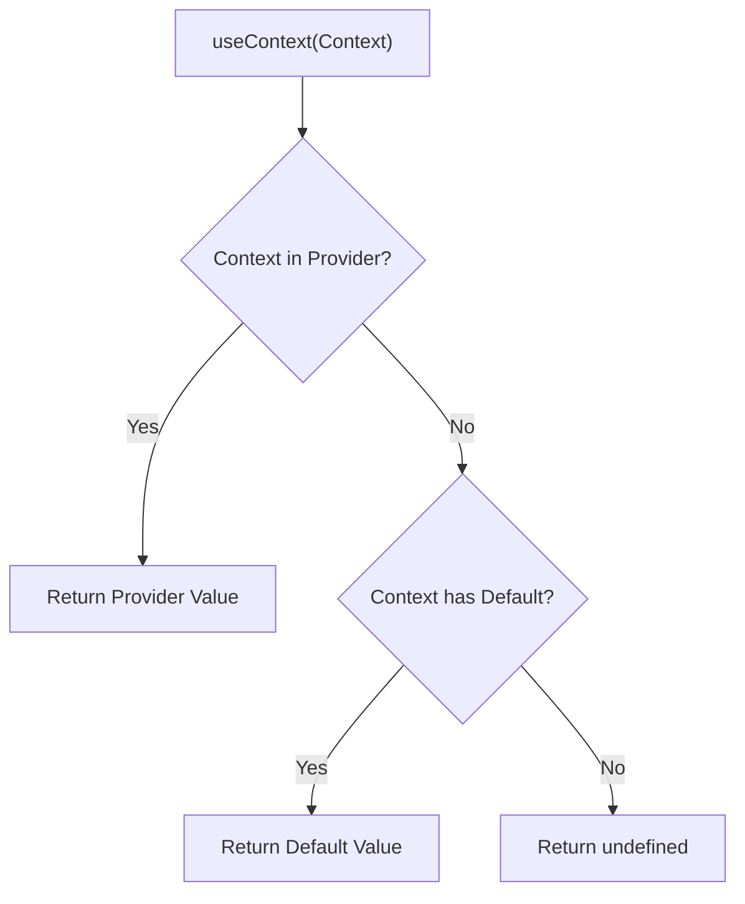
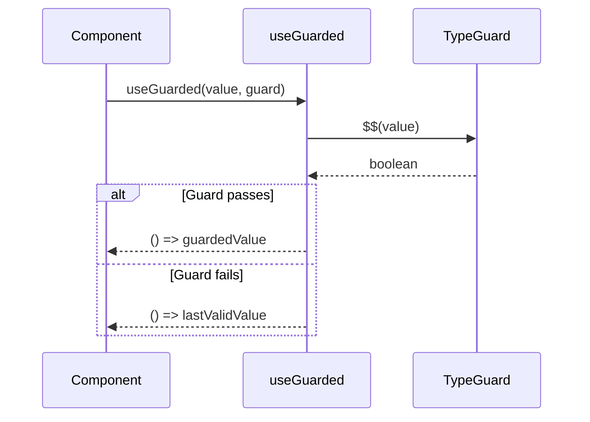
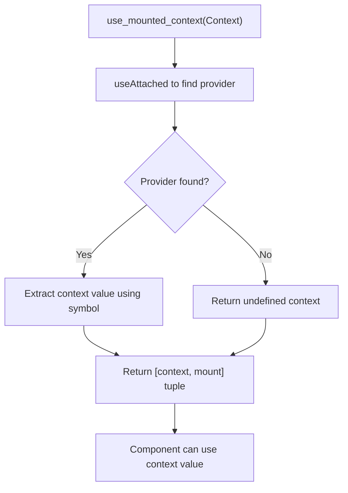
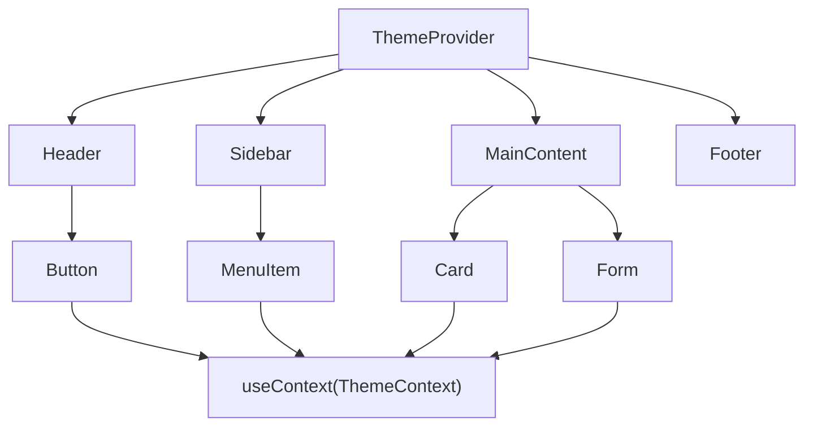

# Context and Dependency Injection Hooks

<cite>
**Referenced Files in This Document**   
- [use_context.ts](file://src/hooks/use_context.ts)
- [use_guarded.ts](file://src/hooks/use_guarded.ts)
- [use_assigned_slot.ts](file://src/hooks/use_assigned_slot.ts)
- [create_context.tsx](file://src/methods/create_context.tsx)
- [types.ts](file://src/types.ts)
- [constants.ts](file://src/constants.ts)
- [soby.ts](file://src/soby.ts)
- [use_mounted_context.ts](file://src/hooks/use_mounted_context.ts)
</cite>

## Table of Contents
1. [Introduction](#introduction)
2. [Core Context Hooks](#core-context-hooks)
3. [Context Creation and Provider Pattern](#context-creation-and-provider-pattern)
4. [Advanced Context Access Patterns](#advanced-context-access-patterns)
5. [Custom Element Integration](#custom-element-integration)
6. [Type Safety and Error Handling](#type-safety-and-error-handling)
7. [SSR and Lifecycle Considerations](#ssr-and-lifecycle-considerations)
8. [Common Patterns and Best Practices](#common-patterns-and-best-practices)
9. [Troubleshooting Guide](#troubleshooting-guide)
10. [Conclusion](#conclusion)

## Introduction

Woby's context and dependency injection system provides a robust mechanism for sharing state and services across component trees without prop drilling. The framework implements a React-like context API with additional features for type safety, custom element integration, and server-side rendering support. This documentation covers the core hooks and patterns for effective context usage in Woby applications.

The system is built on a combination of observable state management from Soby and Woby's own context propagation mechanisms. It supports both functional components and custom elements, making it versatile for different application architectures. The context system works seamlessly with Woby's reactivity model, ensuring efficient updates when context values change.

**Section sources**
- [use_context.ts](file://src/hooks/use_context.ts#L1-L78)
- [create_context.tsx](file://src/methods/create_context.tsx#L1-L133)

## Core Context Hooks

### useContext Hook

The `useContext` hook is the primary mechanism for consuming context values in Woby components. It provides access to the current value of a context object created with `createContext`. The hook supports both contexts with default values and those without, returning the appropriate type based on the context definition.

When called within a component, `useContext` traverses the component tree to find the nearest provider for the specified context. If no provider is found, it returns the default value specified during context creation, or undefined if no default was provided. This behavior ensures type safety while maintaining flexibility in component composition.

The hook is designed to work with Woby's observable system, automatically tracking dependencies and triggering re-renders when context values change. It integrates with both JSX components and custom elements, providing a consistent API across different component types.



**Diagram sources**
- [use_context.ts](file://src/hooks/use_context.ts#L1-L78)
- [create_context.tsx](file://src/methods/create_context.tsx#L1-L133)

**Section sources**
- [use_context.ts](file://src/hooks/use_context.ts#L1-L78)
- [types.ts](file://src/types.ts#L1-L799)

### use_guarded Hook

The `use_guarded` hook provides conditional access to context values with type narrowing capabilities. It accepts a value and a type guard function, returning a function that safely accesses the guarded value. This hook is particularly useful when working with contexts that may contain multiple types or when additional runtime type checking is required.

The implementation uses `useMemo` to optimize performance by only re-evaluating the guard when the underlying value changes. If the guard fails, the hook preserves the last valid value, preventing abrupt changes in the UI. When the value never passes the guard, calling the returned function throws an error, making failures explicit during development.

This pattern enables safer context consumption, especially in complex applications where context values might be conditionally available or have varying types based on application state.



**Diagram sources**
- [use_guarded.ts](file://src/hooks/use_guarded.ts#L1-L37)
- [types.ts](file://src/types.ts#L1-L799)

**Section sources**
- [use_guarded.ts](file://src/hooks/use_guarded.ts#L1-L37)
- [soby.ts](file://src/soby.ts#L1-L1)

## Context Creation and Provider Pattern

### createContext Function

The `createContext` function initializes a new context object with an optional default value. It returns a context object containing a Provider component that wraps child components and makes the context value available to them. The function supports both contexts with default values and those without, providing appropriate typing through overloaded signatures.

Each context is identified by a unique symbol, stored in the `CONTEXTS_DATA` WeakMap along with its default value. This design ensures that contexts are properly isolated and that default values are preserved across the application. The Provider component uses Woby's observable system to propagate value changes efficiently.

The implementation includes special handling for custom elements through the `context-provider` custom element, allowing context to be used in both JSX and HTML-based component trees. This dual support makes the context system versatile for different development approaches.

```mermaid
classDiagram
class Context[T] {
+Provider : ContextProvider[T]
+symbol : symbol
}
class ContextWithDefault[T] {
+Provider : ContextProvider[T]
+symbol : symbol
+[ContextWithDefaultSymbol] : true
}
class ContextProvider[T] {
+value : T
+children : Child
+symbol : symbol
}
Context <|-- ContextWithDefault
ContextProvider --> Context : "used by"
```

**Diagram sources**
- [create_context.tsx](file://src/methods/create_context.tsx#L1-L133)
- [constants.ts](file://src/constants.ts#L1-L27)
- [types.ts](file://src/types.ts#L1-L799)

**Section sources**
- [create_context.tsx](file://src/methods/create_context.tsx#L1-L133)
- [constants.ts](file://src/constants.ts#L1-L27)

### Provider Component Implementation

The Provider component serves as the injection point for context values in the component tree. When rendered, it establishes a new context boundary and makes its value available to all descendants. The component uses Woby's `context` function to create a new observable scope, ensuring that value changes trigger appropriate updates.

A key aspect of the Provider implementation is its use of a comment node reference to store context data. This approach allows the context value to be accessed through the DOM tree, which is essential for custom element integration. The useEffect hook ensures proper cleanup by removing the context property when the Provider unmounts.

The Provider supports both JSX components and custom elements through the `context-provider` custom element registration. This dual implementation ensures consistent behavior regardless of the component type being used, making the context system truly universal across different Woby application architectures.

**Section sources**
- [create_context.tsx](file://src/methods/create_context.tsx#L1-L133)
- [hooks/index.ts](file://src/hooks/index.ts#L1-L18)

## Advanced Context Access Patterns

### use_mounted_context Hook

The `use_mounted_context` hook extends the basic context functionality with enhanced support for custom elements and mounting scenarios. It combines context access with element attachment tracking, providing both the context value and a mounting placeholder when needed.

This hook is particularly useful when the context value needs to be processed or transformed before rendering. In such cases, the mounting placeholder ensures that the component remains properly connected to the context system. The hook uses `useAttached` to track the parent element and detect when a context provider is available.

For custom elements, the hook traverses the DOM tree to find a parent element with the appropriate context symbol. For JSX components, it falls back to the standard context system. This hybrid approach ensures seamless context access across different component types and rendering scenarios.



**Diagram sources**
- [use_mounted_context.ts](file://src/hooks/use_mounted_context.ts#L1-L113)
- [use_attached.ts](file://src/hooks/use_attached.ts#L1-L100)

**Section sources**
- [use_mounted_context.ts](file://src/hooks/use_mounted_context.ts#L1-L113)
- [use_attached.ts](file://src/hooks/use_attached.ts#L1-L100)

## Custom Element Integration

### Context in Custom Elements

Woby's context system is designed to work seamlessly with custom elements, allowing context values to be shared between JSX components and HTML-based custom elements. This integration is achieved through the `context-provider` custom element and special property access patterns.

When a custom element is nested within a context provider, it can access the context value through the parent element's properties. The context value is stored using the context's unique symbol, making it accessible via bracket notation. This approach maintains encapsulation while allowing cross-component communication.

The system supports both direct context access in simple cases and more complex scenarios requiring mounting placeholders. This flexibility ensures that custom elements can participate fully in the context system, regardless of their complexity or rendering requirements.

**Section sources**
- [create_context.tsx](file://src/methods/create_context.tsx#L1-L133)
- [use_mounted_context.ts](file://src/hooks/use_mounted_context.ts#L1-L113)

## Type Safety and Error Handling

### Strong Typing with Generics

Woby's context system leverages TypeScript generics to provide strong typing for context values. The `useContext` hook has overloaded signatures that distinguish between contexts with default values and those without, ensuring appropriate return types.

The `ContextWithDefault` type includes a unique symbol to differentiate it from regular contexts at the type level. This design allows the type system to infer whether a context has a default value, eliminating the need for undefined checks when a default is provided.

Type safety extends to the `use_guarded` hook, which uses TypeScript's type predicates to narrow the type of the context value based on the guard function. This pattern enables safer access to context values while maintaining the benefits of dynamic type checking.

```mermaid
classDiagram
class Context[T] {
+Provider : ContextProvider[T]
+symbol : symbol
}
class ContextWithDefault[T] {
+Provider : ContextProvider[T]
+symbol : symbol
}
Context <|-- ContextWithDefault
Context : T | undefined
ContextWithDefault : T
```

**Diagram sources**
- [types.ts](file://src/types.ts#L1-L799)
- [use_context.ts](file://src/hooks/use_context.ts#L1-L78)

**Section sources**
- [types.ts](file://src/types.ts#L1-L799)
- [use_context.ts](file://src/hooks/use_context.ts#L1-L78)

### Error Handling and Fallbacks

The context system includes several mechanisms for handling edge cases and potential errors. The `use_guarded` hook throws an error when a value never passes its type guard, making failures explicit during development. This approach prevents silent failures and helps identify issues early in the development process.

For cases where context values might be temporarily unavailable, the system preserves the last valid value rather than reverting to defaults or undefined. This behavior prevents flickering in the UI and provides a more stable user experience during state transitions.

The use of WeakMap for storing context metadata ensures that contexts are properly garbage collected when no longer referenced, preventing memory leaks in long-running applications.

**Section sources**
- [use_guarded.ts](file://src/hooks/use_guarded.ts#L1-L37)
- [use_context.ts](file://src/hooks/use_context.ts#L1-L78)

## SSR and Lifecycle Considerations

### Server-Side Rendering Support

Woby's context system is designed to work seamlessly with server-side rendering (SSR). The context values are properly serialized and hydrated during the SSR process, ensuring that the initial render on the client matches the server output.

The use of symbols for context identification is SSR-safe, as the same symbol references are maintained across server and client renders. This consistency ensures that context values are properly restored during hydration, preventing mismatches between server and client renders.

The Provider component's implementation with comment nodes is compatible with SSR, as these nodes are properly rendered and can be accessed during client-side hydration. This approach maintains the context tree structure across the server-client boundary.

**Section sources**
- [create_context.tsx](file://src/methods/create_context.tsx#L1-L133)
- [ssr.js](file://ssr.js#L1-L100)

## Common Patterns and Best Practices

### Theme Propagation

Context is commonly used for theme propagation, allowing UI themes to be shared across an application. A theme context can provide values for colors, typography, and other design tokens, enabling consistent styling across components.



**Diagram sources**
- [create_context.tsx](file://src/methods/create_context.tsx#L1-L133)
- [use_context.ts](file://src/hooks/use_context.ts#L1-L78)

### Service Injection

Context can be used for dependency injection, providing services like authentication, data fetching, or logging to components throughout the application. This pattern eliminates the need to pass service instances through multiple levels of components.

### Nested Component Communication

Context enables communication between nested components without requiring direct references. Parent components can provide values that are consumed by deeply nested children, facilitating complex interactions while maintaining loose coupling.

**Section sources**
- [create_context.tsx](file://src/methods/create_context.tsx#L1-L133)
- [use_context.ts](file://src/hooks/use_context.ts#L1-L78)

## Troubleshooting Guide

### Context Invalidation Issues

When context values are not updating as expected, verify that:
- The Provider component is properly wrapped around consuming components
- The context value is being updated through proper observable mechanisms
- There are no circular dependencies in the context tree

### Provider Hierarchy Problems

Ensure that providers are nested in the correct order when multiple contexts are used. The order of providers affects the availability of context values to consuming components.

### Type Safety Issues

When encountering type errors with context usage:
- Verify that the context type matches the expected value type
- Check that default values are properly typed
- Ensure that type guards in use_guarded are correctly implemented

**Section sources**
- [use_context.ts](file://src/hooks/use_context.ts#L1-L78)
- [use_guarded.ts](file://src/hooks/use_guarded.ts#L1-L37)
- [create_context.tsx](file://src/methods/create_context.tsx#L1-L133)

## Conclusion

Woby's context and dependency injection system provides a comprehensive solution for state sharing and service injection in web applications. The combination of React-like APIs with enhanced features for custom elements and type safety makes it a versatile tool for modern web development.

The system's design prioritizes performance, type safety, and developer experience, with clear patterns for common use cases and robust error handling. Its seamless integration with SSR and custom elements ensures that applications can be built using the most appropriate tools for each scenario.

By following the patterns and best practices outlined in this documentation, developers can effectively leverage Woby's context system to build scalable, maintainable applications with clean component architectures.