# Event and Timing Hooks

<cite>
**Referenced Files in This Document**   
- [use_event_listener.ts](file://src/hooks/use_event_listener.ts)
- [use_timeout.ts](file://src/hooks/use_timeout.ts)
- [use_interval.ts](file://src/hooks/use_interval.ts)
- [use_animation_frame.ts](file://src/hooks/use_animation_frame.ts)
- [use_animation_loop.ts](file://src/hooks/use_animation_loop.ts)
- [use_idle_callback.ts](file://src/hooks/use_idle_callback.ts)
- [use_idle_loop.ts](file://src/hooks/use_idle_loop.ts)
- [use_microtask.ts](file://src/hooks/use_microtask.ts)
- [use_scheduler.ts](file://src/hooks/use_scheduler.ts)
</cite>

## Table of Contents
1. [Introduction](#introduction)
2. [Event Handling Hook](#event-handling-hook)
3. [Timing Hooks](#timing-hooks)
4. [Animation Hooks](#animation-hooks)
5. [Idle Callback Hooks](#idle-callback-hooks)
6. [Microtask Hook](#microtask-hook)
7. [Scheduler Core](#scheduler-core)
8. [Usage Examples](#usage-examples)
9. [Lifecycle Integration](#lifecycle-integration)
10. [Conclusion](#conclusion)

## Introduction
Woby provides a comprehensive suite of event and timing hooks designed for declarative event binding and precise timing control in reactive applications. These hooks abstract away manual resource management, providing automatic cleanup and disposal guarantees that integrate seamlessly with component lifecycles. This document details the event and timing hooks available in Woby, focusing on their declarative nature, automatic disposal mechanisms, and integration with the component lifecycle.

## Event Handling Hook

The `useEventListener` hook provides declarative DOM event binding with automatic cleanup on component unmount. It supports a wide range of event targets including Window, Document, HTMLElement, SVGElement, and various specialized web APIs.

The hook accepts a target (or array of targets), an event name, an event handler, and optional event listener options. It automatically handles adding event listeners during component initialization and removing them when the component is unmounted, preventing memory leaks and ensuring proper resource cleanup.

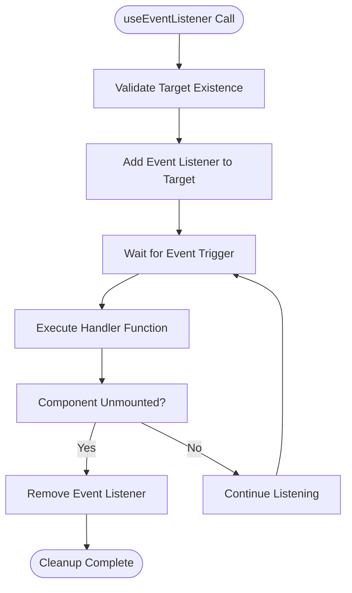

**Diagram sources**
- [use_event_listener.ts](file://src/hooks/use_event_listener.ts#L63-L95)

**Section sources**
- [use_event_listener.ts](file://src/hooks/use_event_listener.ts#L63-L95)

## Timing Hooks

Woby provides two primary timing hooks for delayed or repeated execution: `useTimeout` and `useInterval`. Both hooks offer disposal guarantees and integrate with the component lifecycle to prevent execution after component unmount.

### useTimeout
The `useTimeout` hook schedules a function to execute after a specified delay. Unlike the native setTimeout, this hook automatically cancels the timeout when the component is unmounted, preventing potential errors from executing callbacks on unmounted components.

### useInterval
The `useInterval` hook repeatedly executes a function at specified intervals. It automatically clears the interval when the component is unmounted, ensuring that callbacks are not executed on components that no longer exist in the DOM.

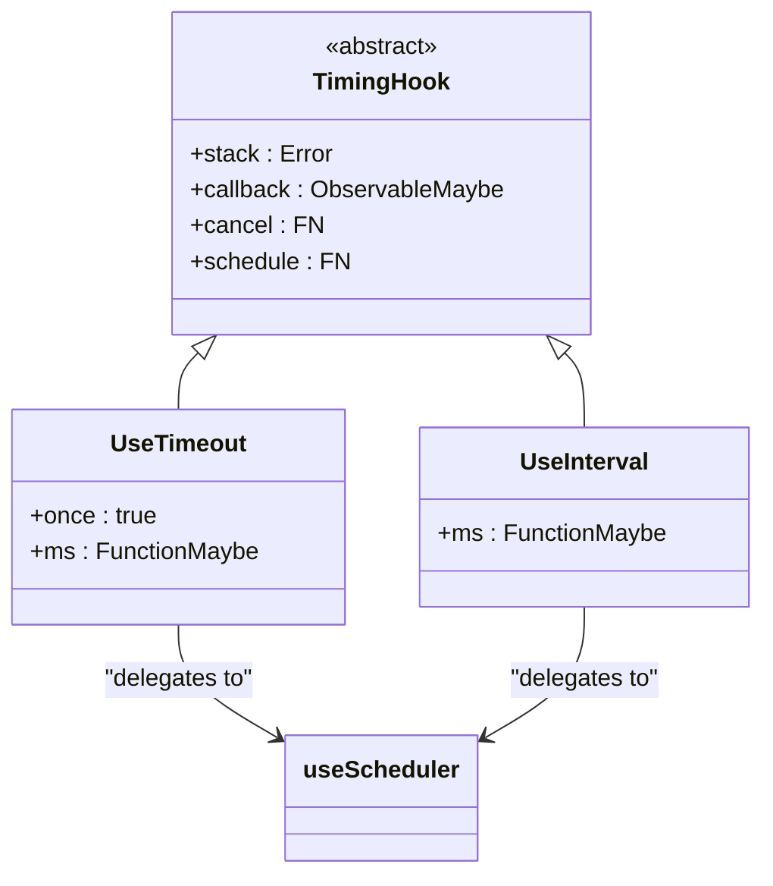

**Diagram sources**
- [use_timeout.ts](file://src/hooks/use_timeout.ts#L7-L19)
- [use_interval.ts](file://src/hooks/use_interval.ts#L7-L18)
- [use_scheduler.ts](file://src/hooks/use_scheduler.ts#L10-L52)

**Section sources**
- [use_timeout.ts](file://src/hooks/use_timeout.ts#L7-L19)
- [use_interval.ts](file://src/hooks/use_interval.ts#L7-L18)

## Animation Hooks

For smooth 60fps animations, Woby provides animation-focused hooks that leverage requestAnimationFrame for optimal performance.

### useAnimationFrame
The `useAnimationFrame` hook executes a callback during the next browser repaint cycle. This is ideal for one-time animations or visual effects that need to be synchronized with the display refresh rate.

### useAnimationLoop
The `useAnimationLoop` hook creates a continuous animation loop by repeatedly calling requestAnimationFrame. This is perfect for games, data visualizations, or any application requiring smooth, continuous updates at 60 frames per second.

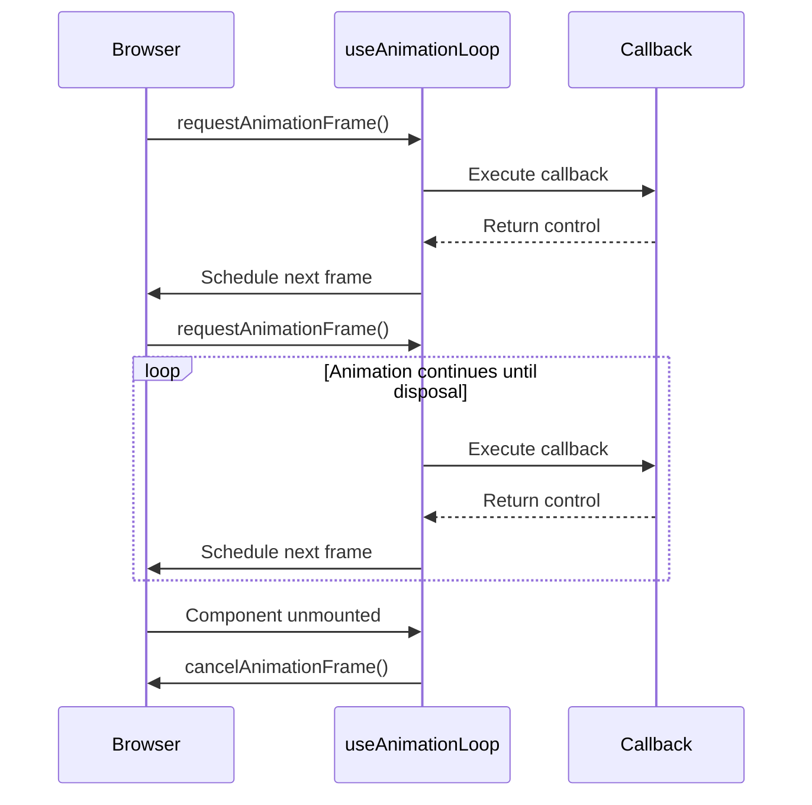

**Diagram sources**
- [use_animation_frame.ts](file://src/hooks/use_animation_frame.ts#L6-L17)
- [use_animation_loop.ts](file://src/hooks/use_animation_loop.ts#L6-L17)

**Section sources**
- [use_animation_frame.ts](file://src/hooks/use_animation_frame.ts#L6-L17)
- [use_animation_loop.ts](file://src/hooks/use_animation_loop.ts#L6-L17)

## Idle Callback Hooks

For background task scheduling that doesn't impact user experience, Woby provides hooks that leverage the IdleDeadline API.

### useIdleCallback
The `useIdleCallback` hook schedules a function to execute during the browser's idle periods. This is ideal for low-priority tasks like analytics reporting, prefetching data, or cleaning up unused resources.

### useIdleLoop
The `useIdleLoop` hook creates a repeating idle callback loop, executing a function during each available idle period. This allows for continuous background processing without affecting main thread performance.

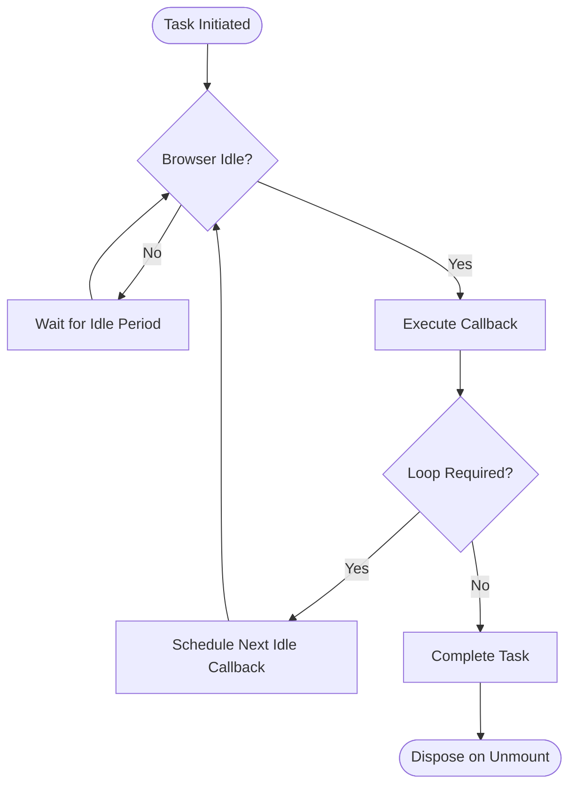

**Diagram sources**
- [use_idle_callback.ts](file://src/hooks/use_idle_callback.ts#L7-L19)
- [use_idle_loop.ts](file://src/hooks/use_idle_loop.ts#L7-L19)

**Section sources**
- [use_idle_callback.ts](file://src/hooks/use_idle_callback.ts#L7-L19)
- [use_idle_loop.ts](file://src/hooks/use_idle_loop.ts#L7-L19)

## Microtask Hook

The `useMicrotask` hook enables post-render asynchronous operations by leveraging the microtask queue. This is particularly useful for operations that need to occur after the current rendering cycle but before the next repaint.

Microtasks are executed after the current task completes and before the browser performs rendering or handles other events. This makes them ideal for batch processing updates, handling promises, or performing cleanup operations that should happen immediately after rendering.

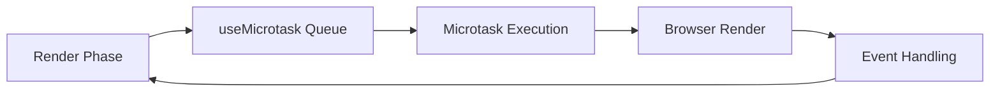

**Diagram sources**
- [use_microtask.ts](file://src/hooks/use_microtask.ts#L10-L23)

**Section sources**
- [use_microtask.ts](file://src/hooks/use_microtask.ts#L10-L23)

## Scheduler Core

All timing and animation hooks in Woby are built on a unified `useScheduler` core that provides consistent disposal and lifecycle integration. This central scheduler handles the common patterns of scheduling, cancellation, and cleanup across different timing APIs.

The scheduler manages execution state, tracks suspension status, and ensures proper disposal of scheduled tasks. It integrates with Woby's reactive system to prevent execution when components are suspended and automatically cleans up resources when components are unmounted.

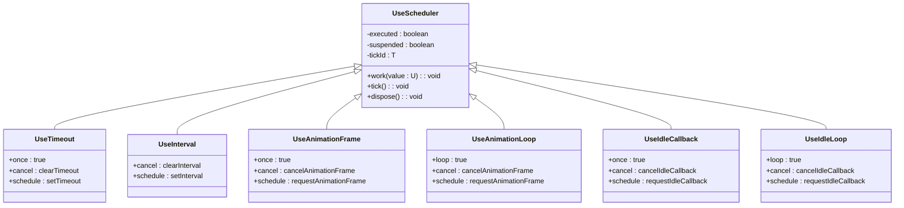

**Diagram sources**
- [use_scheduler.ts](file://src/hooks/use_scheduler.ts#L10-L52)

**Section sources**
- [use_scheduler.ts](file://src/hooks/use_scheduler.ts#L10-L52)

## Usage Examples

### Gesture Handling
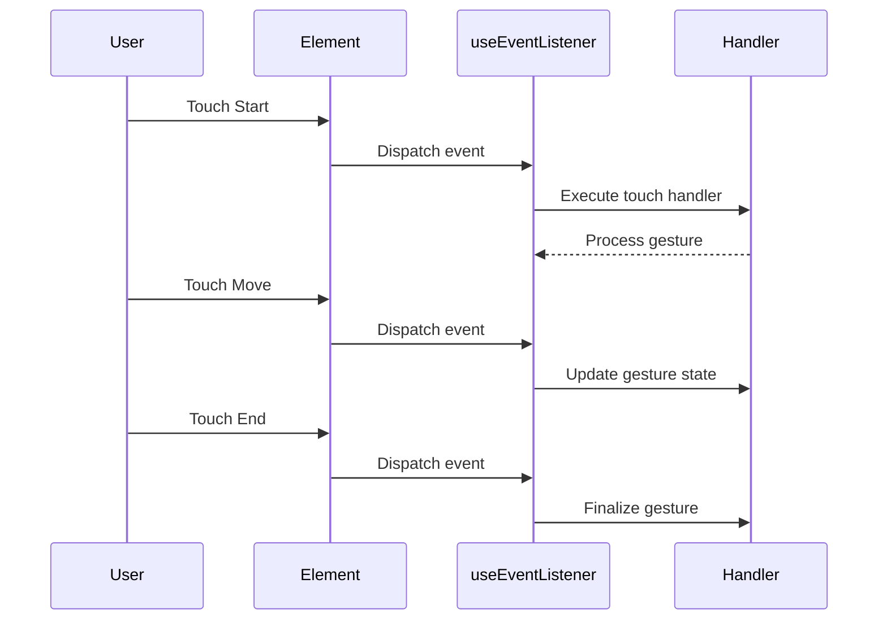

### Polling with useInterval
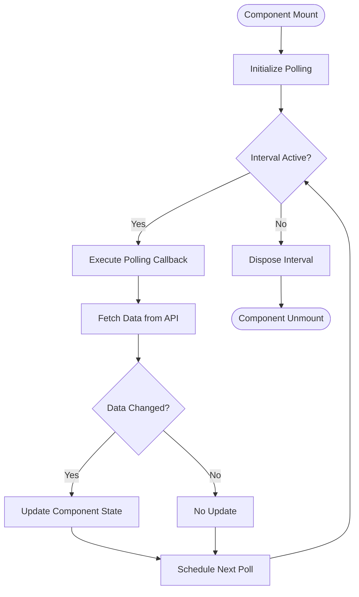

### Animation Loop
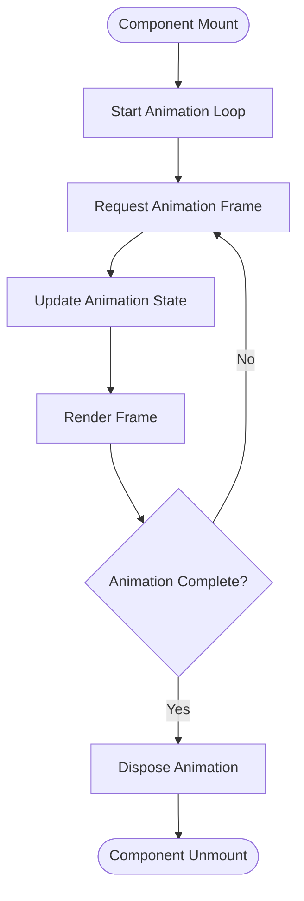

### Background Task Scheduling
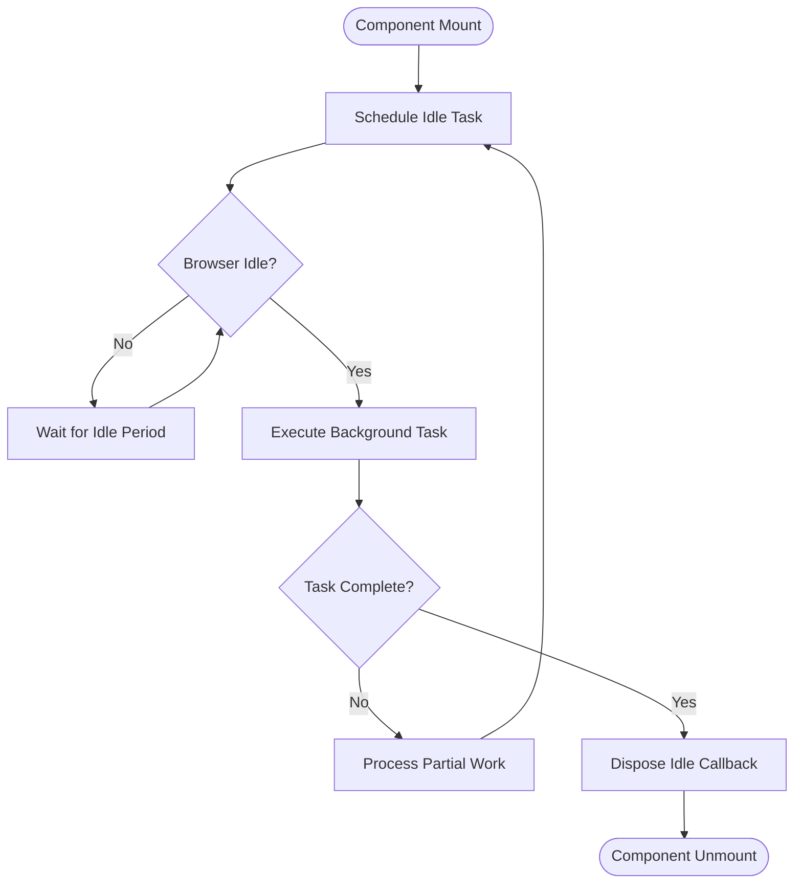

## Lifecycle Integration

All Woby event and timing hooks are designed to integrate seamlessly with component lifecycles, ensuring proper resource management and preventing common issues like memory leaks or execution on unmounted components.

The hooks leverage Woby's effect system to automatically clean up resources when components are unmounted. Each hook returns a disposer function that can be used for manual cleanup if needed, but in most cases, the automatic cleanup provided by the effect system is sufficient.

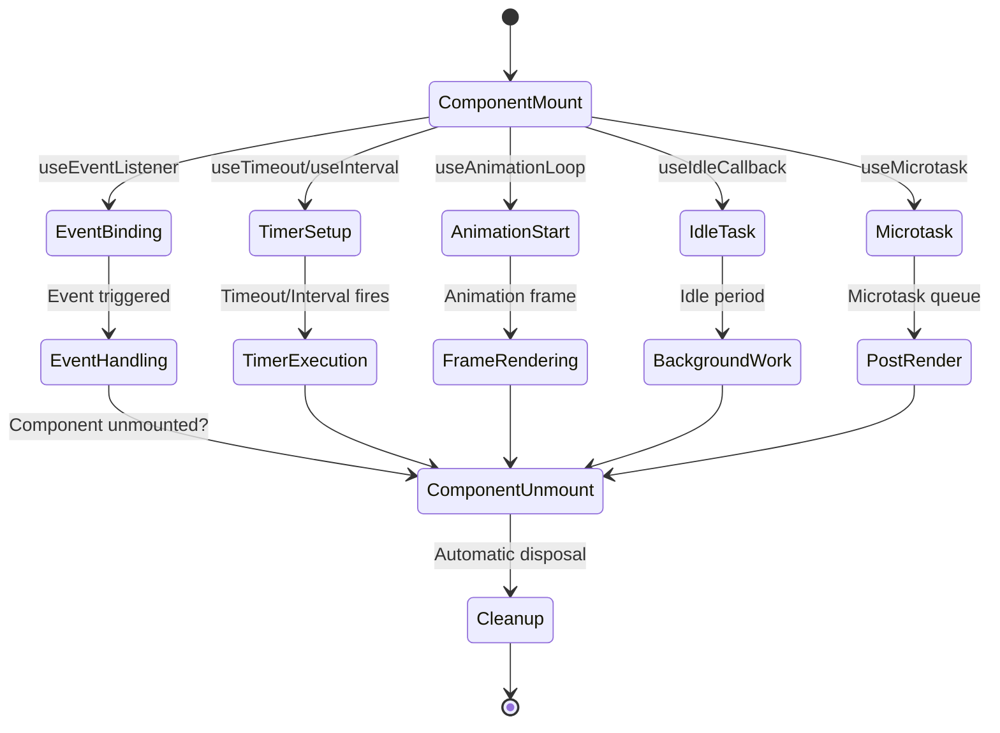

**Diagram sources**
- [use_event_listener.ts](file://src/hooks/use_event_listener.ts#L63-L95)
- [use_timeout.ts](file://src/hooks/use_timeout.ts#L7-L19)
- [use_interval.ts](file://src/hooks/use_interval.ts#L7-L18)
- [use_animation_loop.ts](file://src/hooks/use_animation_loop.ts#L6-L17)
- [use_idle_callback.ts](file://src/hooks/use_idle_callback.ts#L7-L19)
- [use_microtask.ts](file://src/hooks/use_microtask.ts#L10-L23)

## Conclusion

Woby's event and timing hooks provide a robust, declarative approach to handling asynchronous operations in reactive applications. By abstracting away manual resource management, these hooks ensure automatic cleanup and disposal, preventing common issues like memory leaks and execution on unmounted components.

The unified scheduler architecture provides consistency across different timing APIs while maintaining the specific characteristics of each. From DOM event handling to animation loops and background task scheduling, Woby's hooks offer a comprehensive solution for managing time-based operations in modern web applications.

By leveraging these hooks, developers can focus on application logic rather than resource management, resulting in cleaner, more maintainable code that integrates seamlessly with component lifecycles.