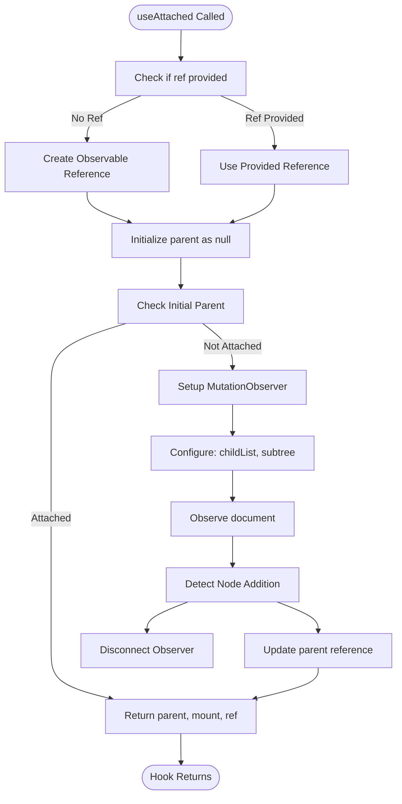
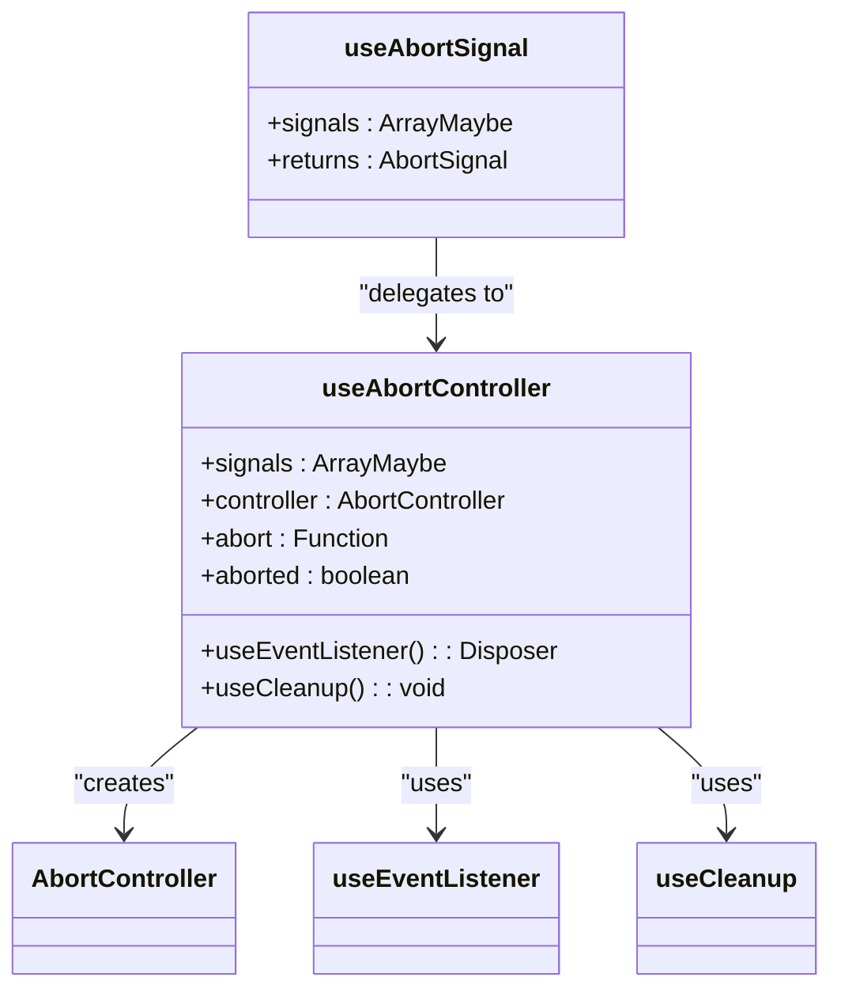
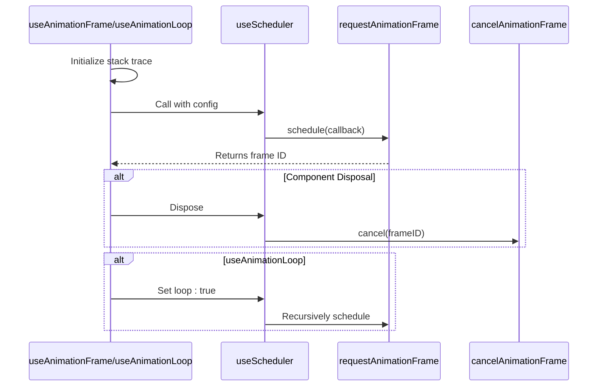
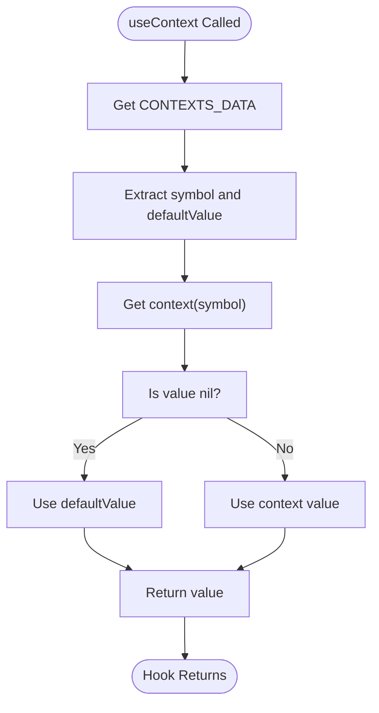
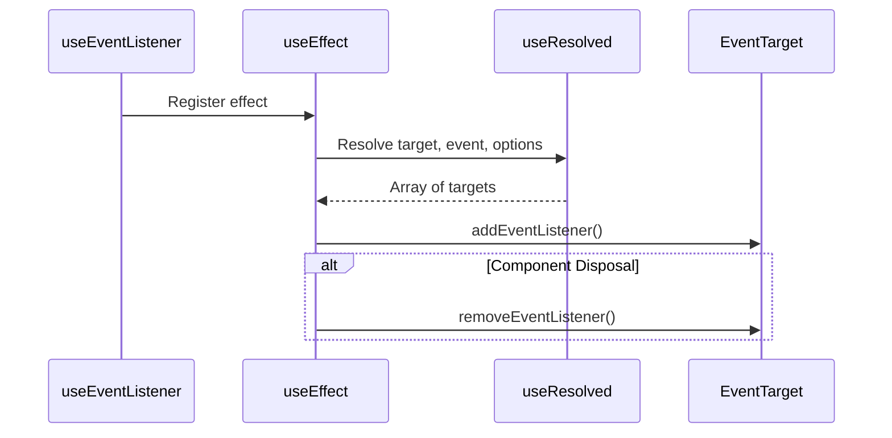
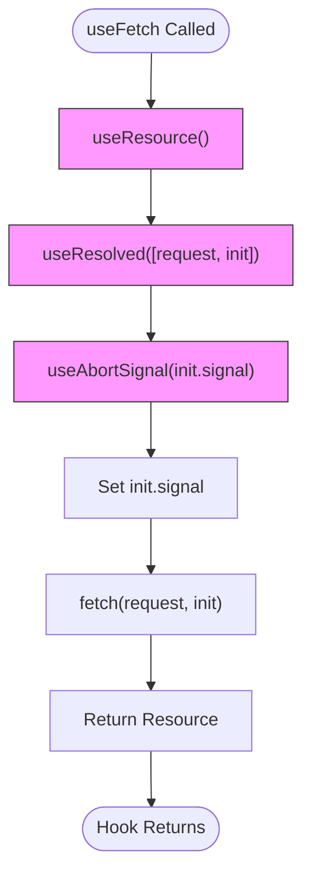
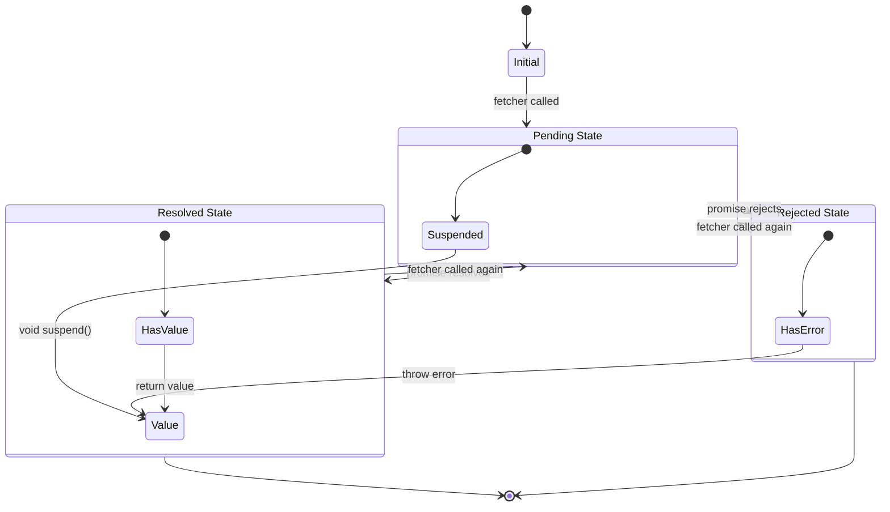

# Hooks API

<cite>
**Referenced Files in This Document**   
- [use_attached.ts](file://src/hooks/use_attached.ts)
- [use_abort_controller.ts](file://src/hooks/use_abort_controller.ts)
- [use_abort_signal.ts](file://src/hooks/use_abort_signal.ts)
- [use_animation_frame.ts](file://src/hooks/use_animation_frame.ts)
- [use_animation_loop.ts](file://src/hooks/use_animation_loop.ts)
- [use_context.ts](file://src/hooks/use_context.ts)
- [use_event_listener.ts](file://src/hooks/use_event_listener.ts)
- [use_fetch.ts](file://src/hooks/use_fetch.ts)
- [use_resource.ts](file://src/hooks/use_resource.ts)
- [use_promise.ts](file://src/hooks/use_promise.ts)
- [use_timeout.ts](file://src/hooks/use_timeout.ts)
- [use_interval.ts](file://src/hooks/use_interval.ts)
</cite>

## Table of Contents
1. [Introduction](#introduction)
2. [useAttached - Detecting DOM Attachment](#useattached---detecting-dom-attachment)
3. [useAbortController and useAbortSignal - Cancellation Management](#useabortcontroller-and-useabortsinal---cancellation-management)
4. [useAnimationFrame and useAnimationLoop - Animation Timing](#useanimationframe-and-useanimationloop---animation-timing)
5. [useContext - Context Value Consumption](#usecontext---context-value-consumption)
6. [useEventListener - Declarative Event Binding](#useeventlistener---declarative-event-binding)
7. [useFetch - Declarative HTTP Requests](#usefetch---declarative-http-requests)
8. [useResource - Async Resource Management](#useresource---async-resource-management)
9. [usePromise - Promise State Tracking](#usepromise---promise-state-tracking)
10. [Timing Hooks - useTimeout and useInterval](#timing-hooks---usetimeout-and-useinterval)
11. [Integration with Observable State](#integration-with-observable-state)

## Introduction
The Woby hooks system provides a comprehensive set of utilities for managing component lifecycle, asynchronous operations, and reactive state. These hooks are designed to work seamlessly with observable values and provide automatic cleanup mechanisms to prevent memory leaks. This documentation covers the core hooks that enable developers to build robust, reactive applications with proper resource management and lifecycle handling.

## useAttached - Detecting DOM Attachment

The `useAttached` hook enables detection of when a component or DOM node is attached to the document. It provides a mechanism to track parent relationships and determine attachment status through mutation observation.

The hook accepts an optional reference to a DOM node and a matching function to determine attachment criteria. When no reference is provided, it creates an observable reference internally. It uses `MutationObserver` to monitor child list changes in the document, allowing it to detect when nodes are added or removed from the DOM tree.

Key features include:
- Automatic parent tracking through `parentNode` and `assignedSlot` properties
- Custom matching logic for complex attachment conditions
- MutationObserver-based detection for reliable attachment monitoring
- Automatic cleanup of observers when components are disposed



**Diagram sources**
- [use_attached.ts](file://src/hooks/use_attached.ts#L1-L210)

**Section sources**
- [use_attached.ts](file://src/hooks/use_attached.ts#L1-L210)

## useAbortController and useAbortSignal - Cancellation Management

The `useAbortController` and `useAbortSignal` hooks provide a standardized approach to managing cancellation tokens for asynchronous operations. These hooks integrate with the Web AbortController API to enable clean cancellation of pending operations.

`useAbortController` creates an `AbortController` instance and automatically subscribes to abort signals from provided `AbortSignal` objects. It handles immediate abortion if any signal is already aborted and sets up event listeners for future abort events. The hook ensures proper cleanup by registering the abort function with the component's cleanup mechanism.

`useAbortSignal` is a convenience wrapper around `useAbortController` that returns only the signal property, making it easier to pass cancellation tokens to fetch operations and other APIs that accept `AbortSignal`.

Key behaviors:
- Automatic connection to multiple abort signals
- Immediate abortion if any signal is already aborted
- Proper cleanup of event listeners on component disposal
- Integration with Woby's effect system for automatic disposal



**Diagram sources**
- [use_abort_controller.ts](file://src/hooks/use_abort_controller.ts#L1-L32)
- [use_abort_signal.ts](file://src/hooks/use_abort_signal.ts#L1-L12)

**Section sources**
- [use_abort_controller.ts](file://src/hooks/use_abort_controller.ts#L1-L32)
- [use_abort_signal.ts](file://src/hooks/use_abort_signal.ts#L1-L12)

## useAnimationFrame and useAnimationLoop - Animation Timing

The `useAnimationFrame` and `useAnimationLoop` hooks provide requestAnimationFrame-based timing functions with automatic cleanup. Both hooks leverage the `useScheduler` utility for consistent scheduling behavior.

`useAnimationFrame` schedules a callback to run once during the next animation frame, making it ideal for one-time animations or layout measurements. `useAnimationLoop` creates a continuous animation loop that runs on every animation frame, suitable for ongoing animations like games or visualizations.

Both hooks ensure proper disposal by canceling the animation frame request when the component is unmounted or recomputed. They capture a stack trace for debugging purposes and integrate with Woby's reactive system to respond to changes in observable dependencies.



**Diagram sources**
- [use_animation_frame.ts](file://src/hooks/use_animation_frame.ts#L1-L19)
- [use_animation_loop.ts](file://src/hooks/use_animation_loop.ts#L1-L19)

**Section sources**
- [use_animation_frame.ts](file://src/hooks/use_animation_frame.ts#L1-L19)
- [use_animation_loop.ts](file://src/hooks/use_animation_loop.ts#L1-L19)

## useContext - Context Value Consumption

The `useContext` hook enables access to context values within functional components. It works with contexts created by `createContext` and supports both default values and undefined values.

The hook first attempts to retrieve context values from a symbol-based lookup system. If no value is found, it falls back to Woby's context system. It handles both contexts with default values and those without, providing proper typing through function overloads.

Key features:
- Type-safe context consumption with proper generics
- Support for default values and undefined values
- Integration with Woby's reactive system
- Symbol-based context identification for performance



**Diagram sources**
- [use_context.ts](file://src/hooks/use_context.ts#L1-L79)

**Section sources**
- [use_context.ts](file://src/hooks/use_context.ts#L1-L79)

## useEventListener - Declarative Event Binding

The `useEventListener` hook provides a declarative way to bind event listeners with automatic disposal. It supports multiple event targets and various event types through method overloads.

The hook uses `useEffect` to set up event listeners and returns a cleanup function that removes the listeners when the component is disposed. It handles multiple targets through `castArray` and supports various options like capture phase and passive events.

Key capabilities:
- Type-safe event handling with specific event maps
- Support for multiple event targets
- Automatic cleanup of event listeners
- Integration with observable values for dynamic targets and handlers



**Diagram sources**
- [use_event_listener.ts](file://src/hooks/use_event_listener.ts#L1-L96)

**Section sources**
- [use_event_listener.ts](file://src/hooks/use_event_listener.ts#L1-L96)

## useFetch - Declarative HTTP Requests

The `useFetch` hook provides a declarative interface for making HTTP requests with built-in abort control and reactivity. It wraps `useResource` and `useAbortSignal` to manage the full lifecycle of fetch operations.

The hook creates an `AbortSignal` from the provided init options or creates a new one, ensuring that ongoing requests can be canceled when the component is disposed. It uses `useResolved` to handle observable dependencies in the request and init parameters.

Key features:
- Built-in abort signal management
- Reactive handling of request parameters
- Integration with useResource for state management
- Proper error handling and promise resolution



**Diagram sources**
- [use_fetch.ts](file://src/hooks/use_fetch.ts#L1-L26)

**Section sources**
- [use_fetch.ts](file://src/hooks/use_fetch.ts#L1-L26)

## useResource - Async Resource Management

The `useResource` hook manages asynchronous resources with pending, error, and resolved states. It provides a comprehensive state object that reflects the current status of an async operation.

The hook creates observables for pending, error, and value states, and uses `useRenderEffect` to execute the fetcher function. It handles both promise and non-promise return values, providing a consistent interface regardless of the fetcher's return type.

Key states:
- `pending`: Boolean indicating if the resource is loading
- `error`: Error object if the operation failed
- `value`: Resolved value (suspends if pending)
- `latest`: Latest value (even if error occurred)
- Functions to access raw values: `pending()`, `error()`, `value()`, `latest()`



**Diagram sources**
- [use_resource.ts](file://src/hooks/use_resource.ts#L1-L106)

**Section sources**
- [use_resource.ts](file://src/hooks/use_resource.ts#L1-L106)

## usePromise - Promise State Tracking

The `usePromise` hook provides a way to track the state of a promise with the same interface as `useResource`. It's a convenience wrapper that converts a promise into a resource object.

The hook uses `useResource` internally, passing the promise through `$$` to resolve observable values. This creates a consistent interface for handling async operations, whether they're created directly as promises or through more complex fetcher functions.

```mermaid
classDiagram
class usePromise {
+promise : FunctionMaybe<Promise<T>>
+returns : Resource<T>
}
class useResource {
+fetcher : () => ObservableMaybe<PromiseMaybe<T>>
+returns : Resource<T>
}
usePromise --> useResource : "delegates to"
usePromise --> $$ : "resolves observable"
```

**Diagram sources**
- [use_promise.ts](file://src/hooks/use_promise.ts#L1-L11)
- [use_resource.ts](file://src/hooks/use_resource.ts#L1-L106)

**Section sources**
- [use_promise.ts](file://src/hooks/use_promise.ts#L1-L11)

## Timing Hooks - useTimeout and useInterval

The `useTimeout` and `useInterval` hooks provide setTimeout and setInterval functionality with automatic cleanup. Both hooks use `useScheduler` for consistent behavior and proper disposal.

`useTimeout` schedules a callback to run once after a specified delay, while `useInterval` schedules a callback to run repeatedly at specified intervals. Both hooks support observable values for the callback and delay parameters, enabling dynamic timing behavior.

Key features:
- Automatic cleanup of timers on component disposal
- Support for observable delay values
- Integration with Woby's error handling (stack capture)
- Consistent API through useScheduler abstraction

```mermaid
flowchart TD
Start([Timing Hook Called]) --> CaptureStack["Capture stack trace"]
CaptureStack --> CallScheduler["useScheduler(config)"]
CallScheduler --> DefineConfig["Config: callback, cancel, schedule"]
DefineConfig --> SetOnce["useTimeout: once=true"]
DefineConfig --> SetLoop["useInterval: loop=true"]
SetOnce --> CreateTimer["setTimeout/setInterval"]
SetLoop --> CreateTimer
CreateTimer --> ReturnDisposer["Return disposer function"]
ReturnDisposer --> End([Hook Returns])
alt Component Disposal
ReturnDisposer --> ClearTimer["clearTimeout/clearInterval"]
end
```

**Diagram sources**
- [use_timeout.ts](file://src/hooks/use_timeout.ts#L1-L21)
- [use_interval.ts](file://src/hooks/use_interval.ts#L1-L20)

**Section sources**
- [use_timeout.ts](file://src/hooks/use_timeout.ts#L1-L21)
- [use_interval.ts](file://src/hooks/use_interval.ts#L1-L20)

## Integration with Observable State

The Woby hooks system is designed to work seamlessly with observable state. All hooks that accept function parameters can handle both regular functions and observable values, enabling reactive behavior without manual effect management.

Key integration patterns:
- Observable parameters automatically trigger hook re-execution
- Automatic cleanup prevents memory leaks
- Consistent disposal patterns across all hooks
- Stack trace capture for debugging async operations

The hooks leverage Woby's reactivity system to respond to changes in observable dependencies, ensuring that operations are properly canceled and restarted when needed. This creates a robust system for managing side effects and asynchronous operations in reactive applications.