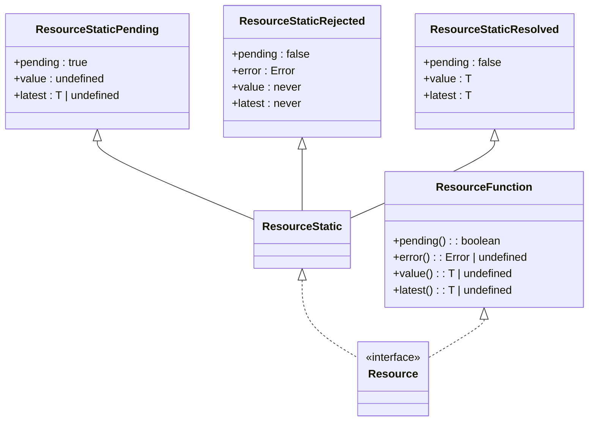
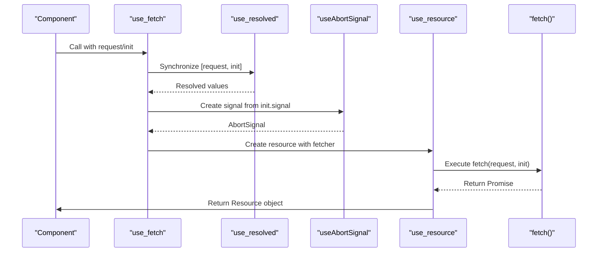
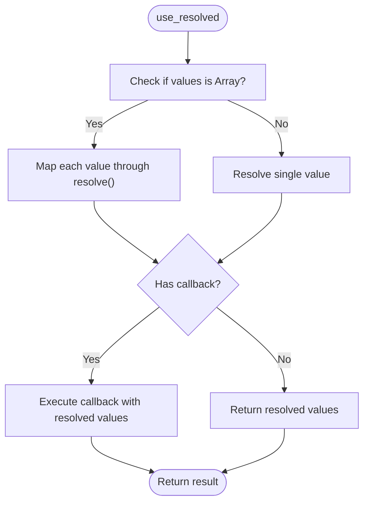
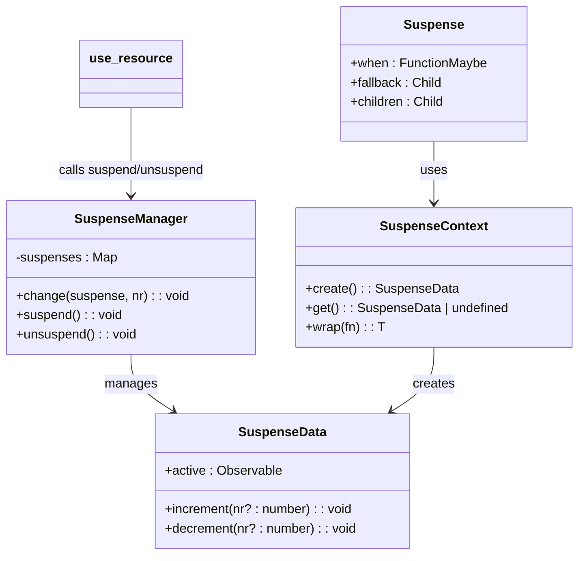
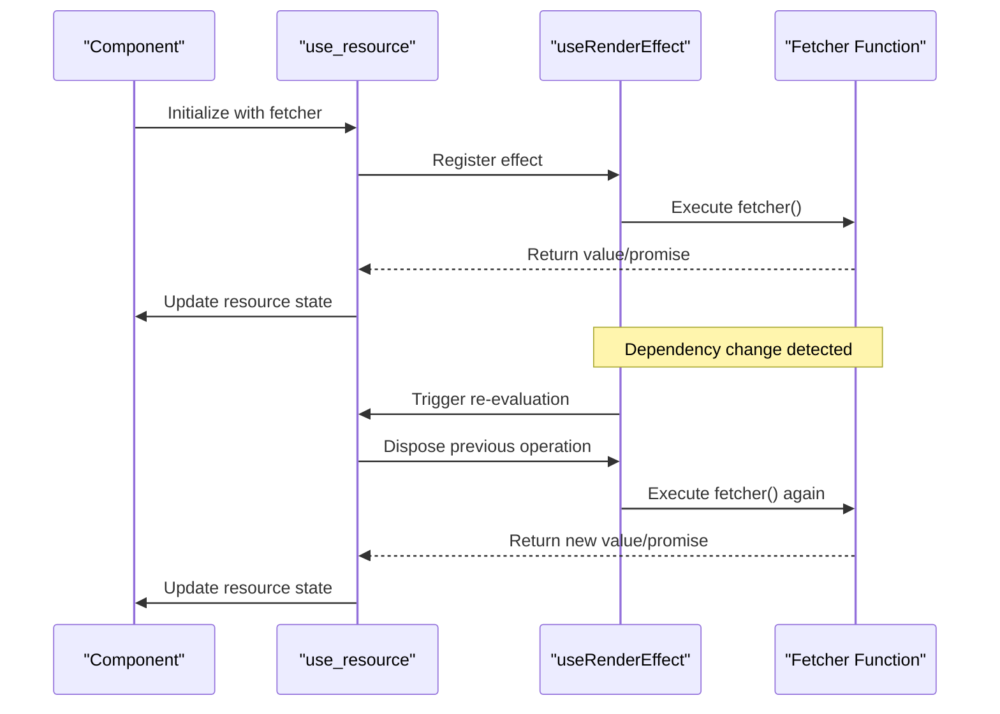

# Resource and Data Fetching Hooks

<cite>
**Referenced Files in This Document**   
- [use_resource.ts](file://src/hooks/use_resource.ts)
- [use_fetch.ts](file://src/hooks/use_fetch.ts)
- [use_promise.ts](file://src/hooks/use_promise.ts)
- [use_resolved.ts](file://src/hooks/use_resolved.ts)
- [use_abort_controller.ts](file://src/hooks/use_abort_controller.ts)
- [use_abort_signal.ts](file://src/hooks/use_abort_signal.ts)
- [suspense.manager.ts](file://src/components/suspense.manager.ts)
- [suspense.context.ts](file://src/components/suspense.context.ts)
- [types.ts](file://src/types.ts)
- [soby.ts](file://src/methods/soby.ts)
- [use_render_effect.ts](file://src/hooks/use_render_effect.ts)
</cite>

## Table of Contents
1. [Introduction](#introduction)
2. [Core Resource Management with use_resource](#core-resource-management-with-use_resource)
3. [Reactive HTTP Requests with use_fetch](#reactive-http-requests-with-use_fetch)
4. [Promise State Tracking with use_promise](#promise-state-tracking-with-use_promise)
5. [Synchronizing Resolved Values with use_resolved](#synchronizing-resolved-values-with-use_resolved)
6. [Abort Control with useAbortController and useAbortSignal](#abort-control-with-useabortcontroller-and-useabortsingal)
7. [Integration with Suspense Boundaries](#integration-with-suspense-boundaries)
8. [Dependency Re-evaluation Mechanism](#dependency-re-evaluation-mechanism)
9. [Error Handling and Cancellation Patterns](#error-handling-and-cancellation-patterns)
10. [Performance and Best Practices](#performance-and-best-practices)

## Introduction
Woby provides a comprehensive suite of hooks for managing asynchronous resources, data fetching, and promise state transitions in reactive applications. These hooks are designed to work seamlessly with Suspense boundaries and automatically re-evaluate when dependencies change, eliminating the need for explicit dependency arrays. This document details the core resource management hooks: `use_resource`, `use_fetch`, `use_promise`, and `use_resolved`, along with their integration with abort control and Suspense.

**Section sources**
- [use_resource.ts](file://src/hooks/use_resource.ts#L18-L104)
- [use_fetch.ts](file://src/hooks/use_fetch.ts#L8-L24)
- [use_promise.ts](file://src/hooks/use_promise.ts#L6-L10)

## Core Resource Management with use_resource

The `use_resource` hook provides a declarative way to manage async resources by exposing pending, error, and resolved states. It returns a resource object that can be used to track the state of asynchronous operations.

The hook creates observables for `pending`, `error`, and `value` states, and uses a `SuspenseManager` to coordinate with Suspense boundaries. When a fetcher function returns a promise, it automatically transitions through pending, resolved, or rejected states. The resource object implements both a reactive interface and direct accessor methods for state inspection.

**Diagram sources**
- [types.ts](file://src/types.ts#L129)
- [use_resource.ts](file://src/hooks/use_resource.ts#L18-L104)

**Section sources**
- [use_resource.ts](file://src/hooks/use_resource.ts#L18-L104)
- [types.ts](file://src/types.ts#L110-L129)

## Reactive HTTP Requests with use_fetch

The `use_fetch` hook provides a reactive wrapper around the Fetch API with built-in abort control. It leverages `use_resource` for state management and `useAbortSignal` for cancellation support.

This hook accepts a request specification and optional init parameters, both of which can be reactive values. It uses `use_resolved` to synchronize the request and init values before creating a fetch operation. The hook automatically integrates an AbortSignal from `useAbortSignal`, enabling cancellation of ongoing requests when dependencies change or components unmount.

**Diagram sources**
- [use_fetch.ts](file://src/hooks/use_fetch.ts#L8-L24)
- [use_resolved.ts](file://src/hooks/use_resolved.ts#L50-L100)
- [use_abort_signal.ts](file://src/hooks/use_abort_signal.ts#L8-L11)

**Section sources**
- [use_fetch.ts](file://src/hooks/use_fetch.ts#L8-L24)

## Promise State Tracking with use_promise

The `use_promise` hook provides a simple way to track the state of a promise, exposing pending, error, and resolved states through a consistent interface. It serves as a lightweight wrapper around `use_resource` specifically designed for promise-based operations.

This hook takes a function that returns a promise (or a promise directly) and returns a resource object that reflects the promise's state transitions. It uses the underlying `use_resource` mechanism to manage state and integrate with Suspense, providing a seamless experience for handling asynchronous values.

**Section sources**
- [use_promise.ts](file://src/hooks/use_promise.ts#L6-L10)
- [use_resource.ts](file://src/hooks/use_resource.ts#L18-L104)

## Synchronizing Resolved Values with use_resolved

The `use_resolved` hook enables synchronization of reactive values in suspense-compatible workflows. It can resolve function values, observables, or arrays of mixed values, making it particularly useful for preparing data before asynchronous operations.

This hook supports multiple signatures for different use cases: resolving individual values, arrays of values, or applying a callback function to resolved values. When used with arrays, it resolves each element and can either return the resolved array or pass it to a callback function. The `resolveFunction` parameter controls whether functions are called or treated as values.

**Diagram sources**
- [use_resolved.ts](file://src/hooks/use_resolved.ts#L50-L100)

**Section sources**
- [use_resolved.ts](file://src/hooks/use_resolved.ts#L50-L100)

## Abort Control with useAbortController and useAbortSignal

Woby provides `useAbortController` and `useAbortSignal` hooks for managing request cancellation through the AbortController API. These hooks integrate with the component lifecycle to ensure proper cleanup and prevent memory leaks.

The `useAbortController` hook creates an AbortController instance and automatically aborts it when the component unmounts or when any provided AbortSignal is aborted. It also listens for abort events on input signals, enabling coordinated cancellation. The `useAbortSignal` hook is a convenience wrapper that returns the signal from an AbortController created with `useAbortController`.

**Section sources**
- [use_abort_controller.ts](file://src/hooks/use_abort_controller.ts#L8-L30)
- [use_abort_signal.ts](file://src/hooks/use_abort_signal.ts#L8-L11)

## Integration with Suspense Boundaries

The resource hooks are designed to work seamlessly with Woby's Suspense implementation. When a resource is pending, it can suspend rendering and display a fallback UI until the resource resolves.

The `SuspenseManager` class coordinates between `use_resource` and the `Suspense` component by maintaining a counter of active suspensions. When a resource enters the pending state, it calls `suspend()` on the current suspense context, which increments the suspension counter. When the resource resolves or rejects, it calls `unsuspend()` to decrement the counter. The `Suspense` component uses this counter to determine whether to show the fallback or the children.

**Diagram sources**
- [suspense.manager.ts](file://src/components/suspense.manager.ts#L4-L67)
- [suspense.context.ts](file://src/components/suspense.context.ts#L20-L50)
- [use_resource.ts](file://src/hooks/use_resource.ts#L18-L104)

**Section sources**
- [suspense.manager.ts](file://src/components/suspense.manager.ts#L4-L67)
- [suspense.context.ts](file://src/components/suspense.context.ts#L20-L50)
- [suspense.ts](file://src/components/suspense.ts#L8-L25)

## Dependency Re-evaluation Mechanism

Woby's resource hooks automatically re-run when dependencies change, without requiring explicit dependency arrays. This is achieved through the reactive system and the `useRenderEffect` hook.

The `use_resource` hook uses `useRenderEffect` to re-execute the fetcher function whenever any tracked reactive values change. The effect is triggered during the render phase, ensuring that dependencies are properly tracked. When dependencies change, the effect disposes of the previous operation (if still pending) and starts a new fetch cycle.

**Diagram sources**
- [use_resource.ts](file://src/hooks/use_resource.ts#L18-L104)
- [use_render_effect.ts](file://src/hooks/use_render_effect.ts#L15-L21)

**Section sources**
- [use_resource.ts](file://src/hooks/use_resource.ts#L18-L104)
- [use_render_effect.ts](file://src/hooks/use_render_effect.ts#L15-L21)

## Error Handling and Cancellation Patterns

The resource hooks provide comprehensive error handling and cancellation patterns. When a fetch operation fails, the error is caught and stored in the resource state, making it available through the `error()` accessor method.

Cancellation is handled through the AbortController integration in `use_fetch`. When dependencies change or the component unmounts, the AbortController automatically aborts the ongoing request. This prevents race conditions and ensures that callbacks from previous requests don't update the state of a component that has moved on.

For manual cancellation, developers can pass an AbortSignal from an external AbortController to `use_fetch`. This allows for coordinated cancellation across multiple requests or user-initiated cancellation.

**Section sources**
- [use_resource.ts](file://src/hooks/use_resource.ts#L18-L104)
- [use_fetch.ts](file://src/hooks/use_fetch.ts#L8-L24)
- [use_abort_controller.ts](file://src/hooks/use_abort_controller.ts#L8-L30)

## Performance and Best Practices

When using Woby's resource hooks, several best practices can optimize performance and prevent common issues:

1. **Leverage built-in memoization**: The hooks automatically handle re-execution on dependency changes, so avoid unnecessary memoization of fetcher functions.

2. **Use appropriate suspense boundaries**: Place Suspense components at appropriate levels in the component tree to minimize the amount of UI that shows fallback content.

3. **Implement caching strategies**: For expensive or frequently accessed resources, consider implementing caching at the service layer or using memoization patterns.

4. **Handle errors gracefully**: Always check the error state before rendering error messages, and consider providing retry mechanisms.

5. **Manage side effects**: Be aware that fetcher functions may be called multiple times during component lifecycle, so ensure they are idempotent or handle re-entrancy appropriately.

These hooks form a cohesive system for managing asynchronous operations in Woby applications, providing a robust foundation for data fetching, resource management, and state synchronization.

**Section sources**
- [use_resource.ts](file://src/hooks/use_resource.ts#L18-L104)
- [use_fetch.ts](file://src/hooks/use_fetch.ts#L8-L24)
- [use_promise.ts](file://src/hooks/use_promise.ts#L6-L10)
- [use_resolved.ts](file://src/hooks/use_resolved.ts#L50-L100)