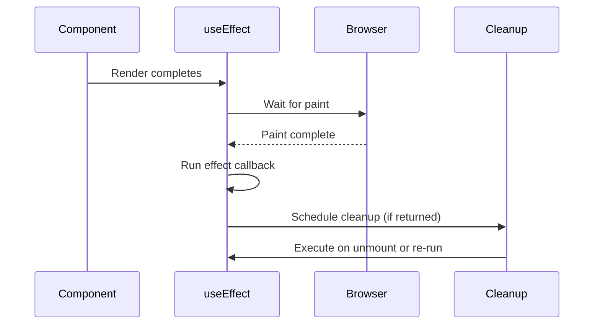
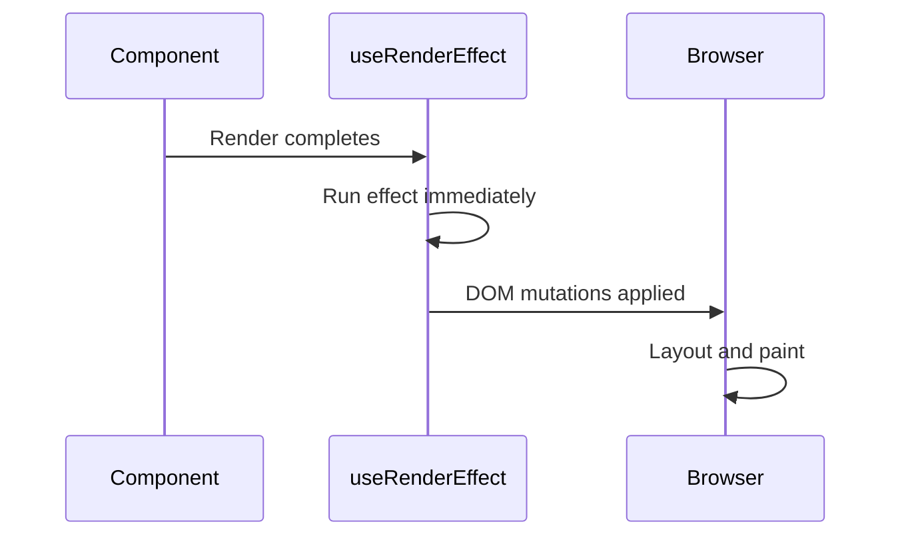
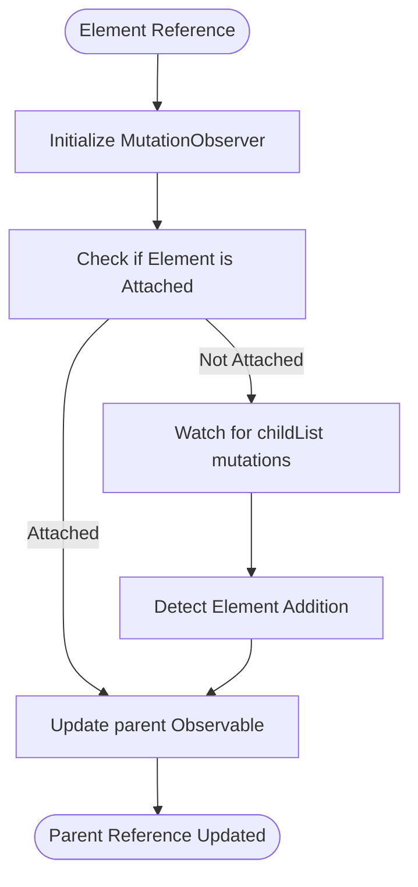
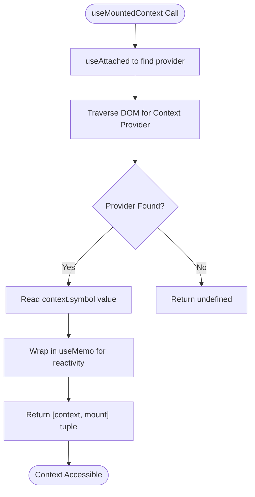
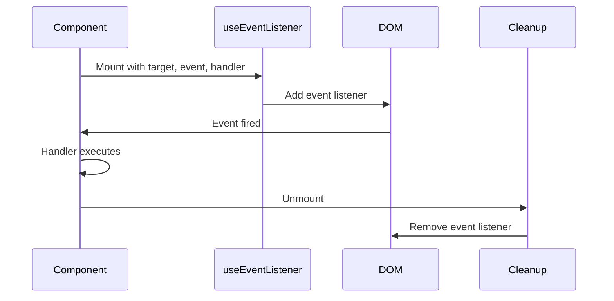
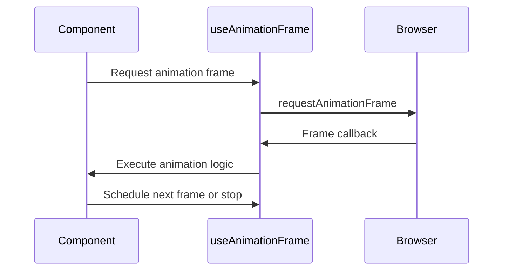
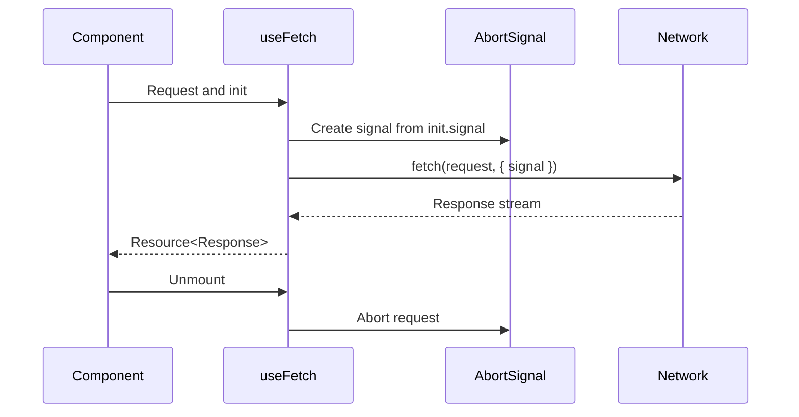
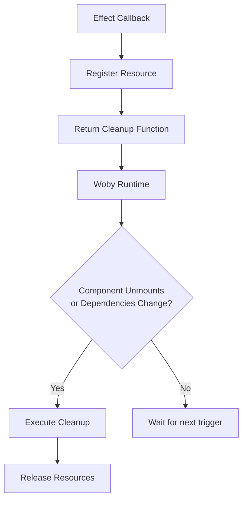

# Side Effects and Lifecycle Hooks

<cite>
**Referenced Files in This Document**  
- [use_effect.ts](file://src/hooks/use_effect.ts)
- [use_render_effect.ts](file://src/hooks/use_render_effect.ts)
- [use_attached.ts](file://src/hooks/use_attached.ts)
- [use_mounted_context.ts](file://src/hooks/use_mounted_context.ts)
- [use_event_listener.ts](file://src/hooks/use_event_listener.ts)
- [use_fetch.ts](file://src/hooks/use_fetch.ts)
- [use_animation_frame.ts](file://src/hooks/use_animation_frame.ts)
- [use_interval.ts](file://src/hooks/use_interval.ts)
</cite>

## Table of Contents
1. [Introduction](#introduction)
2. [use_effect: General Side Effects](#use_effect-general-side-effects)
3. [use_render_effect: Pre-Paint Effects](#use_render_effect-pre-paint-effects)
4. [use_attached: DOM Attachment Detection](#use_attached-dom-attachment-detection)
5. [use_mounted_context: Context Access During Mounting](#use_mounted_context-context-access-during-mounting)
6. [Common Use Cases](#common-use-cases)
7. [Managing Subscriptions and Cleanup](#managing-subscriptions-and-cleanup)
8. [Common Pitfalls and Best Practices](#common-pitfalls-and-best-practices)
9. [Conclusion](#conclusion)

## Introduction
Woby provides a comprehensive system for managing side effects and component lifecycle through a suite of specialized hooks. These hooks enable developers to interact with external systems, manipulate the DOM, manage subscriptions, and respond to rendering cycles with precision. This document details the core lifecycle hooks—`use_effect`, `use_render_effect`, `use_attached`, and `use_mounted_context`—and demonstrates their appropriate usage, integration patterns, and performance considerations.

## use_effect: General Side Effects
The `use_effect` hook is the primary mechanism for executing side effects after component rendering. It runs asynchronously after the browser has painted, making it ideal for operations that do not require immediate DOM layout access, such as logging, analytics, or non-critical API calls.

Effects created with `use_effect` are automatically cleaned up when the component unmounts or when dependencies change, preventing memory leaks. The cleanup function is returned from the effect callback and is invoked before the next effect runs or on unmount.

**Diagram sources**
- [use_effect.ts](file://src/hooks/use_effect.ts)

**Section sources**
- [use_effect.ts](file://src/hooks/use_effect.ts)

## use_render_effect: Pre-Paint Effects
Unlike `use_effect`, the `use_render_effect` hook runs synchronously before the browser performs layout and paint. This makes it suitable for operations that require reading layout information or making DOM mutations that affect rendering, such as measuring elements or updating styles that impact layout.

Internally, `use_render_effect` leverages the same underlying `useEffect` primitive but configures it with a `sync: 'init'` option to ensure execution before paint. This guarantees that any DOM changes made within the effect are reflected in the current frame.

**Diagram sources**
- [use_render_effect.ts](file://src/hooks/use_render_effect.ts)

**Section sources**
- [use_render_effect.ts](file://src/hooks/use_render_effect.ts)

## use_attached: DOM Attachment Detection
The `use_attached` hook detects when a DOM element becomes physically attached to the document. It uses a `MutationObserver` to monitor changes in the DOM tree and updates an observable `parent` reference when the target element is added.

This hook supports optional matching logic via a `match` function, allowing detection of attachment to specific parent elements (e.g., shadow DOM hosts). It is particularly useful for custom elements that need to react to their placement in the DOM hierarchy.

**Diagram sources**
- [use_attached.ts](file://src/hooks/use_attached.ts)

**Section sources**
- [use_attached.ts](file://src/hooks/use_attached.ts)

## use_mounted_context: Context Access During Mounting
The `use_mounted_context` hook enables access to context values during component mounting, with special support for custom elements. It combines `use_attached` with context symbol lookup to retrieve context values from parent elements in the DOM tree.

For JSX components, it falls back to standard context resolution. For custom elements, it traverses the DOM to find a parent with the appropriate context symbol, enabling seamless context propagation across both JSX and HTML-defined components.

**Diagram sources**
- [use_mounted_context.ts](file://src/hooks/use_mounted_context.ts)

**Section sources**
- [use_mounted_context.ts](file://src/hooks/use_mounted_context.ts)

## Common Use Cases

### Managing Subscriptions
Hooks like `use_event_listener` and `use_interval` abstract common subscription patterns. They automatically manage subscription lifecycle, ensuring cleanup on unmount.

**Section sources**
- [use_event_listener.ts](file://src/hooks/use_event_listener.ts)

### Animations and Layout Effects
`use_animation_frame` schedules callbacks to run before the next repaint, ideal for smooth animations. It integrates with Woby's scheduler system and ensures automatic disposal.

**Section sources**
- [use_animation_frame.ts](file://src/hooks/use_animation_frame.ts)

### External API Integration
`use_fetch` provides a reactive wrapper around the Fetch API, integrating with `useAbortSignal` for cancellation and `useResource` for state management. It ensures requests are canceled if the component unmounts.

**Section sources**
- [use_fetch.ts](file://src/hooks/use_fetch.ts)

## Managing Subscriptions and Cleanup
Woby's effect system emphasizes automatic cleanup through observable teardown. Every effect and subscription returns a disposer function that is automatically invoked when the component unmounts or dependencies change.

This prevents common issues like memory leaks and stale subscriptions. Developers should always return a cleanup function from effects that register listeners, intervals, or other resources.

**Section sources**
- [use_effect.ts](file://src/hooks/use_effect.ts)
- [use_event_listener.ts](file://src/hooks/use_event_listener.ts)
- [use_interval.ts](file://src/hooks/use_interval.ts)

## Common Pitfalls and Best Practices

### Avoiding Infinite Loops
Ensure effect dependencies are stable. Avoid creating new objects or functions in dependency arrays unless necessary. Use `useMemo` or `useCallback` to memoize dependencies.

### Timing Effects Correctly
Use `use_effect` for post-render operations and `use_render_effect` only when layout access is required. Misusing `use_render_effect` can lead to performance issues due to synchronous execution.

### Integrating with External APIs
Always handle cancellation via `AbortSignal` when making network requests. Use `useResource` to manage loading, error, and success states consistently.

## Conclusion
Woby's lifecycle hooks provide a robust foundation for managing side effects, DOM interactions, and context propagation. By leveraging automatic cleanup, reactive observables, and precise timing controls, developers can build efficient, maintainable components that integrate seamlessly with both the DOM and external systems.