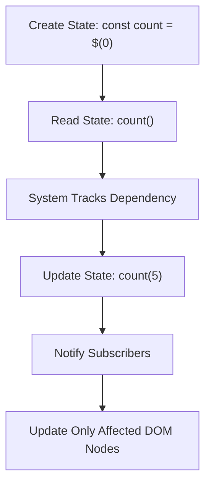
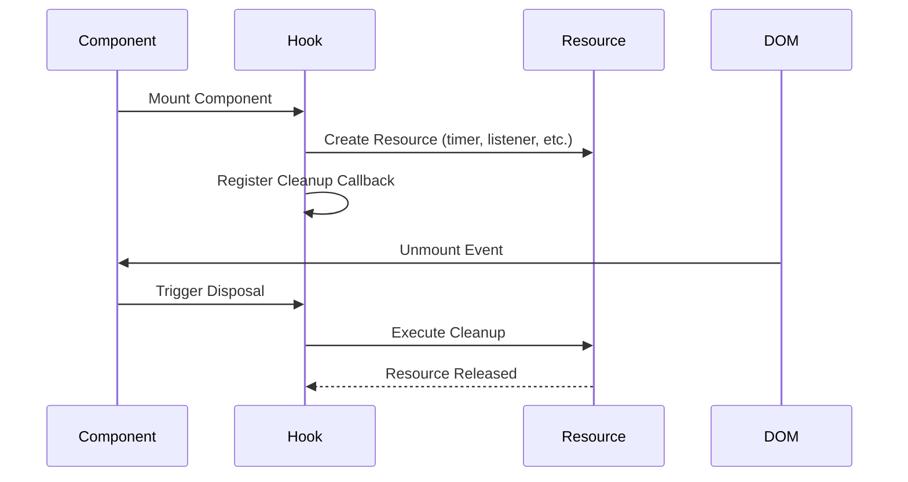
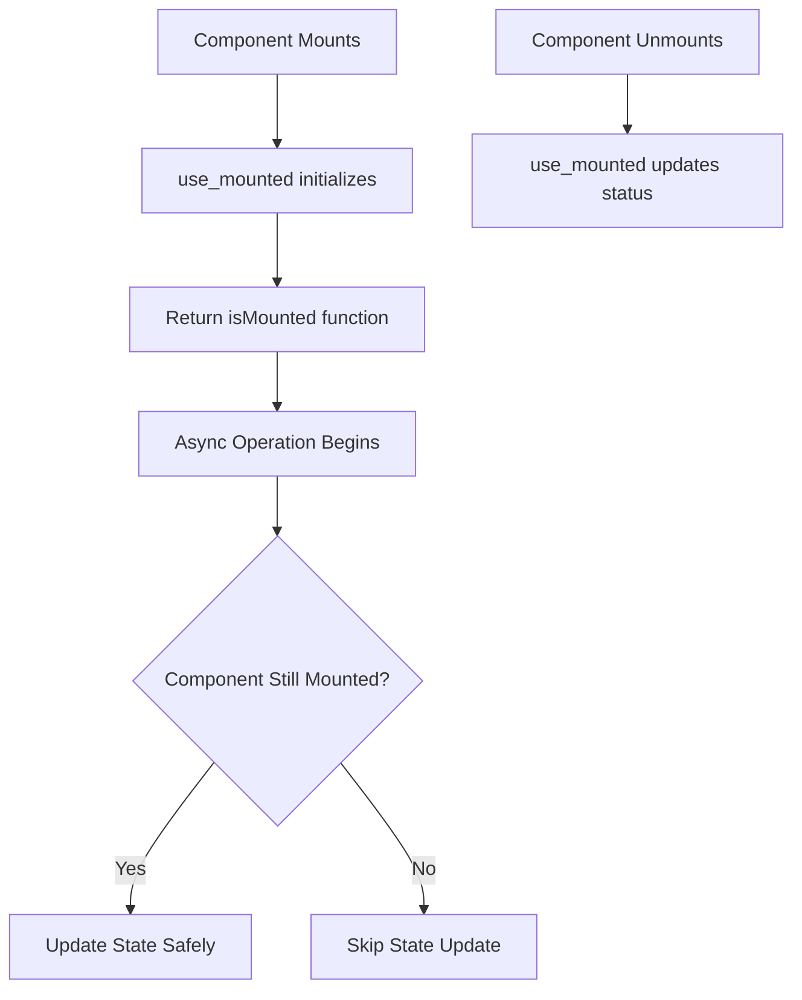
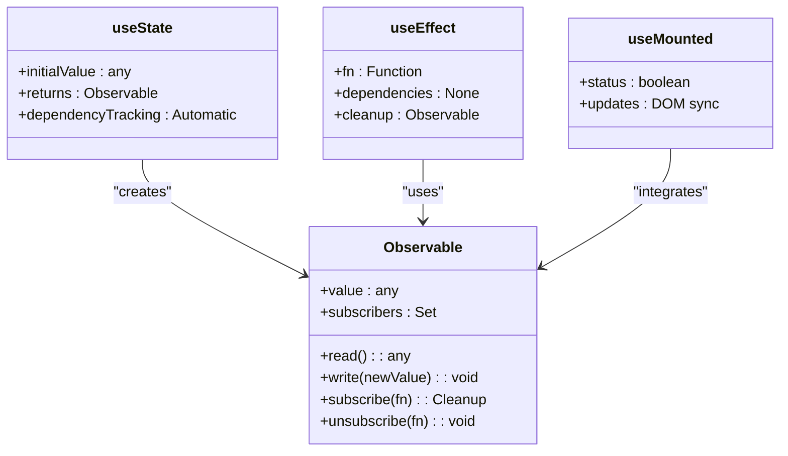
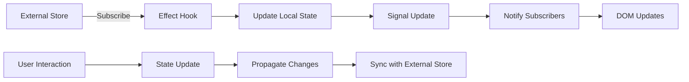
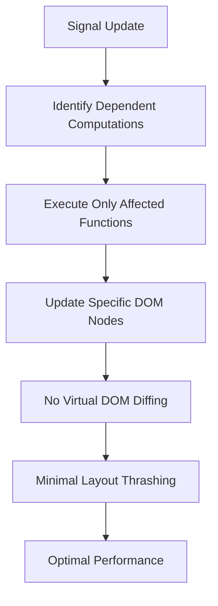

# State Management Hooks

<cite>
**Referenced Files in This Document**  
- [use_state](file://src/hooks/soby.ts)
- [use_cheap_disposed](file://src/hooks/use_cheap_disposed.ts)
- [use_mounted](file://src/hooks/use_mounted.ts)
- [soby.ts](file://src/soby.ts)
- [methods/soby.ts](file://src/methods/soby.ts)
- [Reactivity-System.md](file://doc/Reactivity-System.md)
- [Custom-Element-Practical-Guide.md](file://doc/demos/Custom-Element-Practical-Guide.md)
</cite>

## Table of Contents
1. [Introduction](#introduction)
2. [Core State Management with use_state](#core-state-management-with-use_state)
3. [Resource Management with use_cheap_disposed](#resource-management-with-use_cheap_disposed)
4. [Component Lifecycle Detection with use_mounted](#component-lifecycle-detection-with-use_mounted)
5. [Integration with Soby Observables](#integration-with-soby-observables)
6. [State Initialization and Synchronization](#state-initialization-and-synchronization)
7. [Common Issues and Solutions](#common-issues-and-solutions)
8. [Performance Benefits of Woby's Reactivity](#performance-benefits-of-wobys-reactivity)
9. [Conclusion](#conclusion)

## Introduction
Woby provides a modern, signal-based reactivity system that eliminates the need for virtual DOM diffing through fine-grained updates and automatic dependency tracking. This documentation details the core state management hooks—`use_state`, `use_cheap_disposed`, and `use_mounted`—that enable efficient, reactive component development. These hooks integrate seamlessly with soby observables to deliver high-performance updates directly to the DOM, while automatically managing subscriptions and cleanup.

**Section sources**
- [Reactivity-System.md](file://doc/Reactivity-System.md#L20-L77)
- [Custom-Element-Practical-Guide.md](file://doc/demos/Custom-Element-Practical-Guide.md#L0-L617)

## Core State Management with use_state
The `use_state` hook in Woby is implemented through soby's observable system, providing automatic dependency tracking and fine-grained reactivity. Unlike traditional React hooks, it does not require dependency arrays, as reactivity is tracked at the signal level during execution.

When a state variable is created using `use_state` (which maps to soby's `$` function), it returns a getter/setter function that can be both read from and written to. The system automatically tracks which computations depend on each signal, ensuring that only the minimal necessary updates occur when state changes.

This approach eliminates stale closures and unnecessary re-renders, as each signal maintains its own subscription list and notifies only its direct dependents. The reactivity system works uniformly across components, effects, and computed values, creating a consistent mental model for state management.

**Diagram sources**
- [soby.ts](file://src/soby.ts#L1-L1)
- [methods/soby.ts](file://src/methods/soby.ts#L7-L8)

**Section sources**
- [Reactivity-System.md](file://doc/Reactivity-System.md#L20-L77)
- [Core-Methods.md](file://doc/Core-Methods.md#L18-L54)

## Resource Management with use_cheap_disposed
The `use_cheap_disposed` hook provides efficient resource cleanup tied to component lifecycle. It leverages Woby's reactivity system to automatically dispose of resources when components are unmounted, preventing memory leaks and ensuring proper cleanup.

This hook is particularly useful for managing event listeners, timers, subscriptions, and other resources that require explicit disposal. It integrates with soby's cleanup mechanism, allowing developers to register cleanup functions that execute automatically when the component is removed from the DOM.

The "cheap" aspect refers to the optimized execution model, where disposal logic is batched and executed efficiently during the unmount phase. This prevents performance degradation when dealing with components that create and destroy resources frequently.

**Diagram sources**
- [use_cheap_disposed.ts](file://src/hooks/use_cheap_disposed.ts)
- [soby.ts](file://src/soby.ts#L1-L1)

**Section sources**
- [use_cheap_disposed.ts](file://src/hooks/use_cheap_disposed.ts)
- [Reactivity-System.md](file://doc/Reactivity-System.md#L242-L371)

## Component Lifecycle Detection with use_mounted
The `use_mounted` hook provides a reliable way to detect when components are mounted in the DOM, enabling safe asynchronous operations and side effects. It returns a function that checks the current mounted status of the component, preventing updates on unmounted components.

This hook is essential for avoiding "can't perform a React state update on an unmounted component" type errors that commonly occur in asynchronous scenarios. It integrates with Woby's rendering system to track component lifecycle states accurately.

The implementation leverages Woby's reactive context system, ensuring that the mounted state is updated synchronously with the DOM. This allows developers to safely check mounted status before performing state updates within promises, timers, or other async operations.

**Diagram sources**
- [use_mounted.ts](file://src/hooks/use_mounted.ts)
- [hooks/index.ts](file://src/hooks/index.ts#L17-L18)

**Section sources**
- [use_mounted.ts](file://src/hooks/use_mounted.ts)
- [Context.md](file://doc/Context.md#L14-L64)

## Integration with Soby Observables
Woby's state management hooks are built on top of soby observables, providing a signal-based reactivity system that eliminates the need for virtual DOM diffing. This integration enables direct DOM updates and automatic dependency tracking without dependency arrays.

Soby observables work by creating a reactive context when accessed, automatically tracking which computations depend on each signal. When a signal's value changes, it notifies only its direct dependents, triggering minimal updates to the DOM.

The `$$` function (get) safely unwraps observable values, handling both observable and non-observable inputs uniformly. This provides a consistent interface for reading values regardless of their reactivity status.

Key integration points include:
- Automatic subscription management
- Fine-grained updates to specific DOM nodes
- Batched updates for performance optimization
- Cross-component reactivity without prop drilling

**Diagram sources**
- [soby.ts](file://src/soby.ts#L1-L1)
- [methods/soby.ts](file://src/methods/soby.ts#L7-L8)
- [hooks/soby.ts](file://src/hooks/soby.ts#L1-L11)

**Section sources**
- [Reactivity-System.md](file://doc/Reactivity-System.md#L20-L77)
- [Core-Methods.md](file://doc/Core-Methods.md#L18-L54)
- [hooks/soby.ts](file://src/hooks/soby.ts#L1-L11)

## State Initialization and Synchronization
Woby's state management system supports various initialization patterns and synchronization mechanisms with external stores. State can be initialized with primitive values, objects, arrays, or computed expressions, with optional configuration for equality checking and type synchronization.

For external store integration, Woby provides mechanisms to sync state with external data sources such as localStorage, databases, or APIs. This is typically achieved through effect hooks that subscribe to external changes and update local state accordingly.

The system also supports derived/computed state through memoization (`useMemo`), where values are automatically recomputed only when their dependencies change. This enables efficient calculation of derived data without manual dependency management.

State synchronization follows a unidirectional data flow pattern, where external changes flow into the component state, and user interactions flow out through callbacks or side effects.

**Diagram sources**
- [Reactivity-System.md](file://doc/Reactivity-System.md#L20-L77)
- [Custom-Element-Practical-Guide.md](file://doc/demos/Custom-Element-Practical-Guide.md#L0-L617)

**Section sources**
- [Reactivity-System.md](file://doc/Reactivity-System.md#L20-L77)
- [Custom-Element-Practical-Guide.md](file://doc/demos/Custom-Element-Practical-Guide.md#L0-L617)

## Common Issues and Solutions
Woby's reactivity system addresses several common issues found in traditional state management approaches:

**Stale Closures**: Eliminated through signal-based reactivity, as each signal maintains its current value independently of closure scope.

**Improper Disposal**: Prevented by `use_cheap_disposed` and automatic cleanup mechanisms that ensure resources are properly released when components unmount.

**Dependency Array Errors**: Avoided entirely since dependency tracking is automatic at the signal level, removing the need for manual dependency arrays.

**Memory Leaks**: Mitigated through automatic subscription management and batched cleanup operations.

**Race Conditions**: Reduced by the synchronous nature of signal updates and the ability to check component mounted status with `use_mounted`.

The system also provides utilities like `$$` for safe value unwrapping and `untracked` for reading signals without creating dependencies, giving developers fine-grained control over reactivity behavior.

**Section sources**
- [Best-Practices.md](file://doc/Best-Practices.md#L14-L61)
- [Reactivity-System.md](file://doc/Reactivity-System.md#L20-L77)
- [use_mounted.ts](file://src/hooks/use_mounted.ts)

## Performance Benefits of Woby's Reactivity
Woby's signal-based reactivity system delivers significant performance advantages over traditional virtual DOM approaches:

- **Direct DOM Updates**: Changes are applied directly to affected DOM nodes without diffing, reducing overhead
- **Fine-Grained Updates**: Only the minimal necessary parts of the UI are updated, avoiding whole-component re-renders
- **Automatic Cleanup**: Subscriptions and resources are automatically cleaned up, preventing memory leaks
- **No Dependency Arrays**: Eliminates bugs related to incorrect or missing dependencies
- **Batched Operations**: Updates are batched for efficiency, minimizing layout thrashing
- **Zero-Cost Abstractions**: The reactivity system has minimal runtime overhead

These benefits result in faster initial rendering, more efficient updates, and better memory utilization, particularly in applications with complex state interactions or high update frequencies.

**Diagram sources**
- [soby.ts](file://src/soby.ts#L1-L1)
- [methods/soby.ts](file://src/methods/soby.ts#L7-L8)

**Section sources**
- [Reactivity-System.md](file://doc/Reactivity-System.md#L20-L77)
- [Core-Methods.md](file://doc/Core-Methods.md#L18-L54)

## Conclusion
Woby's state management hooks provide a modern, efficient approach to reactive programming that eliminates many of the pain points associated with traditional React hooks. By leveraging soby observables and signal-based reactivity, these hooks deliver automatic dependency tracking, fine-grained updates, and automatic cleanup without the need for dependency arrays.

The integration of `use_state`, `use_cheap_disposed`, and `use_mounted` creates a cohesive system for managing state, resources, and lifecycle concerns in a way that is both performant and developer-friendly. This approach enables direct DOM updates, prevents common bugs like stale closures and memory leaks, and provides a consistent mental model for building reactive applications.

By combining the simplicity of hooks with the power of signals, Woby offers a compelling alternative to virtual DOM-based frameworks, delivering superior performance and a more intuitive development experience.