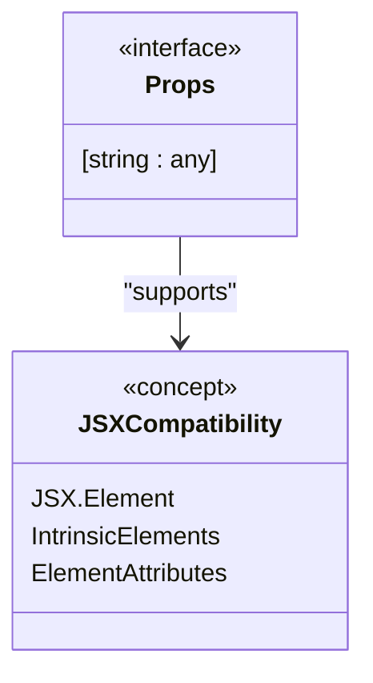
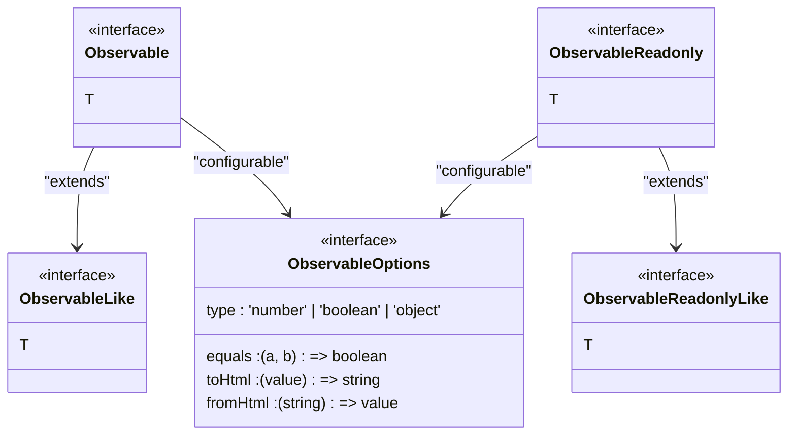
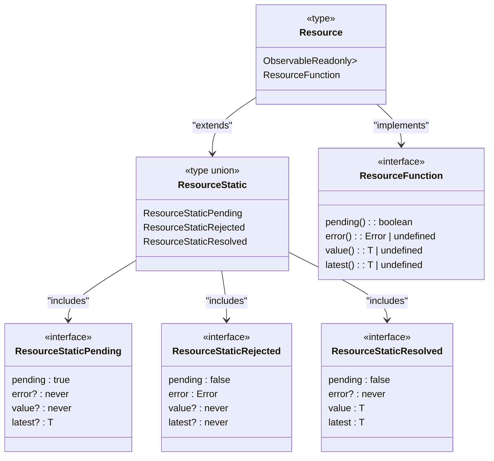

# Types and Interfaces

<cite>
**Referenced Files in This Document**   
- [types.ts](file://src/types.ts)
- [jsx/types.ts](file://src/jsx/types.ts)
- [soby.ts](file://src/soby.ts)
- [create_directive.ts](file://src/methods/create_directive.ts)
- [setters.ts](file://src/utils/setters.ts)
- [html/index.ts](file://src/html/index.ts)
</cite>

## Table of Contents
1. [Component Type Union](#component-type-union)
2. [Child Type Hierarchy](#child-type-hierarchy)
3. [Props Interface](#props-interface)
4. [Observable Types](#observable-types)
5. [Resource Type](#resource-type)
6. [Styling Types](#styling-types)
7. [Event Handling](#event-handling)
8. [DOM References](#dom-references)
9. [Directive System](#directive-system)
10. [Advanced Type Patterns](#advanced-type-patterns)

## Component Type Union

The Component type union represents the different forms a Woby component can take, enabling flexible component composition and rendering. It combines functions, intrinsic elements, and DOM nodes into a single type that can be used interchangeably in the framework.

```mermaid
classDiagram
class Component {
<<type union>>
ComponentFunction<P>
ComponentIntrinsicElement
ComponentNode
}
class ComponentFunction {
<<type>>
(props : P) => Child
}
class ComponentIntrinsicElement {
<<type>>
keyof JSX.IntrinsicElements
}
class ComponentNode {
<<type>>
Node
}
Component --> ComponentFunction : "includes"
Component --> ComponentIntrinsicElement : "includes"
Component --> ComponentNode : "includes"
```

**Diagram sources**
- [types.ts](file://src/types.ts#L27)

**Section sources**
- [types.ts](file://src/types.ts#L27)

## Child Type Hierarchy

The Child type hierarchy defines the various forms that can be rendered as children in Woby components. This recursive type supports null values, primitives, DOM nodes, arrays of children, and render functions, providing maximum flexibility for component composition.

```mermaid
classDiagram
class Child {
<<type union>>
null
undefined
boolean
bigint
number
string
symbol
Node
Array<Child>
() => Child
}
Child --> Array : "contains"
Child --> RenderFunction : "includes"
class RenderFunction {
<<type>>
() => Child
}
Array --> Child : "recursive"
```

**Diagram sources**
- [types.ts](file://src/types.ts#L15)

**Section sources**
- [types.ts](file://src/types.ts#L15)

## Props Interface

The Props interface provides a flexible type for component properties with full JSX compatibility. It extends the Record type to allow any string key with any value, enabling seamless integration with JSX syntax while maintaining type safety.



**Diagram sources**
- [types.ts](file://src/types.ts#L115)

**Section sources**
- [types.ts](file://src/types.ts#L115)

## Observable Types

The Observable types from the soby reactivity system form the foundation of Woby's reactive programming model. These types provide fine-grained reactivity with both writable and readonly variants, enabling efficient updates and data flow throughout the application.



**Diagram sources**
- [types.ts](file://src/types.ts#L160-L163)
- [soby.ts](file://src/soby.ts)

**Section sources**
- [types.ts](file://src/types.ts#L160-L163)
- [soby.ts](file://src/soby.ts)

## Resource Type

The Resource type provides a comprehensive solution for async data loading with explicit handling of pending, error, and resolved states. This type combines an observable with a functional interface to provide both reactive updates and direct state inspection.



**Diagram sources**
- [types.ts](file://src/types.ts#L129)

**Section sources**
- [types.ts](file://src/types.ts#L129)

## Styling Types

The CSSProperties and Style types enable type-safe styling with support for function values, allowing dynamic styling based on component state. These types integrate with CSS type definitions while adding Woby's reactivity capabilities.

```mermaid
classDiagram
class CSSProperties {
<<type>>
[K in keyof CSS.Properties] : FunctionMaybe<CSS.Properties[K]>
}
class Style {
<<type>>
FunctionMaybe<Nullable<string | StyleProperties | (FunctionMaybe<null | undefined | number | string> | Style)[]>>
}
class StyleProperties {
<<interface>>
DOMCSSProperties
DOMCSSVariables
}
class DOMCSSProperties {
<<interface>>
[key in CSSStyleDeclaration keys] : FunctionMaybe<Nullable<string | number>>
}
class DOMCSSVariables {
<<interface>>
[key : `--${string}`] : FunctionMaybe<Nullable<string | number>>
}
CSSProperties --> CSS : "extends"
Style --> StyleProperties : "includes"
StyleProperties --> DOMCSSProperties : "implements"
StyleProperties --> DOMCSSVariables : "implements"
```

**Diagram sources**
- [types.ts](file://src/types.ts#L169-L197)

**Section sources**
- [types.ts](file://src/types.ts#L169-L197)

## Event Handling

Woby provides EventTarget-specific event handlers with proper typing through the TargetedEvent and EventHandler interfaces. These types ensure type safety when working with DOM events while maintaining compatibility with standard event handling patterns.

```mermaid
classDiagram
class TargetedEvent {
<<interface>>
currentTarget : T
target : T
}
class EventHandler {
<<interface>>
(event : Event) : void
}
class GenericEventHandler {
<<interface>>
(event : TargetedEvent<T>) : void
}
class SpecificEventHandlers {
<<interface>>
AnimationEventHandler
ClipboardEventHandler
ChangeEventHandler
CompositionEventHandler
DragEventHandler
FocusEventHandler
InputEventHandler
KeyboardEventHandler
MouseEventHandler
PointerEventHandler
SubmitEventHandler
TouchEventHandler
TransitionEventHandler
UIEventHandler
WheelEventHandler
}
EventHandler --> GenericEventHandler : "extends"
GenericEventHandler --> TargetedEvent : "uses"
SpecificEventHandlers --> GenericEventHandler : "extends"
class EventAttributes {
<<interface>>
onClick? : ObservableMaybe<Nullable<MouseEventHandler<T>>>
onChange? : ObservableMaybe<Nullable<KeyboardEventHandler<T>>>
onSubmit? : ObservableMaybe<Nullable<SubmitEventHandler<T>>>
// ... other event handlers
}
EventAttributes --> SpecificEventHandlers : "contains"
```

**Diagram sources**
- [types.ts](file://src/types.ts#L200-L240)

**Section sources**
- [types.ts](file://src/types.ts#L200-L240)

## DOM References

The Ref and Refs types provide a flexible system for managing DOM references in Woby components. These types support both single references and arrays of references, enabling complex DOM manipulation patterns while maintaining type safety.

```mermaid
classDiagram
class Ref {
<<type>>
(value : T) => void
}
class Refs {
<<type>>
ArrayMaybe<Nullable<Ref<T>>>
Refs<T>[]
}
class ArrayMaybe {
<<type>>
T[] | T
}
Refs --> ArrayMaybe : "uses"
ArrayMaybe --> Ref : "contains"
class RefUsage {
<<example>>
ref : Ref<HTMLDivElement>
refs : Refs<HTMLInputElement>
}
RefUsage --> Ref : "single"
RefUsage --> Refs : "multiple"
```

**Diagram sources**
- [types.ts](file://src/types.ts#L117-L195)

**Section sources**
- [types.ts](file://src/types.ts#L117-L195)

## Directive System

The Directive system in Woby provides a powerful mechanism for extending component behavior with custom logic. The system includes DirectiveFunction, DirectiveRef, and DirectiveProvider types that work together to create reusable directive patterns.

```mermaid
classDiagram
class DirectiveFunction {
<<type>>
(ref : Element, ...args : Arguments) => void
}
class DirectiveRef {
<<type>>
(...args : Arguments) => ((ref : Element) => void)
}
class DirectiveProvider {
<<type>>
(props : { children : Child }) => Child
}
class Directive {
<<interface>>
Provider : DirectiveProvider
ref : DirectiveRef<Arguments>
register : DirectiveRegister
}
class DirectiveData {
<<interface>>
fn : DirectiveFunction<Arguments>
immediate : boolean
}
class DirectiveOptions {
<<interface>>
immediate? : boolean
}
Directive --> DirectiveProvider : "has"
Directive --> DirectiveRef : "has"
Directive --> DirectiveRegister : "has"
DirectiveData --> DirectiveFunction : "references"
DirectiveOptions --> DirectiveData : "configures"
class createDirective {
<<function>>
<T>(name : T, fn : DirectiveFunction, options? : DirectiveOptions) => Directive
}
createDirective --> Directive : "returns"
createDirective --> DirectiveOptions : "uses"
```

**Diagram sources**
- [types.ts](file://src/types.ts#L43-L47)
- [create_directive.ts](file://src/methods/create_directive.ts)

**Section sources**
- [types.ts](file://src/types.ts#L43-L47)
- [create_directive.ts](file://src/methods/create_directive.ts)

## Advanced Type Patterns

Woby's type system incorporates several advanced patterns to enhance type safety and developer experience. These include conditional typing, generics, and utility types that work together to create a robust and flexible type system.

```mermaid
flowchart TD
A["Advanced Type Patterns"] --> B["Conditional Typing"]
A --> C["Generics"]
A --> D["Utility Types"]
B --> B1["ObservableMaybe<T>"]
B --> B2["FunctionMaybe<T>"]
B --> B3["ArrayMaybe<T>"]
C --> C1["Component<P = {}>"]
C --> C2["DirectiveFunction<Arguments extends unknown[] = []>"]
C --> C3["Resource<T = unknown>"]
D --> D1["Extract<T, U>"]
D --> D2["Exclude<T, U>"]
D --> D3["Omit<T, K>"]
D --> D4["Pick<T, K>"]
D --> D5["Partial<T>"]
D --> D6["Required<T>"]
B1 --> "Observable<T> | ObservableReadonly<T> | T"
B2 --> "() => T | T"
B3 --> "T[] | T"
C1 --> "Supports default props"
C2 --> "Type-safe directive arguments"
C3 --> "Flexible resource typing"
D1 --> "Extracts assignable types"
D2 --> "Excludes specific types"
D3 --> "Removes properties"
D4 --> "Selects properties"
D5 --> "Makes all properties optional"
D6 --> "Makes all properties required"
```

**Diagram sources**
- [types.ts](file://src/types.ts)
- [jsx/types.ts](file://src/jsx/types.ts)

**Section sources**
- [types.ts](file://src/types.ts)
- [jsx/types.ts](file://src/jsx/types.ts)