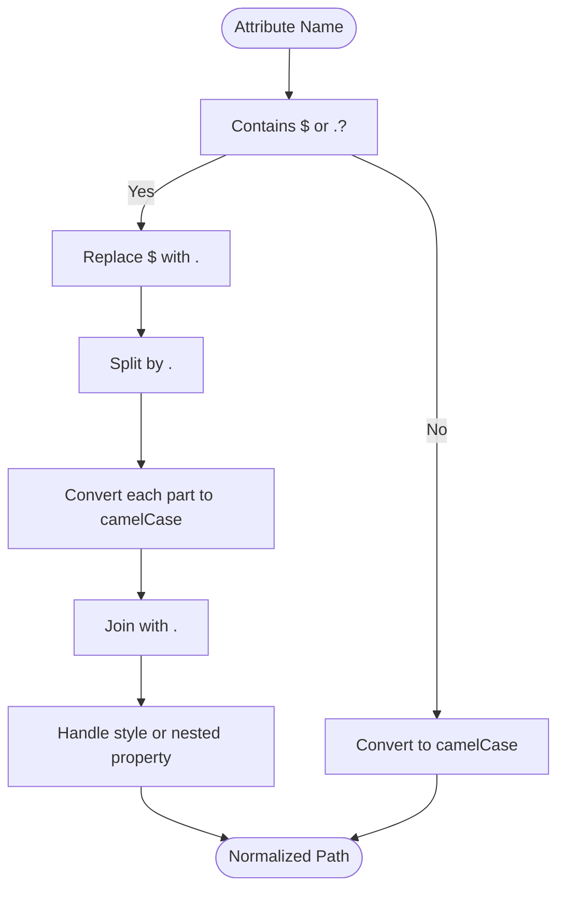

# Advanced Features

<cite>
**Referenced Files in This Document**   
- [custom_element.ts](file://src/methods/custom_element.ts)
- [create_context.tsx](file://src/methods/create_context.tsx)
- [use_context.ts](file://src/hooks/use_context.ts)
- [nested.ts](file://src/utils/nested.ts)
</cite>

## Table of Contents
1. [Custom Elements Implementation](#custom-elements-implementation)
2. [Context API](#context-api)
3. [Advanced Nested Property Support](#advanced-nested-property-support)
4. [Integration Patterns and Performance](#integration-patterns-and-performance)
5. [Usage Guidance and Best Practices](#usage-guidance-and-best-practices)

## Custom Elements Implementation

The Woby framework provides a robust custom element system through the `customElement` function in `custom_element.ts`, enabling seamless integration between reactive components and native Web Components. This implementation allows developers to create reusable, encapsulated components that can be used both in JSX/TSX and directly in HTML markup.

Custom elements are created by registering a component function with a specific tag name. The component must define default props using the `defaults` helper function, which ensures proper initialization and type safety. When a custom element is instantiated, it automatically observes attribute changes and synchronizes them with the corresponding reactive properties.

The implementation supports Shadow DOM encapsulation with optional stylesheet adoption, providing style isolation while allowing global styles to be applied when needed. By default, custom elements adopt all document stylesheets into their shadow roots, but this behavior can be disabled by setting the `ignoreStyle` prop to `true`.

Reactive properties are automatically synchronized between HTML attributes and JavaScript properties. The system handles type conversion for observables based on their configuration (number, boolean, bigint, object, etc.), ensuring that string attribute values are properly converted to their corresponding JavaScript types.

**Diagram sources**
- [custom_element.ts](file://src/methods/custom_element.ts#L452-L641)

**Section sources**
- [custom_element.ts](file://src/methods/custom_element.ts#L1-L642)

## Context API

The Context API in Woby provides a mechanism for passing data through the component tree without manually passing props at every level. Implemented across `create_context.tsx` and `use_context.ts`, this system enables efficient state sharing between components regardless of their position in the component hierarchy.

The `createContext` function creates a context object with a Provider component and a unique symbol for internal identification. Contexts can be created with or without default values, providing flexibility for different use cases. The Provider component accepts a `value` prop that becomes available to all descendant components through the `useContext` hook.

Context values are stored in a global `CONTEXTS_DATA` map, which maintains references to each context's symbol and default value. When a component calls `useContext`, it retrieves the current value from either the Soby context system (for JSX components) or falls back to the default value if no provider is found in the component tree.

The implementation supports both JSX components and custom elements, ensuring consistent behavior across different component types. Context providers can wrap both standard JSX elements and custom elements, making it possible to share state between different component paradigms.

**Diagram sources**
- [create_context.tsx](file://src/methods/create_context.tsx#L104-L133)
- [use_context.ts](file://src/hooks/use_context.ts#L62-L77)

**Section sources**
- [create_context.tsx](file://src/methods/create_context.tsx#L1-L133)
- [use_context.ts](file://src/hooks/use_context.ts#L1-L78)

## Advanced Nested Property Support

Woby's advanced nested property system enables setting deeply nested properties through HTML attributes using either `$` or `.` notation. This feature is implemented in the `nested.ts` utility module and integrated into the custom element system, providing a powerful way to work with complex data structures directly in markup.

The `normalizePropertyPath` function converts attribute names with `$` or `.` notation into normalized paths with camelCase segments. For example, `user$profile$age` or `user.profile.age` are both converted to `user.profile.age` with proper camelCase conversion. This normalization enables consistent property access regardless of the notation used in the HTML.

Style properties receive special handling through the nested property system. Attributes like `style$font-size` or `style.font-size` are automatically converted and applied to the element's style object, with kebab-case CSS property names converted to camelCase JavaScript property names. This allows developers to set CSS styles directly through HTML attributes while maintaining proper JavaScript conventions.

The system also supports custom serialization through `toHtml` and `fromHtml` options on observables. These functions allow developers to define how values are converted between JavaScript objects and string representations in HTML attributes. Properties can be hidden from HTML attributes entirely by setting `toHtml: () => undefined`, which is useful for sensitive data or complex objects that shouldn't be exposed in markup.

**Diagram sources**
- [nested.ts](file://src/utils/nested.ts#L30-L42)
- [custom_element.ts](file://src/methods/custom_element.ts#L150-L200)

**Section sources**
- [nested.ts](file://src/utils/nested.ts#L1-L103)
- [custom_element.ts](file://src/methods/custom_element.ts#L1-L642)

## Integration Patterns and Performance

The advanced features in Woby are designed to work together seamlessly, enabling powerful integration patterns while maintaining performance efficiency. Custom elements can consume context values, and context providers can wrap custom elements, creating a flexible architecture for state management and component composition.

When integrating custom elements with the Context API, components can access context values using the `useContext` hook just like any other functional component. This allows custom elements to respond to global state changes without requiring explicit prop passing. The context system is optimized to minimize unnecessary re-renders by using Soby's observable system for efficient change detection.

Performance considerations include the automatic stylesheet adoption in custom elements, which can impact initial rendering performance when many stylesheets are present. Developers can mitigate this by setting `ignoreStyle: true` when style encapsulation is not required. The nested property system is optimized through the `normalizePropertyPath` utility, which caches conversions and minimizes string manipulation overhead.

The mutation observer used in custom elements for attribute change detection is carefully implemented to avoid performance pitfalls. It only observes attribute changes and uses the `attributeOldValue` option to minimize unnecessary processing. The observer is connected when the element is added to the DOM and disconnected when removed, preventing memory leaks.

For applications with many custom elements, consider using context selectively rather than passing all state through context. This follows React's recommended patterns and prevents unnecessary re-renders when context values change. Custom elements with complex nested properties should be optimized by minimizing the depth of nested structures exposed through attributes.

**Section sources**
- [custom_element.ts](file://src/methods/custom_element.ts#L1-L642)
- [create_context.tsx](file://src/methods/create_context.tsx#L1-L133)
- [use_context.ts](file://src/hooks/use_context.ts#L1-L78)

## Usage Guidance and Best Practices

When working with Woby's advanced features, follow these guidelines to ensure optimal implementation and maintainability:

Use custom elements for reusable, encapsulated components that need to work across different frameworks or in non-JSX environments. They are particularly valuable for library components, design system elements, or when integrating with legacy systems. Always define default props using the `defaults` helper to ensure proper initialization and type safety.

Leverage the Context API for global state that is consumed by many components, such as theme, user authentication, or application configuration. Avoid using context for props that are only used by a few components, as this can lead to unnecessary re-renders. When creating contexts without default values, ensure that all consuming components handle the possibility of `undefined` values.

For nested properties, use the `$` notation in JSX and either `$` or `.` notation in HTML, maintaining consistency within your codebase. Limit the depth of nested properties exposed through attributes to maintain readability and avoid complexity. Use custom serialization (`toHtml`/`fromHtml`) for complex data types like dates or custom objects that need special handling when converted to strings.

Be mindful of performance implications when using these advanced features. Avoid creating excessive numbers of custom elements or deeply nested context providers. Use the `ignoreStyle` option when style encapsulation is not required to improve rendering performance. For high-frequency updates, consider using memoization or other optimization techniques to prevent unnecessary computations.

Common implementation challenges include ensuring proper cleanup of observers and subscriptions, handling edge cases with nested property updates, and debugging context propagation issues. When encountering problems, verify that default props are properly defined, check context provider hierarchy, and validate attribute naming conventions for nested properties.

**Section sources**
- [custom_element.ts](file://src/methods/custom_element.ts#L1-L642)
- [create_context.tsx](file://src/methods/create_context.tsx#L1-L133)
- [use_context.ts](file://src/hooks/use_context.ts#L1-L78)
- [nested.ts](file://src/utils/nested.ts#L1-L103)