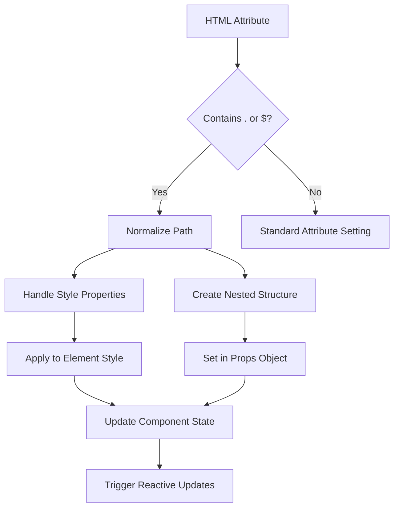
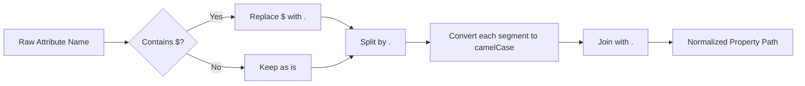
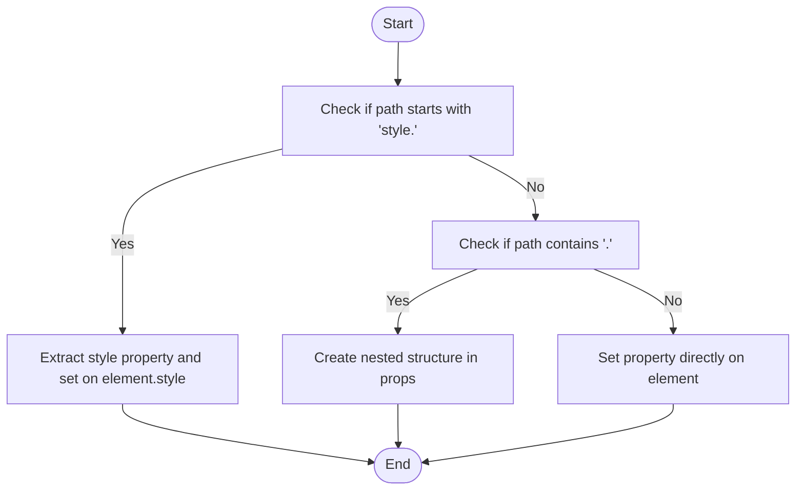
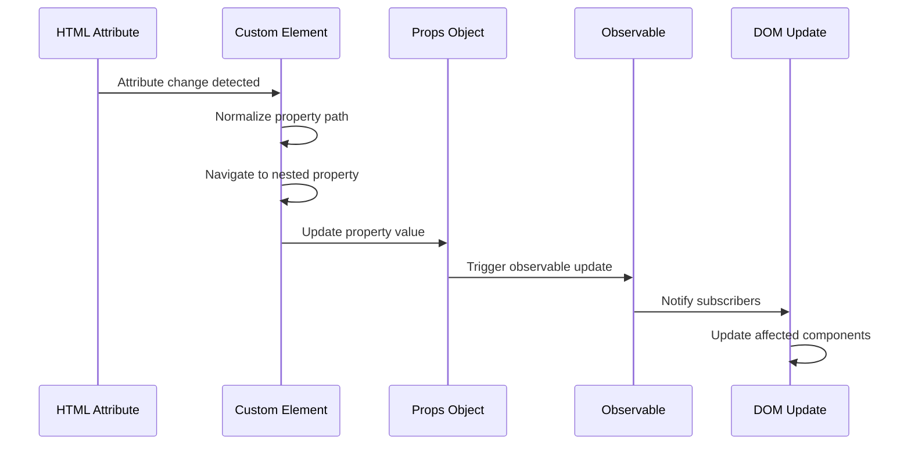

# Advanced Nested Property Support

<cite>
**Referenced Files in This Document**   
- [setters.ts](file://src/utils/setters.ts)
- [nested.ts](file://src/utils/nested.ts)
- [custom_element.ts](file://src/methods/custom_element.ts)
- [string.ts](file://src/utils/string.ts)
</cite>

## Table of Contents
1. [Introduction](#introduction)
2. [Core Implementation](#core-implementation)
3. [Property Path Normalization](#property-path-normalization)
4. [Nested Property Setting Mechanism](#nested-property-setting-mechanism)
5. [Integration with Reactivity System](#integration-with-reactivity-system)
6. [Usage Examples](#usage-examples)
7. [Performance Considerations](#performance-considerations)
8. [Common Issues and Best Practices](#common-issues-and-best-practices)
9. [Conclusion](#conclusion)

## Introduction
The Advanced Nested Property Support feature in Woby enables developers to directly manipulate deeply nested object structures in components through HTML attributes using both `$` and `.` notation. This powerful capability allows for intuitive configuration of complex component state directly from markup, bridging the gap between declarative HTML and reactive JavaScript objects. The feature supports setting properties like `user$name="John"` or `style.font-size="1.2em"` directly in HTML, which are automatically parsed and applied to the component's internal state structure.

This documentation provides a comprehensive analysis of the implementation details, covering how nested properties are parsed, validated, and applied to component state. It explains the relationship between this feature and the reactivity system, detailing how changes to nested properties trigger fine-grained updates. The document also addresses common issues such as property naming conflicts, performance considerations with deeply nested structures, and security implications of dynamic property access, while providing best practices for effective usage.

**Section sources**
- [setters.ts](file://src/utils/setters.ts#L18-L45)
- [nested.ts](file://src/utils/nested.ts#L0-L37)

## Core Implementation
The Advanced Nested Property Support is implemented through a coordinated system of utility functions across multiple files in the Woby framework. The core functionality is distributed between `setters.ts`, `nested.ts`, `custom_element.ts`, and `string.ts`, each handling specific aspects of the nested property processing pipeline. The implementation begins in `setters.ts` where the `setAttributeStatic` function detects nested property syntax and delegates to specialized handlers.

The architecture follows a modular approach where each component has a specific responsibility: `string.ts` handles naming convention conversions, `nested.ts` manages path normalization and attribute setting, while `custom_element.ts` integrates these capabilities with the custom element lifecycle. This separation of concerns allows for maintainable code and clear extension points for future enhancements. The system is designed to work seamlessly with both static and reactive properties, ensuring consistent behavior regardless of the property type.



**Diagram sources**
- [setters.ts](file://src/utils/setters.ts#L18-L45)
- [nested.ts](file://src/utils/nested.ts#L0-L103)

**Section sources**
- [setters.ts](file://src/utils/setters.ts#L18-L45)
- [nested.ts](file://src/utils/nested.ts#L0-L103)
- [custom_element.ts](file://src/methods/custom_element.ts#L0-L642)

## Property Path Normalization
The property path normalization process is a critical component of the nested property system, implemented in the `normalizePropertyPath` function within `nested.ts`. This function converts attribute names from HTML-friendly formats to JavaScript-compatible property paths by handling both `$` and `.` notation interchangeably. When an attribute contains the `$` character, it is replaced with a dot to create a unified path format that can be easily split and processed.

Following the notation conversion, each segment of the path undergoes kebab-case to camelCase transformation using the `kebabToCamelCase` utility from `string.ts`. This ensures compatibility with JavaScript's conventional property naming while maintaining the readability of CSS-style attribute names in HTML. For example, `user$first-name` becomes `user.firstName` after normalization, allowing seamless access to nested properties in the component's JavaScript code.

The normalization process is designed to be efficient and predictable, handling edge cases such as single-level properties without dots or dollar signs by simply converting them to camelCase. This comprehensive approach ensures that developers can use intuitive attribute names in their HTML while the framework handles the necessary transformations to maintain JavaScript compatibility.



**Diagram sources**
- [nested.ts](file://src/utils/nested.ts#L30-L42)
- [string.ts](file://src/utils/string.ts#L0-L78)

**Section sources**
- [nested.ts](file://src/utils/nested.ts#L30-L42)
- [string.ts](file://src/utils/string.ts#L0-L78)

## Nested Property Setting Mechanism
The nested property setting mechanism is implemented through the `setNestedAttribute` function in `nested.ts`, which handles the actual application of normalized property paths to HTML elements. This function first normalizes the incoming attribute name using `normalizePropertyPath` and then determines the appropriate handling strategy based on the property type. Special handling is provided for style properties, which are identified by the `style.` prefix in the normalized path.

For style properties, the function extracts the specific CSS property name, removes the `style.` prefix, and directly sets the value on the element's style object. This direct access ensures immediate visual updates and leverages the browser's native style handling. For other nested properties, the function creates a hierarchical structure within the element's props object, traversing the path and creating intermediate objects as needed. This approach maintains a clean separation between the element's direct properties and its component-specific props.

The implementation carefully handles edge cases such as missing intermediate objects or null values, ensuring robust behavior even with incomplete or malformed property paths. When setting the final property value, the function uses the element's props object as the target, preserving the component's internal state structure while allowing direct manipulation through HTML attributes.



**Diagram sources**
- [nested.ts](file://src/utils/nested.ts#L61-L103)
- [setters.ts](file://src/utils/setters.ts#L18-L45)

**Section sources**
- [nested.ts](file://src/utils/nested.ts#L61-L103)
- [setters.ts](file://src/utils/setters.ts#L18-L45)

## Integration with Reactivity System
The integration between nested property support and Woby's reactivity system is implemented in `custom_element.ts` through the `setNestedProperty` and `attributeChangedCallback1` functions. When an attribute changes, the custom element's `attributeChangedCallback1` method normalizes the property path and delegates to `setNestedProperty`, which navigates the nested object structure and applies the new value. This process is tightly coupled with the observable system, ensuring that changes propagate correctly through the reactivity chain.

For observable properties, the system uses `setObservableValue` to handle type conversion and notification of subscribers. This function checks if the target property is an observable and, if so, applies the new value through the observable's setter function, triggering any dependent computations. The integration supports various data types including numbers, booleans, and objects, with appropriate parsing from string values provided in HTML attributes.

The reactivity system ensures that changes to nested properties trigger fine-grained updates, only re-rendering the components that depend on the modified values. This efficient update mechanism prevents unnecessary re-renders and maintains high performance even with complex component hierarchies. The system also handles the reverse direction, allowing JavaScript code to update properties that are then reflected in the HTML attributes.



**Diagram sources**
- [custom_element.ts](file://src/methods/custom_element.ts#L194-L240)
- [custom_element.ts](file://src/methods/custom_element.ts#L582-L616)

**Section sources**
- [custom_element.ts](file://src/methods/custom_element.ts#L194-L240)
- [custom_element.ts](file://src/methods/custom_element.ts#L582-L616)

## Usage Examples
The Advanced Nested Property Support feature enables several practical usage patterns for configuring components through HTML attributes. For user profile components, developers can set nested properties like `user$name="John Doe"` and `user$age="30"` directly in the markup, which are automatically parsed and applied to the component's user object. Similarly, style properties can be configured using `style$font-size="1.2em"` or `style$color="blue"`, providing fine-grained control over visual presentation.

The feature supports both `$` and `.` notation in HTML, allowing developers to choose their preferred syntax. In JSX, only the `$` notation is supported, maintaining consistency with JavaScript's property access patterns. This flexibility enables the same component to be configured differently depending on the context, whether in static HTML files or dynamic JSX templates.

Complex nested structures can be created by chaining multiple properties, such as `config$database$host="localhost"` and `config$database$port="5432"`, which automatically creates a hierarchical configuration object within the component. This capability significantly reduces the need for JavaScript initialization code, allowing components to be fully configured through markup alone.

```mermaid
graph TB
subgraph "HTML Usage"
A[user$name="John Doe"] --> B[Creates user object]
C[user$age="30"] --> B
D[style$font-size="1.2em"] --> E[Applies to style object]
F[style$color="blue"] --> E
end
subgraph "JSX Usage"
G[user$name="Jane Smith"] --> H[Creates user object]
I[style$font-size="1.5em"] --> J[Applies to style object]
end
```

**Diagram sources**
- [custom_element.ts](file://src/methods/custom_element.ts#L114-L183)
- [readme.md](file://readme.md#L104-L145)

**Section sources**
- [custom_element.ts](file://src/methods/custom_element.ts#L114-L183)
- [readme.md](file://readme.md#L104-L145)

## Performance Considerations
The Advanced Nested Property Support implementation includes several performance optimizations to ensure efficient handling of nested properties. The path normalization and property setting operations are designed to be lightweight, with minimal string manipulation and object creation. The system caches normalized attribute names where possible, reducing redundant processing for frequently used properties.

For deeply nested structures, the implementation avoids unnecessary object creation by checking for existing intermediate objects before creating new ones. This optimization prevents memory bloat and reduces garbage collection pressure. The reactivity integration is also optimized to minimize the number of observable updates, batching changes when appropriate and only notifying subscribers when actual value changes occur.

The feature's performance characteristics make it suitable for most use cases, though developers should be mindful of extremely deep nesting levels or high-frequency updates to nested properties. In such cases, alternative approaches like pre-constructing complex objects in JavaScript may provide better performance. The system's fine-grained update mechanism helps mitigate performance issues by ensuring that only affected components are re-rendered.

**Section sources**
- [nested.ts](file://src/utils/nested.ts#L61-L103)
- [setters.ts](file://src/utils/setters.ts#L18-L45)

## Common Issues and Best Practices
When using the Advanced Nested Property Support feature, developers should be aware of several common issues and follow recommended best practices. Property naming conflicts can occur when attribute names collide with existing HTML attributes or JavaScript properties, so it's recommended to use descriptive, unique names for nested properties. The system handles these conflicts by prioritizing the props object for nested properties, but clear naming conventions can prevent confusion.

Security implications should be considered when allowing dynamic property access, particularly when property names are derived from user input. The framework includes basic validation to prevent prototype pollution and other common vulnerabilities, but developers should still validate and sanitize input when possible. For sensitive properties, consider using the `toHtml: () => undefined` option to prevent them from being set through HTML attributes.

Best practices include using consistent notation (preferring `$` for JSX and either `$` or `.` for HTML), avoiding excessively deep nesting levels, and documenting the available nested properties for component users. When working with complex nested structures, consider providing default values through the component's defaults function to ensure robust behavior even when some properties are not specified.

**Section sources**
- [custom_element.ts](file://src/methods/custom_element.ts#L95-L124)
- [nested.ts](file://src/utils/nested.ts#L61-L103)

## Conclusion
The Advanced Nested Property Support feature in Woby provides a powerful and intuitive way to configure complex component state directly through HTML attributes. By supporting both `$` and `.` notation, the feature bridges the gap between declarative markup and reactive JavaScript objects, enabling developers to create highly configurable components that can be easily embedded in static HTML files. The implementation is robust, efficient, and well-integrated with the framework's reactivity system, ensuring that changes to nested properties trigger appropriate updates throughout the component hierarchy.

This capability sets Woby apart from other frameworks by providing a unique combination of simplicity and power, allowing developers to achieve complex configurations with minimal code. The feature's design follows the framework's philosophy of transparency and direct DOM manipulation, avoiding the overhead of virtual DOM diffing while maintaining fine-grained reactivity. As web applications continue to grow in complexity, features like Advanced Nested Property Support will become increasingly valuable for creating maintainable, configurable components.