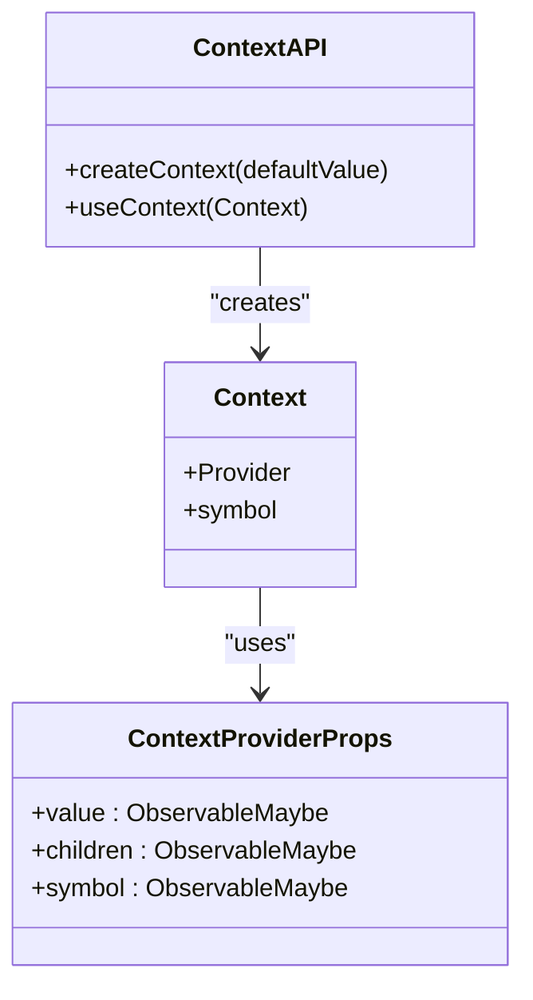
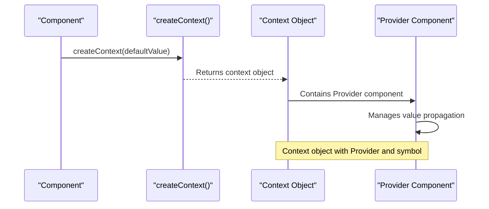
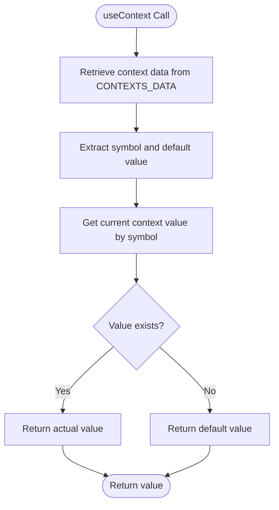
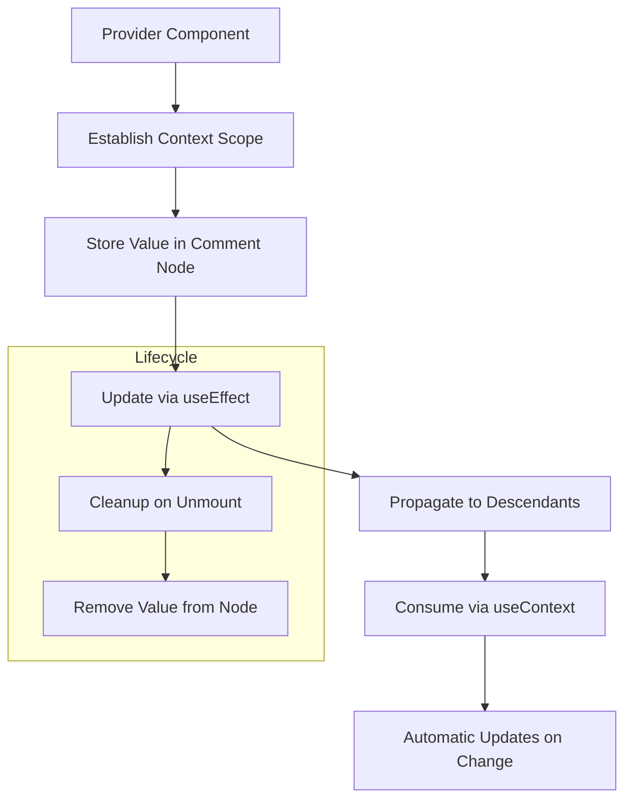
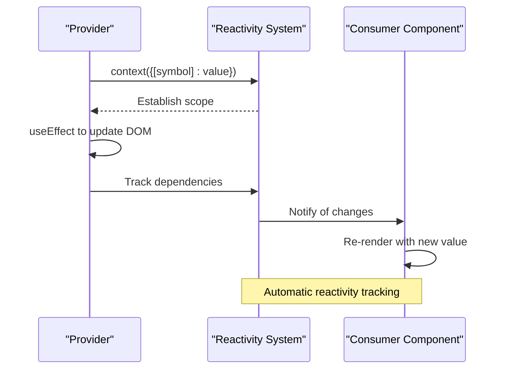
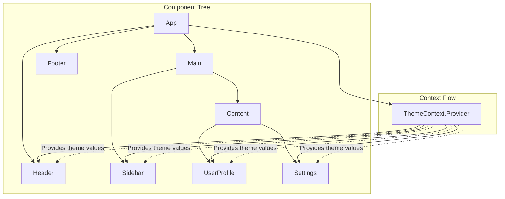

# Context API

<cite>
**Referenced Files in This Document**   
- [create_context.tsx](file://src/methods/create_context.tsx)
- [use_context.ts](file://src/hooks/use_context.ts)
- [constants.ts](file://src/constants.ts)
- [types.ts](file://src/types.ts)
- [soby.ts](file://src/soby.ts)
- [defaults.ts](file://src/methods/defaults.ts)
- [suspense.context.ts](file://src/components/suspense.context.ts)
</cite>

## Table of Contents
1. [Introduction](#introduction)
2. [Core Implementation](#core-implementation)
3. [Context Creation](#context-creation)
4. [Context Consumption](#context-consumption)
5. [Provider-Consumer Pattern](#provider-consumer-pattern)
6. [Reactivity Integration](#reactivity-integration)
7. [Cross-Component Communication](#cross-component-communication)
8. [Performance Considerations](#performance-considerations)
9. [Best Practices and Guidelines](#best-practices-and-guidelines)
10. [Troubleshooting Common Issues](#troubleshooting-common-issues)

## Introduction

The Context API in the Woby framework provides a powerful mechanism for sharing data across component trees without the need for prop drilling. This system enables components to access shared state and configuration values regardless of their position in the component hierarchy. The implementation supports both JSX components and custom elements, making it versatile for various use cases including theme management, user authentication state, and application configuration.

The Context API follows the provider-consumer pattern where a Provider component establishes a context value that can be consumed by any descendant component through the useContext hook. This approach promotes cleaner component interfaces and reduces the complexity of passing props through intermediate components that don't need the data.

**Section sources**
- [create_context.tsx](file://src/methods/create_context.tsx#L1-L133)
- [use_context.ts](file://src/hooks/use_context.ts#L1-L78)

## Core Implementation

The Context API implementation consists of two primary components: context creation through `createContext` and context consumption through `useContext`. These functions work together to establish a reliable mechanism for data propagation throughout the component tree.

The system leverages symbols as unique identifiers for each context instance, ensuring that context values are properly isolated and preventing collisions between different context objects. Context data is stored in a WeakMap (`CONTEXTS_DATA`) that maps context objects to their configuration, including the symbol identifier and default value.

**Diagram sources**
- [create_context.tsx](file://src/methods/create_context.tsx#L104-L133)
- [types.ts](file://src/types.ts#L35-L39)

**Section sources**
- [create_context.tsx](file://src/methods/create_context.tsx#L1-L133)
- [types.ts](file://src/types.ts#L35-L50)

## Context Creation

The `createContext` function is responsible for creating new context objects that can be used to share data across components. This function accepts an optional default value parameter that will be returned when no Provider is found in the component tree.

When a context is created, a unique symbol is generated to serve as the internal identifier for that specific context instance. This symbol ensures that context values are properly scoped and prevents interference between different context objects. The function returns a context object containing a Provider component and the symbol identifier.

The Provider component is implemented as a higher-order component that wraps its children and makes the context value available to them. It uses the `context` function from the underlying reactivity system to establish the context scope, ensuring that consuming components can access the current value.

**Diagram sources**
- [create_context.tsx](file://src/methods/create_context.tsx#L104-L133)
- [constants.ts](file://src/constants.ts#L5-L6)

**Section sources**
- [create_context.tsx](file://src/methods/create_context.tsx#L104-L133)
- [types.ts](file://src/types.ts#L35-L39)

## Context Consumption

The `useContext` hook provides a mechanism for components to access the current value of a context. This hook must be called within a functional component or custom hook and will return the nearest context value from a Provider component above it in the tree.

When `useContext` is called, it first retrieves the symbol and default value associated with the provided context object from the `CONTEXTS_DATA` WeakMap. It then attempts to retrieve the current context value using the symbol as a key. If no value is found in the current context scope, the hook returns the default value specified during context creation.

The implementation includes proper handling for both contexts with default values and those without. For contexts created without a default value, the hook will return undefined when no Provider is present in the component tree, allowing components to handle the absence of context appropriately.

**Diagram sources**
- [use_context.ts](file://src/hooks/use_context.ts#L62-L77)
- [constants.ts](file://src/constants.ts#L5-L6)

**Section sources**
- [use_context.ts](file://src/hooks/use_context.ts#L62-L77)
- [types.ts](file://src/types.ts#L35-L39)

## Provider-Consumer Pattern

The Context API implements the provider-consumer pattern through the interaction between the Provider component and the useContext hook. This pattern enables data to flow from a Provider component down through the component tree to any consuming components, regardless of their nesting depth.

The Provider component creates a context scope using the underlying reactivity system's context function. It uses a comment node reference to store the context value, which is updated via useEffect whenever the value changes. This approach ensures proper cleanup when the component is unmounted by removing the context value from the comment node.

For custom elements, the implementation includes a specialized ContextProvider component that uses the `defaults` function to establish default props. This allows custom elements to participate in the context system and receive context values appropriately.

**Diagram sources**
- [create_context.tsx](file://src/methods/create_context.tsx#L20-L29)
- [create_context.tsx](file://src/methods/create_context.tsx#L104-L133)

**Section sources**
- [create_context.tsx](file://src/methods/create_context.tsx#L20-L29)
- [defaults.ts](file://src/methods/defaults.ts#L1-L164)

## Reactivity Integration

The Context API is deeply integrated with the framework's reactivity system, enabling automatic tracking and updates of context values. When a context value changes, all components that consume that context are automatically re-rendered with the updated value.

The implementation leverages the `context` function from the underlying reactivity library (Soby) to establish context scopes. This function creates a reactive scope that tracks dependencies and ensures that consuming components are properly notified of changes.

The Provider component uses the `useEffect` hook to synchronize the context value with the DOM. When the value prop changes, the effect updates the comment node with the new value and ensures proper cleanup when the component unmounts. This approach maintains reactivity while preventing memory leaks.

**Diagram sources**
- [create_context.tsx](file://src/methods/create_context.tsx#L104-L133)
- [soby.ts](file://src/soby.ts#L1-L1)
- [hooks/soby.ts](file://src/hooks/soby.ts#L1-L11)

**Section sources**
- [create_context.tsx](file://src/methods/create_context.tsx#L104-L133)
- [soby.ts](file://src/soby.ts#L1-L1)
- [hooks/soby.ts](file://src/hooks/soby.ts#L4-L4)

## Cross-Component Communication

The Context API facilitates communication between distant components in the component tree, enabling patterns such as theme management and global state sharing. This capability eliminates the need to pass props through intermediate components that don't need the data.

For theme management, a ThemeContext can be created with default styling values. Components throughout the application can consume this context to access the current theme, allowing for consistent styling across the entire application. When the theme changes, all consuming components automatically update.

Similarly, for state sharing, contexts can be used to manage user authentication state, application configuration, or any other shared data. Components can access this state without requiring it to be passed explicitly through props, resulting in cleaner component interfaces.

**Diagram sources**
- [create_context.tsx](file://src/methods/create_context.tsx#L104-L133)
- [use_context.ts](file://src/hooks/use_context.ts#L62-L77)

**Section sources**
- [create_context.tsx](file://src/methods/create_context.tsx#L104-L133)
- [use_context.ts](file://src/hooks/use_context.ts#L62-L77)

## Performance Considerations

While the Context API provides a convenient way to share data across components, it's important to consider performance implications, especially when dealing with frequently updated values.

Context updates trigger re-renders in all consuming components, which can lead to performance issues if not managed properly. To mitigate this, consider using memoization techniques or breaking large context objects into smaller, more focused contexts.

The implementation includes optimizations such as using symbols for context identification and WeakMaps for storing context data, which helps prevent memory leaks. The use of comment nodes for value storage is also a lightweight approach that minimizes DOM impact.

For high-frequency updates, consider whether the data truly needs to be shared via context or if alternative approaches like prop drilling for closely related components might be more appropriate.

**Section sources**
- [create_context.tsx](file://src/methods/create_context.tsx#L104-L133)
- [use_context.ts](file://src/hooks/use_context.ts#L62-L77)

## Best Practices and Guidelines

When using the Context API, several best practices should be followed to ensure optimal performance and maintainability:

1. Use context for truly global data that needs to be accessed by many components
2. Avoid putting frequently changing data in context unless necessary
3. Consider breaking large context objects into smaller, more focused contexts
4. Provide meaningful default values when appropriate
5. Document the purpose and expected usage of each context

The Context API should be used judiciously, as overuse can make component dependencies less explicit and harder to trace. For data that is only needed by a few closely related components, prop drilling may be a clearer and more maintainable approach.

**Section sources**
- [create_context.tsx](file://src/methods/create_context.tsx#L1-L133)
- [use_context.ts](file://src/hooks/use_context.ts#L1-L78)

## Troubleshooting Common Issues

Common issues with the Context API include context nesting problems, unexpected re-renders, and improper cleanup. When multiple Providers of the same context are nested, the innermost Provider's value takes precedence.

To troubleshoot context-related issues:
1. Verify that Providers are properly positioned in the component tree
2. Check that context values are properly reactive
3. Ensure proper cleanup by confirming that useEffect cleanup functions are working
4. Validate that symbols are correctly generated and used

The implementation includes safeguards such as proper cleanup in useEffect and the use of unique symbols to prevent common issues. When problems occur, examining the context propagation flow and verifying the reactivity chain can help identify the root cause.

**Section sources**
- [create_context.tsx](file://src/methods/create_context.tsx#L104-L133)
- [use_context.ts](file://src/hooks/use_context.ts#L62-L77)
- [suspense.context.ts](file://src/components/suspense.context.ts#L1-L54)