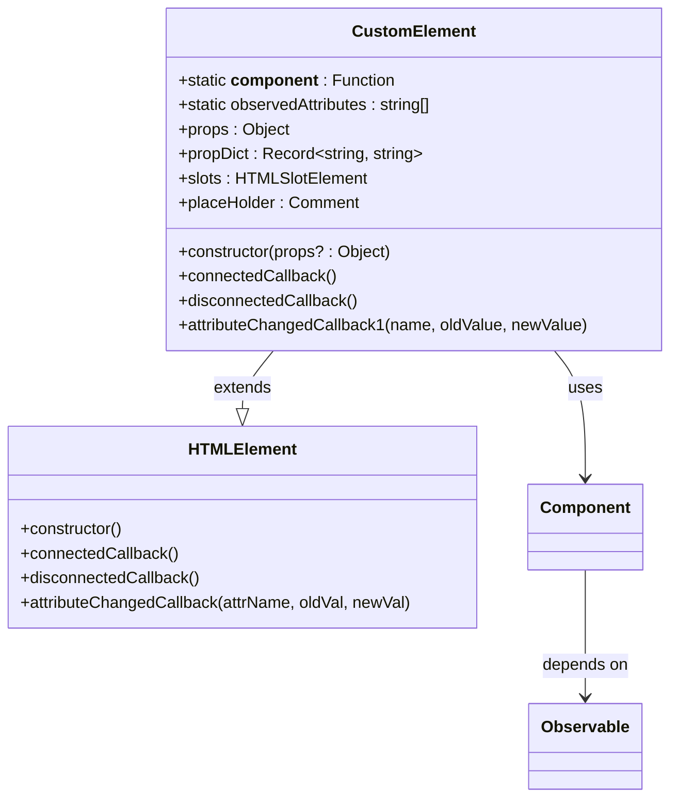
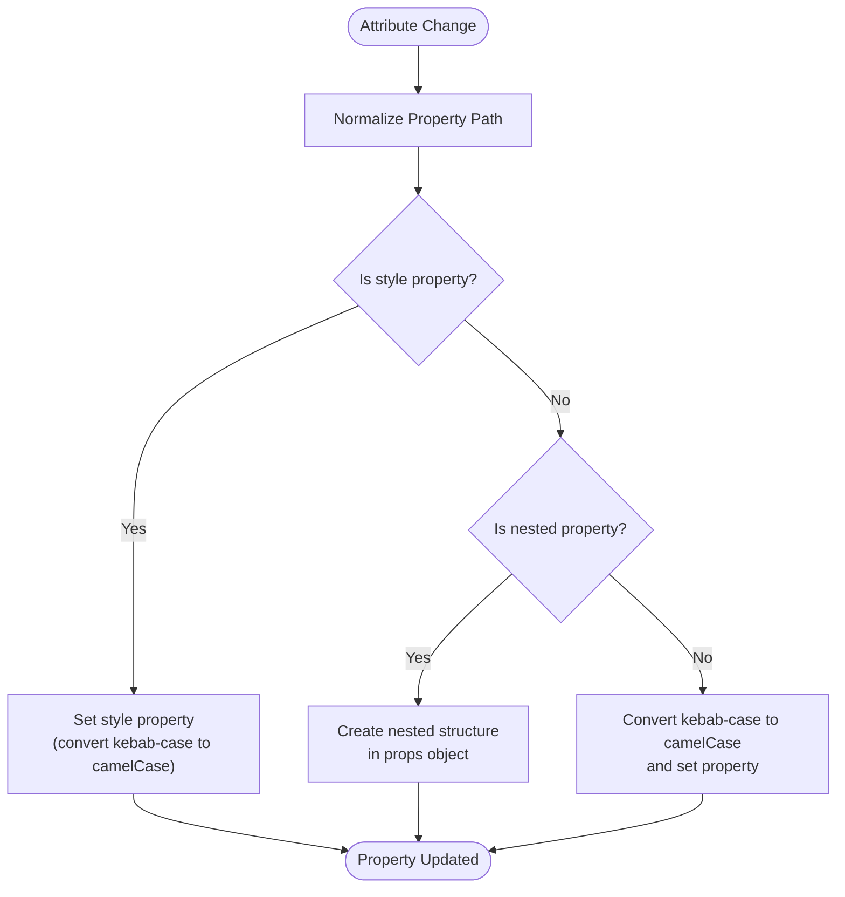
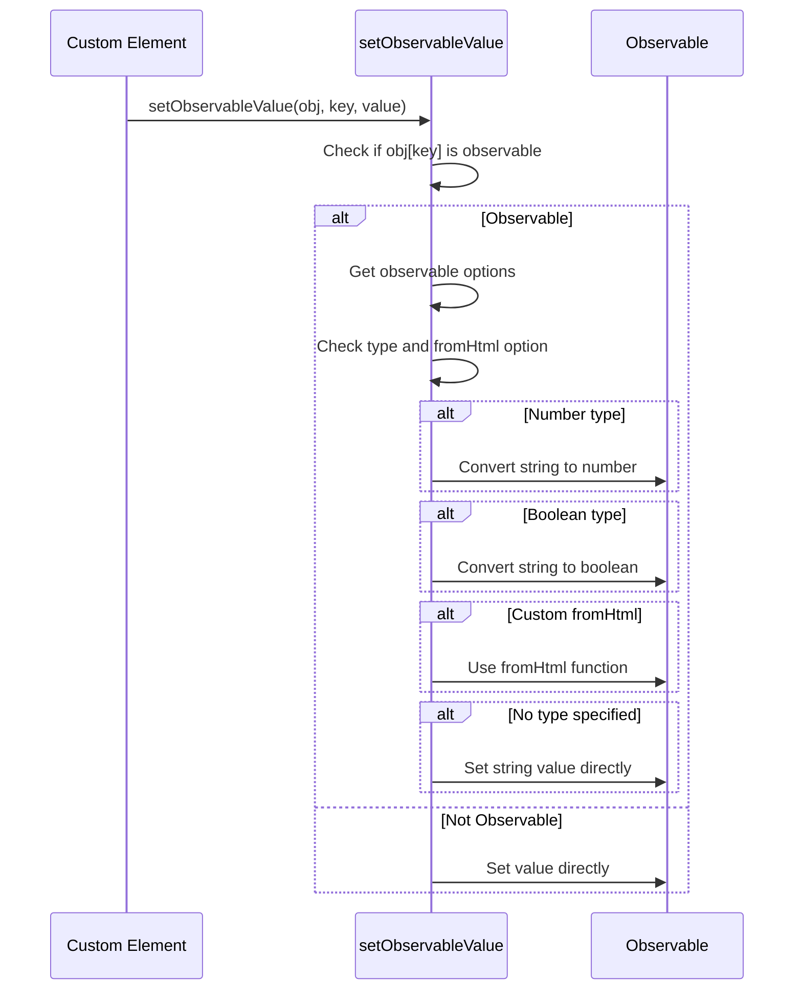
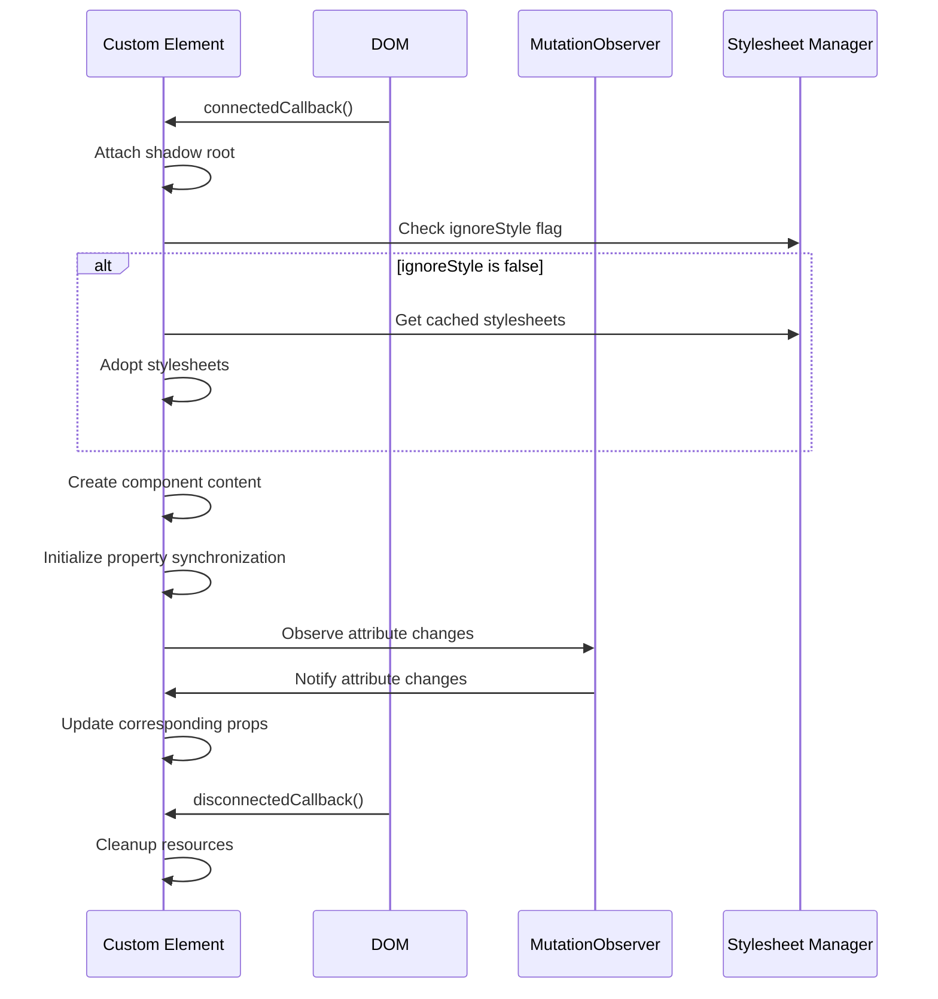

# Custom Elements

<cite>
**Referenced Files in This Document**   
- [custom_element.ts](file://src/methods/custom_element.ts)
- [defaults.ts](file://src/methods/defaults.ts)
- [string.ts](file://src/utils/string.ts)
- [nested.ts](file://src/utils/nested.ts)
- [stylesheets.ts](file://src/utils/stylesheets.ts)
- [README.md](file://src/methods/README.md)
</cite>

## Table of Contents
1. [Introduction](#introduction)
2. [Core Implementation](#core-implementation)
3. [Property Synchronization](#property-synchronization)
4. [Attribute Type Conversion](#attribute-type-conversion)
5. [DOM Lifecycle Handling](#dom-lifecycle-handling)
6. [Integration with Observables](#integration-with-observables)
7. [Common Issues and Solutions](#common-issues-and-solutions)
8. [Performance Considerations](#performance-considerations)
9. [Complete Example](#complete-example)
10. [Conclusion](#conclusion)

## Introduction

The Custom Elements feature in the Woby framework enables seamless integration between Woby components and Web Components, allowing developers to create reusable, reactive custom HTML elements. This implementation provides a bridge between the declarative nature of HTML and the reactive programming model of Woby, enabling components to be used both in JSX/TSX and directly in HTML markup without additional JavaScript initialization.

The core functionality revolves around the `customElement` function, which registers Woby components as custom HTML elements with reactive properties. These elements automatically synchronize attributes with component props, handle type conversion, and integrate with the Woby observable system for reactivity. The implementation supports nested properties, style attributes, and proper DOM lifecycle management, making it suitable for both simple and complex component scenarios.

**Section sources**
- [custom_element.ts](file://src/methods/custom_element.ts#L1-L50)
- [README.md](file://src/methods/README.md#L1-L20)

## Core Implementation

The custom element implementation is centered around the `customElement` function, which creates and registers custom HTML elements that integrate with Woby's observable system. The implementation follows the Web Components specification while adding Woby-specific reactive capabilities.

The process begins with a component that has default props defined using the `defaults` helper function. When `customElement` is called with a tag name and component, it creates a class that extends `HTMLElement` and sets up the necessary infrastructure for reactive property synchronization. The custom element class maintains a reference to the component function and automatically observes all properties defined in the component's defaults.

Key aspects of the core implementation include:
- Shadow DOM encapsulation with optional stylesheet adoption
- Automatic attribute to prop mapping with kebab-case to camelCase conversion
- Support for nested properties using both `$` and `.` notation
- Context support for custom elements
- Custom serialization using `toHtml` and `fromHtml` options



**Diagram sources**
- [custom_element.ts](file://src/methods/custom_element.ts#L452-L641)

**Section sources**
- [custom_element.ts](file://src/methods/custom_element.ts#L452-L641)
- [defaults.ts](file://src/methods/defaults.ts#L143-L162)

## Property Synchronization

Property synchronization is a fundamental aspect of the custom elements implementation, ensuring that HTML attributes and component props stay in sync. The system handles both flat and nested properties, with special handling for style attributes.

For flat properties, the implementation automatically converts kebab-case attribute names to camelCase property names using the `kebabToCamelCase` utility function. This allows developers to use natural HTML attribute naming while maintaining JavaScript-style property access within components.

Nested properties are supported through two syntaxes:
- `$` notation (e.g., `nested$prop$value`) for both HTML and JSX
- `.` notation (e.g., `nested.prop.value`) for HTML only

The `normalizePropertyPath` function handles the conversion of these notations, normalizing `$` to `.` and converting each segment from kebab-case to camelCase. This enables complex data structures to be passed through HTML attributes while maintaining readability.

Style properties receive special treatment, with attributes like `style$font-size` or `style.font-size` being automatically converted and applied to the element's style object. The implementation handles the conversion from kebab-case to camelCase for CSS property names, ensuring proper application of styles.



**Diagram sources**
- [custom_element.ts](file://src/methods/custom_element.ts#L69-L93)
- [string.ts](file://src/utils/string.ts#L27-L29)
- [nested.ts](file://src/utils/nested.ts#L30-L42)

**Section sources**
- [custom_element.ts](file://src/methods/custom_element.ts#L69-L93)
- [string.ts](file://src/utils/string.ts#L27-L29)
- [nested.ts](file://src/utils/nested.ts#L30-L42)

## Attribute Type Conversion

The custom elements implementation includes sophisticated type conversion capabilities that handle the automatic conversion of string attribute values to appropriate JavaScript types based on observable options. This is managed by the `setObservableValue` function, which examines the observable's type metadata and performs the appropriate conversion.

The system supports several built-in types:
- **Number**: Converts string values to numbers using `Number()`
- **Boolean**: Handles various boolean representations ('true', '1', empty string)
- **BigInt**: Attempts to parse string values using `BigInt()`
- **Object**: Attempts to parse string values as JSON
- **Function**: Uses custom `fromHtml` serializer if provided
- **Symbol**: Creates a symbol from the string value
- **Undefined**: Converts to undefined value

When a type is not explicitly specified, the system uses the `fromHtml` option if provided, otherwise it sets the string value directly. This allows for custom serialization logic, such as converting ISO date strings to Date objects.

To hide a property from HTML attributes (preventing it from being set via attributes), developers can use `{ toHtml: () => undefined }` in the observable options. This is useful for properties that should only be set programmatically.



**Diagram sources**
- [custom_element.ts](file://src/methods/custom_element.ts#L95-L145)

**Section sources**
- [custom_element.ts](file://src/methods/custom_element.ts#L95-L145)

## DOM Lifecycle Handling

The custom elements implementation properly handles the DOM lifecycle through the standard Web Components lifecycle callbacks: `connectedCallback`, `disconnectedCallback`, and a custom `attributeChangedCallback1`. These callbacks ensure that elements are properly initialized, updated, and cleaned up.

During the `connectedCallback`, the element sets up attribute observation using a `MutationObserver` to detect changes to any attributes. This observer watches for attribute changes with `attributeOldValue` enabled, allowing the system to compare old and new values and avoid unnecessary updates.

The element creation process includes:
1. Attaching a shadow root with open mode
2. Optionally adopting global stylesheets (unless `ignoreStyle` is true)
3. Creating the component's content using `createElement`
4. Setting up the initial property-to-attribute synchronization

Stylesheet encapsulation is handled through the `convertAllDocumentStylesToConstructed` function, which converts all document stylesheets to constructed stylesheets that can be adopted by shadow roots. This ensures consistent styling across the application while maintaining encapsulation.

The `observeStylesheetChanges` function sets up a `MutationObserver` to watch for changes to the document's stylesheets. When changes are detected, the stylesheet cache is invalidated, ensuring that custom elements always have access to the latest styles.



**Diagram sources**
- [custom_element.ts](file://src/methods/custom_element.ts#L517-L583)
- [stylesheets.ts](file://src/utils/stylesheets.ts#L29-L59)
- [stylesheets.ts](file://src/utils/stylesheets.ts#L75-L96)

**Section sources**
- [custom_element.ts](file://src/methods/custom_element.ts#L517-L583)
- [stylesheets.ts](file://src/utils/stylesheets.ts#L29-L59)
- [stylesheets.ts](file://src/utils/stylesheets.ts#L75-L96)

## Integration with Observables

The custom elements system is deeply integrated with Woby's observable system, enabling true reactivity where attribute changes automatically trigger observable updates and subsequent UI re-renders. This integration is achieved through the `isObservable` and `isObservableWritable` checks in the `setObservableValue` function.

When an attribute changes, the system checks if the corresponding property is an observable. If it is, the value is set through the observable's setter function, which triggers the reactivity system. This ensures that any computed values, effects, or dependent components are properly updated.

The relationship between custom elements and observables works in both directions:
1. **Attribute → Observable**: HTML attribute changes update the corresponding observable
2. **Observable → Attribute**: Observable changes can be reflected back to attributes (if `toHtml` is defined)

This bidirectional synchronization creates a seamless experience where components can be controlled both through HTML attributes and programmatically through JavaScript, with changes propagating appropriately in both directions.

The system also handles nested observables within complex objects, allowing for fine-grained reactivity even with deeply nested data structures. When a nested property is updated through an attribute, the corresponding observable in the nested structure is updated, triggering reactivity at the appropriate level.

**Section sources**
- [custom_element.ts](file://src/methods/custom_element.ts#L95-L145)
- [custom_element.ts](file://src/methods/custom_element.ts#L618-L641)

## Common Issues and Solutions

Several common issues arise when working with custom elements in the Woby framework, along with their solutions:

### Attribute Naming Conventions
**Issue**: Inconsistent naming between HTML and JSX
**Solution**: Use kebab-case for HTML attributes and camelCase for JSX props. The system automatically handles the conversion, but developers should be consistent in their usage.

### Type Serialization
**Issue**: Complex types not properly serialized/deserialized
**Solution**: Use the `toHtml` and `fromHtml` options in observable definitions to provide custom serialization logic. For example, dates can be serialized as ISO strings and deserialized back to Date objects.

### Performance at Scale
**Issue**: Performance degradation with many custom elements
**Solution**: 
- Use `ignoreStyle: true` for elements that don't need global styles
- Minimize the number of observed attributes
- Use debounced updates for frequently changing attributes
- Consider using virtual scrolling for large lists of custom elements

### Shadow DOM Encapsulation
**Issue**: Styles not applying correctly in shadow DOM
**Solution**: 
- Ensure stylesheets are properly converted to constructed stylesheets
- Use `adoptedStyleSheets` for global styles
- Use CSS custom properties for theming
- Consider using `ignoreStyle: true` and manually managing styles if needed

### Nested Property Access
**Issue**: Difficulty accessing nested properties
**Solution**: Use the normalized path syntax (`nested$prop$value` or `nested.prop.value`) and ensure the `normalizePropertyPath` function is properly handling the conversion.

**Section sources**
- [custom_element.ts](file://src/methods/custom_element.ts#L1-L50)
- [README.md](file://src/methods/README.md#L221-L234)

## Performance Considerations

When using custom elements at scale, several performance considerations should be addressed:

### Stylesheet Management
The stylesheet system uses caching to improve performance, but this cache can become stale. The `observeStylesheetChanges` function automatically invalidates the cache when stylesheets change, but this comes with a small performance cost. For applications with stable styles, this is not an issue, but for dynamic styling scenarios, consider:

- Using `ignoreStyle: true` for elements that don't need global styles
- Manually managing stylesheet adoption for better control
- Implementing a more sophisticated caching strategy for high-performance scenarios

### Attribute Observation
The `MutationObserver` used for attribute observation is efficient, but can still impact performance with many elements. Consider:

- Limiting the number of observed attributes
- Using debounced updates for frequently changing attributes
- Implementing a throttling mechanism for high-frequency updates

### Memory Usage
Custom elements maintain references to their component functions and props, which can increase memory usage. To optimize:

- Clean up unused elements promptly
- Use `disconnectedCallback` to release resources
- Avoid circular references in component data

### Initialization Performance
Element initialization involves several steps that can impact performance:
- Shadow root creation
- Stylesheet adoption
- Component rendering
- Attribute synchronization

For critical performance scenarios, consider:
- Lazy loading of non-visible elements
- Using placeholder elements for off-screen content
- Implementing a pool of reusable elements

**Section sources**
- [custom_element.ts](file://src/methods/custom_element.ts#L517-L583)
- [stylesheets.ts](file://src/utils/stylesheets.ts#L29-L59)

## Complete Example

Here is a complete example demonstrating the use of custom elements with the Woby framework:

```tsx
import { $, $$, render, Observable, customElement, ElementAttributes, defaults } from 'woby'

// Define a component with default props
const Counter = defaults(() => ({
  value: $(0, { type: 'number' } as const),
  color: $('black'),
  size: $('1em')
}), ({ value, color, size }: { 
  value: Observable<number>,
  color: Observable<string>,
  size: Observable<string>
}): JSX.Element => {
  return <div style={{ color: color(), fontSize: size() }}>
    <h1>Counter</h1>
    <p>{value}</p>
    <button onClick={() => value(prev => prev + 1)}>+</button>
    <button onClick={() => value(prev => prev - 1)}>-</button>
  </div>
})

// Register as custom element
customElement('counter-element', Counter)

// Extend JSX types to include the custom element
declare module 'woby' {
    namespace JSX {
        interface IntrinsicElements {
            'counter-element': ElementAttributes<typeof Counter>
        }
    }
}

// Use the custom element
const App = () => {
  return <counter-element 
    value={5}
    color="red"
    size="2em"
    style$font-size="2em"
  />
}

render(<App />, document.getElementById('app'))
```

This example demonstrates:
- Component definition with default props using `defaults`
- Registration as a custom element with `customElement`
- Type extension for JSX support
- Usage in JSX with both standard and style attributes
- Automatic type conversion for the numeric `value` prop

The element can also be used directly in HTML:
```html
<counter-element 
  value="5"
  color="blue" 
  style$font-size="1.5em" 
  style.font-size="1.5em"
  class="border-2 border-black border-solid bg-amber-400">
</counter-element>
```

**Section sources**
- [README.md](file://src/methods/README.md#L168-L234)

## Conclusion

The Custom Elements implementation in the Woby framework provides a robust and flexible system for creating reactive web components that integrate seamlessly with the framework's observable system. By bridging the gap between declarative HTML and reactive JavaScript, it enables components to be used in both JSX/TSX and plain HTML contexts without additional configuration.

Key strengths of the implementation include:
- Automatic property synchronization with type conversion
- Support for nested properties and style attributes
- Proper DOM lifecycle management
- Integration with the observable system for true reactivity
- Shadow DOM encapsulation with stylesheet management

The system is designed to be accessible to beginners while providing sufficient depth for experienced developers, with clear patterns for common use cases and extensibility for advanced scenarios. By following the documented patterns and being aware of the performance considerations, developers can create efficient, maintainable custom elements that enhance the reusability and interoperability of their components.