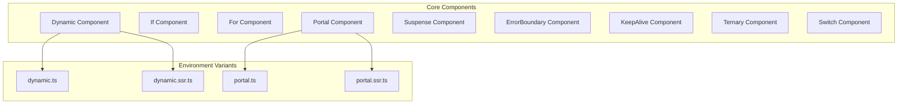
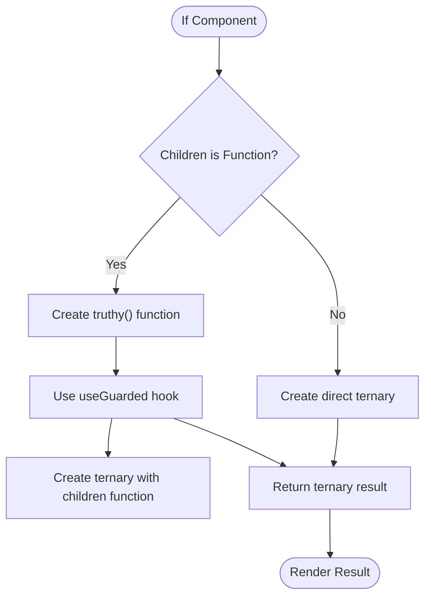
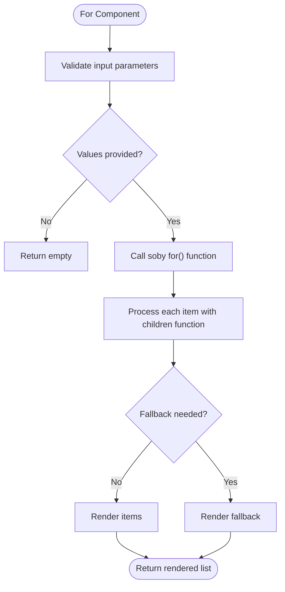
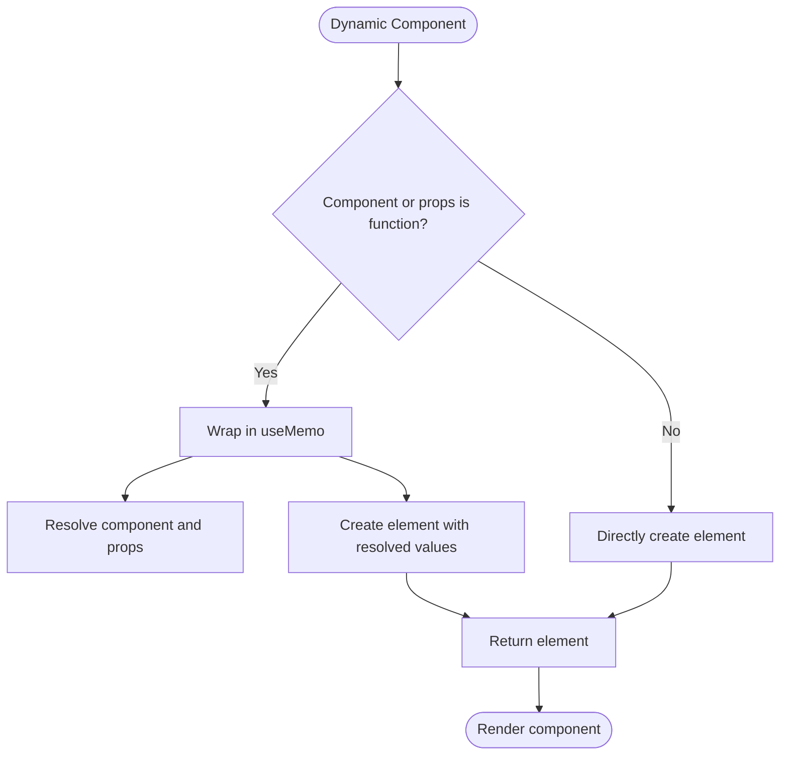
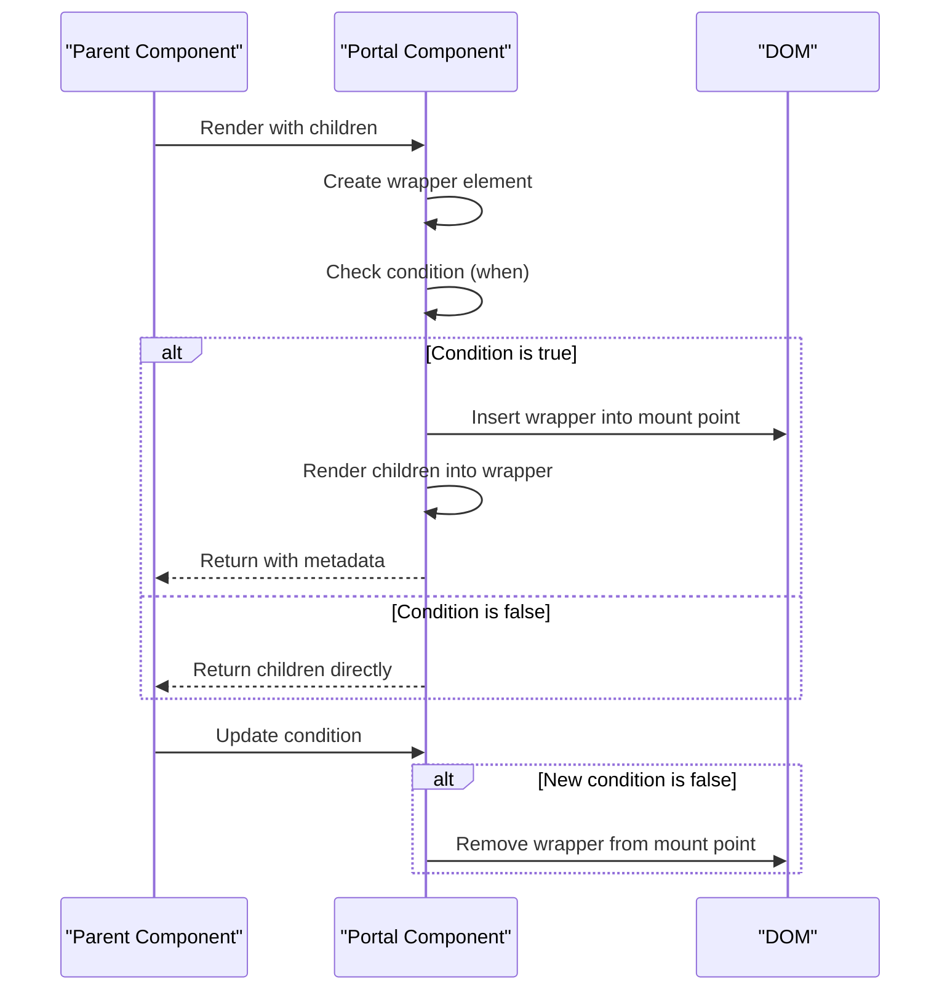
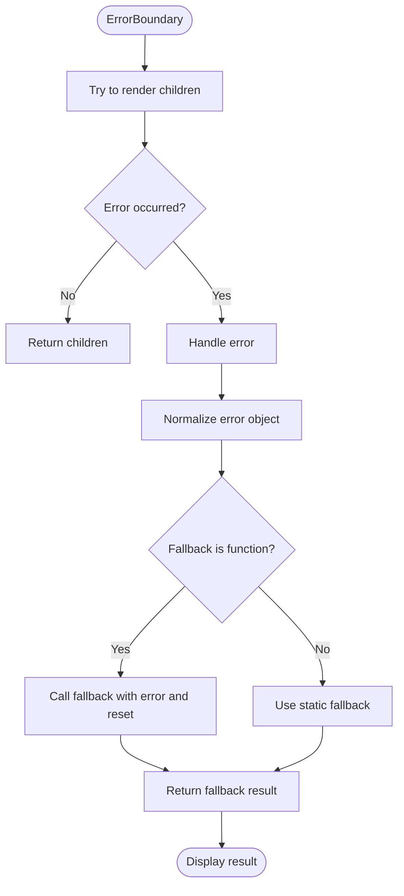
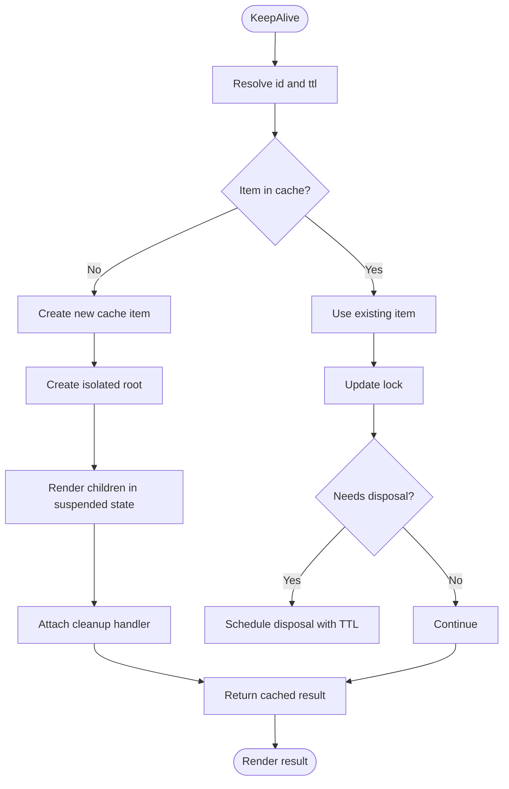

# Components

<cite>
**Referenced Files in This Document**   
- [dynamic.ts](file://src/components/dynamic.ts)
- [dynamic.ssr.ts](file://src/components/dynamic.ssr.ts)
- [if.ts](file://src/components/if.ts)
- [for.ts](file://src/components/for.ts)
- [portal.ts](file://src/components/portal.ts)
- [portal.ssr.ts](file://src/components/portal.ssr.ts)
- [suspense.ts](file://src/components/suspense.ts)
- [error_boundary.ts](file://src/components/error_boundary.ts)
- [keep_alive.ts](file://src/components/keep_alive.ts)
- [ternary.ts](file://src/components/ternary.ts)
- [switch.ts](file://src/components/switch.ts)
- [index.ts](file://src/components/index.ts)
- [index.ssr.ts](file://src/components/index.ssr.ts)
- [use_guarded.ts](file://src/hooks/use_guarded.ts)
- [soby.ts](file://src/soby.ts)
</cite>

## Table of Contents
1. [Introduction](#introduction)
2. [Core Components Overview](#core-components-overview)
3. [Conditional Rendering Components](#conditional-rendering-components)
4. [List Rendering Component](#list-rendering-component)
5. [Dynamic Component Loading](#dynamic-component-loading)
6. [Portal Component](#portal-component)
7. [Suspense and Error Handling](#suspense-and-error-handling)
8. [Advanced State Management Components](#advanced-state-management-components)
9. [Component Composition Patterns](#component-composition-patterns)
10. [Client vs SSR Implementations](#client-vs-ssr-implementations)
11. [Performance Considerations](#performance-considerations)
12. [Best Practices and Troubleshooting](#best-practices-and-troubleshooting)

## Introduction

Woby provides a comprehensive set of built-in UI components designed to handle common rendering patterns and state management scenarios. These components enable developers to build reactive, efficient, and maintainable user interfaces. This document details the purpose, usage, and implementation of Woby's core components including Dynamic, If, For, Portal, Suspense, and ErrorBoundary, along with advanced features like keep-alive and ternary components.

**Section sources**
- [index.ts](file://src/components/index.ts#L1-L11)

## Core Components Overview

Woby's component system is built around functional components that leverage reactive programming patterns. The core components provide abstractions for common UI patterns including conditional rendering, list rendering, dynamic component loading, and error handling. These components are designed to work seamlessly with Woby's reactivity system and can be used in both client and server-side rendering contexts.

The components are exported through index files that provide different implementations for different environments (client, SSR). The main entry point `index.ts` exports the client-side implementations, while `index.ssr.ts` provides server-side compatible versions.

**Diagram sources**
- [index.ts](file://src/components/index.ts#L1-L11)
- [index.ssr.ts](file://src/components/index.ssr.ts#L1-L13)

**Section sources**
- [index.ts](file://src/components/index.ts#L1-L11)
- [index.ssr.ts](file://src/components/index.ssr.ts#L1-L13)

## Conditional Rendering Components

### If Component

The `If` component provides conditional rendering capabilities based on a condition. It accepts a `when` prop that determines whether to render the main content or fallback. The component supports both direct children and function-based children that receive a truthiness check function.

When the children prop is a function (but not an observable or component), it receives a function that can be called to check if the condition is truthy. This enables fine-grained control over rendering based on the condition's value.

**Diagram sources**
- [if.ts](file://src/components/if.ts#L15-L28)
- [use_guarded.ts](file://src/hooks/use_guarded.ts#L15-L38)

**Section sources**
- [if.ts](file://src/components/if.ts#L15-L28)

### Ternary Component

The `Ternary` component provides a simple way to render one of two alternatives based on a condition. It accepts a `when` prop and an array of two children, rendering the first child when the condition is truthy and the second when falsy.

This component is a thin wrapper around the core `ternary` function from the soby reactivity library, providing a declarative API for conditional rendering.

**Section sources**
- [ternary.ts](file://src/components/ternary.ts#L5-L8)

### Switch Component

The `Switch` component enables multi-way conditional rendering similar to a switch statement. It evaluates a `when` value against multiple `Case` components and renders the matching one, with an optional `Default` component for unmatched cases.

The `Case` and `Default` components use metadata to store their values and associated content, which the main `Switch` component uses to determine which case to render.

**Section sources**
- [switch.ts](file://src/components/switch.ts#L15-L36)

## List Rendering Component

### For Component

The `For` component handles list rendering with support for keyed and unkeyed iterations. It accepts an array of values and a render function that receives each value and its index.

The component supports two modes:
- **Keyed mode** (default): Each item is tracked by its position in the array
- **Unkeyed mode**: Enabled with `unkeyed={true}`, which can improve performance for static lists

The `For` component delegates to the core `for` function from the soby library, providing a reactive implementation that efficiently handles array updates.

**Diagram sources**
- [for.ts](file://src/components/for.ts#L5-L13)

**Section sources**
- [for.ts](file://src/components/for.ts#L5-L13)

## Dynamic Component Loading

### Dynamic Component

The `Dynamic` component enables runtime component selection and rendering. It accepts a `component` prop that can be either a component function or a reactive signal that resolves to a component.

When either the `component` or `props` are functions (potentially reactive), the component uses `useMemo` to memoize the result, ensuring efficient re-renders. Otherwise, it directly creates the element.

The SSR version (`dynamic.ssr.ts`) uses SSR-specific methods for element creation, demonstrating Woby's approach to environment-specific implementations.

**Diagram sources**
- [dynamic.ts](file://src/components/dynamic.ts#L15-L27)
- [dynamic.ssr.ts](file://src/components/dynamic.ssr.ts#L15-L26)

**Section sources**
- [dynamic.ts](file://src/components/dynamic.ts#L15-L27)
- [dynamic.ssr.ts](file://src/components/dynamic.ssr.ts#L15-L26)

## Portal Component

### Portal Implementation

The `Portal` component enables rendering content into a different part of the DOM tree, typically used for modals, tooltips, and other overlay elements.

Key features:
- **Conditional rendering**: Controlled by the `when` prop
- **Custom mount points**: Specified via the `mount` prop (defaults to document.body)
- **Custom wrappers**: Specified via the `wrapper` prop (creates a div by default)
- **Cleanup**: Automatically removes the portal element when unmounted

The component uses `useRenderEffect` to manage the DOM insertion and removal, ensuring proper cleanup. It returns a metadata object containing a reference to the portal element, enabling parent components to interact with it.

The SSR implementation (`portal.ssr.ts`) uses SSR-compatible node creation methods, maintaining the same API while adapting to server-side constraints.

**Diagram sources**
- [portal.ts](file://src/components/portal.ts#L15-L50)
- [portal.ssr.ts](file://src/components/portal.ssr.ts#L15-L49)

**Section sources**
- [portal.ts](file://src/components/portal.ts#L15-L50)
- [portal.ssr.ts](file://src/components/portal.ssr.ts#L15-L49)

## Suspense and Error Handling

### Suspense Component

The `Suspense` component provides a way to handle asynchronous operations and loading states. It works with Woby's reactivity system to suspend rendering while waiting for data.

The component uses the `SuspenseContext` to coordinate suspension across the component tree. When the `when` condition is truthy or the suspense context is active, it renders the `fallback` content; otherwise, it renders the main `children`.

It leverages `useSuspense` to manage the suspension state and `useMemo` to memoize the condition, ensuring efficient updates.

**Section sources**
- [suspense.ts](file://src/components/suspense.ts#L15-L26)

### ErrorBoundary Component

The `ErrorBoundary` component provides error handling capabilities, catching errors that occur during rendering and displaying a fallback UI.

It uses the `tryCatch` function from the soby library to catch errors. The `fallback` can be either a static child or a function that receives the error and a reset function, allowing users to recover from errors.

The component uses `untrack` to prevent the fallback rendering from creating reactive dependencies, ensuring stable error recovery.

**Diagram sources**
- [error_boundary.ts](file://src/components/error_boundary.ts#L15-L18)

**Section sources**
- [error_boundary.ts](file://src/components/error_boundary.ts#L15-L18)

## Advanced State Management Components

### KeepAlive Component

The `KeepAlive` component provides state preservation for components that are temporarily unmounted. It caches component instances and their state for a specified time-to-live (TTL).

Key features:
- **Instance caching**: Uses a global cache object to store component instances
- **Lock mechanism**: Prevents race conditions during updates
- **TTL support**: Automatically disposes of cached instances after the specified time
- **Suspension management**: Integrates with the suspense system

The component uses `useResolved` to reactively respond to changes in the `id` and `ttl` props. It creates a super root using `with` from soby to isolate the cached component's lifecycle.

**Diagram sources**
- [keep_alive.ts](file://src/components/keep_alive.ts#L15-L98)

**Section sources**
- [keep_alive.ts](file://src/components/keep_alive.ts#L15-L98)

## Component Composition Patterns

Woby components are designed to be composable, allowing developers to build complex UIs from simple building blocks. Key composition patterns include:

- **Higher-order components**: Components that accept other components as props
- **Render props**: Components that accept functions as children
- **Context-based composition**: Using context for cross-cutting concerns
- **Conditional composition**: Combining components based on runtime conditions

The components work together to create sophisticated UI patterns. For example, `Suspense` can be combined with `Dynamic` for lazy loading, or `ErrorBoundary` can wrap `For` to handle errors in list rendering.

**Section sources**
- [index.ts](file://src/components/index.ts#L1-L11)

## Client vs SSR Implementations

Woby provides different implementations of certain components for client and server-side rendering environments:

| Component | Client File | SSR File | Key Differences |
|---------|-----------|--------|----------------|
| Dynamic | dynamic.ts | dynamic.ssr.ts | Uses different createElement methods |
| Portal | portal.ts | portal.ssr.ts | Uses different node creation methods |
| Index | index.ts | index.ssr.ts | Different portal import |

The SSR implementations avoid DOM-specific operations where possible and use server-compatible methods for node creation and manipulation. This ensures that components can be rendered on the server while maintaining the same API surface.

The pattern of having separate `.ts` and `.ssr.ts` files allows Woby to optimize for each environment while providing a consistent developer experience.

**Section sources**
- [dynamic.ts](file://src/components/dynamic.ts#L15-L27)
- [dynamic.ssr.ts](file://src/components/dynamic.ssr.ts#L15-L26)
- [portal.ts](file://src/components/portal.ts#L15-L50)
- [portal.ssr.ts](file://src/components/portal.ssr.ts#L15-L49)
- [index.ts](file://src/components/index.ts#L1-L11)
- [index.ssr.ts](file://src/components/index.ssr.ts#L1-L13)

## Performance Considerations

When using Woby components, consider the following performance implications:

- **Memoization**: Components like `Dynamic` automatically use `useMemo` when props are reactive, preventing unnecessary re-renders
- **DOM operations**: `Portal` minimizes DOM operations by using `useRenderEffect` and proper cleanup
- **List rendering**: Use `unkeyed` mode in `For` for static lists to improve performance
- **Suspense boundaries**: Place `Suspense` components strategically to avoid over-blocking
- **Error boundaries**: Position `ErrorBoundary` components to catch errors at appropriate levels
- **KeepAlive caching**: Use appropriate TTL values to balance memory usage and performance

The components are designed with performance in mind, leveraging Woby's reactivity system to minimize unnecessary work.

**Section sources**
- [dynamic.ts](file://src/components/dynamic.ts#L15-L27)
- [for.ts](file://src/components/for.ts#L5-L13)
- [portal.ts](file://src/components/portal.ts#L15-L50)
- [suspense.ts](file://src/components/suspense.ts#L15-L26)
- [keep_alive.ts](file://src/components/keep_alive.ts#L15-L98)

## Best Practices and Troubleshooting

### When to Use Each Component

| Component | Use Case | Anti-pattern |
|---------|--------|------------|
| If | Simple conditional rendering | Complex nested conditions |
| For | List rendering | Manual array mapping |
| Dynamic | Runtime component selection | Static component imports |
| Portal | Overlay elements (modals, tooltips) | Regular DOM structure |
| Suspense | Async data loading | Sync rendering of async data |
| ErrorBoundary | Error isolation | Global error handling |
| KeepAlive | State preservation | Caching everything |

### Common Issues and Solutions

- **Portal not rendering**: Ensure the mount node exists in the DOM
- **Dynamic component not updating**: Ensure reactive dependencies are properly tracked
- **Suspense infinite loading**: Verify the `when` condition eventually becomes falsy
- **ErrorBoundary not catching**: Errors must occur during rendering, not in event handlers
- **KeepAlive memory leaks**: Set appropriate TTL values

### Integration Patterns

- Combine `Suspense` with `Dynamic` for code splitting
- Wrap `For` with `ErrorBoundary` for robust list rendering
- Use `KeepAlive` with route components for SPA navigation
- Combine `If` and `Ternary` for complex conditional logic

**Section sources**
- [dynamic.ts](file://src/components/dynamic.ts#L15-L27)
- [if.ts](file://src/components/if.ts#L15-L28)
- [for.ts](file://src/components/for.ts#L5-L13)
- [portal.ts](file://src/components/portal.ts#L15-L50)
- [suspense.ts](file://src/components/suspense.ts#L15-L26)
- [error_boundary.ts](file://src/components/error_boundary.ts#L15-L18)
- [keep_alive.ts](file://src/components/keep_alive.ts#L15-L98)
- [ternary.ts](file://src/components/ternary.ts#L5-L8)