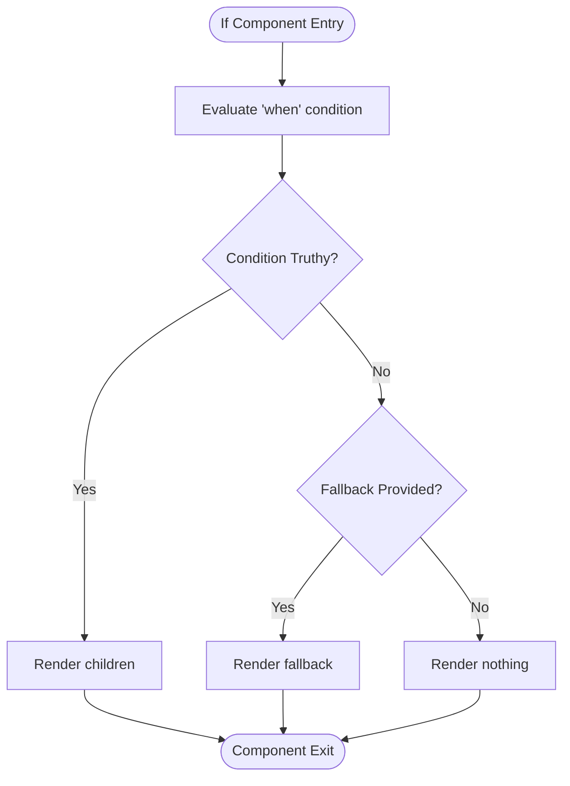
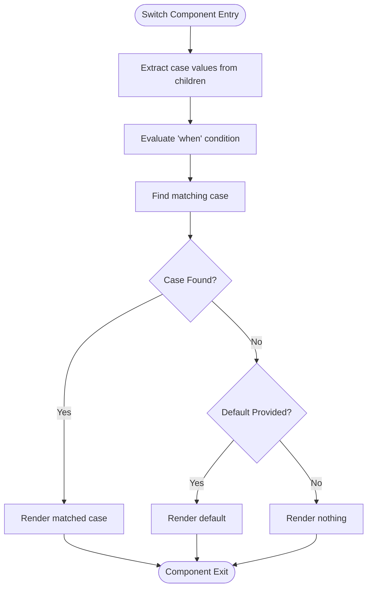
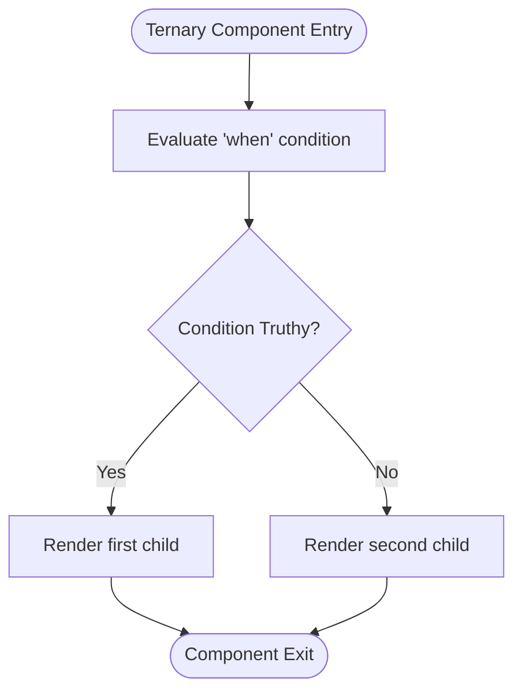
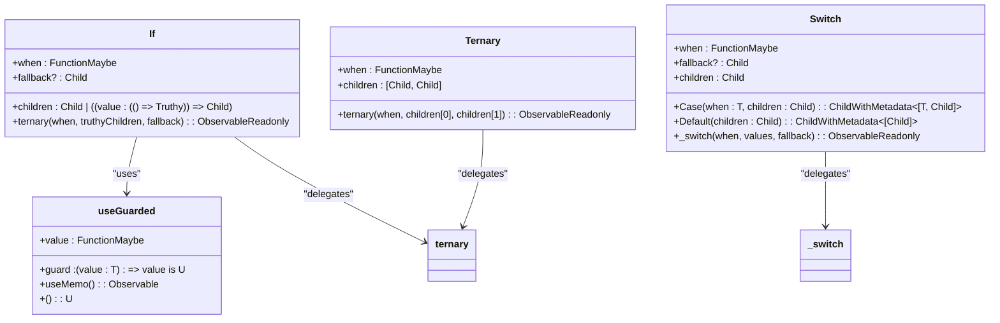
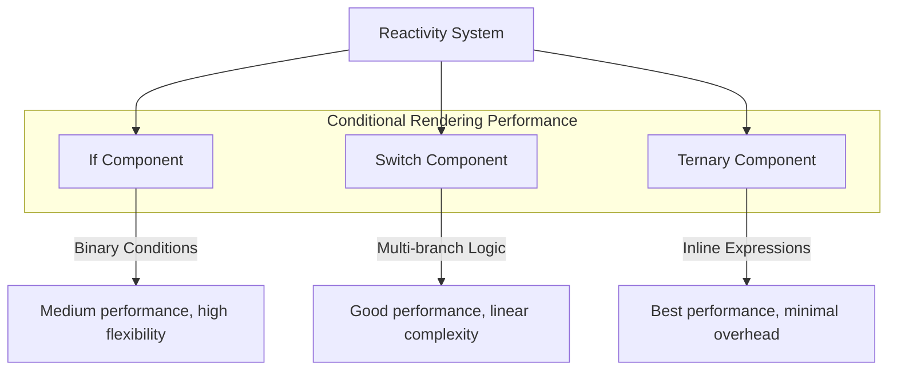
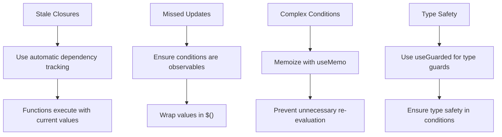

# Conditional Rendering

<cite>
**Referenced Files in This Document**   
- [if.ts](file://src/components/if.ts)
- [switch.ts](file://src/components/switch.ts)
- [ternary.ts](file://src/components/ternary.ts)
- [use_guarded.ts](file://src/hooks/use_guarded.ts)
- [lang.ts](file://src/utils/lang.ts)
- [Built-in-Components.md](file://doc/Built-in-Components.md)
</cite>

## Table of Contents
1. [Introduction](#introduction)
2. [If Component](#if-component)
3. [Switch Component](#switch-component)
4. [Ternary Component](#ternary-component)
5. [Reactivity and DOM Update Strategies](#reactivity-and-dom-update-strategies)
6. [Performance Characteristics](#performance-characteristics)
7. [Common Pitfalls and Solutions](#common-pitfalls-and-solutions)
8. [Component Selection Guidelines](#component-selection-guidelines)
9. [Conclusion](#conclusion)

## Introduction
Woby provides a set of conditional rendering components—If, Switch, and Ternary—that enable developers to create dynamic user interfaces with fine-grained reactivity. These components are designed to work seamlessly with Woby's observable-based reactivity system, ensuring efficient DOM updates and optimal performance. This document details the use cases, props, reactivity behavior, and integration patterns for each conditional rendering component, along with guidance on selecting the appropriate component for different scenarios.

**Section sources**
- [Built-in-Components.md](file://doc/Built-in-Components.md#L1-L50)

## If Component

The If component is designed for binary conditional rendering, allowing developers to conditionally render content based on a boolean condition. It supports both direct children rendering and function-based children that receive a truthiness check function.

The component accepts three props: `when` (the condition to evaluate), `fallback` (optional content to render when the condition is falsy), and `children` (the content to render when the condition is truthy). When children are provided as a function, the component passes a guarded truthiness function that ensures type safety and reactivity.

**Diagram sources**
- [if.ts](file://src/components/if.ts#L12-L26)

**Section sources**
- [if.ts](file://src/components/if.ts#L12-L26)
- [Built-in-Components.md](file://doc/Built-in-Components.md#L48-L92)

## Switch Component

The Switch component handles multi-branch conditional logic, similar to a switch/case statement. It evaluates a condition against multiple case branches and renders the first matching case, with an optional default fallback.

The component accepts `when` (the value to match against cases), `fallback` (optional default content), and `children` (case components). The Switch.Case utility creates case branches with specific values to match, while Switch.Default provides a fallback branch when no cases match.

**Diagram sources**
- [switch.ts](file://src/components/switch.ts#L10-L17)

**Section sources**
- [switch.ts](file://src/components/switch.ts#L10-L34)
- [Built-in-Components.md](file://doc/Built-in-Components.md#L93-L126)

## Ternary Component

The Ternary component provides a concise way to handle inline conditional rendering with exactly two branches. It accepts a condition and an array of two children elements representing the truthy and falsy states.

Unlike traditional ternary operators, this component integrates with Woby's reactivity system to ensure efficient updates. The component directly delegates to the underlying `ternary` function from the soby reactive core, providing optimal performance for simple conditional logic.

**Diagram sources**
- [ternary.ts](file://src/components/ternary.ts#L3-L7)

**Section sources**
- [ternary.ts](file://src/components/ternary.ts#L3-L7)
- [Built-in-Components.md](file://doc/Built-in-Components.md#L127-L150)

## Reactivity and DOM Update Strategies

Woby's conditional rendering components leverage the framework's fine-grained reactivity system to minimize unnecessary re-renders. Each component integrates with observable values through the underlying soby reactive core, ensuring that updates occur only when relevant conditions change.

The If component uses `useGuarded` and `useUntracked` hooks to manage conditional rendering efficiently. `useGuarded` ensures that type guards are properly applied to observable values, while `useUntracked` prevents unnecessary re-execution of child functions when the parent component updates.

**Diagram sources**
- [if.ts](file://src/components/if.ts#L12-L26)
- [switch.ts](file://src/components/switch.ts#L10-L17)
- [ternary.ts](file://src/components/ternary.ts#L3-L7)
- [use_guarded.ts](file://src/hooks/use_guarded.ts#L10-L34)

**Section sources**
- [if.ts](file://src/components/if.ts#L12-L26)
- [switch.ts](file://src/components/switch.ts#L10-L17)
- [ternary.ts](file://src/components/ternary.ts#L3-L7)
- [use_guarded.ts](file://src/hooks/use_guarded.ts#L10-L34)

## Performance Characteristics

The conditional rendering components in Woby are optimized for performance with minimal bundle impact. Each component has distinct performance characteristics based on its use case:

- **If Component**: Slightly higher overhead due to type checking and guarded evaluation, but provides the most flexibility for complex conditional logic
- **Switch Component**: Efficient for multi-branch scenarios with O(n) case evaluation, where n is the number of cases
- **Ternary Component**: Minimal overhead, essentially a thin wrapper around the core ternary function, making it the most performant for simple binary conditions

The components avoid unnecessary re-renders by leveraging Woby's fine-grained reactivity system, which tracks dependencies automatically without requiring dependency arrays. This ensures that only the relevant parts of the UI update when conditions change.

**Diagram sources**
- [if.ts](file://src/components/if.ts#L12-L26)
- [switch.ts](file://src/components/switch.ts#L10-L17)
- [ternary.ts](file://src/components/ternary.ts#L3-L7)

**Section sources**
- [if.ts](file://src/components/if.ts#L12-L26)
- [switch.ts](file://src/components/switch.ts#L10-L17)
- [ternary.ts](file://src/components/ternary.ts#L3-L7)

## Common Pitfalls and Solutions

Developers may encounter several common issues when using Woby's conditional rendering components. The most frequent pitfalls include stale closures, missed updates due to non-observable conditions, and improper handling of reactive dependencies.

Stale closures can occur when functions capture outdated values from previous renders. This is mitigated by Woby's automatic dependency tracking, which ensures functions execute with current values. However, developers should ensure that all conditions passed to conditional components are proper observables.

Missed updates happen when non-observable values are used as conditions. The solution is to wrap such values in observables using the `$()` function. Additionally, complex conditions should be memoized using `useMemo` to prevent unnecessary re-evaluation.

**Diagram sources**
- [if.ts](file://src/components/if.ts#L12-L26)
- [use_guarded.ts](file://src/hooks/use_guarded.ts#L10-L34)
- [lang.ts](file://src/utils/lang.ts#L180-L200)

**Section sources**
- [if.ts](file://src/components/if.ts#L12-L26)
- [use_guarded.ts](file://src/hooks/use_guarded.ts#L10-L34)
- [lang.ts](file://src/utils/lang.ts#L180-L200)

## Component Selection Guidelines

Choosing the appropriate conditional rendering component depends on the complexity and nature of the condition being evaluated:

- **Use If** for binary conditions with potentially complex logic, especially when you need to pass a truthiness check function to children or require fallback content
- **Use Switch** for multi-branch logic with three or more possible outcomes, particularly when matching specific values against a condition
- **Use Ternary** for simple inline expressions where readability and performance are prioritized over flexibility

For nested conditions, consider combining components strategically. For example, use Switch for the primary branching logic and If components within case branches for secondary conditions. This approach maintains code clarity while leveraging the strengths of each component.

**Section sources**
- [if.ts](file://src/components/if.ts#L12-L26)
- [switch.ts](file://src/components/switch.ts#L10-L17)
- [ternary.ts](file://src/components/ternary.ts#L3-L7)

## Conclusion

Woby's conditional rendering components—If, Switch, and Ternary—provide a comprehensive toolkit for creating dynamic user interfaces with optimal performance. By leveraging the framework's fine-grained reactivity system, these components ensure efficient DOM updates and minimal re-renders. Understanding the specific use cases, reactivity behavior, and performance characteristics of each component enables developers to make informed decisions and create maintainable, high-performance applications.