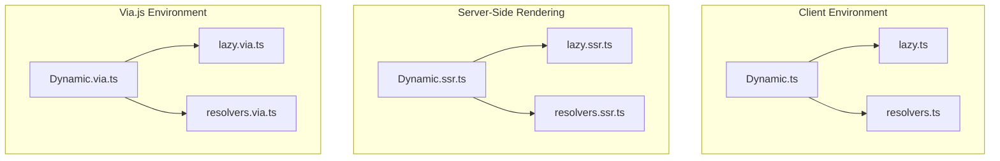
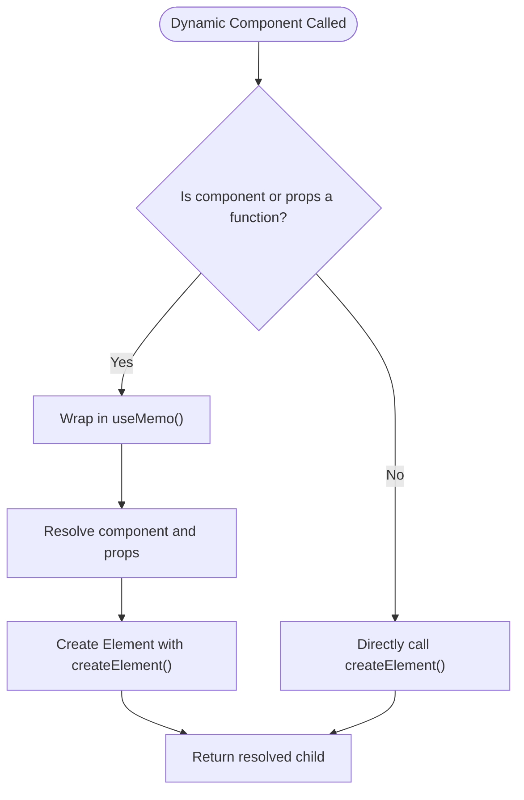
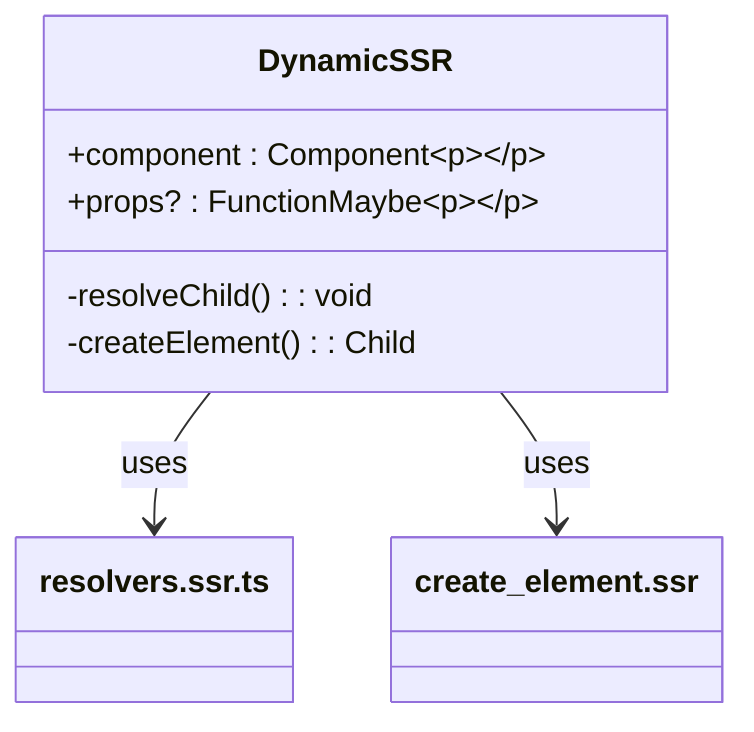
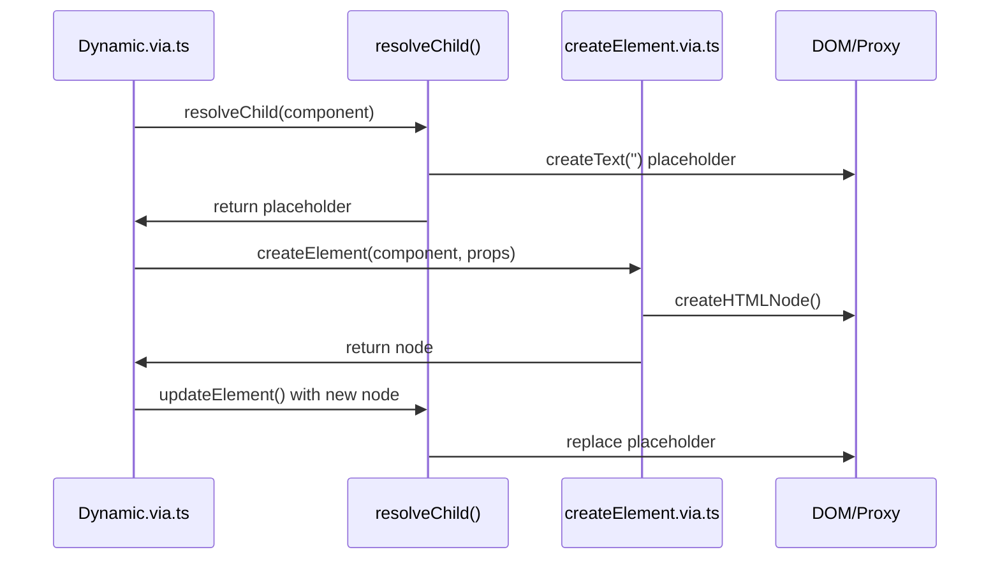

# Dynamic Components

<cite>
**Referenced Files in This Document**   
- [dynamic.ts](file://src/components/dynamic.ts)
- [dynamic.ssr.ts](file://src/components/dynamic.ssr.ts)
- [dynamic.via.ts](file://src/components/dynamic.via.ts)
- [lazy.ts](file://src/methods/lazy.ts)
- [lazy.ssr.ts](file://src/methods/lazy.ssr.ts)
- [lazy.via.ts](file://src/methods/lazy.via.ts)
- [resolvers.ts](file://src/utils/resolvers.ts)
- [resolvers.ssr.ts](file://src/utils/resolvers.ssr.ts)
- [resolvers.via.ts](file://src/utils/resolvers.via.ts)
</cite>

## Table of Contents
1. [Introduction](#introduction)
2. [Core Components](#core-components)
3. [Architecture Overview](#architecture-overview)
4. [Detailed Component Analysis](#detailed-component-analysis)
5. [Dependency Analysis](#dependency-analysis)
6. [Performance Considerations](#performance-considerations)
7. [Troubleshooting Guide](#troubleshooting-guide)
8. [Conclusion](#conclusion)

## Introduction
The Dynamic component in Woby enables runtime component resolution and lazy loading, allowing for flexible and efficient rendering across different environments. This document details the implementation differences between client-side (dynamic.ts), server-side rendering (dynamic.ssr.ts), and via.js (dynamic.via.ts) contexts. It covers interface definitions, props such as 'component' and 'props', hydration behavior, integration with `lazy()`, error handling, performance implications, and best practices for code-splitting. Common issues like SSR hydration mismatches are also addressed.

**Section sources**
- [dynamic.ts](file://src/components/dynamic.ts#L10-L26)
- [dynamic.ssr.ts](file://src/components/dynamic.ssr.ts#L8-L23)
- [dynamic.via.ts](file://src/components/dynamic.via.ts#L8-L24)

## Core Components
The Dynamic component serves as a universal wrapper that resolves components at runtime based on provided props. It supports both static and dynamic component resolution through observable values. The implementation varies slightly across environments to accommodate platform-specific rendering mechanisms.

The `lazy()` function enables asynchronous component loading by wrapping a fetcher function that returns a promise. It integrates with Woby's resource and suspense systems to handle pending states and errors during resolution. Each environment has its own version of `lazy()` to ensure compatibility with respective rendering pipelines.

**Section sources**
- [lazy.ts](file://src/methods/lazy.ts#L11-L59)
- [lazy.ssr.ts](file://src/methods/lazy.ssr.ts#L10-L58)
- [lazy.via.ts](file://src/methods/lazy.via.ts#L10-L58)

## Architecture Overview


**Diagram sources**
- [dynamic.ts](file://src/components/dynamic.ts#L10-L26)
- [lazy.ts](file://src/methods/lazy.ts#L11-L59)
- [resolvers.ts](file://src/utils/resolvers.ts#L27-L68)

## Detailed Component Analysis

### Dynamic Component Implementation
The Dynamic component conditionally uses `useMemo` when either the `component` or `props` are functions, ensuring reactivity. Otherwise, it directly creates the element. This pattern allows for dynamic resolution while maintaining performance.

In SSR and Via environments, the component omits children from the parameter list, reflecting differences in how child content is managed during server rendering and proxy-based updates.

#### Client-Side Dynamic Component


**Diagram sources**
- [dynamic.ts](file://src/components/dynamic.ts#L10-L26)

#### Server-Side Rendering (SSR) Behavior
During SSR, the Dynamic component avoids processing children directly, relying on the SSR-specific `createElement` implementation. The resolver logic is adapted to handle frozen observables and disposed parents, preventing unnecessary re-renders on the server.



**Diagram sources**
- [dynamic.ssr.ts](file://src/components/dynamic.ssr.ts#L8-L23)
- [resolvers.ssr.ts](file://src/utils/resolvers.ssr.ts#L11-L50)

#### Via.js Environment Specifics
In the Via.js environment, the Dynamic component leverages proxy-based DOM manipulation. The `resolveChild` function includes special handling for proxies, symbols, and HTML value tracking, enabling fine-grained updates without full re-renders.



**Diagram sources**
- [dynamic.via.ts](file://src/components/dynamic.via.ts#L8-L24)
- [resolvers.via.ts](file://src/utils/resolvers.via.ts#L13-L142)

### Lazy Loading Integration
The `lazy()` function wraps a fetcher that returns a component asynchronously. It uses `useResource` to manage the loading state and `useResolved` to reactively handle the result. When the component is resolved, it is instantiated with the provided props.

Error handling is built into the lazy loading process—errors are thrown when they occur, allowing surrounding error boundaries to catch them. A `preload()` method is available to initiate loading ahead of time.

```mermaid
flowchart TD
Fetcher[lazy(fetcher)] --> Resource[useResource(fetcherOnce)]
Resource --> Resolved[useResolved()]
Resolved --> Pending{"Pending?"}
Pending --> |Yes| ReturnNothing[Return nothing]
Pending --> |No| HasError{"Error?"}
HasError --> |Yes| ThrowError[Throw error]
HasError --> |No| ExtractComponent[Extract default export]
ExtractComponent --> Create[createElement(component, props)]
Create --> Return[Return resolved element]
```

**Diagram sources**
- [lazy.ts](file://src/methods/lazy.ts#L11-L59)
- [lazy.ssr.ts](file://src/methods/lazy.ssr.ts#L10-L58)
- [lazy.via.ts](file://src/methods/lazy.via.ts#L10-L58)

## Dependency Analysis
The Dynamic component relies on several core utilities:
- `createElement`: Environment-specific element creation
- `resolve` and `$$`: Observable resolution and unwrapping
- `useMemo`: Memoization for reactive updates
- `resolveChild`: Recursive child resolution with observable support

Each environment imports its own version of these dependencies to maintain consistency with platform-specific behaviors.

```mermaid
dependency-graph
Dynamic --> createElement
Dynamic --> resolve
Dynamic --> $$
Dynamic --> useMemo
Dynamic --> resolveChild
createElement --> setters
resolveChild --> resolvers
useResolved --> resource
```

**Diagram sources**
- [dynamic.ts](file://src/components/dynamic.ts#L10-L26)
- [methods/create_element.ts](file://src/methods/create_element.ts)
- [utils/resolvers.ts](file://src/utils/resolvers.ts#L27-L68)

## Performance Considerations
Dynamic components enable code-splitting and lazy loading, reducing initial bundle size. However, improper usage can lead to excessive re-renders or memory leaks.

Best practices include:
- Preloading critical components using `component.preload()`
- Using stable references for dynamic components
- Avoiding inline function definitions for `component` prop
- Ensuring proper cleanup in error boundaries

SSR environments benefit from frozen observable detection, preventing unnecessary client-side re-renders after hydration.

## Troubleshooting Guide
Common issues include:
- **Hydration mismatches**: Occur when server and client render different content. Ensure dynamic components have consistent initial states.
- **Missing fallbacks**: When using `lazy()`, always wrap in `<Suspense>` with a fallback.
- **Observable leaks**: Use `useRenderEffect` appropriately to avoid infinite loops.

Ensure children are properly handled in client vs SSR environments, as some implementations omit children from parameters.

**Section sources**
- [resolvers.ssr.ts](file://src/utils/resolvers.ssr.ts#L11-L50)
- [resolvers.via.ts](file://src/utils/resolvers.via.ts#L13-L142)

## Conclusion
The Dynamic component in Woby provides a robust mechanism for runtime component resolution and lazy loading across multiple environments. By leveraging observables and environment-specific implementations, it ensures efficient rendering while maintaining flexibility. Proper use of `lazy()` and `<Suspense>` enables optimal code-splitting and user experience.