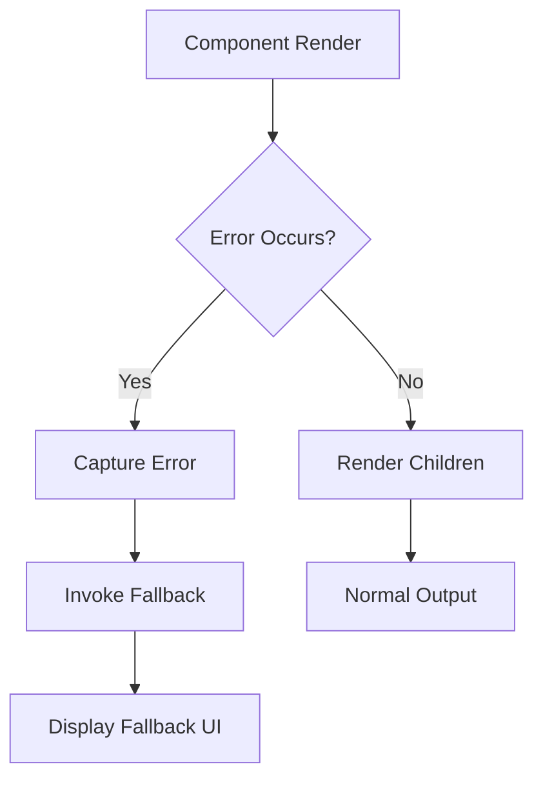
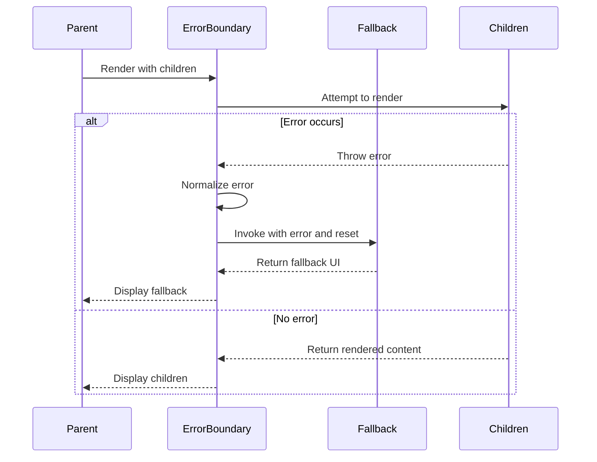
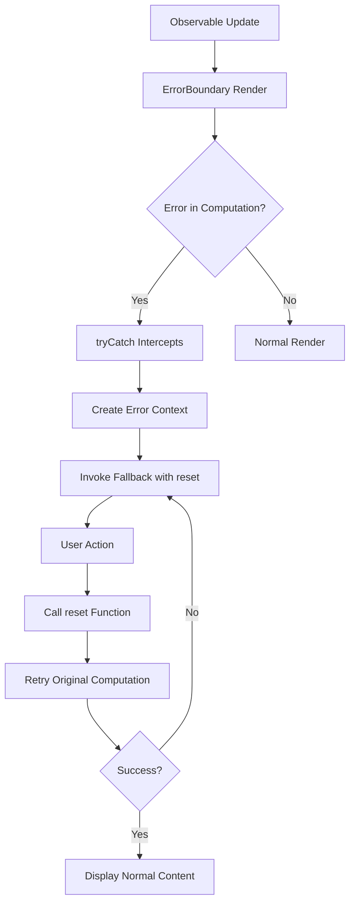
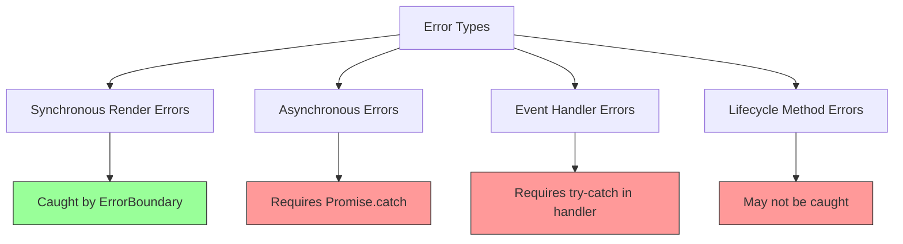
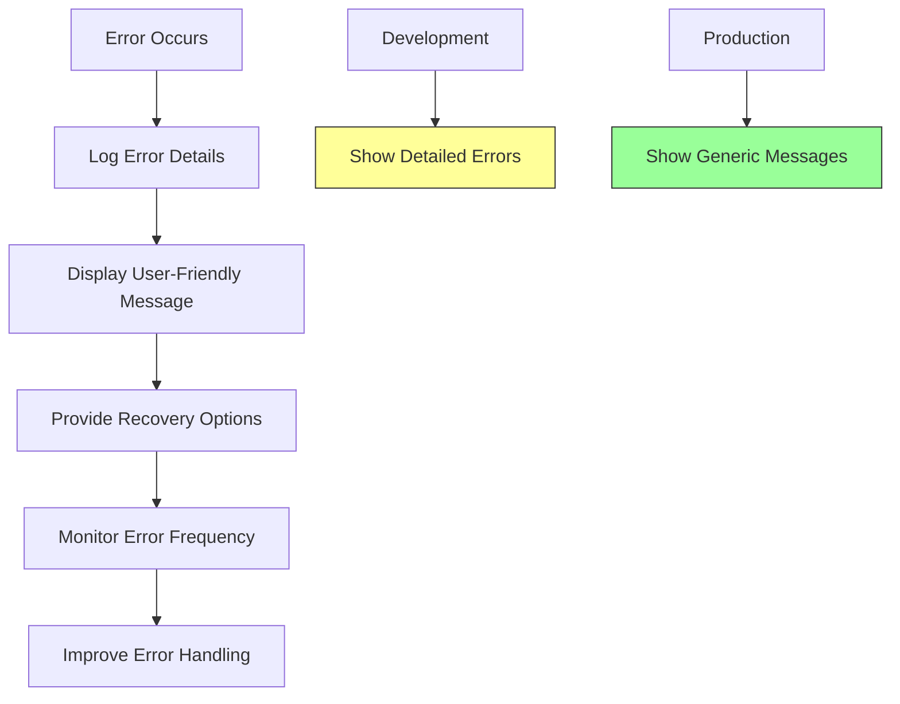
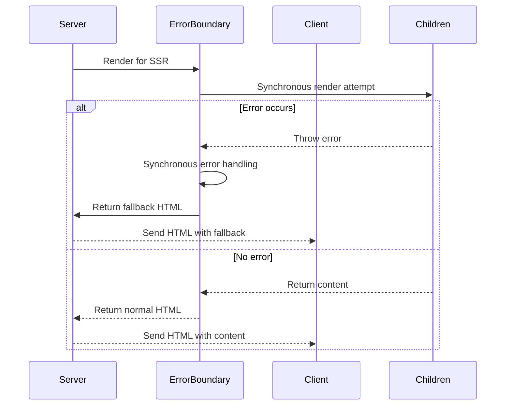

# Error Boundaries

<cite>
**Referenced Files in This Document**   
- [error_boundary.ts](file://src/components/error_boundary.ts)
- [lang.ts](file://src/utils/lang.ts)
- [types.ts](file://src/types.ts)
- [soby.ts](file://src/methods/soby.ts)
</cite>

## Table of Contents
1. [Introduction](#introduction)
2. [Core Components](#core-components)
3. [Error Boundary Props and Lifecycle](#error-boundary-props-and-lifecycle)
4. [Integration with Observables and Recovery](#integration-with-observables-and-recovery)
5. [Implementation Details](#implementation-details)
6. [Limitations and Complementary Strategies](#limitations-and-complementary-strategies)
7. [Best Practices](#best-practices)
8. [SSR Considerations](#ssr-considerations)

## Introduction
The ErrorBoundary component in Woby is designed to catch JavaScript errors that occur during rendering, preventing the entire application from crashing. Instead of failing catastrophically, it intercepts errors and displays a fallback UI while maintaining application stability. This documentation details its implementation, usage patterns, integration with Woby's reactive system, and considerations for both client and server environments.

## Core Components

The ErrorBoundary component is implemented as a functional component that leverages Woby's observable system to handle errors gracefully. It uses a try-catch mechanism around component execution and integrates with the rendering scheduler to ensure errors are captured at the right time.



**Diagram sources**
- [error_boundary.ts](file://src/components/error_boundary.ts#L8-L16)

**Section sources**
- [error_boundary.ts](file://src/components/error_boundary.ts#L8-L16)

## Error Boundary Props and Lifecycle

The ErrorBoundary component accepts two main props: `fallback` and `children`. The `fallback` prop can be either a static child element or a function that receives error information and a reset function. The lifecycle involves capturing errors during rendering, normalizing them into Error objects, and invoking the appropriate fallback based on the error state.



**Diagram sources**
- [error_boundary.ts](file://src/components/error_boundary.ts#L8-L16)
- [types.ts](file://src/types.ts#L15-L20)

**Section sources**
- [error_boundary.ts](file://src/components/error_boundary.ts#L8-L16)
- [types.ts](file://src/types.ts#L15-L20)

## Integration with Observables and Recovery

ErrorBoundary integrates with Woby's observable system through the `tryCatch` function from the 'soby' package. This allows it to handle errors in reactive computations and provides a reset mechanism that can be used to retry failed renders. The `untrack` function ensures that the fallback rendering doesn't create unnecessary dependencies.



**Diagram sources**
- [error_boundary.ts](file://src/components/error_boundary.ts#L8-L16)
- [soby.ts](file://src/methods/soby.ts#L1-L12)

**Section sources**
- [error_boundary.ts](file://src/components/error_boundary.ts#L8-L16)
- [soby.ts](file://src/methods/soby.ts#L1-L12)

## Implementation Details

The ErrorBoundary implementation relies on several key functions and types from the Woby codebase. It uses `tryCatch` to wrap the children rendering, `untrack` to prevent unnecessary reactivity in the fallback, and `isFunction` to determine how to handle the fallback prop. The error normalization process ensures consistent error objects regardless of what was thrown.

```mermaid
classDiagram
class ErrorBoundary {
+fallback : Child | FN<[{ error : Error, reset : Callback }], Child>
+children : Child
+ErrorBoundary(props) : ObservableReadonly<Child>
}
class tryCatch {
+tryCatch(children, errorHandler) : ObservableReadonly<Child>
}
class untrack {
+untrack(fn) : any
}
class isFunction {
+isFunction(value) : boolean
}
ErrorBoundary --> tryCatch : uses
ErrorBoundary --> untrack : uses
ErrorBoundary --> isFunction : uses
```

**Diagram sources**
- [error_boundary.ts](file://src/components/error_boundary.ts#L8-L16)
- [lang.ts](file://src/utils/lang.ts#L150-L155)
- [types.ts](file://src/types.ts#L15-L20)

**Section sources**
- [error_boundary.ts](file://src/components/error_boundary.ts#L8-L16)
- [lang.ts](file://src/utils/lang.ts#L150-L155)
- [types.ts](file://src/types.ts#L15-L20)

## Limitations and Complementary Strategies

The ErrorBoundary component has certain limitations that developers should be aware of. It cannot catch asynchronous errors or errors that occur in event handlers. These limitations necessitate complementary error handling strategies for a robust application.



**Diagram sources**
- [error_boundary.ts](file://src/components/error_boundary.ts#L8-L16)

**Section sources**
- [error_boundary.ts](file://src/components/error_boundary.ts#L8-L16)

## Best Practices

When using ErrorBoundary, several best practices should be followed to ensure effective error handling and user experience. These include proper error logging, meaningful user feedback, and graceful degradation strategies that maintain application functionality even when parts fail.



**Diagram sources**
- [error_boundary.ts](file://src/components/error_boundary.ts#L8-L16)

**Section sources**
- [error_boundary.ts](file://src/components/error_boundary.ts#L8-L16)

## SSR Considerations

When rendering on the server, ErrorBoundary must capture errors synchronously and render appropriate fallback content. This requires special consideration since asynchronous operations and streaming responses have different error handling requirements than client-side rendering.



**Diagram sources**
- [error_boundary.ts](file://src/components/error_boundary.ts#L8-L16)

**Section sources**
- [error_boundary.ts](file://src/components/error_boundary.ts#L8-L16)