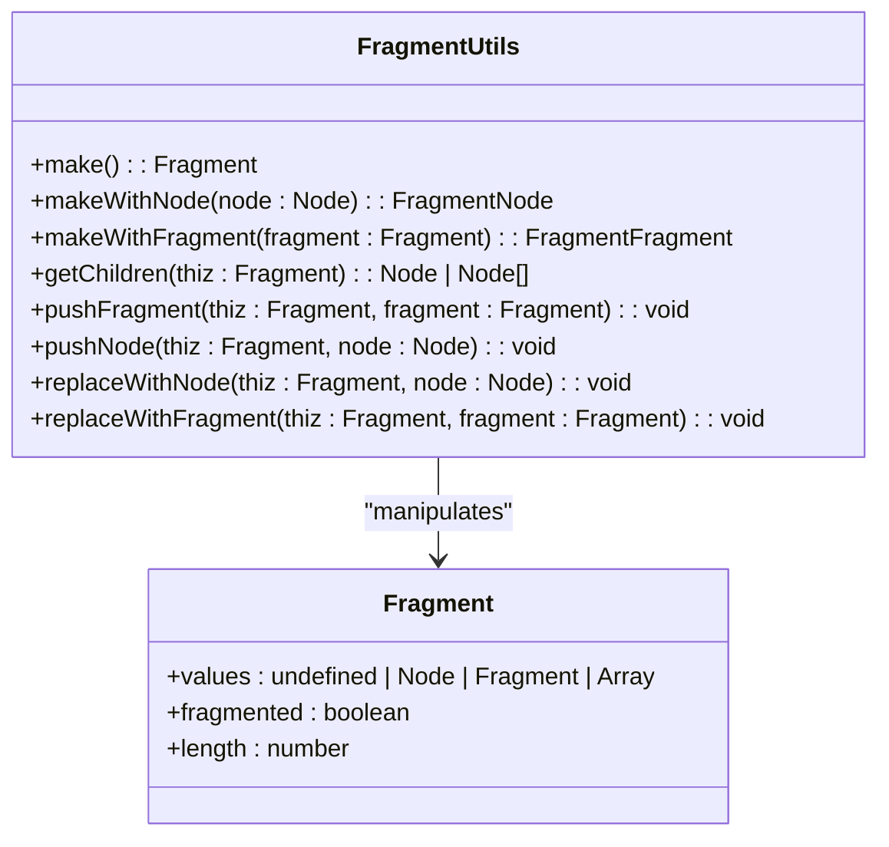
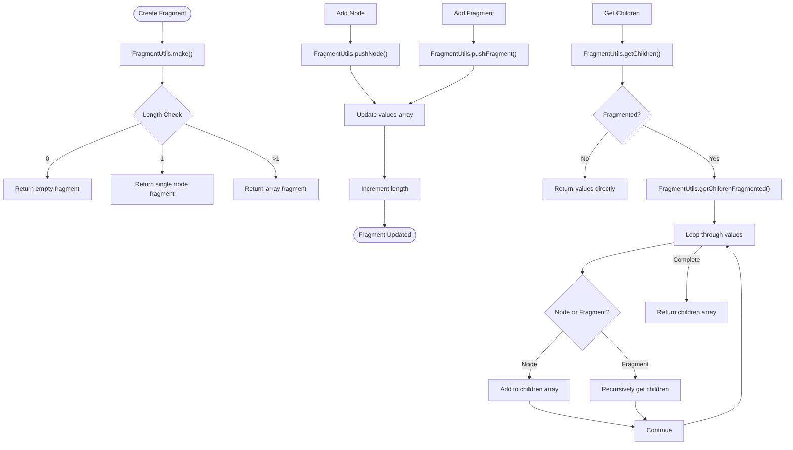
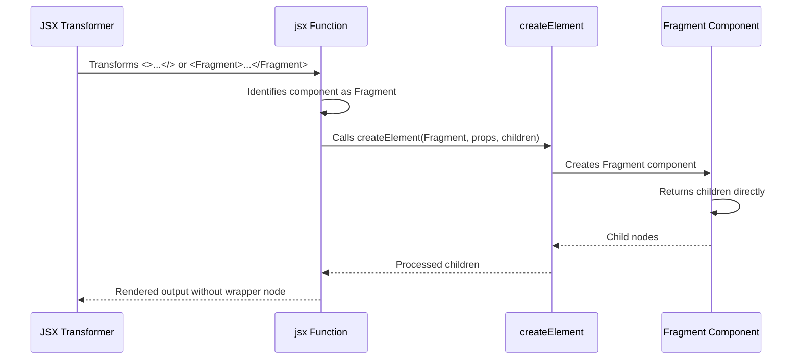
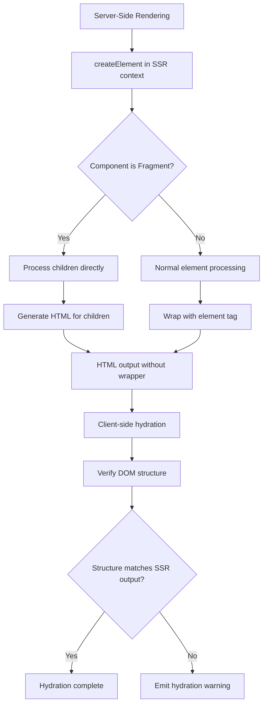

# Fragments

<cite>
**Referenced Files in This Document**   
- [fragment.ts](file://src/components/fragment.ts)
- [fragment.ts](file://src/utils/fragment.ts)
- [create_element.ssr.ts](file://src/methods/create_element.ssr.ts)
- [types.ts](file://src/types.ts)
- [jsx-runtime.ssr.tsx](file://src/jsx/jsx-runtime.ssr.tsx)
</cite>

## Table of Contents
1. [Introduction](#introduction)
2. [Core Implementation](#core-implementation)
3. [Fragment Utilities](#fragment-utilities)
4. [JSX Integration](#jsx-integration)
5. [Server-Side Rendering](#server-side-rendering)
6. [Usage Patterns](#usage-patterns)
7. [Limitations and Workarounds](#limitations-and-workarounds)
8. [Performance Considerations](#performance-considerations)
9. [Best Practices](#best-practices)

## Introduction
The Fragment component in Woby provides a lightweight way to group multiple elements without introducing additional DOM nodes. This enables cleaner markup and more efficient rendering by avoiding unnecessary wrapper elements. Fragments are particularly valuable when working with lists, conditional rendering, and components that need to return multiple root elements. The implementation supports both the explicit `<Fragment>` syntax and the short `<>` notation, making it versatile for various use cases while maintaining optimal performance characteristics.

**Section sources**
- [fragment.ts](file://src/components/fragment.ts#L2-L6)

## Core Implementation
The Fragment component is implemented as a simple functional component that returns its children directly without creating any additional DOM structure. This zero-overhead approach ensures maximum performance while providing the necessary grouping functionality. The core implementation leverages TypeScript types to define the Fragment structure and its various states, including empty fragments, single-node fragments, and multi-node fragments. The component accepts children as a prop and passes them through unmodified, making it a transparent container for other elements.

**Diagram sources**
- [fragment.ts](file://src/components/fragment.ts#L2-L6)
- [types.ts](file://src/types.ts#L87-L87)

**Section sources**
- [fragment.ts](file://src/components/fragment.ts#L2-L6)
- [types.ts](file://src/types.ts#L87-L87)

## Fragment Utilities
Woby provides a comprehensive set of utility functions through the FragmentUtils object to manage fragment operations efficiently. These utilities handle the creation, manipulation, and traversal of fragment structures. The implementation supports various fragment types including empty fragments, single-node fragments, and complex nested fragment structures. The utilities provide methods for adding nodes or fragments, retrieving child nodes, and replacing fragment contents, all while maintaining optimal performance through direct object manipulation.

**Diagram sources**
- [utils/fragment.ts](file://src/utils/fragment.ts#L8-L147)
- [utils/fragment.ssr.ts](file://src/utils/fragment.ssr.ts#L8-L144)

**Section sources**
- [utils/fragment.ts](file://src/utils/fragment.ts#L8-L147)
- [utils/fragment.ssr.ts](file://src/utils/fragment.ssr.ts#L8-L144)

## JSX Integration
Fragments integrate seamlessly with Woby's JSX transformer and rendering engine through the jsx function implementation. The JSX runtime handles fragment elements by recognizing the Fragment component and processing its children appropriately during element creation. When the jsx function encounters a Fragment component, it processes the children without creating any additional DOM nodes, maintaining the fragment's lightweight nature. This integration ensures that both the short syntax (`<>`) and explicit Fragment tags work identically in terms of functionality and performance.

**Diagram sources**
- [jsx-runtime.ssr.tsx](file://src/jsx/jsx-runtime.ssr.tsx#L15-L40)
- [create_element.ssr.ts](file://src/methods/create_element.ssr.ts#L10-L80)

**Section sources**
- [jsx-runtime.ssr.tsx](file://src/jsx/jsx-runtime.ssr.tsx#L15-L40)
- [create_element.ssr.ts](file://src/methods/create_element.ssr.ts#L10-L80)

## Server-Side Rendering
During server-side rendering, fragments are handled through specialized SSR implementations that maintain the same semantics as client-side rendering. The SSR version of fragment utilities ensures proper handling of text nodes, comments, and adjacent elements while generating HTML output. The create_element.ssr.ts implementation processes fragments by directly including their children in the output stream without adding any wrapper elements, preserving the intended markup structure. This approach ensures consistent behavior between server-rendered and client-rendered content, enabling seamless hydration.

**Diagram sources**
- [create_element.ssr.ts](file://src/methods/create_element.ssr.ts#L10-L80)
- [fragment.ssr.ts](file://src/utils/fragment.ssr.ts#L8-L144)

**Section sources**
- [create_element.ssr.ts](file://src/methods/create_element.ssr.ts#L10-L80)
- [fragment.ssr.ts](file://src/utils/fragment.ssr.ts#L8-L144)

## Usage Patterns
Fragments support two primary usage patterns: the short syntax (`<>...</>`) and the explicit `<Fragment>...</Fragment>` tag. Both patterns are functionally equivalent and compile to the same underlying implementation. The short syntax is preferred for its brevity when grouping elements, while the explicit tag may be used when additional clarity is needed or when working with tools that require explicit component names. Fragments are commonly used in scenarios such as returning multiple elements from a component, grouping list items, or conditionally rendering content without introducing extra DOM nodes.

**Section sources**
- [fragment.ts](file://src/components/fragment.ts#L2-L6)
- [jsx-runtime.ssr.tsx](file://src/jsx/jsx-runtime.ssr.tsx#L15-L40)

## Limitations and Workarounds
Fragments cannot have attributes or keys applied directly, as they do not represent actual DOM nodes. This limitation means that fragments cannot be used as targets for event listeners or directives that require a DOM element reference. When attributes or keys are needed, a wrapper div or other appropriate container element should be used instead. For cases where a key is required for list items, the key should be applied to the individual elements within the fragment rather than the fragment itself. Event listeners and directives should be attached to specific child elements rather than the fragment container.

**Section sources**
- [fragment.ts](file://src/components/fragment.ts#L2-L6)
- [types.ts](file://src/types.ts#L87-L87)

## Performance Considerations
Fragments provide optimal performance by eliminating the need for additional DOM nodes, reducing memory usage and improving rendering speed. The implementation avoids any runtime overhead by simply passing through children without additional processing. This zero-cost abstraction makes fragments the preferred choice for grouping elements when no styling or layout requirements necessitate a wrapper element. The performance benefits are particularly noticeable in large lists or complex component hierarchies where multiple unnecessary wrapper elements could otherwise impact rendering performance.

**Section sources**
- [fragment.ts](file://src/components/fragment.ts#L2-L6)
- [utils/fragment.ts](file://src/utils/fragment.ts#L8-L147)

## Best Practices
Use fragments when grouping elements that don't require styling, layout, or DOM manipulation as a group. They are ideal for returning multiple elements from a component, grouping list items, or conditionally rendering content. Avoid using fragments when you need to apply CSS styles, event listeners, or directives to the container, as these require an actual DOM element. In such cases, use an appropriate HTML element like div, span, or section based on the semantic meaning and styling requirements. Prefer the short syntax (`<>`) for brevity unless the explicit `<Fragment>` tag provides better readability in a particular context.

**Section sources**
- [fragment.ts](file://src/components/fragment.ts#L2-L6)
- [utils/fragment.ts](file://src/utils/fragment.ts#L8-L147)
- [create_element.ssr.ts](file://src/methods/create_element.ssr.ts#L10-L80)